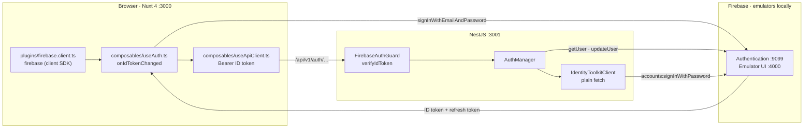
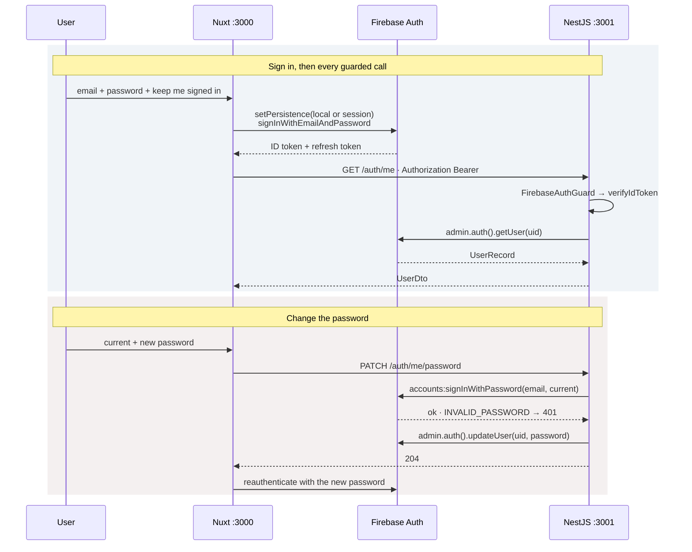

# Firebase Authentication integration

## Overview

Firebase Authentication owns accounts and credentials. The browser exchanges an email and
password with Firebase directly and gets an ID token back; the API never sees a password and
never issues a token of its own. Every versioned route sits behind `FirebaseAuthGuard`, which
verifies that token with the Admin SDK and parks the decoded claims on the request.

The one thing the Admin SDK cannot do is *check* a password — `updateUser` sets one without
verifying the old one — so `PATCH /auth/me/password` proves the current password over the
Identity Toolkit REST API before writing the new one. A stolen ID token is therefore not
enough to lock an owner out.

Locally everything runs against the Firebase emulator suite, started by
`pnpm dev:infrastructure`. Only configuration changes between that and a real project:
`FirebaseAdminService` hands our emulator hosts to the SDK's own environment variables, and
drops the credential entirely when all four services are emulated.

## Requirements

- **Credentials go to Firebase, not to us.** `pages/auth/login.vue` calls
  `signInWithEmailAndPassword` through `useAuth`. There is no login or register endpoint on
  the API, and no password-handling code in `backend/src/auth/` besides the current-password
  proof below.
- **Every versioned route is behind a verified ID token.** `AuthController`,
  `LibraryController` and `ScrapingController` each carry `@UseGuards(FirebaseAuthGuard)`.
  `/system` and `/health` are deliberately outside the prefix, the version and the guard.
- **The profile is what the API agrees the caller is.** `/profile` reads `GET /auth/me`
  rather than the client SDK's `currentUser`, so a token the API refuses shows as a refused
  request instead of a screen drawn from stale local state.
- **A password change proves the current password.** `ChangePasswordDto` requires
  `currentPassword`; `IdentityToolkitClient.verifyPassword` signs in with it before
  `updateUser` runs. A wrong password is a `401`, a password Firebase will not take is a `400`.
- **A restored session is verified once.** `middleware/auth.global.ts` awaits `useAuth().ready`
  — with `ssr: false` the SDK restores a session a few ticks after boot — then calls
  `verifySession()`, which spends one `GET /auth/me` per uid and signs out what the API refuses.
- **A 401 mid-page ends the session.** The `http.fetch` wrapper in `useApiClient` calls
  `expireSession()` on any 401, which signs out and redirects to `/auth/login?redirect=…`.
- **Local development needs no real project.** The emulator project is `demo-media-studio`;
  the `demo-` prefix is what lets firebase-tools run with no credentials.

## Solution

### Contract Skeleton

| Method | Path | Answers | Refuses |
| --- | --- | --- | --- |
| `GET` | `/api/v1/auth/me` | `200 UserDto` | `401` missing or invalid ID token, or the account is gone |
| `PATCH` | `/api/v1/auth/me/password` | `204` no content | `400` unusable or unchanged password · `401` bad token or wrong current password · `429` too many attempts |

**`UserDto`** — `backend/src/auth/dto/user.dto.ts`. Built by `publicView(UserRecord)`; only the
fields a client has a use for.

| Field | Type | Notes |
| --- | --- | --- |
| `id` | `string` | The Firebase uid. |
| `email` | `string` | Empty where the account has none. |
| `name` | `string` | `displayName`, empty where unset. |
| `emailVerified` | `boolean` | |
| `photoUrl` | `string \| null` | |
| `createdAt` | `string` | UTC, as Firebase reports it. |
| `lastSignInAt` | `string \| null` | Null until the account has signed in once. |

**`ChangePasswordDto`** — `backend/src/auth/dto/change-password.dto.ts`.

| Field | Type | Rules |
| --- | --- | --- |
| `currentPassword` | `string` | `@MinLength(1)`. Proof it is the owner asking. |
| `newPassword` | `string` | `@MinLength(8)` — Firebase's own floor is six; eight is ours. |

### Component Diagrams

- **The wiring.** The plugin creates the app and connects the emulators *before* anything
  touches Auth — a request that went out first would hit the real project. `useAuth` is a
  `createSharedComposable`, so one `onIdTokenChanged` subscription serves every caller off the
  same `user` ref. `useApiClient` wraps the generated NSwag clients' `http.fetch` seam, which
  is what authenticates all of them in one place.

- **Sign-in, and the guarded call after it.** `keepSignedIn` chooses `browserLocalPersistence`
  over `browserSessionPersistence`, which is the difference between surviving a browser
  restart and not. `getIdToken()` is read per request rather than once, so the SDK renews an
  expired token and a tab left open keeps working.
- **The password change, and why it re-signs in.** A change does not revoke what the caller is
  already holding: the guard does not check for revocation, so an ID token stays good until it
  expires. Firebase revokes the account's *refresh* tokens, which ends the session at the next
  refresh; the emulator does not do even that. So `profile.vue` calls `reauthenticate()` with
  the new password on success, and falls back to `signOut()` and a redirect if that fails.
- **Route guarding.** `auth.global.ts` awaits `ready`, verifies a restored session, sends
  unauthenticated traffic to `/auth/login` with the intended path in `?redirect=`, and sends
  signed-in traffic away from the login screen. `login.vue` accepts only a same-origin
  `redirect` — a value not starting with a single `/` falls back to `/`.

## Implementation Steps

- **Step 1 — the emulator suite.** `_deploy/firebase/firebase.json` publishes Authentication on
  `9099`, Firestore on `8080`, Realtime Database on `9000`, Storage on `9199` and the Emulator
  UI on `4000`, with `singleProjectMode`.
  `_deploy/dockercompose.local.infrastructure.yml` runs it under `pnpm dev:infrastructure`,
  exporting on exit and re-importing on the next start. `scripts/seed-firebase-auth.mjs` creates
  `admin@datntdev.com` / `StrongPassword123!` through the emulator's REST surface — plain
  `fetch`, no dependency, idempotent.
- **Step 2 — the browser's end.** `plugins/firebase.client.ts` initialises the app and connects
  the Auth, Storage and Database emulators when their hosts are configured.
  `composables/useAuth.ts` exposes `user`, `name`, `initials`, a `ready` promise resolved on the
  first `onIdTokenChanged`, `signIn`, `reauthenticate`, `signOut`, `verifySession`,
  `expireSession` and `getIdToken`. `middleware/auth.global.ts` guards every route.
  `pages/auth/login.vue` maps Firebase error codes onto one line each — every "those
  credentials are wrong" case says the same thing.
- **Step 3 — the guard and the decorator.** `FirebaseAdminService` initialises the Admin app once
  in the global `CoreModule`, handing our emulator hosts to `FIREBASE_AUTH_EMULATOR_HOST` and
  its neighbours, and setting `METADATA_SERVER_DETECTION=none` when there is no credential to
  resolve. `FirebaseAuthGuard` verifies the bearer token and attaches `DecodedIdToken`;
  `@CurrentUser()` hands it to the handler. A missing or bad token is an
  `UnauthorizedException`, which `AllExceptionsFilter` renders in the standard error shape.
- **Step 4 — `GET /auth/me`.** `AuthManager.me(uid)` reads a `UserRecord` and maps it through
  `publicView`. `auth/user-not-found` becomes a `401` — a token outlives the account it was
  issued for.
- **Step 5 — `PATCH /auth/me/password`.** `IdentityToolkitClient` posts to
  `accounts:signInWithPassword` with `returnSecureToken: false`, against
  `http://{emulatorHost}/identitytoolkit.googleapis.com/v1` locally and
  `https://identitytoolkit.googleapis.com/v1` otherwise. Every code meaning "wrong password"
  is answered the same way; `TOO_MANY_ATTEMPTS_TRY_LATER` becomes a `429`; anything else is a
  `503` with the detail in the log.
- **Step 6 — the screens.** `composables/useApiClient.ts` is the one place the API base URL and
  the bearer header are written. `pages/profile.vue` draws the account details from
  `GET /auth/me` and a change-password form against `PATCH /auth/me/password`, validating the
  same eight-character floor the DTO enforces. `AppUserMenu.vue` reads the signed-in identity
  and wires "Log out". `/profile` and `/auth/login` both stay out of `appNavLinks` — neither is
  a section.
- **Step 7 — the served surface.** `configureApp` enables CORS for the frontend origin with
  `authorization` and `content-type` allowed, and `setupOpenApi` declares bearer auth with
  `persistAuthorization`, so Swagger UI can carry a real token across reloads.

## Appendix

### Known limits

- **Revocation is not checked.** `verifyIdToken` is called without `checkRevoked`, so an ID
  token stays valid until it expires even after a password change or a sign-out elsewhere.
  Ending a session promptly relies on the refresh cycle, and the Auth emulator does not revoke
  refresh tokens at all.
- **Emulator tokens are unsigned.** The guard's signature check is a no-op against the
  emulator, so locally it is only as good as the emulator is private — which is why every
  published port binds to `127.0.0.1`.
- **No registration, and no password reset.** Accounts are created by
  `scripts/seed-firebase-auth.mjs` or by hand in the Emulator UI. The mockup's Google/SSO and
  forgot-password controls were dropped.
- **`verifySession` caches per uid.** Once `/auth/me` has answered for a uid it is not asked
  again for that uid, so an account disabled mid-session is noticed at the next 401 rather than
  at the next navigation.
- **No roles.** A verified token is full access: there is no claim, scope or ownership check
  anywhere, and `storage.rules` says the same thing — any signed-in user may write any item's
  objects.
