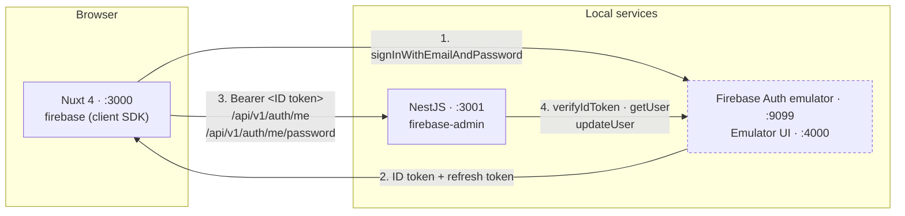
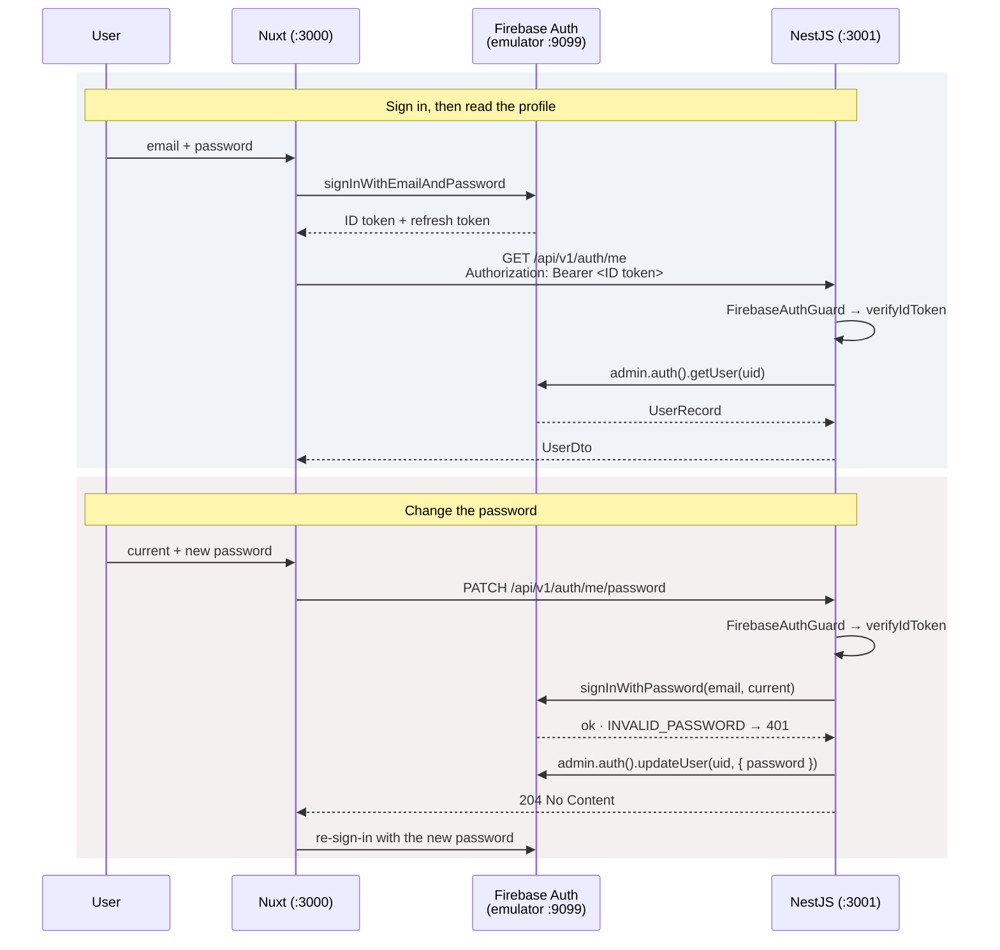

# Firebase Authentication integration

## Why

`backend/src/auth/` shipped as an explicitly-labelled mock: `AuthManager` compared plain-text passwords against an in-memory `Map` and minted an unsigned `mock.<user id>` token that anyone could forge. `frontend/app/pages/auth/login.vue` was UI only — its `submit` event was deliberately unlistened — and `AppUserMenu.vue` rendered a hard-coded name.

Firebase Authentication replaces that mock. Sign-in moves to the client SDK, the backend stops issuing tokens and starts verifying them with the Admin SDK, and local development runs against the Firebase Auth emulator so no real project, credentials or network access is needed.

## Shape of the system



In production the same wiring points at the real Firebase project instead of the emulator; only configuration changes.

## The flows



The Admin SDK can set a password but cannot check one, so `PATCH /auth/me/password` proves the current password through the Identity Toolkit REST `signInWithPassword` before updating. A stolen ID token on its own therefore cannot change a password.

A password change does not revoke what the caller is already holding: the guard does not check for revocation, so an ID token stays good until it expires. Firebase revokes the account's refresh tokens, which ends the session at the next refresh; the Auth emulator does not do even that. So the frontend does not try to reason about it — on success it silently signs in again with the new password, and falls back to sign-out and a redirect to `/auth/login` if that fails.

## Steps

Each step is one commit, and each leaves `pnpm lint`, `pnpm typecheck` and `pnpm build` green.

### 1. The Auth emulator for local development

| File | What it does |
| --- | --- |
| `firebase.json` | Auth emulator on `9099`, Emulator UI on `4000`, `singleProjectMode`. |
| `.firebaserc` | Defaults to project `demo-media-studio` — the `demo-` prefix is what lets firebase-tools run with no credentials. |
| `scripts/seed-firebase-auth.mjs` | Creates `admin@datntdev.com` / `StrongPassword123!` through the emulator's REST surface. Plain `fetch`, no dependency, idempotent. |
| `package.json` | `firebase-tools` devDependency, plus `dev:firebase` and `seed:firebase`. |

### 2. The login page signs in with the client SDK

- `firebase` dependency, and a `runtimeConfig.public` block in `nuxt.config.ts` — without it the `NUXT_PUBLIC_*` values are never exposed to the client.
- `plugins/firebase.client.ts` initialises the app and connects the emulator when `emulatorHost` is set.
- `composables/useAuth.ts` — a shared composable over `onIdTokenChanged`: `user`, a `ready` promise resolved on the first fire, `signIn`, `signOut`, `getIdToken`. "Keep me signed in" chooses local over session persistence.
- `middleware/auth.global.ts` awaits `ready`, then sends unauthenticated traffic to `/auth/login` and signed-in traffic away from it. Awaiting `ready` is what stops a page refresh from bouncing a signed-in user out, since `ssr: false` means auth resolves asynchronously on boot.
- `pages/auth/login.vue` listens for `@submit` and maps Firebase error codes onto the error line the mockup already had.
- `AppUserMenu.vue` reads the signed-in identity and wires "Log out".

### 3. The backend login and register endpoints go

Sign-in happens client-side now, so the credential-handling half of the mock is deleted: the two handlers, `LoginDto`, `RegisterDto`, and `SessionDto` (nothing else returned it). `dto/session.dto.ts` becomes `dto/user.dto.ts`.

### 4. `GET /auth/me` is protected by the ID token

- `firebase-admin` dependency. `FirebaseAdminService` initialises the Admin app once, in the global `CoreModule`: with an emulator host it needs only a project id and no credential, otherwise it takes a service-account JSON from configuration or falls back to application-default credentials.
- `FirebaseAuthGuard` verifies the bearer token and attaches the decoded token; `@CurrentUser()` hands it to the handler. A missing or bad token is an `UnauthorizedException`, which the existing `AllExceptionsFilter` renders in the standard error shape.
- `AuthManager.me(uid)` now reads a `UserRecord`. `UserDto` grows `emailVerified`, `photoUrl`, `createdAt` and `lastSignInAt` so the profile screen has something to show. The in-memory repository is deleted.
- CORS is enabled for the frontend origin, and the OpenAPI document declares bearer auth so Swagger UI can carry a real token.

### 5. `PATCH /auth/me/password`

`ChangePasswordDto` (`currentPassword`, `newPassword`), an Identity Toolkit client that verifies the current password against the emulator or the real endpoint, then `admin.auth().updateUser`. Answers `204 No Content`; a wrong current password is a `401`.

### 6. The `/profile` screen

- `composables/useApi.ts` — the one place the API base URL and the bearer header are written.
- `pages/profile.vue` — two blueprint-framed sections: the account details from `GET /auth/me`, and a change-password form against `PATCH /auth/me/password`. Styled per `DESIGN.md`: square, hairline frames with all four registration marks, tokens only.
- `/profile` is reached from the account menu rather than the sidebar, so it stays out of `appNavLinks` — the same treatment `/auth/login` gets.

## Running it locally

```bash
pnpm install
pnpm dev:firebase     # Auth emulator on :9099, Emulator UI on :4000
pnpm seed:firebase    # admin@datntdev.com / StrongPassword123!
pnpm dev              # backend :3001 + frontend :3000
```

Both packages read their Firebase settings from `.env` — see each package's `.env.example`. The emulator is stateless: restart it and re-run `pnpm seed:firebase`.
