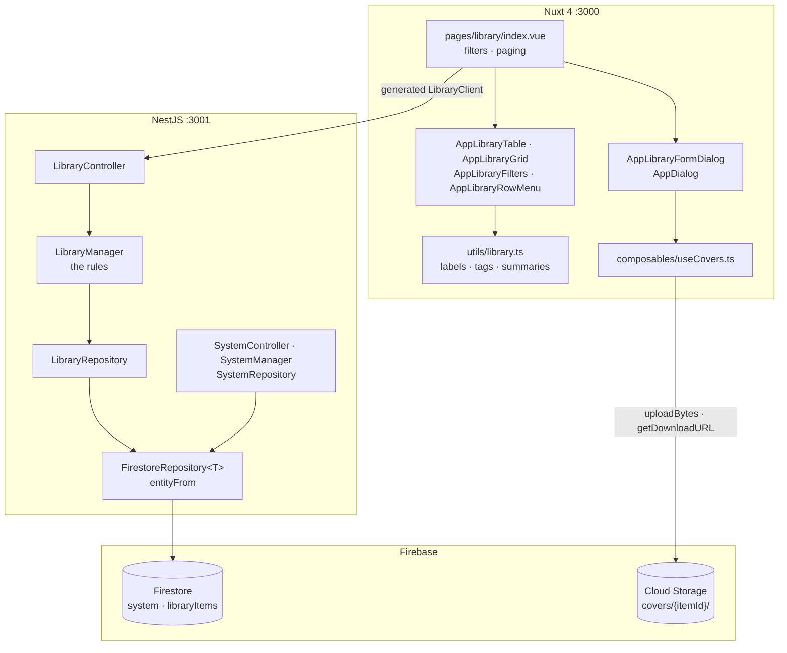
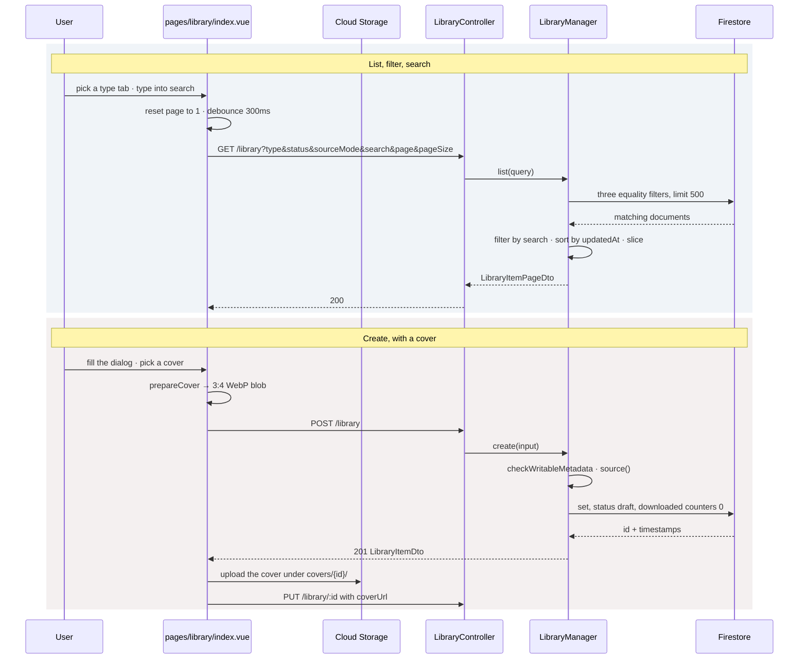

# Library — Part 1: basic management and the codebase it needs

## Overview

Part 1 builds the listing page of the Library section, the CRUD behind it, and the persistence
layer the rest of the product sits on. Source design: `_docs/design/1. Library.dc.html`, read
against `DESIGN.md` for the visual system.

The persistence layer is a deliberately small `FirestoreRepository<T>` base — a collection
reference and one mapping from a document to a domain object — proved end to end by a `System`
repository that writes on every boot and that `GET /system` reads. Queries are not generic: a
repository that needs one writes it in its own domain's terms.

On top of that sits the `library` feature module: controller → manager → repository, over a
`libraryItems` collection whose root shape never changes when a content type is added, because
everything type-specific lives under `metadata`. The entity is a union discriminated on `type`,
so `item.type === 'video'` narrows `metadata` to the one shape carrying `downloadedDuration`.

The rule the whole part follows: **every field the later parts need exists on the entity now,
and only the ones part 1 can honestly maintain are writable.**

## Requirements

- **A repository layer with a real first consumer.** `FirestoreRepository<T>` owns
  `collection`, `findById` and `delete`, plus `entityFrom` — which flattens every Firestore
  `Timestamp` to an ISO string, recursively through maps and arrays, so no driver type reaches
  a DTO. `SystemRepository` is the first user: `recordStart` writes in a transaction so
  `installedAt` survives two instances booting together.
- **Collection names live in one place.** `core/firebase/collections.ts` — a name that appears
  in two files eventually disagrees with itself.
- **The item's root shape is type-agnostic.** `type`, `title`, `coverUrl`, `sourceMode`,
  `sourceName`, `sourceUrl`, `status`, `metadata`, `createdAt`, `updatedAt`. Adding a content
  type adds a `metadata` shape and nothing else.
- **`type` and `sourceMode` are immutable after creation.** Both decide the item's shape;
  `checkImmutable` refuses a `PUT` that moves either.
- **Statuses are split by ownership.** A person may set `Draft` or `Ready`. `Scraping` and
  `Failed` are the job runner's, and `WRITABLE_STATUSES` plus `checkStatus` refuse them from a
  client. The list filter still accepts all four — a filter reads data it does not write.
- **Counters are split the same way.** `discoveredCount` and `discoveredAt` are the inventory
  a client may state; `downloadedCount`, `downloadedSize` and `downloadedDuration` say what is
  actually stored here, are omitted from every input DTO by `OmitType`, and are carried over
  rather than read from a `PUT` body.
- **Only a novel has descriptive metadata.** `checkWritableMetadata` refuses `status`,
  `author`, `language`, `genres` and `description` on an image or video set — a set has nothing
  to say about a work.
- **A crawler item needs both a URL and a crawler; a manual item is refused a URL.** `source()`
  enforces both, and names a manual item's source `Manual` whatever was sent.
- **`PUT` replaces the whole writable representation.** An omitted field is a cleared field —
  that is what `PUT` promises — with two documented exceptions carried over instead: the
  downloaded counters, and `createdAt`.
- **The listing is filtered in Firestore and searched in the manager.** Three equality filters
  go to Firestore, which serves them by merging automatic single-field indexes; the search, the
  `updatedAt` ordering and the page slice happen over what comes back. That is what keeps the
  collection free of composite indexes.
- **The screen is the mockup.** Type tabs, search, status and source filters, table and grid
  views, a create/edit dialog and a delete confirmation.

## Solution

### Contract Skeleton

| Method | Path | Answers | Refuses |
| --- | --- | --- | --- |
| `GET` | `/system` | `200 ServiceInfoDto` | — · version-neutral, outside `/api` |
| `GET` | `/health` | `200 HealthDto` | — · version-neutral, outside `/api` |
| `GET` | `/api/v1/library` | `200 LibraryItemPageDto` | `401` |
| `GET` | `/api/v1/library/:id` | `200 LibraryItemDto` | `401` · `404` |
| `POST` | `/api/v1/library` | `201 LibraryItemDto` | `400` source rules, or metadata the type has no room for · `401` |
| `PUT` | `/api/v1/library/:id` | `200 LibraryItemDto` | `400` the creation rules, plus a changed `type` or `sourceMode`, or a runner-owned status · `401` · `404` |
| `DELETE` | `/api/v1/library/:id` | `204` — and every chapter, image, clip and translation under it | `401` · `404` |

**`QueryListLibraryItemsDto`** — every field optional.

| Field | Type | Default | Applied by |
| --- | --- | --- | --- |
| `type` | `LibraryItemType` | — | Firestore equality |
| `status` | `LibraryItemStatus` | — | Firestore equality |
| `sourceMode` | `LibrarySourceMode` | — | Firestore equality |
| `search` | `string` (≤200) | — | manager, over title / sourceName / author |
| `page` | `int ≥ 1` | `1` | manager slice |
| `pageSize` | `int 1–100` | `20` | manager slice |

**`LibraryItemDto`** — what `GET /:id`, `POST` and `PUT` answer with.

| Field | Type | Notes |
| --- | --- | --- |
| `id` | `string` | Firestore document id. |
| `type` | `LibraryItemType` | `novel` \| `image` \| `video`. Immutable. |
| `title` | `string` | |
| `coverUrl` | `string \| null` | Null draws the wireframe placeholder. |
| `sourceMode` | `LibrarySourceMode` | `manual` \| `crawler`. Immutable. |
| `sourceName` | `string` | `Manual`, or the crawler's name. |
| `sourceUrl` | `string \| null` | Required of a crawler item, null of a manual one. |
| `status` | `LibraryItemStatus` | `draft` \| `scraping` \| `ready` \| `failed`. |
| `metadata` | `oneOf` the three below | Which shape follows from `type`. |
| `createdAt` / `updatedAt` | `string` (ISO) | |
| `translations` | `LibraryTranslationCoverageDto[] \| null` | Added in part 4. Null on a set. |

**Metadata** — `NovelMetadataDto`, `ImageSetMetadataDto`, `VideoSetMetadataDto`, over one base.

| Shape | Fields |
| --- | --- |
| base | `discoveredCount: number`, `discoveredAt: string \| null`, `downloadedCount: number` |
| novel | base + `status: NovelStatus`, `author`, `language`, `genres: string[]`, `description` |
| image set | base + `downloadedSize: number` (bytes) |
| video set | base + `downloadedSize: number`, `downloadedDuration: number` (seconds) |

**Input DTOs** are derived, not restated: `NovelMetadataInputDto` is
`PartialType(OmitType(NovelMetadataDto, ['downloadedCount']))`, and the two set shapes also drop
`downloadedSize` and `downloadedDuration`. `CreateLibraryItemDto` requires `type`, `title` and
`sourceMode`; `UpdateLibraryItemDto` is the same plus an optional `status` restricted by
`@IsIn(WRITABLE_STATUSES)`.

**`LibraryItemPageDto`** — `items: LibraryListItemDto[]`, `total`, `page`, `pageSize`.
`LibraryListItemDto` is `OmitType(LibraryItemDto, ['createdAt', 'translations'])`: neither view
draws the creation date, and coverage would be three aggregations per row for a question the
listing never asks.

**`SystemRecord` / `ServiceInfoDto`** — one document, `system/current`. `name`, `version`,
`schemaVersion`, `environment`, `apiVersion`, `installedAt`, `lastStartedAt`. The build fields
are *stored* rather than derived on purpose: `lastStartedAt` is only worth reading next to
*what* started, and reading those from live configuration would report the answering process as
though the record had said it.

**`HealthDto`** — `status: 'ok'`, `uptimeSeconds`, `firebaseStatus: 'up' | 'down'`.

### Component Diagrams

- **Where each rule lives.** The controller knows status codes and DTOs. The manager holds
  every rule about meaning — the source rules, the immutability checks, the writable statuses,
  the search and the paging. The repository is the only file that mentions Firestore, and would
  not change if the store did. `entityFrom` is the seam that keeps `Timestamp` out of
  everything above it.
- **Covers never enter the API process.** The dialog resizes a picked file to 3:4 WebP in a
  canvas (`utils/covers.ts`), uploads it straight to `covers/{itemId}/{uuid}.webp`, and sends
  the API only the download URL. `storage.rules` is the whole guard on that path.

- **Listing.** Deleting the last row of a page leaves that page empty while the catalogue is
  not, so the screen steps back to the last page that has something on it. A refetch with rows
  already drawn keeps them — the skeleton appears only when there is nothing on screen yet.
- **Creating.** The item is written before its cover is uploaded, because the object path is
  keyed on the item id. A failed upload therefore leaves an item without a cover rather than an
  orphaned object; a failed row write leaves nothing at all.
- **Deleting.** The row goes first and its bytes after — `covers.discard` is quiet about a URL
  that is not ours, which is what makes it safe on a cover somebody linked rather than
  uploaded. `LibraryManager.remove` cascades by hand: contents, translations, the live import
  node, then the item, because Firestore does not cascade.
- **Boot.** `SystemManager.onModuleInit` fires `recordStart()` **without awaiting it**.
  `NestFactory.create` does not resolve until every init hook has, so awaiting an unreachable
  Firestore would hold the process short of `listen` — in total silence, with `bufferLogs` on —
  and would take `/health` down with it, which is precisely the endpoint that has to answer
  when the database does not.

## Implementation Steps

- **Step 1 — Firestore, and a `System` repository that uses it.**
  `core/firebase/firebase-admin.service.ts` initialises the Admin app once, applies
  `ignoreUndefinedProperties`, and reuses an existing app so a watch reload cannot throw.
  `core/firebase/firestore.repository.ts` holds the base class and `entityFrom`.
  `core/firebase/collections.ts` names the collections. `system/entities/system-info.entity.ts`
  declares `SCHEMA_VERSION`, `SystemRecord` and `SystemInfo`; `system.repository.ts` writes the
  boot record in a transaction; `system.manager.ts` adds the two deadlines —
  `RECORD_DEADLINE_MS = 10_000` for the boot write and `PROBE_DEADLINE_MS = 2_000` for the
  health probe — because the Firestore client retries an unreachable backend for minutes
  without complaining.
- **Step 2 — the `library` module.** `entities/library-item.entity.ts` and
  `entities/library-item-metadata.entity.ts` declare the union and the four enums.
  `library.repository.ts` adds `findMatching`, `create`, `replace`, `updateStatus` and
  `updateCounters`, with `LIST_SCAN_LIMIT = 500` and a warning when a query fills it.
  `library.manager.ts` holds the rules. `dto/` derives the input classes from the response
  classes with `OmitType` and `PartialType`. `library.controller.ts` maps them onto HTTP, and
  `library.module.ts` exports the managers for the parts that come later.
- **Step 3 — the `/library` screen.** `types/library.ts` mirrors the DTOs by hand — names and
  field order follow `backend/src/library/dto/` so drift is easy to spot. `utils/library.ts`
  holds every label, tag and summary the two views share, plus `asLibraryItem`, which is the
  one place the generated client's flattened `oneOf` is read back as the union.
  `pages/library/index.vue` owns the filter state; `AppLibraryTable`, `AppLibraryGrid`,
  `AppLibraryFilters` and `AppLibraryRowMenu` draw it; `AppLibraryFormDialog` and `AppDialog`
  are the create/edit and delete dialogs; `AppLibraryCoverField` and `composables/useCovers.ts`
  handle the cover.
- **Step 4 — the index overrides.** `_deploy/firebase/firestore.indexes.json` switches off
  single-field indexing on every `libraryItems` field nothing queries — `title`, `coverUrl`,
  `sourceName`, `sourceUrl`, `metadata`, `createdAt`, `updatedAt` — so writes do not pay for
  indexes no read uses.

## Appendix

### Known limits

- **No full-text search.** Firestore has no substring index, so `search` runs in the manager
  over the documents the filters returned. It matches title, `sourceName`, and a novel's
  `author`, case-insensitively, as a plain `includes`.
- **The 500-document scan limit is the honest ceiling.** `findMatching` reads at most
  `LIST_SCAN_LIMIT` filtered documents, and search, ordering and paging all run over those.
  Past that many matches, items beyond the limit are invisible to all three. The repository
  logs a warning when a query fills it.
- **`total` is what matched the scan**, not what matched the collection, for the same reason.
- **Ordering is manager-side.** `orderBy('updatedAt')` alongside an equality filter would need
  a composite index per filter combination. The trade is deliberate.
- **Validation does not reach inside `metadata`.** The input classes are derived from the
  *response* classes, which carry no `class-validator` rules to inherit — so `PartialType`
  registers the fields with the pipe but checks no types or lengths inside them. The manager
  still refuses fields a type has no room for.
- **Nothing moves `Scraping` or `Failed` in this part.** Both statuses and every downloaded
  counter exist on the entity and are read by the screen, but part 1 has no crawler and no job
  runner to write them.
- **No detail screen.** Nothing on the listing navigates in part 1; the create wizard's
  crawler steps run against the static list in `utils/crawlers.ts` until part 3 replaces the
  validation with the server's.
