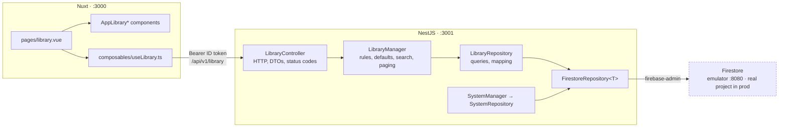

# Library — Part 1: basic management and the codebase it needs

Source design: `_docs/design/1. Library.dc.html` (list screen, create modal), read against
`DESIGN.md` for the visual system.

## Goal of design

Part 1 builds **the listing page of the Library section and the CRUD behind it**, plus the
persistence layer the rest of the product will sit on. Nothing more.

**In scope**

- A repository layer on Firebase Firestore, proven end to end by a `System` repository that
  `GET /system` reads from — the smallest real use of the layer, so the pattern is established
  before the Library feature copies it.
- `library` feature module — controller → manager → repository — with list, read, create,
  replace and delete.
- The `/library` screen: type tabs, search, status and source filters, table and grid views,
  a create/edit dialog and a delete confirmation.

**Out of scope — deliberately**

| Deferred | Why |
| --- | --- |
| Scraping jobs, crawlers, discovery, progress | Part 2. The `Scraping` and `Failed` statuses and every counter in `metadata` exist on the entity but no code moves them yet. |
| The detail screens — novel chapters, chapter reader, gallery assets | Part 3. Nothing on the listing page navigates. |
| The 3-step create wizard from the mockup | Steps 2 (crawler + URL validation) and 3 (fetched preview) are scraping features. Part 1 collapses creation into one metadata form. |
| Cover and asset uploads | Needs Cloud Storage. `coverUrl` is a plain URL field in part 1 — a link you paste, not a file you upload. |
| Full-text search | Firestore has no substring index — see [Known limits](#known-limits). |

The rule the whole part follows: **every field the later parts need exists on the entity now,
and only the ones part 1 can honestly maintain are writable.**

---

## Contracts

### Domain entities

Entities are plain interfaces, one per feature module, under `entities/`. No ORM, no decorators —
they describe what a Firestore document holds; `Timestamp` values become ISO strings on the way
out.

#### `SystemInfo` — `backend/src/system/entities/system-info.entity.ts`

One document, `system/current`. It exists so the repository layer has a first, real consumer.
The entity covers everything `ServiceInfoDto` already answers with, plus what is now persisted:

| Field | Type | Source | Notes |
| --- | --- | --- | --- |
| `id` | `string` | document id | Always `current` — a singleton. |
| `name` | `string` | stored | `SERVICE_NAME` of the build that last started. |
| `version` | `string` | stored | `SERVICE_VERSION` of that build. |
| `schemaVersion` | `number` | stored | What data shape this deployment expects. Bumped by hand when a migration lands. |
| `installedAt` | `string` (ISO) | stored | Written once, when the document is first created. |
| `lastStartedAt` | `string` (ISO) | stored | Rewritten on every boot. Proves the write path works, not only the read path. |
| `environment` | `NodeEnv` | derived | Read from configuration — a property of the running process, not of the record. |
| `apiVersion` | `string` | derived | `v${API_VERSION}`. Same reason. |

`SystemRepository` persists the five stored fields; `SystemManager` overlays the two derived ones
and hands back a whole `SystemInfo`. Keeping `name` and `version` in the document is what makes
`lastStartedAt` worth reading — it says *which build* booted, not just that something did.

#### `LibraryItem` — `backend/src/library/entities/library-item.entity.ts`

Collection `libraryItems`. One document per row of the listing. Everything type-specific lives
under `metadata`, so the root shape never changes when a new content type is added.

| Field | Type | Writable in part 1 | Notes |
| --- | --- | --- | --- |
| `id` | `string` | — | Firestore document id. |
| `type` | `LibraryItemType` | create only | `novel` \| `image` \| `video`. Immutable — the mockup says so ("Type and mode can not be changed after creation"), and it decides the shape of `metadata`. |
| `title` | `string` | yes | The heading in both views. |
| `coverUrl` | `string \| null` | yes | Rendered where the mockup draws a wireframe thumbnail; the wireframe stays when it is null. |
| `sourceMode` | `LibrarySourceMode` | create only | `manual` \| `crawler`. Immutable, same reason. |
| `sourceName` | `string` | yes | `Manual`, or the crawler's name (`novelbin.crawler`). Free text in part 1; part 2 turns it into a reference to a registered crawler. |
| `sourceUrl` | `string \| null` | yes | Required when `sourceMode` is `crawler`, null otherwise. |
| `status` | `LibraryItemStatus` | restricted | The pipeline status — see below. |
| `metadata` | `LibraryItemMetadata` | partly | Discriminated by `type`. See the table under it. |
| `createdAt` | `string` (ISO) | — | Set on create. |
| `updatedAt` | `string` (ISO) | — | Set on every write. The list is ordered by it. |

**Metadata** — `backend/src/library/entities/library-item-metadata.entity.ts`

Three shapes over one common core. `discoveredAt` is when the source was last read for a
content inventory; the counts are what is known and what is held.

| Shape | Fields |
| --- | --- |
| common | `discoveredCount: number`, `discoveredAt: string \| null`, `downloadedCount: number` |
| `NovelMetadata` | common + `status: NovelStatus`, `author: string`, `language: string`, `genres: string[]`, `description: string` |
| `ImageSetMetadata` | common + `downloadedSize: number` (bytes) |
| `VideoSetMetadata` | common + `downloadedSize: number` (bytes), `downloadedDuration: number` (seconds) |

```ts
type LibraryItemMetadata = NovelMetadata | ImageSetMetadata | VideoSetMetadata

type LibraryItem = NovelItem | ImageSetItem | VideoSetItem   // discriminated on `type`
```

The union is worth the small cost: `item.type === 'video'` narrows `item.metadata` to the one
shape that has `downloadedDuration`, so a helper cannot read a field the type does not carry.

**Enums** (`entities/library-item.entity.ts`):

```ts
enum LibraryItemType   { Novel = 'novel', Image = 'image', Video = 'video' }
enum LibrarySourceMode { Manual = 'manual', Crawler = 'crawler' }
enum LibraryItemStatus { Draft = 'draft', Scraping = 'scraping', Ready = 'ready', Failed = 'failed' }
enum NovelStatus       { Ongoing = 'ongoing', Complete = 'complete', Hiatus = 'hiatus' }
```

Two different things are called "status" and they must not be confused: `LibraryItemStatus` is
ours — where the item is in our pipeline — while `NovelStatus` is the work's own, as the source
publishes it. Only the first appears in the list's status filter.

`LibraryItemStatus` is split by ownership. A person may set `Draft` or `Ready`; `Scraping` and
`Failed` belong to the job runner, and part 1 has no way to reach them honestly, so the write DTO
rejects them. The list filter still accepts all four — a filter reads data it does not write.

Every counter (`discoveredCount`, `discoveredAt`, `downloadedCount`, `downloadedSize`,
`downloadedDuration`) is server-owned and absent from the write DTOs, for the same reason: a
client that could set `412 / 640` would be claiming content that does not exist. What that leaves
writable inside `metadata` is the novel's descriptive block — `status`, `author`, `language`,
`genres`, `description`. **Image and video items have no writable metadata in part 1.**

### Endpoints

| Method | Path | Auth | Input | Answers |
| --- | --- | --- | --- | --- |
| `GET` | `/system` | none | — | `200 ServiceInfoDto` — now includes the persisted fields |
| `GET` | `/health` | none | — | `200 HealthDto` — unchanged, stays free of the database |
| `GET` | `/api/v1/library` | bearer | `ListLibraryItemsQueryDto` (query) | `200 LibraryItemPageDto` |
| `GET` | `/api/v1/library/:id` | bearer | — | `200 LibraryItemDto` · `404` |
| `POST` | `/api/v1/library` | bearer | `CreateLibraryItemDto` | `201 LibraryItemDto` · `400` |
| `PUT` | `/api/v1/library/:id` | bearer | `ReplaceLibraryItemDto` | `200 LibraryItemDto` · `400` · `404` |
| `DELETE` | `/api/v1/library/:id` | bearer | — | `204` · `404` |

`PUT`, not `PATCH`: the body is the item's whole writable representation, so **an omitted optional
field is cleared**, not left alone. That is the point — clearing `author` or `sourceUrl` has to be
expressible, and with `PATCH` an absent key and an intentional erasure look identical.

Because the body is a whole representation, it may carry `type` and `sourceMode`; both are
immutable, so a value that differs from the stored one is a `400` rather than silently ignored.
A client that reads, edits and writes back therefore needs no special handling.

`LIBRARY_PATH = 'library'` joins `api.constants.ts`. The routes are versioned (`/api/v1/…`) and
guarded by the existing `FirebaseAuthGuard`, exactly like `AuthController`.

`GET /:id` is not the deferred detail screen — it is the read half of CRUD, used to refresh a row
after an edit.

### DTO classes

**Backend — `backend/src/library/dto/`**

| Class | Direction | Holds |
| --- | --- | --- |
| `LibraryItemDto` | out | The whole entity, dates as ISO strings. `metadata` documented as `oneOf` the three metadata DTOs. |
| `NovelMetadataDto` · `ImageSetMetadataDto` · `VideoSetMetadataDto` | out | One per shape, so the OpenAPI document describes what each type actually returns. |
| `LibraryItemPageDto` | out | `items: LibraryItemDto[]`, `total` (matching the filter), `page`, `pageSize`. |
| `CreateLibraryItemDto` | in | `type`, `title`, `coverUrl?`, `sourceMode`, `sourceName?`, `sourceUrl?`, `metadata?`. |
| `ReplaceLibraryItemDto` | in | The `PUT` body: everything `CreateLibraryItemDto` has, plus `status?` (`Draft` \| `Ready`). |
| `LibraryItemMetadataDto` | in | The writable metadata, all optional: `status?` (`NovelStatus`), `author?`, `language?`, `genres?`, `description?`. |
| `ListLibraryItemsQueryDto` | in | `type?`, `status?`, `sourceMode?`, `search?`, `page = 1`, `pageSize = 20` (max 100). |

Validation lives in two places, on purpose:

- **The pipe** checks shapes — `@IsEnum`, `@IsString`, `@MaxLength`, `@IsUrl` on the two URLs,
  `@IsArray` + `@IsString({ each: true })` on genres, `@ValidateNested` + `@Type` on `metadata`,
  and `@Type(() => Number)` on the query's numbers, since query strings arrive as text and the
  global `ValidationPipe` runs with `transform: true`.
- **The manager** checks meaning — that `metadata` is empty for an image or video item, that a
  crawler item carries a URL, that `type` and `sourceMode` match what is stored. One
  `LibraryItemMetadataDto` rather than a per-type discriminated body keeps the request surface at
  one shape; the rule that narrows it belongs with the other rules.

`ReplaceLibraryItemDto` is built with `IntersectionType(CreateLibraryItemDto, …)` from
`@nestjs/swagger`, already a dependency, so the OpenAPI document keeps the property metadata.

**Backend — `backend/src/system/dto/`**

`ServiceInfoDto` keeps `name`, `version`, `environment` and `apiVersion`, and grows
`schemaVersion: number`, `installedAt: string` and `lastStartedAt: string`. `HealthDto` is
untouched.

**Frontend — `frontend/app/types/library.ts`**

Hand-written mirrors of the response and request shapes: `LibraryItem` (the same discriminated
union), the three metadata shapes, `LibraryItemPage`, `CreateLibraryItem`, `ReplaceLibraryItem`,
`ListLibraryItemsQuery`, and the four string-union types matching the enums. There is no shared
package between the two workspaces yet, and `profile.vue` already sets the precedent of declaring
the shape client-side.

---

## Shape of the system



Three layers, each with one job: the **controller** knows HTTP and nothing about Firestore, the
**manager** holds the rules and is framework-free so its spec needs no Nest fixture (the note
already on `SystemManager`), the **repository** is the only place a collection name or a query is
written.

---

## Step 1 — Firestore, and a `System` repository that uses it

The point of this step is the layer, not the feature. `GET /system` becomes the first endpoint
whose answer is partly read from the database, so a broken Firestore setup is visible immediately
rather than three files into the Library work.

| File | What changes |
| --- | --- |
| `firebase.json` | Add the `firestore` emulator on `8080`, pointing at `firestore.rules` and `firestore.indexes.json`. |
| `firestore.rules` | Deny every client read and write. All access is server-side through the Admin SDK, which bypasses rules by design; an open rule set would be a hole, not a convenience. |
| `firestore.indexes.json` | Field overrides that keep the indexed set to exactly what is queried — see [Known limits](#known-limits). |
| `.firebaserc` | Unchanged — `demo-media-studio` already lets the emulator run credential-free. |
| `package.json` (root) | `dev:firebase` becomes `firebase emulators:start --only auth,firestore`; add `seed:firestore`. |
| `backend/src/core/config/configuration.ts` | `FirebaseConfig.firestoreEmulatorHost`, read from `FIRESTORE_EMULATOR_HOST`. |
| `backend/src/core/firebase/firebase-admin.service.ts` | Set `process.env.FIRESTORE_EMULATOR_HOST` when configured (the SDK reads the variable itself, same as the auth one), and expose a `firestore` getter over `getFirestore(this.app)` with `ignoreUndefinedProperties: true`. |
| `backend/src/core/firebase/collections.ts` | The collection names, in one place: `SYSTEM_COLLECTION`, `LIBRARY_COLLECTION`. |
| `backend/src/core/firebase/firestore.repository.ts` | `abstract class FirestoreRepository<T extends { id: string }>` — the collection reference, `toEntity(snapshot)` (document id + data, `Timestamp` → ISO string), and `findById` / `delete`. Small on purpose; a repository that needs a query writes it itself. |
| `backend/src/system/entities/system-info.entity.ts` | The entity above. |
| `backend/src/system/system.repository.ts` | `read()` and `recordStart()` — an upsert that sets `installedAt` only when the document is absent, and always rewrites `name`, `version` and `lastStartedAt`. |
| `backend/src/system/system.manager.ts` | `getInfo()` becomes async: the stored record, with `environment` and `apiVersion` overlaid from configuration. Implements `OnModuleInit` to call `recordStart()`. |
| `backend/src/system/system.module.ts` | Register `SystemRepository`; replace the "No repository" comment, which stops being true here. |
| `backend/src/system/system.controller.ts` | `getInfo()` returns a promise. `getHealth()` is untouched — liveness must not depend on the database. |
| `backend/.env.example` | `FIRESTORE_EMULATOR_HOST=127.0.0.1:8080`, with the same "leave it out to talk to the real project" note as the auth host. |
| `scripts/seed-firestore.mjs` | Plain `fetch` against the emulator's REST surface, no dependency — the shape `seed-firebase-auth.mjs` already set. Seeds the eight sample items from the mockup, nested `metadata` included, so the listing page has something to show. Idempotent: it deletes the seeded ids before writing them. |

A Firestore failure on `GET /system` propagates as a 500. That is the honest answer — the endpoint
reports what this deployment *is*, and it cannot do that with half the record. `/health` stays
database-free for whatever is watching the process.

## Step 2 — The `library` module

| File | What it is |
| --- | --- |
| `backend/src/core/api.constants.ts` | `export const LIBRARY_PATH = 'library'`, with the same one-line comment style as `AUTH_PATH`. |
| `backend/src/library/entities/library-item.entity.ts` | The root entity, the union, and the four enums. |
| `backend/src/library/entities/library-item-metadata.entity.ts` | The three metadata shapes over their common core. |
| `backend/src/library/dto/*.ts` | One file per class, as the table above lists — matching `auth/dto/`'s one-class-per-file layout. |
| `backend/src/library/library.repository.ts` | `findMatching(filter)`, `findById`, `create`, `replace`, `delete`. The only file that mentions Firestore. |
| `backend/src/library/library.manager.ts` | Defaults on create (`status: Draft`, zeroed counters, `sourceName: 'Manual'` for a manual item), per-type metadata narrowing, the "crawler needs a URL" rule, the immutability check on `PUT`, the rejected statuses, `NotFoundException` on an unknown id, and the search / sort / page pass over what the repository returns. Framework-free. |
| `backend/src/library/library.controller.ts` | `@ApiTags('Library')`, `@ApiBearerAuth()`, `@UseGuards(FirebaseAuthGuard)`, `@Controller(LIBRARY_PATH)`. `DELETE` carries `@HttpCode(NO_CONTENT)`, as `PATCH /auth/me/password` does. |
| `backend/src/library/library.module.ts` | Controller, manager, repository; exports the manager. |
| `backend/src/app.module.ts` | Import `LibraryModule`. |
| `backend/src/library/library.manager.spec.ts` | The rules, against a hand-written fake repository — the create defaults, the crawler-URL rule, metadata rejected for an image item, a changed `type` on `PUT`, a rejected status, the 404. The repo has no specs yet; the framework-free manager is the cheapest place to start one. |

**How a list request is served.** `type`, `sourceMode` and `status` go to Firestore as equality
filters — the three fields the collection is indexed on. Everything after that happens in the
manager, over at most `LIST_SCAN_LIMIT = 500` documents: the `search` match across `title`,
`sourceName` and the novel's `author`, then `updatedAt` descending, then the page slice. One code
path, no timestamp indexes, and no sort control on the API — the mockup has none either. The
volume assumption behind it, and the way out of it, are in [Known limits](#known-limits).

## Step 3 — The `/library` screen

`frontend/app/pages/library.vue` currently renders an empty `AppPage`. It becomes the listing
screen from the mockup.

| File | What it is |
| --- | --- |
| `app/types/library.ts` | The client-side mirrors of the DTOs. |
| `app/utils/library.ts` | Presentation helpers, auto-imported by Nuxt: `contentLabel(item)` (`412 / 640 ch.`, `248 images`, `42 clips · 3.1 GB`), `typeLabel`, `statusColor`, `relativeUpdated`. The metadata union is what makes these safe — size and duration are only reachable on the types that carry them. |
| `app/composables/useLibrary.ts` | `list`, `create`, `replace`, `remove` over `useApi()`. The one place a library path is written. |
| `app/pages/library.vue` | Owns the filter state, fetches through `useAsyncData` keyed on that state, and hosts the dialogs. |
| `app/components/AppLibraryFilters.vue` | The 52px control bar: type tabs (`UTabs`), the search input, status and source selects, the `{visible} of {total}` count, and the table/grid toggle. |
| `app/components/AppLibraryTable.vue` | The table view — cover or wireframe placeholder, title over description, type, source over URL, content, status, updated, and the row's `…` menu. |
| `app/components/AppLibraryGrid.vue` | The grid view — `AppBlueprint` cards, 16:9 cover or wireframe head with the type and status tags, title, description, content and updated, and the same `…` menu. |
| `app/components/AppLibraryFormDialog.vue` | One `UModal` for both create and edit. Type and source-mode pickers are the mockup's blueprint radio cards, disabled when editing. The novel metadata block (novel status, author, language, genres, description) appears only for `type === 'novel'` — there is nothing else writable for a set. |
| `app/components/AppLibraryDeleteDialog.vue` | Names the item it is about to delete. Destructive action, so `--color-danger`. |
| `app/components/AppPage.vue` | Add a passthrough `#trailing` slot over `UDashboardNavbar`, so the page can put the `{total} items` badge beside the title without any screen restyling the navbar. |

Screen behaviour:

- **Filters drive the request.** Every control writes to one reactive `filters` object; the
  `useAsyncData` watcher refetches. Search is debounced (~300ms). Changing a filter resets `page`
  to 1.
- **Rows and cards are inert.** Clicking one does nothing — the detail screen is part 3, and a row
  that looks clickable and is not would be worse than one that plainly is not. Edit and Delete
  live in the `…` menu, which is the only interactive element on a row. No pointer cursor, no
  hover-highlight-as-affordance.
- **Counts come from the list response.** `total` is what matches the current filter; the navbar
  badge and the `{visible} of {total}` line both read it. There is no per-tab count — that would
  need a second endpoint, and part 1 does not earn one.
- **After a mutation** the list refreshes and a `useToast` line confirms it — matching how
  `profile.vue` reports a password change.
- **Empty state**: a dashed `AppBlueprint` with the "New item" call to action. Distinguish "no
  items at all" from "no items match the filter" — the second offers to clear the filter.
- **Loading**: skeleton rows in the table view, skeleton cards in the grid.
- **The navbar's `Scrapings 5` link** ships without its count badge; there are no jobs to count
  until part 2.
- **Styling**: tokens and Tailwind classes only, no `<style>` block, square corners, all four
  registration marks on every framed element — `DESIGN.md`, and `profile.vue` as the worked
  example.

---

## Known limits

**What is indexed.** The collection is queried on three fields and three only — `type`,
`sourceMode` and `status`, all equality. Firestore indexes every field automatically, and
equality-only filters with no `orderBy` on a *different* field are served by merging those
single-field indexes, so **no composite index is needed**. `firestore.indexes.json` therefore
carries no composite entries; what it does carry is `fieldOverrides` that switch automatic
indexing **off** for the fields nothing filters on — `createdAt`, `updatedAt`, `title`,
`coverUrl`, `sourceUrl` and the whole `metadata` map — because every indexed field is paid for on
every write. The indexed set is exactly the queried set.

That choice is what pins sorting and paging to the manager: ordering by `updatedAt` alongside a
filter would require both an index on `updatedAt` and a composite for each filter combination.
Part 1 does not want either.

**Search, sort and paging happen in memory.** The manager reads at most `LIST_SCAN_LIMIT = 500`
filtered documents, then matches `search`, orders by `updatedAt` and slices the page. Correct
while the catalogue is small, and wrong past 500 items — silently, which is the dangerous part, so
the repository logs a warning when a query fills the scan limit. The way out is not a bigger
limit: it is a `keywords` array field (or Typesense/Algolia) for search, plus the timestamp
composite indexes and cursor paging (`startAfter`) once ordering moves back to Firestore.

**No optimistic concurrency.** Two editors saving the same item, last write wins — and with `PUT`
that means the later save also reverts whatever the earlier one cleared. A `version` field
checked in a transaction is the fix, and a later concern.

---

## Running it locally

```bash
pnpm install
pnpm dev:firebase      # Auth on :9099, Firestore on :8080, Emulator UI on :4000
pnpm seed:firebase     # admin@datntdev.com / StrongPassword123!
pnpm seed:firestore    # the eight sample library items
pnpm dev               # backend :3001 + frontend :3000
```

The emulators are stateless — restart them and re-run both seeds.

Each step is one commit, and each leaves `pnpm lint`, `pnpm typecheck` and `pnpm build` green.
