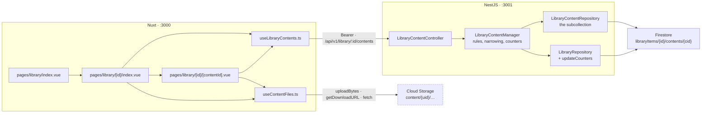

# Library — Part 2: library content management

Source design: `_docs/design/1. Library.dc.html` — the `isNovel` (lines 228–297), `isChapter`
(299–349) and `isGallery` (351–405) screens, read against `DESIGN.md` for the visual system.

## Goal of design

Part 1 built the library listing and the CRUD behind it, and stopped at the door: `library.vue`'s
own comment says *"Rows and cards are inert on purpose — the detail screens are part 3."* Nothing
opens an item, and nothing stores what an item actually holds — `metadata.discoveredCount` and
`downloadedCount` are on the entity but no code moves them, so every row reads `0 ch.`

Part 2 makes an item openable and gives it content: a novel's chapters, an image set's images, a
video set's clips. One new subcollection, one CRUD surface over it, and the three detail screens
the mockup draws. The counters stop lying because content writes maintain them.

**In scope**

- A `contents` subcollection under each library item, with its own entity, repository, manager and
  controller — list, read, create, replace and delete.
- The parent item's counters maintained by every content write, so `412 / 640 ch.` on the listing is
  true rather than decorative.
- The three detail screens: the novel's metadata sidebar over its chapters table, the chapter
  reader/editor, and the gallery's hero band over its asset grid.
- Content bytes in Cloud Storage, uploaded straight from the browser — chapter text included.

**Out of scope — deliberately**

| Deferred | Why |
| --- | --- |
| The job runner, and the scrape dialog | The mockup's **Scrape content… / Download content… / Discover new chapters / Discover new links / Retry failed / Scrape selected** controls are rendered **disabled with a tooltip** saying scraping arrives later. The screens stay visually faithful without claiming work nothing performs. |
| A real crawler registry | Still `app/utils/crawlers.ts`, as in part 1. |
| Media probing | `downloadedDuration` needs a clip's length. Nothing in this system can read one, so the counter stays where part 1 left it: `0`. |
| Server-side truth about `words` and `filesize` | The browser uploads the bytes, so only the browser counts them — see [Known limits](#known-limits). |
| Full-text search over content | Firestore has no substring index, same as part 1. |

### Decisions taken

| Question | Decision |
| --- | --- |
| Where content bytes live | **Cloud Storage, browser-direct.** Every content row carries a `contentUrl`, chapter text included, uploaded as a `text/plain` object exactly the way `useCovers.ts` already uploads a cover. The API never touches a byte. |
| Firestore layout | **Subcollection** `libraryItems/{itemId}/contents/{contentId}`. No `libraryItemId` field — the path *is* the parent reference. |
| Screens | **All three** — novel detail, gallery detail, chapter reader/editor. |
| Job-runner controls | **Rendered disabled**, each with a `UTooltip` explaining why. |

---

## Contracts

### `LibraryContent` — `backend/src/library/entities/library-content.entity.ts`

One document per chapter, image or clip, in the `contents` subcollection of its item. Discriminated
on `type` by **reusing `LibraryItemType`**, so a content row cannot claim a type its parent is not.

| Field | Type | Writable | Notes |
| --- | --- | --- | --- |
| `id` | `string` | — | Firestore document id. |
| `type` | `LibraryItemType` | — | **Server-set from the parent item.** Absent from the write DTOs entirely, which removes a whole class of mismatch. |
| `status` | `LibraryContentStatus` | derived | See below. |
| `contentUrl` | `string \| null` | yes | The Storage download URL. Null while the row is a placeholder — a chapter added by title before anything is written into it. |
| `createdAt` | `string` (ISO) | — | Set on create. |
| `updatedAt` | `string` (ISO) | — | Rewritten on every write. |

Per type, over that base:

| Shape | Adds |
| --- | --- |
| `NovelChapter` | `index: number` (the chapter number, what the list is ordered by), `title: string`, `language: string`, `words: number` |
| `ImageAsset` | `filename: string`, `filesize: number` (bytes) |
| `VideoAsset` | `filename: string`, `filesize: number` (bytes) |

```ts
enum LibraryContentStatus { Pending = 'pending', Ready = 'ready', Failed = 'failed' }

type LibraryContent = NovelChapter | ImageAsset | VideoAsset   // discriminated on `type`
```

`ImageAsset` and `VideoAsset` are the same shape and stay two interfaces, for the reason part 1 kept
two set-metadata cases: each narrows off its own `type`, and merged, neither would.

**Status is derived, not sent.** `contentUrl` present → `Ready`; absent → `Pending`. `Failed` is the
job runner's, exactly as `LibraryItemStatus.Scraping` and `.Failed` are — so `status` is absent from
the write DTOs and the manager sets it. The field is still stored, because the chapters table filters
and draws on it and the runner will write `Failed` into it. It maps onto the mockup's
Done / Queued / Failed tags.

### Endpoints

`LIBRARY_CONTENT_PATH = 'contents'` joins `api.constants.ts`. Versioned and guarded by
`FirebaseAuthGuard`, like every other library route.

| Method | Path | Input | Answers |
| --- | --- | --- | --- |
| `GET` | `/api/v1/library/:itemId/contents` | `QueryListLibraryContentsDto` | `200 LibraryContentPageDto` · `404` |
| `GET` | `/api/v1/library/:itemId/contents/:contentId` | — | `200 LibraryContentDto` · `404` |
| `POST` | `/api/v1/library/:itemId/contents` | `CreateLibraryContentDto` | `201 LibraryContentDto` · `400` · `404` |
| `PUT` | `/api/v1/library/:itemId/contents/:contentId` | `UpdateLibraryContentDto` | `200 LibraryContentDto` · `400` · `404` |
| `DELETE` | `/api/v1/library/:itemId/contents/:contentId` | — | `204` · `404` |

A `404` on an unknown `:itemId` as readily as an unknown `:contentId` — the subcollection path means
content of another item is simply not there, so no cross-item leak is possible by construction.

`PUT`, not `PATCH`, for part 1's reason: the body is the row's whole writable representation, so **an
omitted field is a cleared field**. Clearing a chapter's `contentUrl` — a reset back to a placeholder
— has to be expressible.

### DTO classes — `backend/src/library/dto/`

| Class | Direction | Holds |
| --- | --- | --- |
| `NovelChapterDto` · `ImageAssetDto` · `VideoAssetDto` | out | One per shape, each `implements` its entity so a forgotten field is a compile error. |
| `LibraryContentDto` | out | The row, `contentUrl` and stamps included; the per-type fields documented as `oneOf` the three above, the way `LibraryItemDto` documents `metadata`. |
| `LibraryContentPageDto` | out | `items`, `total`, `page`, `pageSize`. |
| `CreateLibraryContentDto` | in | **One shape for all three types**, every field optional: `index?`, `title?`, `language?`, `words?`, `filename?`, `filesize?`, `contentUrl?`. Part 1's precedent — one request shape, and the rule that narrows it lives in the manager with the other rules about meaning. |
| `UpdateLibraryContentDto` | in | `extends CreateLibraryContentDto` — nothing to add, since `type` and `status` are the server's. |
| `QueryListLibraryContentsDto` | in | `status?`, `search?`, `page = 1`, `pageSize = 50` (max 200). |

Validation splits the way part 1 split it. **The pipe** checks shapes: `@IsInt() @Min(0)` on `index`,
`words` and `filesize`, `@MaxLength` on `title`, `language` and `filename`, `@IsUrl` +
`@MaxLength(MAX_URL)` on `contentUrl`, `@Type(() => Number)` on the query's numbers. **The manager**
checks meaning:

- a novel chapter needs a `title`, and must not carry `filename` or `filesize`
- an image or video asset needs a `filename`, and must not carry `index`, `title`, `language` or `words`
- `index` defaults to *the highest stored index + 1* when a chapter is created without one, so "Add
  chapter" is a title and nothing else
- `words` and `filesize` default to `0`

### Frontend types — `frontend/app/types/library-content.ts`

Hand-written mirrors, as `types/library.ts` already is: `LibraryContent` (the same union),
`NovelChapter`, `ImageAsset`, `VideoAsset`, `LibraryContentStatus`, `LibraryContentPage`,
`CreateLibraryContent`, `ListLibraryContentsQuery`, and a `LibraryContentFilters` for the screen's
own `'all'` sentinel.

`types/library.ts` also grows **`LibraryItemDetail extends LibraryItem { createdAt: string }`** —
`GET /library/:id` returns `createdAt` and the listing's mirror deliberately omits it.

---

## Shape of the system



The bytes and the record travel separately and meet at `contentUrl`, which is the whole point of the
browser-direct decision: a 200 MB clip never enters the API process.

---

## Step 1 — The subcollection and its repository

The base repository is the one thing that needs care. `FirestoreRepository`'s `collection`,
`findById` and `delete` all assume a **root** collection keyed by one id; content is keyed by two.
Inheriting them would leave `delete(itemId)` on the content repository pointing at the parent item —
a live footgun.

| File | What changes |
| --- | --- |
| `backend/src/core/firebase/firestore.repository.ts` | Extract the mapping into an exported free function `entityFrom<T>(snapshot): T \| null`, and have `protected toEntity` delegate to it. Four lines; the class's behaviour and its spec are untouched. This is what lets a two-key repository reuse the `Timestamp` → ISO flattening without inheriting one-key methods. |
| `backend/src/core/firebase/collections.ts` | `export const CONTENT_SUBCOLLECTION = 'contents'`, in the same one-line comment style. |
| `backend/src/library/entities/library-content.entity.ts` | The entity, the union and `LibraryContentStatus`, as above. |
| `backend/src/library/library-content.repository.ts` | Does **not** extend `FirestoreRepository`. Injects `FirebaseAdminService`, keeps a private `contentsOf(itemId)` accessor, and uses `entityFrom`. Methods: `findMatching(itemId, filter)`, `findOne(itemId, contentId)`, `create(itemId, draft)`, `replace(itemId, stored, draft)`, `remove(itemId, contentId)`, `removeAll(itemId)` (batched, for the item cascade), and `counts(itemId)`. |
| `backend/src/library/library.repository.ts` | Add `updateCounters(itemId, counts)` — the only file that writes the `libraryItems` collection stays the only file that writes it. |
| `firestore.indexes.json` | `fieldOverrides` for the `contents` collection group, switching automatic indexing **off** for everything nothing queries — `title`, `language`, `words`, `filename`, `filesize`, `contentUrl`, `createdAt`, `updatedAt`. `type`, `status` and `index` keep theirs: `index` is what chapters are ordered by, `status` is what the counters aggregate on. |

Mirror `LibraryRepository`'s conventions exactly: a
`LibraryContentDraft = Omit<…, 'id' | 'createdAt' | 'updatedAt'>` distributed over the union,
`Timestamp.now()` written and ISO returned, the result **built from what was written rather than read
back**, `update` (not `set`) on replace so `createdAt` survives, and a module-local `iso()` helper.

`counts(itemId)` uses Firestore **aggregation queries** rather than reading the documents: `.count()`
for the total, `.where('status','==',Ready).count()` for what is held, and
`.aggregate({ total: AggregateField.sum('filesize') })` for the bytes. Exact, server-side, and
independent of how many rows there are — which matters for a 1,204-chapter novel.

```ts
const CONTENT_SCAN_LIMIT = 2000
```

The same bargain part 1 struck at 500, with the headroom the mockup's largest sample needs: Firestore
orders by `index` (novels) or `filename` (assets) and caps the read; the `search` match and the page
slice happen in the manager. The repository logs a warning when a query fills the limit.

## Step 2 — The content manager and controller

| File | What it is |
| --- | --- |
| `backend/src/core/api.constants.ts` | `export const LIBRARY_CONTENT_PATH = 'contents'`. |
| `backend/src/library/dto/library-content.dto.ts` | The three out-shapes plus `LibraryContentDto` and `LibraryContentPageDto`. |
| `backend/src/library/dto/create-library-content.dto.ts` | The one write shape. |
| `backend/src/library/dto/update-library-content.dto.ts` | `extends CreateLibraryContentDto`. |
| `backend/src/library/dto/query-list-library-contents.dto.ts` | The list filter. |
| `backend/src/library/library-content.manager.ts` | The rules. Framework-free, module-level free functions after the class, matching `library.manager.ts` in style. |
| `backend/src/library/library-content.controller.ts` | ``@Controller(`${LIBRARY_PATH}/:itemId/${LIBRARY_CONTENT_PATH}`)``, `@ApiTags('Library content')`, `@ApiBearerAuth()`, `@UseGuards(FirebaseAuthGuard)`. One-line delegations, `@HttpCode(NO_CONTENT)` on `DELETE`. |
| `backend/src/library/library.manager.ts` | `remove(id)` now also calls `contents.removeAll(id)` — Firestore does not cascade, and an item deleted without its subcollection leaves documents nothing can reach. |
| `backend/src/library/library.controller.ts` | The `DELETE` description stops saying *"Its content is not — part 1 stores none."* |
| `backend/src/library/library.module.ts` | Register the content controller, manager and repository. |
| `backend/src/library/library-content.manager.spec.ts` | Against a hand-written fake repository, no Nest fixture — the same shape as `library.manager.spec.ts`, `jest.mock('firebase-admin/auth', () => ({}))` first line included. |

The manager's jobs, in order:

1. **`require(itemId)`** via `LibraryRepository` — the 404 every route naming an item owes, and the
   source of `type` for everything below.
2. **Narrow by the parent's type** — the per-type field rules listed under the DTOs. A body carrying
   a field its type has no room for is a `400`, not a silent drop, exactly as
   `checkWritableMetadata` refuses metadata on an image item.
3. **Derive `status`** from `contentUrl`. There is no status in the body to refuse.
4. **Default `index`** to the next one up on create.
5. **Maintain the parent's counters** after every create, replace and delete: read `counts(itemId)`,
   then `updateCounters`. `discoveredCount` = every row (a manually added chapter *is* a discovered
   chapter), `downloadedCount` = the rows that are `Ready`, `downloadedSize` = the summed `filesize`,
   `discoveredAt` = now. This is what makes `412 / 640 ch.` on the listing true.
6. **List** — the repository's ordered scan, then the `search` match (a chapter's title, an asset's
   filename), then the slice. One code path, part 1's.

`downloadedDuration` stays `0`. Reading a clip's length needs media probing, which no part of this
system has; a counter this cannot honestly fill is left alone.

Spec cases: the per-type field rules both ways, `index` auto-assignment, status derived from
`contentUrl`, the counter deltas across create → replace → delete, the 404 on an unknown item, and
the 404 on a `contentId` belonging to another item.

## Step 3 — Storage, for content this time

`storage.rules` grows one path beside `covers/{userId}/{file}`, on the reasoning its comment already
states — Cloud Storage *is* reached from the browser, so these rules are the whole guard on that
path, not a second line behind one:

```
match /content/{userId}/{file} {
  allow read: if request.auth != null;
  allow create, update: if request.auth != null
    && request.auth.uid == userId
    && request.resource.size < 200 * 1024 * 1024
    && request.resource.contentType.matches('image/.*|video/.*|text/plain.*');
  allow delete: if request.auth != null && request.auth.uid == userId;
}
```

200 MB is the mockup's own cap (*"JPG, PNG, WEBP, MP4 · max 200 MB"*), kept in step with
`ASSET_MAX_MB` in `app/utils/library-content.ts` the way the cover cap is kept in step with
`COVER_MAX_MB`. `text/plain` is there because a chapter body is an object too.

## Step 4 — The three screens

**Routing first.** `app/pages/library.vue` **moves to `app/pages/library/index.vue`**. Keeping
`library.vue` beside a `library/` directory would make it a parent layout that has to render
`<NuxtPage/>`, which is not what it is — the same reason the detail is `library/[id]/index.vue` and
not `library/[id].vue`. `AppNavLink` already prefix-matches, so the sidebar's Library row stays lit
on every child route; no navigation change is needed.

| File | What it is |
| --- | --- |
| `app/components/AppPage.vue` | One more passthrough: a `#title` slot over `UDashboardNavbar`'s, so a screen can draw the mockup's `← Library / {title}` breadcrumb without restyling the navbar. `#leading` is the sidebar collapse's and stays it. |
| `app/pages/library/index.vue` | Moved. Rows and cards become openable, and the "inert on purpose" comment goes. |
| `app/components/AppLibraryTable.vue` · `AppLibraryGrid.vue` | The title becomes a `NuxtLink` to the item — a real link, so it is keyboard-reachable — and the row or card carries a `@click` for the pointer, with the `…` menu cell stopping propagation. |
| `app/composables/useLibrary.ts` | Add `get(id)` returning `LibraryItemDetail`. The backend has had `GET /:id` since part 1 and nothing called it. |
| `app/composables/useLibraryContents.ts` | `list`, `get`, `create`, `replace`, `remove` over `/library/:itemId/contents`. The one place a content path is written. |
| `app/composables/useContentFiles.ts` | Storage, mirroring `useCovers.ts`: `uploadAsset(file)` (an image or clip, as picked), `uploadText(text)` (a chapter body as `text/plain; charset=utf-8`), `readText(url)` and `discard(url)`. Path `content/${uid}/${crypto.randomUUID()}${extension}`, and the same prose-sentence errors rather than Storage's codes. |
| `app/utils/library-content.ts` | Presentation helpers, auto-imported: `contentStatusTag` (Done / Queued / Failed over the mono badge scheme), `chapterLabel`, `assetMeta`, `wordCount(text)`, `ASSET_ACCEPT`, `ASSET_MAX_MB = 200`. |
| `app/pages/library/[id]/index.vue` | Fetches the item through `useAsyncData` keyed on the route id, then branches: `type === 'novel'` renders the novel panes, anything else the gallery. Hosts the dialogs, and reuses `AppLibraryFormDialog` and `AppLibraryDeleteDialog` unchanged for "Edit metadata" and "Delete item" — after a delete it navigates back to `/library`. |
| `app/components/AppLibraryNovelPanel.vue` | The 320px sidebar: the 3:4 cover in an `AppBlueprint`, title, author, genre badges, the `<dl>` (Status, Chapters, Mode, Crawler, Source, Language, Updated) and the action stack. The step-3 review block already in `AppLibraryFormDialog` is the worked example for the `<dl>`. |
| `app/components/AppLibraryChapterTable.vue` | The chapters table — checkbox, No., Title, Words, Status, Scraped, and the row's ghost **Open** / **Retry**. Hand-rolled `<table class="w-full table-fixed">` with `USkeleton` rows, as `AppLibraryTable` is. |
| `app/components/AppLibraryChapterDialog.vue` | "Add chapter": a title, and an index defaulting to the next one. Also serves the rename, so the reader is not the only way to change a title. |
| `app/components/AppLibraryGalleryPanel.vue` | The hero band: title, subtitle, the five uppercase stats (Assets · Mode · Crawler · Size · Updated) and the action cluster. |
| `app/components/AppLibraryAssetGrid.vue` | The `minmax(180px,1fr)` grid: the dashed dropzone card first, then one square card per asset — wireframe thumb, the meta badge bottom-right, a `circle-play` overlay on a clip, filename, and a `…` menu whose one live item is Delete. |
| `app/components/AppLibraryContentDeleteDialog.vue` | Names the chapter or asset, deletes the row, then `discard`s its Storage object. Destructive, so `color="error"`. |
| `app/pages/library/[id]/[contentId].vue` | The chapter reader/editor: a 280px chapter navigator with the **All chapters** back link and the active row tinted, a 52px toolbar (`Chapter {index}` eyebrow, title, word count, a Read/Edit toggle, **Save**), and a `max-w-[45rem]` centred column — paragraphs when reading, a title field over a `UTextarea` when editing. |

Screen behaviour:

- **Saving a chapter body** is upload-then-`PUT`, the shape `AppLibraryFormDialog.save()` already
  uses for a cover: `uploadText` the body, `PUT` the row with the new `contentUrl` and the
  `wordCount`, then `discard` the object it replaced. On a failed `PUT` the fresh object is discarded
  instead, so a failure leaves nothing behind.
- **Uploading assets** is the same, per file, with progress drawn as each settles. The dropzone
  handles both the click and the drop, as `AppLibraryCoverField` does.
- **Reading a chapter** fetches `contentUrl` and splits on newlines into paragraphs. A placeholder
  chapter (`contentUrl` null) opens straight into Edit with an empty body rather than an empty
  reading view.
- **Selection** in the chapters table drives one live action, **Delete selected**, beside the
  disabled **Scrape selected**. Checkboxes that could only feed a disabled control would be dead UI.
- **Disabled controls** each get a `UTooltip`: *"Scraping arrives with the job runner."* **Retry
  failed (n)** takes its `n` from the real count of `failed` rows, so the number is true even though
  the button does nothing.
- **Loading** is skeleton rows in the chapters table, skeleton cards in the asset grid; **empty** is
  a dashed `AppBlueprint` offering "Add chapter" or the dropzone.
- **After a mutation** the list refreshes and a `useToast` line confirms it, as the listing does.
- **Styling**: tokens and Tailwind classes only, no `<style>` block, square corners, all four
  registration marks on every framed element.

---

## Known limits

**`words` and `filesize` are the client's word.** The browser uploads the bytes, so only the browser
counts them; the server stores what it is told. A client could claim `words: 999999`. The fix is the
one that fixes it for real content — the job runner, which will write both itself.

**A chapter body costs a second round trip, and edits race.** Reading one is `GET` the row then
`fetch` the URL; two people editing the same chapter is last-write-wins, and the loser's object is
orphaned rather than overwritten. Part 1's *No optimistic concurrency* limit, now with a second place
to bite.

**Orphaned Storage objects.** A content row deleted through the UI discards its object, but an item
deleted whole does not — the backend has no Storage access by design, and deleting N objects from the
browser is not something to trust. Abandoned editor sessions leak too. A sweep job over `content/`
reconciled against Firestore is the fix.

**`CONTENT_SCAN_LIMIT = 2000`, and search and paging happen in memory.** Correct while an item holds
fewer rows than that, and wrong past it — silently, so the repository warns when a query fills the
limit. The way out is `startAfter` cursor paging plus a `keywords` field for search, not a bigger
number.

**`downloadedDuration` stays `0`.** No media probing exists.

**Chapter indexes are not unique and not transactional.** `index` defaults to the next one up, read
and written without a transaction, so two simultaneous "Add chapter" calls can land on the same
number. Nothing breaks — the order is merely arbitrary between them.

**Counters are exact but not atomic with the write.** The aggregation runs after the content write,
in a separate call. A crash between the two leaves the item's counters one row stale until the next
content write recomputes them.

**A Storage download URL is a bearer token.** `getDownloadURL` returns a long-lived tokenised URL,
and anyone holding it can read the object regardless of `storage.rules`. Fine for this catalogue;
worth knowing before anything private lands in it.

---

## Running it locally

```bash
pnpm install
pnpm dev:firebase      # Auth :9099, Firestore :8080, Storage :9199, Emulator UI :4000
pnpm seed:firebase     # admin@datntdev.com / StrongPassword123!
pnpm dev               # backend :3001 + frontend :3000
```

The emulators are stateless — restart them and re-run the seed.

**Backend**, before any UI:

```bash
pnpm --filter @media-studio/backend run test -- library-content.manager
pnpm lint && pnpm typecheck
```

Then `http://localhost:3001/docs` — the new routes appear under **Library content**, and
`POST /api/v1/library/:itemId/contents` with `{ "title": "Chapter one" }` should answer `201` with
`index: 1`, `status: "pending"`, `contentUrl: null`.

**End to end through the UI**, which is the real check because the CRUD *is* the seeding:

1. `/library` → create a manual **novel**, then click its title. The detail opens with an empty
   chapters table.
2. **Add chapter** twice. Both rows read **Queued**; go back to `/library` and the row now says
   `0 / 2 ch.` — the counters moving is the whole point of step 2.
3. Open a chapter, **Edit**, type a few paragraphs, **Save**. The row flips to **Done**, the word
   count appears, `/library` reads `1 / 2 ch.`, and the Storage emulator UI at
   `http://localhost:4000/storage` shows the object under `content/{uid}/`.
4. Reload the reader — the body comes back from `contentUrl`. This is the one step that proves the
   cross-origin read works against the emulator; if it fails, it fails here and nowhere else.
5. Delete a chapter → the row goes, the counters drop, the object goes.
6. Create a manual **image set**, open it, drop two files on the dropzone. Cards appear with their
   dimensions; `/library` shows `2 images`. Repeat with a **video set** and check the play overlay
   and the size stat.
7. **Edit metadata** and **Delete item** on the detail page — the second should return to `/library`
   with the item gone, and the Firestore UI should show its `contents` subcollection gone with it.
8. Confirm every scraping control is disabled and tooltipped, and that **Retry failed (0)** shows a
   real zero.

Each step is one commit, and each leaves `pnpm lint`, `pnpm typecheck` and `pnpm build` green.
