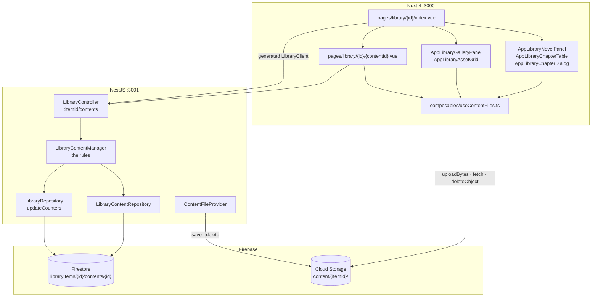
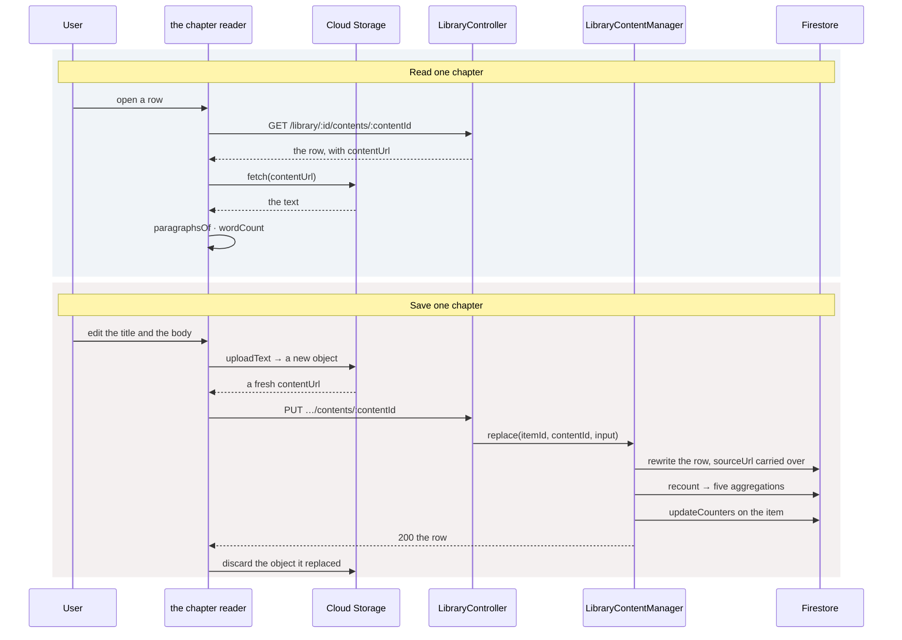

# Library — Part 2: library content management

## Overview

Part 2 gives every library item what it holds: a novel's chapters, an image set's images, a
video set's clips. One `contents` subcollection under each item, one controller shared with the
item itself, and three screens — the novel detail page, the set detail page, and the chapter
reader.

Content is not addressable apart from its item, so it gets no controller of its own: every
route below `:itemId/contents` names the item first, and a client that can reach one can reach
the other. The rows live in a subcollection rather than a root collection because the path *is*
the parent reference — there is no `libraryItemId` field to keep in step with anything, and a
cross-item read is impossible rather than merely refused.

The bytes never travel through the API. A chapter's text and an asset's file go from the
browser straight into `content/{itemId}/{uuid}` in Cloud Storage, and the row keeps only the
download URL. That is what keeps a 200 MB clip — and a 640-chapter novel's worth of prose — out
of both the API process and Firestore.

## Requirements

- **One shape per type, discriminated on the item's `type`.** `NovelChapter` carries `index`,
  `title`, `language` and `words`; `ImageAsset` and `VideoAsset` carry `filename` and
  `filesize`. The two asset shapes are identical and stay two, because each narrows off its own
  `type` — merged, neither would.
- **A row cannot claim a type its parent is not.** `type` is read from the item, never from the
  request, on create and on replace alike.
- **Which fields belong to which type is enforced.** `chapterBlock` refuses `filename` and
  `filesize` on a chapter and requires a title; `assetBlock` refuses `index`, `title`,
  `language` and `words` on an asset and requires a filename.
- **`status` is derived, not sent.** A row with a `contentUrl` holds something (`completed`) and
  a row without one does not (`pending`). `discovered`, `scraping` and `failed` belong to
  discovery and the job runner, and no client can set them.
- **A chapter's number is read from the store.** `newDraft` defaults `index` to
  `highestIndex(itemId) + 1`, so "Add chapter" is a title and nothing else. On a replace,
  `index` is the one field an omission does not clear — a chapter has no "no number" state.
- **`sourceUrl` is not a `PUT`'s to rewrite.** It is where the row came from — the key discovery
  matches on and the only address a re-scrape has — so `nextDraft` carries the stored value
  over. Left to the generic path, a save that omitted it would clear it and the chapter could
  never be fetched again.
- **The item's counters are recomputed, never incremented.** `recount()` reads five Firestore
  aggregations and writes `discoveredCount`, `downloadedCount` and — for a set only —
  `downloadedSize`. A count that is recomputed cannot drift, and a novel of twelve hundred
  chapters costs the same as one of twelve.
- **Deleting cascades by hand.** A row's translations go with it; an item's contents and
  translations go with it. Firestore does not cascade.
- **The list is ordered in Firestore and searched in the manager.** `index` for a chapter,
  `filename` for an asset — `orderField(type)` picks which — with an optional `status` equality
  filter. The search and the page slice run over what comes back.
- **Bytes go around the API.** `useContentFiles` uploads and reads;
  `ContentFileProvider` is the server-side twin used by scraping and import, and both build
  their URLs through `core/firebase/storage-url.ts` so a URL written by either end is the same
  URL.

## Solution

### Contract Skeleton

| Method | Path | Answers | Refuses |
| --- | --- | --- | --- |
| `GET` | `/api/v1/library/:itemId/contents` | `200 LibraryContentPageDto` | `401` · `404` no item |
| `GET` | `/api/v1/library/:itemId/contents/:contentId` | `200` `oneOf` the three row shapes | `401` · `404` no item, or no row under it |
| `POST` | `/api/v1/library/:itemId/contents` | `201` one row | `400` fields belonging to a type the item is not, or a chapter without a title · `401` · `404` |
| `PUT` | `/api/v1/library/:itemId/contents/:contentId` | `200` one row | `400` as above · `401` · `404` |
| `DELETE` | `/api/v1/library/:itemId/contents/:contentId` | `204` — the stored bytes are not deleted; whoever uploaded them drops them | `401` · `404` |

**`QueryListLibraryContentsDto`**

| Field | Type | Default | Applied by |
| --- | --- | --- | --- |
| `status` | `LibraryContentStatus` | — | Firestore equality |
| `search` | `string` (≤200) | — | manager, over title or filename |
| `page` | `int ≥ 1` | `1` | manager slice |
| `pageSize` | `int 1–200` | `50` | manager slice |
| `language` | `TranslationLanguage` | — | added in part 4 |

**`LibraryContentBaseDto`** and the three shapes over it.

| Field | Type | On | Notes |
| --- | --- | --- | --- |
| `id` | `string` | all | |
| `type` | `LibraryItemType` | all | The item's own. |
| `sourceUrl` | `string \| null` | all | Null for a row added by hand. What discovery matches on. |
| `contentUrl` | `string \| null` | all | Where the bytes are. Null while the row is a placeholder. |
| `status` | `LibraryContentStatus` | all | `discovered` \| `pending` \| `scraping` \| `completed` \| `failed`. |
| `createdAt` / `updatedAt` | `string` (ISO) | all | |
| `translated` / `sourceTitle` | `boolean` / `string \| null` | all | Added in part 4. |
| `index` | `number` | `NovelChapterDto` | The chapter number, and what the list is ordered by. |
| `title` | `string` | `NovelChapterDto` | |
| `language` | `string` | `NovelChapterDto` | |
| `words` | `number` | `NovelChapterDto` | Zero until there is text. |
| `filename` | `string` | `ImageAssetDto`, `VideoAssetDto` | And what the list is ordered by. |
| `filesize` | `number` | `ImageAssetDto`, `VideoAssetDto` | Bytes. |

**`CreateLibraryContentDto`** — one shape for all three types, **every field optional**, because
which fields a request must carry and which it must leave out follows from the parent item's
type, and that rule belongs in the manager with the other rules about meaning.
`UpdateLibraryContentDto extends CreateLibraryContentDto` — same body, different promise.
Absent on purpose: `type`, which is the parent's, and `status`, which follows from `contentUrl`.

| Field | Rules |
| --- | --- |
| `index` | `int 0–1_000_000`. A chapter only. |
| `title` | `string 1–300`. A chapter only, and required of one. |
| `language` | `string ≤32`. A chapter only. |
| `words` | `int ≥ 0`. A chapter only. |
| `filename` | `string 1–300`. An asset only, and required of one. |
| `filesize` | `int ≥ 0`. An asset only. |
| `sourceUrl` | URL ≤2048, nullable. |
| `contentUrl` | URL ≤2048, nullable. What decides `status`. |

**`LibraryContentPageDto`** — `items`, `total`, `page`, `pageSize`. `CONTENT_ONE_OF` is what
declares the three row shapes on every single-row response, and `@ApiExtraModels` on the
controller is what puts them in the document.

### Component Diagrams

- **One controller, two managers.** `LibraryController` serves both the item and its content;
  `LibraryContentManager` holds the row rules and calls `LibraryRepository.updateCounters`
  after every change. `LibraryContentRepository` does not extend `FirestoreRepository` — a row
  here is found by two ids, so it cannot inherit the one-key `findById`; what is worth sharing
  is `entityFrom`, and that is what it uses.
- **Two writers, one URL shape.** The browser writes through `useContentFiles`; the server
  writes through `ContentFileProvider`. Both produce
  `…/o/{path}?alt=media&token=…` — the token is written as object metadata, which is what
  `getDownloadURL()` itself reads — so a scraped chapter and a hand-typed one are read back the
  same way. A signed URL is not the alternative: the emulators issue no credential to sign with.

- **Upload, then write the row, then drop what it replaced.** That order is the whole of the
  consistency story: a failed upload leaves no row pointing at nothing, and a failed `PUT`
  discards the fresh object instead. Objects are named at random rather than after the row,
  because a body replaced mid-edit must not overwrite the one still being read.
- **A placeholder opens straight into Edit.** A row with no `contentUrl` has nothing to read, so
  the reader skips the reading view rather than drawing an empty one.
- **The navigator is its own fetch.** The reader's left-hand list is the whole novel, not the
  detail screen's filtered list — that one is whatever the search box there narrowed it to. It
  pages in on scroll through an `IntersectionObserver`, and a failure leaves it short rather
  than taking over a screen that is showing the chapter perfectly well.
- **Both screens page at 200 and append.** `ticket` is bumped per request, so the answer to a
  search two letters ago cannot land after the answer to this one.
- **Assets upload one at a time.** Each file is checked against `ASSET_ACCEPTS` and the 200 MB
  cap, uploaded, then turned into a row; a row that fails discards the object it would have
  pointed at, so a retry leaves nothing orphaned.

## Implementation Steps

- **Step 1 — the subcollection and its repository.**
  `entities/library-content.entity.ts` declares `LibraryContentStatus`, the base shape and the
  three row shapes. `library-content.repository.ts` adds `findMatching` (ordered by
  `orderField(type)`, `CONTENT_SCAN_LIMIT = 2000`), `findOne`, `highestIndex`, `create`,
  `createMany` (batched at 500, answering with the ids it allocated, in order), `replaceMany`,
  `updateStatus`, `patch`, `replace`, `remove`, `removeAll` and `counts` — five aggregations in
  one `Promise.all`, including an `AggregateField.sum('filesize')`.
- **Step 2 — the content manager and controller.** `library-content.manager.ts` holds
  `list`, `get`, `find`, `create`, `replace`, `remove` and `recount`, plus the type-block
  helpers that do the refusing. `library.controller.ts` grows the five content routes under
  `:itemId/contents`. `dto/library-content.dto.ts`, `library-content-create.dto.ts`,
  `library-content-update.dto.ts` and `query-list-library-contents.dto.ts` are the contract.
- **Step 3 — storage for content.** `composables/useContentFiles.ts` gains `uploadAsset`,
  `uploadText`, `readText` and `discard`, filing everything under `content/{itemId}/` — an
  item's objects belong to the item, not to whoever uploaded them, and two people adding
  chapters to one novel are filling the same shelf. `_deploy/firebase/storage.rules` admits
  `image/*`, `video/*` and `text/plain*` under that prefix, capped at 200 MB, for any signed-in
  user.
- **Step 4 — the three screens.** `types/library-content.ts` mirrors the DTOs;
  `utils/library-content.ts` holds the status badges, the per-type nouns, the accepted MIME
  lists, `checkAsset`, `wordCount` and `paragraphsOf`. `pages/library/[id]/index.vue` splits on
  `type` into `AppLibraryNovelPanel` + `AppLibraryChapterTable` or `AppLibraryGalleryPanel` +
  `AppLibraryAssetGrid`, and hosts `AppLibraryChapterDialog`, the item form and the two delete
  confirmations. `pages/library/[id]/[contentId].vue` is the reader and editor.
- **Step 5 — the index overrides.** `firestore.indexes.json` switches off single-field indexing
  on every `contents` field nothing queries — `title`, `language`, `words`, `contentUrl`,
  `type`, `createdAt`, `updatedAt` — leaving `index`, `filename` and `status` indexed, which is
  exactly what `findMatching` and `counts` use.

## Appendix

### Known limits

- **`words` is whoever wrote the text's figure.** The count is computed in the browser by
  `wordCount` and sent; nothing recomputes it server-side. `ScrapingJobManager.wordCount` is
  deliberately the same function so a scraped chapter and an edited one agree — but a client
  can send any number it likes.
- **`filesize` is likewise the client's.** The server never probes the object.
- **The 2000-row scan limit.** `findMatching` reads at most `CONTENT_SCAN_LIMIT` rows, and the
  search and the slice run over those. A novel longer than that is searchable only within the
  first two thousand rows.
- **No substring index.** As in part 1, `search` is a case-insensitive `includes` in the
  manager, over a chapter's title or an asset's filename.
- **Deleting a row does not delete its bytes.** The API answers `204` and leaves the object;
  the browser drops it through `files.discard` immediately after. A row deleted by any other
  means leaves an orphan in the bucket, and nothing sweeps `content/{itemId}/` yet.
- **A chapter's `index` is not unique.** Nothing stops two chapters sharing a number — which is
  why part 5's package numbers body entries by position rather than by chapter number.
- **Two rows may share a `filename`.** The list is ordered by it, not keyed on it.
- **No bulk content endpoint.** Deleting a selection is a loop over the single-row route, one at
  a time, so a partial failure leaves what it removed removed and says which row stopped it.
