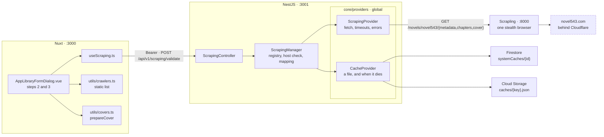

# Library — Part 3: creating an item from the scraping service

Source design: `_docs/design/1. Library.dc.html` — the add-item wizard, steps 2 and 3. The service
this part finally calls is documented in `scraping/README.md`.

## Goal of design

Part 1 built the add-item wizard whole: step 2 picks a crawler and takes a URL, a **Validate** button
reads the source, and step 3 reviews what it found before anything is written. Every bit of that is
mocked. `frontend/app/utils/crawlers.ts` invents a title from the URL's last path segment, derives a
chapter count by summing character codes, sleeps 600 ms so the spinner is seen, and offers four
crawlers — three of which do not exist. Part 2 left it alone, and said so: *"A real crawler registry —
still `app/utils/crawlers.ts`, as in part 1."*

Meanwhile `scraping/` became real. Commit `fbc5e4c` replaced FlareSolverr with a FastAPI service
wrapping Scrapling, holding one persistent stealth browser against Cloudflare, and it scrapes
novel543.com properly: metadata from the `og:novel:*` meta tags, the full chapter list from the `/dir`
page, covers through the same browser because the image CDN is protected too. It has been running on
`:8000` since, and nothing in the backend or the frontend has ever called it.

Part 3 connects the two. One new backend module over two new core providers, and the preview screen
starts showing what the source actually publishes.

**In scope**

- A `scraping` module in the backend with one endpoint, `POST /api/v1/scraping/validate`, that reads a
  source and answers with everything the preview screen draws.
- A **static** crawler registry, defined once in the backend and once in the frontend. `novel543` is
  the only entry, because it is the only crawler that exists.
- `core/providers/scraping.provider.ts` — the HTTP client for the scraping service.
- `core/providers/cache.provider.ts` — a TTL cache whose files live in Cloud Storage under `caches/`
  and whose `systemCaches` document says where each one is and when it expires. The validate response
  is cached whole, for 30 days, so a source is read once.
- The wizard wired to it: real validation, a real preview, the scraped cover carried into the save that
  uploads it, and an honest empty state where no crawler exists.

**Out of scope — deliberately**

| Deferred | Why |
| --- | --- |
| The job runner | Validating a source and scraping its content are different jobs. The item is still created as a `draft` holding nothing; `discoveredCount` stays `0` until something writes chapters. Part 2's disabled-and-tooltipped scraping controls stay disabled. |
| The `Scrapings` screen | `pages/scrapings.vue` stays the one-line placeholder it is. There are no jobs to list. |
| Crawlers beyond novel543 | Adding one is a parser module in `scraping/app/` plus one entry in each static registry. No endpoint, manager or DTO changes — that is the point of the registry being a list. |
| Re-validating an existing item | Editing a crawler item still types its source in by hand, as part 1 has it. Validation belongs to creation, where a wrong URL is still cheap to fix. |
| A `GET /crawlers` endpoint | The list is static on both sides. A request to learn two facts that ship in the bundle is a request not worth making. |
| Seeding chapters on create | The response carries the whole chapter list, and creation still ignores it. Writing 1,305 content rows is the job runner's work, and doing it inside a `POST /library` would make one request that either finishes or leaves half a novel behind. |

### Decisions taken

| Question | Decision |
| --- | --- |
| Where the crawler list lives | **Static, on both sides.** `backend/src/scraping/crawlers.ts` and `frontend/app/utils/crawlers.ts`. The backend's is authoritative — validate refuses a name it does not hold — and the frontend's exists so the wizard can draw the choice without a round trip. |
| Endpoint shape | **`POST /api/v1/scraping/validate`**, behind `FirebaseAuthGuard` like every library route. POST because a source URL in a query string is awkward to escape and read, and because the call writes a cache entry. `?refresh=true` skips the cache read. |
| Where the providers live | **`core/providers/`.** A TTL cache is not a domain concept, and the scraping service is infrastructure the job runner will reach for next. Both are exported by the global `CoreModule`, so the feature module declares nothing but its own controller and manager. |
| How much to scrape | **Metadata, chapters and cover.** `/metadata` publishes no chapter count, so the preview's *"1,305 chapters detected"* needs `/chapters`. The `coverUrl` it does publish is on a Cloudflare-protected CDN that answers a browser `` with `403`, so the bytes come through `/cover`. |
| In what order | **Sequentially**, one call at a time. The service drives a real browser; three concurrent page loads through it buy seconds once and complicate the failure story every time. |
| What gets cached | **The finished response, as one JSON file.** Not the three upstream payloads separately: the mapping from what the source says to what we say is deterministic, so caching after it is done means a hit is a download and a parse rather than a download and a re-derivation. One entry also means one expiry, and no way to hold a novel's metadata beside a chapter list read a fortnight later. |
| Where that file goes | **Cloud Storage, `caches/<cacheKey>.json`**, with the `systemCaches` document holding only where it is and when it dies. A response with a base64 cover and a thousand chapters is a few hundred kilobytes, and a Firestore document is capped at 1 MB. |
| How the cover reaches the browser | **Base64, inside the response.** The frontend runs it through the existing `prepareCover()` into `form.coverFile`, and the existing save path uploads it to our own bucket under the created item's id. No new upload path, and the listing draws a cover it can actually load. |
| Status mapping | **On the crawler entry.** `連載 → ongoing`, `完結 → complete`, anything unrecognised `ongoing`. A per-crawler map rather than a branch in the mapper, because the next site will spell its statuses differently. |
| The crawler's name | **`novel543`** end to end — the scraping service's path segment, the name a request gives, the item's `sourceName`, and part of the cache key. One identifier, no translation table. The `novelbin.crawler` examples in the library DTOs are updated to match. |

---

## Contracts

### The cache document — `systemCaches/{id}`

| Field | Type | Notes |
| --- | --- | --- |
| `cacheKey` | `string` | What is cached. Validate uses `novel:validate:novel543:0413553971`. |
| `cacheType` | `CacheType` | Who it belongs to. `scraping` is the only value today. |
| `dataUrl` | `string` | Where the file is. A Firebase download URL, so an entry can be opened in a browser to see exactly what was cached. |
| `expiredAt` | `Timestamp` | Checked on read. |

No field says what the file is, because there is only one answer: **every entry is JSON**, at
`caches/<cacheKey>.json`. Anything binary is a base64 string inside that JSON, the way `coverBinary`
is — which means the cache never handles bytes, and a caller that wants to cache an image has already
decided how it will be read back.

The document id is `encodeURIComponent(`${cacheType}:${cacheKey}`)` — a lookup rather than a query, so
there is no index to add and no way to end up with two live entries for one key. Both fields are stored
on the document anyway, so what is written stays legible in the emulator UI.

### `Crawler` — `backend/src/scraping/crawlers.ts`

What the backend knows about a source without asking it anything. A plain array; there is no registry
class, because nothing registers at runtime.

| Field | Type | Notes |
| --- | --- | --- |
| `name` | `string` | What the scraping service calls it, what the item stores as `sourceName`, and what a request names. |
| `domain` | `string` | For display — what the wizard prints under the crawler's name. |
| `hosts` | `string[]` | Every host a URL may carry. Checked before a fetch is spent, mirroring the parser's own `HOSTS`. |
| `kind` | `LibraryItemType` | The one type of item it reads. It narrows the wizard's list, and it is the response's `type`. |
| `language` | `string` | What the source publishes in. novel543 does not say, and every book on it is `zh-Hant`. |
| `statuses` | `Record<string, NovelStatus>` | How the source spells its own statuses. |

`kind` and `statuses` reuse `LibraryItemType` and `NovelStatus` from
`backend/src/library/entities/library-item.entity.ts` rather than redeclaring them — a crawler that
could claim a type or a status the library does not have would be describing an item nothing can store.

```ts
export const CRAWLERS: Crawler[] = [
  {
    name: 'novel543',
    domain: 'www.novel543.com',
    hosts: ['novel543.com', 'www.novel543.com'],
    kind: LibraryItemType.Novel,
    language: 'zh-Hant',
    statuses: { 連載: NovelStatus.Ongoing, 完結: NovelStatus.Complete },
  },
];
```

### The upstream shapes — declared by `scraping.provider.ts`

There is **no** `entities/` folder in the scraping module. The service's wire shapes are the provider's
own contract — it is the only file that reads them — so `ScrapedNovel` and `ScrapedChapter` are
exported interfaces there, and nothing else in the codebase sees a snake-cased-turned-camelCase field
from someone else's API. Every field but the first three is optional: the service runs
`response_model_exclude_none=True`, so an absent field is absent rather than `null`.

| Field | Notes |
| --- | --- |
| `id`, `url`, `crawler` | Always present. `id` is the book id the source files it under. |
| `title`, `author`, `description` | From `og:novel:book_name`, `og:novel:author`, `og:description`. |
| `category` | One genre, e.g. `武俠`. |
| `status` | The source's own word — `連載`, `完結`. |
| `updatedAt` | The source's own format, `2026-08-13 00:33:11`. Not an ISO instant, and not ours to reinterpret. |
| `latestChapter`, `latestChapterUrl`, `readUrl` | The newest chapter as the source names it. |
| `coverUrl` | Absolute, on the protected CDN. |

`ScrapedChapter` is `{ index, title, url }`. A cover is `{ contentType, bytes }`.

### Endpoint

| Method | Path | Input | Output |
| --- | --- | --- | --- |
| `POST` | `/api/v1/scraping/validate` | `dto/validate.dto.ts` body, `refresh?: boolean` query | `dto/preview.dto.ts` |

Refusals, each a sentence a person can act on:

| Status | When |
| --- | --- |
| `400` | The URL's host belongs to no crawler in the list, or to a different one than the name given. Caught before a browser fetch is spent. |
| `401` | Missing or invalid ID token. |
| `404` | No crawler under that name — the message lists the ones there are. Or: the source has no book at that URL. |
| `502` | The source or the browser failed. The scraping service's own `502`, passed on. |
| `503` | The scraping service did not answer, or did not answer in time. |

### `dto/validate.dto.ts`

`ValidateDto` — `crawler` (`@IsString`, `@MaxLength(100)`), `sourceUrl` (`@IsUrl`, `@MaxLength(2048)`).
And `QueryValidateDto` — `refresh?: boolean` with
`@Transform(({ value }) => value === true || value === 'true')`. Not `@Type(() => Boolean)`:
`Boolean('false')` is `true`, the trap `configuration.ts` already documents.

### `dto/preview.dto.ts`

What the endpoint answers with, what gets cached, and what the review screen renders — one shape doing
all three, which is what makes a cache hit a parse rather than a re-derivation.

```
PreviewDto
  type      LibraryItemType — the crawler's `kind`. 'novel' today
  content   what that type of source holds
```

An envelope rather than a flat object, so an image crawler adds a `content` shape instead of reshaping
the response. `type` is what says which one it is, exactly as `LibraryItemDto.metadata` is discriminated
by an item's `type`, and it is documented the same way — `oneOf`, with `@ApiExtraModels`.

`NovelPreviewDto` — the `content` of a novel:

| Field | From |
| --- | --- |
| `metadata` | The novel as we describe it, below. |
| `chapters` | `{ index, title, url }[]`, in reading order, straight from the service. |
| `coverBinary` | `data:image/jpeg;base64,…`, or `null` where the book has no cover or fetching it failed. A data URI rather than bare base64: one string carries the bytes and their type, and the frontend already reads that shape. |

`NovelPreviewMetadataDto`:

| Field | From |
| --- | --- |
| `sourceUrl` | `novel.url` — the canonical book URL, so two spellings of the same book normalise to one. |
| `title`, `author`, `description` | Passed through, defaulting to `''`. |
| `status` | `crawler.statuses[novel.status] ?? NovelStatus.Ongoing`. |
| `language` | `crawler.language`. The source does not publish one. |
| `genres` | `[novel.category]`, or `[]`. |
| `latest`, `latestUrl` | `novel.latestChapter`, `novel.latestChapterUrl`. |
| `updatedAt` | `novel.updatedAt`, untouched. |
| `coverUrl` | The remote URL, for the record. Not for an ``. |

No `discoveredCount` and no `unit`: the first is `chapters.length` and the second is presentation the
frontend already owns in `CONTENT_UNITS`. A field the receiver can derive is a field that can disagree
with what it was derived from.

### Frontend types — `frontend/app/types/library.ts`

`CrawlerPreview` becomes the envelope above — `{ type, content: { metadata, chapters, coverBinary } }` —
and keeps its name, because it is still the same thing to the dialog. `CrawlerOption` loses the *"part 2
registers these on the server; until then `utils/crawlers.ts` holds a mocked list"* note and gains
nothing: `language` and `statuses` are the backend's business.

---

## Shape of the system



### The flow

```
validate(input, refresh)
  1  crawlerByName(input.crawler)               404 if unknown
  2  host of input.sourceUrl ∈ crawler.hosts     400 if not — before any fetch
  3  bookId from the URL path, as parser.novel543.resolve() derives it
     key = `${crawler.kind}:validate:${crawler.name}:${bookId}`
  4  unless refresh: cache.get<PreviewDto>(key, CacheType.Scraping)
     hit → answer with it, and nothing below runs
  5  provider.metadata(…)   ~4s
  6  provider.chapters(…)   ~4s
  7  provider.cover(…)      ~8s, tolerated: a failure means coverBinary: null
  8  build the PreviewDto — the mapping lives here, before anything is stored
  9  cache.set(key, CacheType.Scraping, preview, ttl)
 10  answer with it
```

Steps 8 and 9 in that order is the whole design: what is stored is what was answered, so a hit and a
miss cannot return different things. And the mapping runs once per source rather than once per request —
`連載` becomes `ongoing` before the file is written, not after it is read.

The cover is the one thing that travels the whole way and back out again: bytes from the CDN, through
the scraping service's browser, into base64 inside our cached JSON, out of the API in the response,
into a canvas in the client, and up to our own bucket as WebP when the item is saved. It looks long, and
every hop earns its place — the CDN will not serve our frontend directly, and a cover on a URL we do
not control is a cover that breaks.

---

## Step 1 — `CacheProvider`

| File | What changes |
| --- | --- |
| `backend/src/core/firebase/collections.ts` | `export const SYSTEM_CACHE_COLLECTION = 'systemCaches'`, in the same one-line-comment style as the other three. |
| `backend/src/core/config/configuration.ts` | `storageBucket` on `FirebaseConfig` from `FIREBASE_STORAGE_BUCKET` (default `demo-media-studio.firebasestorage.app`, the bucket the frontend already uploads to), and `storageHost` on `FirebaseEmulatorConfig` from `FIREBASE_EMULATOR_STORAGE_HOST`. |
| `backend/src/core/firebase/firebase-admin.service.ts` | A `bucket` getter, a `downloadUrl(objectPath, token)`, the storage emulator host copied into `FIREBASE_STORAGE_EMULATOR_HOST`, and `credential()` requiring all three emulator hosts rather than two. |
| `backend/.env.example`, `backend/.env` | The bucket and the storage emulator host, in the file's house style. |
| `backend/src/core/providers/cache.provider.ts` | New. `CacheType` and `CacheProvider`. |
| `backend/src/core/core.module.ts` | Add it to `providers` and `exports`. The module is `@Global()`, so no feature module imports anything. |
| `backend/src/core/providers/cache.provider.spec.ts` | A fake Firestore and a fake bucket, hand-written in the shape of `firestore.repository.spec.ts`'s fake. |

```ts
export enum CacheType { Scraping = 'scraping' }

get<T>(cacheKey: string, cacheType: CacheType): Promise<T | null>
set<T>(cacheKey: string, cacheType: CacheType, value: T, ttlMs: number): Promise<void>
drop(cacheKey: string, cacheType: CacheType): Promise<void>
```

Three methods and one enum. A value in, the same value out, `null` when there is nothing to give — and
because the only format is JSON, there is no `dataType` to carry, no bytes to hand over, and no second
pair of methods for the other case. A caller with something binary base64s it into the value it is
already storing, as the validate response does with `coverBinary`.

Nothing here knows what an entry means, which is the point: a cache that understood its contents would
change every time a caller's shape did. `T` is the caller's word and is not checked — a stored shape
that later changes reads back as the old shape, which is what the TTL is for.

- **The file is named after the key alone** — `caches/<cacheKey>.json`. That makes a key unique across
  cache *types*, not merely within one, a constraint the class comment states because the Firestore
  document is keyed by both and the two would otherwise disagree about who owns the file.
- **`expiredAt` is checked on read.** Firestore can expire the document itself with a TTL policy on
  that field, and in production it should — but nothing except this deletes the file with it, and the
  emulator has no such policy at all. An expired entry is dropped, document and file, as it is found.
- **A read never throws.** A missing entry, an expired one, a document that outlived its file, a file
  that is not the JSON it must be: every one of them is `null` and a logged warning. A cache is not a
  place to fail from — a corrupt entry should cost a re-fetch, not a `500`.
- **The write is file first, document second**, so a failure leaves an unreferenced object rather than
  an entry pointing at nothing.
- **`downloadUrl` is built, not fetched.** The shape `getDownloadURL` returns —
  `…/v0/b/<bucket>/o/<encoded path>?alt=media&token=<uuid>` — from a
  `firebaseStorageDownloadTokens` metadata token the write sets. The SDK's own `getDownloadURL` fetches
  the object's metadata to read back a token its caller has just written, which is a round trip for
  something already known.
- **`Bucket` is typed as `ReturnType<Storage['bucket']>`.** It is `@google-cloud/storage`'s class, and
  that package is a dependency of `firebase-admin` rather than of this one — importing from it directly
  would reach past our own manifest.

Not a `FirestoreRepository` subclass. The base class exists to give a *collection of domain documents*
its reference and its mapping; a cache has neither a domain nor an id it did not compute, and
`entityFrom`'s `Timestamp` flattening is the opposite of what this document wants.

## Step 2 — `ScrapingProvider`

| File | What changes |
| --- | --- |
| `backend/src/core/config/configuration.ts` | `ScrapingConfig { baseUrl, timeoutMs, cacheTtlDays }` on `AppConfig`, read from `SCRAPING_BASE_URL` (default `http://127.0.0.1:8000`), `SCRAPING_TIMEOUT_MS` (default `120000`, the service's own per-operation default) and `SCRAPING_CACHE_TTL_DAYS` (default `30`), each falling back the way the existing settings do. |
| `backend/src/core/config/app-config.service.ts` | A `scraping` getter beside `firebase`. |
| `backend/.env.example` | A `── Scraping ──` block: every variable optional, the default stated. |
| `backend/src/core/providers/scraping.provider.ts` | New. `ScrapedNovel`, `ScrapedChapter`, `ScrapedCover` and `ScrapingProvider`. |
| `backend/src/core/core.module.ts` | Add it to `providers` and `exports`. |

`metadata(crawler, sourceUrl)`, `chapters(crawler, sourceUrl)`, `cover(crawler, sourceUrl)`.

This is `IdentityToolkitClient` again, and deliberately so: plain `fetch`, no `@nestjs/axios`, a private
`baseUrl` getter reading `AppConfigService`, the upstream detail written to a `Logger` and a sentence
thrown at the caller. What it adds is a timeout — `AbortSignal.timeout(config.scraping.timeoutMs)` on
every call, because a stealth browser solving a Cloudflare challenge can hang in a way an identity API
cannot.

The error mapping, in one private helper so all three methods agree:

| Upstream | Becomes |
| --- | --- |
| `400` | `BadRequestException` carrying the service's own `detail` — it already reads as a sentence (*"…is not a novel543 address"*). |
| `404` | `NotFoundException('There is no book at that URL')`. |
| Any other non-2xx | `BadGatewayException('The source could not be read. Try again.')`, status and `detail` logged. |
| A thrown `fetch`, or the abort | `ServiceUnavailableException('The scraping service is not answering. Try again in a moment.')`, logged. |

`cover()` answers `null` on a `404` rather than throwing: a book with no cover is a book, not a failure.
It hands back the `content-type` alongside the bytes, because the data URI in the response needs it and
the service reads it from the file's own signature rather than trusting the CDN.

## Step 3 — The manager and the endpoint

| File | What it is |
| --- | --- |
| `backend/src/core/api.constants.ts` | `export const SCRAPING_PATH = 'scraping'`, with the `/api/v1/scraping/…` comment the others carry. |
| `backend/src/scraping/crawlers.ts` | The static list, `Crawler`, and `crawlerByName(name): Crawler \| null`. |
| `backend/src/scraping/dto/validate.dto.ts` | The input, as contracted. |
| `backend/src/scraping/dto/preview.dto.ts` | The output, as contracted. |
| `backend/src/scraping/scraping.manager.ts` | The flow above. |
| `backend/src/scraping/scraping.controller.ts` | `@ApiTags('Scraping')`, `@ApiBearerAuth()`, `@UseGuards(FirebaseAuthGuard)`, `@Controller(SCRAPING_PATH)`. One method, one line of delegation, the Swagger responses spelled out as `LibraryController` spells them. |
| `backend/src/scraping/scraping.module.ts` | The controller and the manager, and nothing else — both providers arrive from the global `CoreModule`. |
| `backend/src/app.module.ts` | `ScrapingModule` in `imports`. |
| `backend/src/library/dto/*.dto.ts` | The `novelbin.crawler` examples become `novel543`, and the `sourceUrl` examples a novel543 URL. Cosmetic, and the docs are read. |
| `backend/src/scraping/scraping.manager.spec.ts` | The manager's spec. |

Two details worth stating out loud:

- **The book id is derived from the URL, not from the response.** The cache key is needed before
  anything is fetched, so the manager takes the first path segment the way `parser.novel543.py`'s
  `resolve()` does. `metadata.id` is asserted against it before the entry is written, so the key and
  the book cannot drift apart silently.
- **The host check happens before the cache is even read.** It is the mistake this whole screen exists
  to catch, and it should not cost a round trip, let alone twenty seconds.

The manager is framework-free apart from `@Injectable()` and the exceptions, and its helpers are
module-level free functions after the class — `library.manager.ts`'s shape exactly. Its spec follows
`library.manager.spec.ts`: a `FakeScrapingProvider` and a `FakeCache` written by hand rather than a
mocking framework, each recording what it was asked for. Cases worth having:

- An unknown crawler → `404`, and neither provider nor cache was touched.
- A URL on another host → `400`, same.
- A cache hit → the answer, with no provider call at all.
- A cache miss → three provider calls in order, then one `set` whose value is exactly what was returned.
- The same request with `refresh` → the cache is not read, and is written again.
- `連載` → `ongoing`, `完結` → `complete`, `絕版` → `ongoing`. The unmapped case is the one that would
  otherwise be discovered in production.
- A book with no `category`, no `author`, no `latestChapter` → empty strings and no genres, rather than
  `undefined` reaching the DTO.
- A cover the provider fails on → `coverBinary: null`, the rest of the preview intact, and the entry
  still cached: a book without a cover is not a failed validation.

## Step 4 — The wizard, wired to it

| File | What changes |
| --- | --- |
| `frontend/app/utils/crawlers.ts` | Everything mocked is deleted: `MOCK_METADATA`, `validateCrawlerSource`, `titleFromUrl`, `pseudoCount`, `VALIDATE_DELAY`. What remains is `LIBRARY_CRAWLERS` — the single `novel543` entry — and `crawlersFor()`. The file's header comment stops apologising for being a mock. |
| `frontend/app/composables/useScraping.ts` | New, in `useLibrary`'s shape: one `SCRAPING` path constant and `validate(body, refresh?)`. |
| `frontend/app/types/library.ts` | `CrawlerPreview` and `CrawlerOption`, as contracted. |
| `frontend/app/utils/covers.ts` | `prepareCover(file: File)` widens to `(image: Blob)` — `createImageBitmap` already takes a `Blob` and `File extends Blob`, so no caller changes and the size cap still applies. Add `blobFromDataUrl(dataUrl)`: `fetch(dataUrl).then(response => response.blob())`. |
| `frontend/app/components/AppLibraryFormDialog.vue` | The four changes below. |

- **`onValidate` calls the API.** `useScraping().validate({ crawler, sourceUrl })`, and the failure
  prints `apiMessage(cause, 'Could not read that URL.')` — our API's refusals are already sentences,
  which is what `apiMessage` exists for.
- **`applyPreview` reads the envelope.** `preview.content.metadata` fills the form, the count under the
  field is `preview.content.chapters.length`, and the byline composes `latest` with `updatedAt`.
  `form.sourceUrl` is replaced with the metadata's canonical URL, so the item stores the URL that was
  actually read.
- **The cover comes along.** `coverBinary` goes through `blobFromDataUrl` then `prepareCover`, landing
  in `form.coverFile` and `form.coverUrl` exactly as a hand-picked file does. Everything downstream is
  already built: the save uploads it under the created item's id, a cancel leaves the bucket untouched,
  and the listing draws a cover from our own bucket instead of asking a Cloudflare CDN for one it will
  not get.
- **An honest empty state, and a way to re-read.** With `novel543` the only crawler, picking **Image
  set** or **Video set** with **From a crawler** leaves the list empty; the step says *"No crawler reads
  image sets yet — add the item manually and fill it in."* and `validate()` blocks Continue there. The
  **Crawler** field's `help` text drops *"A mocked registry until part 2 registers crawlers for real."*
  Step 3 gains a ghost **Re-read source** button that validates with `refresh: true`, for when the entry
  is three weeks old and the book has moved on.

What is *not* sent on create: `discoveredCount`. The counters stay server-owned, exactly as
`CreateLibraryItemDto` and `LibraryManager.newDraft` have them — the preview knows the source has 1,305
chapters, and we hold none of them. The item is created as a `draft` whose descriptive metadata is now
real and whose content is still empty. Step 3's closing line stays true, with the part number moved on.

---

## Known limits

**A cold validation takes about twenty-five seconds.** Measured against the live service on a
1,305-chapter book: metadata 19.7s on a cold browser, chapters 1.7s, cover 3.6s. Almost all of the
first number is the Cloudflare solve — a container past its `SCRAPER_IDLE_RESTART_SECONDS` pays it
again, and a warm one answers the same three calls in about seven seconds. The cache means it is paid
once per book; the wizard's spinner covers the rest. Running the three calls
concurrently is the first thing to try if the wait proves intolerable — the service bounds itself with a
semaphore over four tabs, so it is safe, merely harder to reason about when one of the three fails.

**The cover is fetched by re-reading the book page.** The service's `/cover` takes a `sourceUrl`,
fetches the page, re-parses the metadata for `coverUrl`, then fetches the image — so a cold validation
reads the book page twice. It cannot simply be handed the image URL: an endpoint that fetches an
arbitrary URL through our browser is an SSRF, and the CDN needs the browser. The fix is an optional
`coverUrl` short-circuit *inside* the service, where the URL can be checked against the crawler's own
hosts.

**The response carries every chapter, and the preview reads one number from them.** A 1,305-chapter
novel is a few hundred kilobytes of JSON for a screen that prints a count and a title. It is carried
anyway because the list is what the job runner will seed content from, and scraping it twice costs four
seconds and a Cloudflare solve. If it ever hurts, the cache is the right place to split: store the list
under its own key and answer the preview with a count.

**novel543's `og:image` is a thumbnail.** Measured on `0413553971`: `thumb_qm/120x160/…jpg`, 7 KB, 120
by 160 pixels. `prepareCover` resizes to 320×427, so a scraped cover is an upscale and will look soft
beside a hand-picked one. Nothing here can invent detail; if it matters, the CDN likely serves a larger
variant under another path prefix, and finding it is parser work in `scraping/app/parser.novel543.py`
rather than anything on this side.

**A cover crosses the API as base64.** A third larger than the bytes, in a JSON response, for an image
the browser immediately decodes and re-encodes. Acceptable because it is one cover at a time on a screen
someone is waiting at. The alternative is handing over the cached file's URL and letting the browser
fetch it, which is a better design the day a preview needs more than one image.

**A cached entry is readable by anyone holding its URL.** `dataUrl` carries a download token, which
bypasses `storage.rules` by design — the same property part 2 recorded for covers. What is behind it is
what a public source already published, so this is worth knowing rather than fixing; a `gs://` URI would
close it at the cost of an entry nobody can open to see what went wrong.

**Thirty days is a long time for an ongoing novel.** A cached chapter count goes stale silently, and
**Re-read source** is the only thing that notices. It is also only a preview: the count is not stored on
the item, and the job runner will discover the real inventory when it runs.

**`updatedAt` from the source is a string, not an instant.** `2026-08-13 00:33:11` in whatever zone
novel543 keeps. It is displayed and never compared, which is the only honest thing to do with it —
`relativeUpdated()` is for our own `updatedAt` and is not used on it.

**The two static registries can disagree.** A crawler added to the backend and forgotten in the
frontend is invisible; the other way round is a `404` from validate. The backend's list is the
authoritative one, so the failure is loud in the direction that matters. A shared package is the real
fix, and `types/library.ts` already carries the same note about the library DTOs.

**No rate limiting.** `POST /validate` will drive the browser as fast as it is asked to, and `refresh`
is a way to insist. Every caller is authenticated and this is a single-tenant tool, so the bound that
matters is the one the service already has: four tabs.

---

## Running it locally

```bash
pnpm install
pnpm dev:infrastructure   # emulators + the scraping API on :8000
pnpm seed:firebase        # admin@datntdev.com / StrongPassword123!
pnpm dev                  # backend :3001 + frontend :3000
```

The scraping container takes about 90 seconds to report healthy — it installs nothing at boot, but it
launches Chromium under Xvfb and warms it against Cloudflare. Wait for it, then check the service
before blaming anything of ours:

```bash
curl "http://127.0.0.1:8000/novels/novel543/metadata?sourceUrl=https://www.novel543.com/0413553971"
```

**Backend**, before any UI:

```bash
pnpm --filter @media-studio/backend run test -- cache.provider
pnpm --filter @media-studio/backend run test -- scraping.manager
pnpm lint && pnpm typecheck
```

Then `http://localhost:3001/docs` — the route appears under **Scraping**. With an ID token from the
signed-in app:

```bash
curl -X POST http://localhost:3001/api/v1/scraping/validate \
  -H 'authorization: Bearer <token>' -H 'content-type: application/json' \
  -d '{"crawler":"novel543","sourceUrl":"https://www.novel543.com/0413553971"}'
```

`type: "novel"`, a real title, `status: "ongoing"`, a chapter list in the hundreds or thousands, and a
`data:` cover. Time it twice: the first call is slow, the second is a download and a parse.

1. **The cache is real.** `http://127.0.0.1:4000/firestore` → `systemCaches` holds one document,
   `cacheKey: "novel:validate:novel543:0413553971"`, `cacheType: "scraping"`, `expiredAt` 30 days out.
   `http://localhost:4000/storage` → the file under `caches/`. Open `dataUrl` in a browser and the
   cached response is there, cover and all.
2. **A hit is a hit.** The second call makes no outbound request — the log shows the three
   `GET /novels/…` lines only once.
3. **`?refresh=true` re-reads.** Three outbound calls again, and the file rewritten.
4. **An expired entry drops itself.** Edit `expiredAt` in the emulator UI to a past date, validate, and
   watch the document and the file go before the scrape starts.
5. **The refusals.** An unknown `crawler` → `404` naming `novel543`. A `wuxiaworld.com` URL → `400`,
   with **no** outbound call and no cache read in the log. Stop the scraping container and try again →
   `503` with a sentence.
6. **The wizard.** `/library` → **Add item** → **Novel** → **From a crawler** → paste the URL →
   **Validate**. Step 2 confirms the count under the field; **Continue**; step 3 shows the scraped
   cover, title, author, genre badge and description. **Create item**.
7. **The cover survived the round trip.** The new row in the listing draws the cover, and the Storage
   emulator holds a WebP under `covers/{itemId}/` — separate from the cached JSON under `caches/`. The
   item's `coverUrl` points at our bucket, not at novel543; if it points at novel543, the listing shows
   a broken image and this is the step where it shows.
8. **The empty state.** **Image set** + **From a crawler** says no crawler reads those yet, and Continue
   does not advance.
9. **Nothing else moved.** The created item is a `draft` reading `0 ch.`, and part 2's scraping controls
   on its detail screen are still disabled and tooltipped.

Each step is one commit, and each leaves `pnpm lint`, `pnpm typecheck` and `pnpm build` green.
