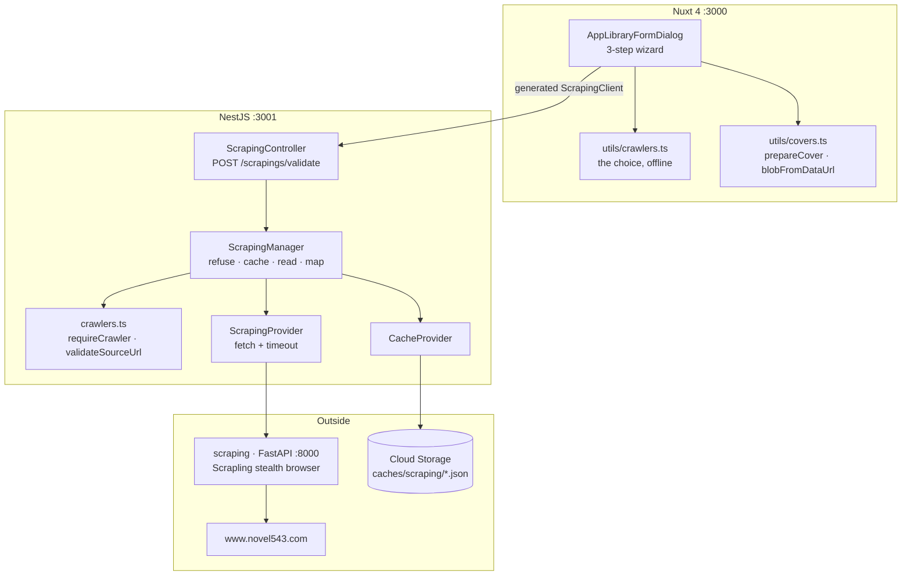
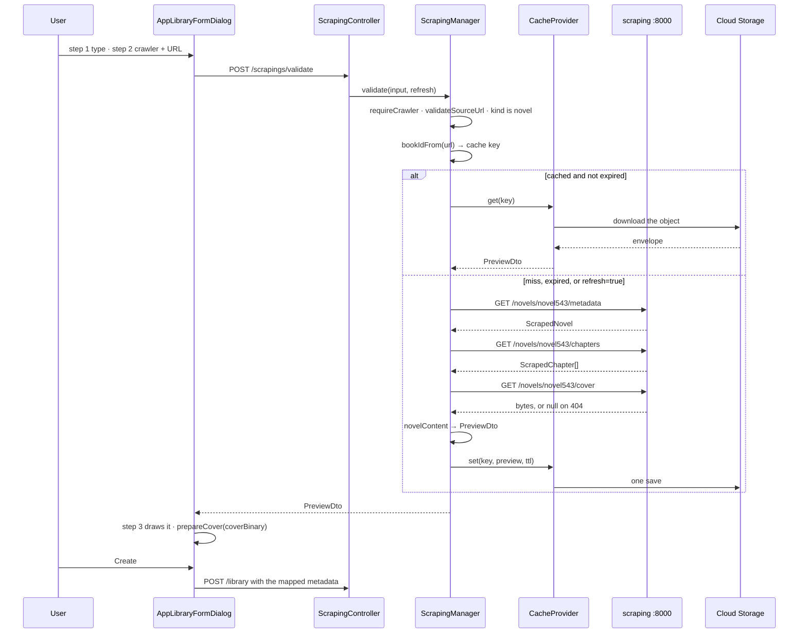

# Library — Part 3: creating an item from the scraping service

## Overview

Part 3 makes the create wizard's crawler branch real. Steps 2 and 3 stop running against a
mocked registry and a mocked validation: the browser posts a crawler name and a book URL to
`POST /api/v1/scrapings/validate`, the API reads the source through the Python scraping service,
and answers with everything the review step draws — the metadata in our vocabulary, every
chapter the source lists, and the cover as a data URI.

The order of operations is the whole design: **refuse what can be refused for free, answer from
the cache if it can, and only then spend twenty seconds of somebody else's browser.** The
crawler registry check and the host check cost nothing and catch the mistake the wizard exists
to catch. The cache is keyed on the book id read out of the URL. Only a miss reaches the
scraping service, which drives a real stealth browser and can take a minute to clear a
Cloudflare turnstile.

What is built is what is stored, so a hit and a miss cannot return different things: `PreviewDto`
is the response, the cache entry and the review screen's model, all one shape.

## Requirements

- **The crawler registry is static, in code, and the authority.** `backend/src/scraping/crawlers.ts`
  holds one entry per site: `name`, `domain`, `hosts`, `kind`, `language`, `statuses`.
  Adding a site is a `parser.<name>.py` in `scraping/app/` and an entry here. `CRAWLERS` borrows
  the library's own `LibraryItemType` and `NovelStatus` rather than declaring its own — a
  crawler that could claim a type the library does not have would be describing an item nothing
  can store.
- **A name nothing answers to is a `404`, and a URL on another site is a `400`.**
  `requireCrawler` and `validateSourceUrl` run before the cache and before the browser, because
  a wrong-crawler URL is the mistake the wizard exists to catch and it should cost nothing to
  report.
- **A slow answer is cached, in Cloud Storage.** `CacheProvider` writes one JSON object per
  entry under `caches/{type}/{encodedKey}.json`, holding both the value and when it dies. No
  Firestore pointer document: a pointer would only say where the file is and when it expires,
  and both fit in the file — one store means no write ordering to get right and nothing to
  reconcile when one of two writes fails.
- **Expiry is enforced on read**, and an expired entry is dropped as it is found so the next
  caller does not download it again to reach the same conclusion.
- **A cache never fails a request.** Every read path answers `null` rather than throwing: a
  corrupt entry costs a re-fetch, not a `500`.
- **`?refresh=true` skips the cache.** Read with `@Transform` rather than `@Type(() => Boolean)`,
  because `Boolean('false')` is `true` and casting would make every value mean yes.
- **The scraping service's shapes stay in one file.** `ScrapedNovel`, `ScrapedChapter`,
  `ScrapedCover` and `ScrapedContent` are declared by `scraping.provider.ts`, which is the only
  file that reads them — a field of somebody else's API should not travel.
- **Upstream failures map to ours.** A refused connection or our own timeout is a `503`; the
  service's own `400` passes through with its sentence; a `404` is "there is no book at that
  URL"; anything else is a `502` with the detail in the log.
- **The mapping into our vocabulary happens once, before the cache is written.**
  `novelContent()` turns the source's `status` word into a `NovelStatus` through the crawler's
  own `statuses` map, takes `language` off the crawler entry — novel543 never publishes one and
  every book on it is the same — and lands every absent field on the value the DTO promises.
- **The cover is fetched as bytes and returned as a data URI.** The source's `coverUrl` is on a
  CDN behind the same protection as the site, so it is no good in an ``. `coverBinary` is
  what the review step draws and what `prepareCover` resizes into the item's own cover.
- **A missing cover is not a failure.** `ScrapingProvider.cover` answers `null` on a `404`: by
  the time it is called the book has been read, so a missing cover is a fact about the book.

## Solution

### Contract Skeleton

| Method | Path | Answers | Refuses |
| --- | --- | --- | --- |
| `POST` | `/api/v1/scrapings/validate?refresh=false` | `200 PreviewDto` | `400` a URL not on the crawler's own site · `401` · `404` no crawler under that name, or no book at that URL · `501` a crawler whose `kind` is not `novel` · `502` the source or the browser behind the service failed · `503` the service did not answer in time |

A `POST` that creates nothing: it answers a question about a source, and the cache entry it may
write is not a resource a caller can address — hence `200` rather than `201`.

**`ValidateDto`** — two fields, because that is the whole question.

| Field | Type | Rules |
| --- | --- | --- |
| `crawler` | `string` | `1–100`. One of the registered crawlers. |
| `sourceUrl` | `string` | `@IsUrl`, ≤2048. The book's URL on the source site. |

**`QueryValidateDto`** — `refresh: boolean = false`.

**`PreviewDto`** — an envelope rather than a flat object, so a crawler that reads image sets adds
a `content` shape instead of reshaping the response.

| Field | Type | Notes |
| --- | --- | --- |
| `type` | `LibraryItemType` | The crawler's `kind`, which decides the shape of `content`. |
| `content` | `NovelPreviewDto` | Typed as the one shape there is; a second makes it a `oneOf`. |

**`NovelPreviewDto`** — `metadata: NovelPreviewMetadataDto`, `chapters: PreviewChapterDto[]`,
`coverBinary: string | null`.

**`NovelPreviewMetadataDto`** — the novel as *we* describe it, not as the source spells it.

| Field | Type | Notes |
| --- | --- | --- |
| `sourceUrl` | `string` | The canonical book URL, so two spellings normalise to one. |
| `title` / `author` / `description` | `string` | Empty where the source said nothing. |
| `status` | `NovelStatus` | Mapped through the crawler's `statuses`; anything unknown reads as `ongoing`. |
| `language` | `string` | From the crawler's entry. |
| `genres` | `string[]` | The source category, where it has one. |
| `latest` / `latestUrl` | `string` | The newest chapter, as the source names it. |
| `updatedAt` | `string` | The source's own format, `2026-08-13 00:33:11`. Not an ISO instant, and not compared to one. |
| `coverUrl` | `string \| null` | Where the cover lives on the source. Not for an ``. |

**`PreviewChapterDto`** — `index` (from 1), `title`, `url`.

**`Crawler`** — `backend/src/scraping/crawlers.ts`, and the one entry there is:

| Field | Value for `novel543` |
| --- | --- |
| `name` | `novel543` |
| `domain` | `www.novel543.com` |
| `hosts` | `novel543.com`, `www.novel543.com` |
| `kind` | `LibraryItemType.Novel` |
| `language` | `zh` |
| `statuses` | `連載 → ongoing`, `完結 → complete` |

**The upstream service** — `GET {SCRAPING_BASE_URL}/novels/{crawler}/{part}?sourceUrl=…` for
`part` in `metadata`, `chapters`, `cover`, `content`. `ScrapedNovel` is `camelCase` over the
wire with everything but `id`, `url` and `crawler` optional, because the service runs
`response_model_exclude_none=True` and leaves a field out rather than sending null.

**Configuration** — `SCRAPING_BASE_URL` (default `http://127.0.0.1:8000`),
`SCRAPING_TIMEOUT_MS` (default `120_000` — generous on purpose, the service drives a real
browser), `SCRAPING_CACHE_TTL_DAYS` (default `30`).

### Component Diagrams

- **Three layers, three jobs.** `crawlers.ts` knows what we know without asking anything.
  `ScrapingProvider` knows how to ask and how to turn a failure into an exception, and nothing
  about what a novel means. `ScrapingManager` knows the order, the cache key, and how to read
  the source's words as ours.
- **The frontend keeps its own crawler list.** `utils/crawlers.ts` mirrors the registry so the
  wizard can draw the choice without a round trip for two facts that fit in the bundle. The
  server is the authority: validate refuses a name that is not there, so a crawler missing from
  the copy is invisible rather than broken.

- **The cache key.** `novel:validate:novel543:0413553971` — kind, what was asked, crawler, book.
  The book id is the first path segment of the URL, which is what `parser.novel543.py`'s
  `resolve()` reads, so `/0413553971`, `/0413553971/` and `/0413553971/dir` are one entry. The
  object path is `caches/scraping/{encodeURIComponent(key)}.json`: the type is a folder and the
  key is one name under it, encoded because a key eventually carries a `/`.
- **The three reads are sequential, one at a time.** The service drives a single browser, so
  three at once would save seconds one time and complicate every failure. Metadata and chapters
  must succeed; the cover is allowed to fail.
- **A book id that disagrees with the URL is logged, not corrected.** The key was built from the
  URL before anything was read, and only a URL is ever available to look one up with — so the
  URL-derived key stays the honest one, but the disagreement is worth hearing about rather than
  discovering as a cache that never hits.
- **The wizard maps the preview onto a `POST /library` body.** `sourceUrl` becomes the canonical
  URL the source gave, not the one that was pasted; `sourceName` becomes the crawler's name;
  `metadata` takes `status`, `author`, `language`, `genres` and `description`, plus
  `discoveredCount` from the preview's chapter count and `discoveredAt` as now. `coverBinary`
  goes through `blobFromDataUrl` and `prepareCover` and is uploaded after the item exists: the
  item is created *without* a cover when one is waiting, because the object path is keyed on the
  item id, and a `PUT` then writes the URL it came back with.

## Implementation Steps

- **Step 1 — `CacheProvider`.** `core/providers/cache.provider.ts` and its spec. A `CacheType`
  enum, because who an entry belongs to is part of its identity — two features are free to key
  on the same string and neither should see the other's answer. `get` / `set` / `drop`, a
  `CacheEnvelope<T>` carrying `expiredAt` and `value`, and JSON as the only format: anything
  binary is a base64 string inside the value the caller is already storing.
- **Step 2 — `ScrapingProvider`.** `core/providers/scraping.provider.ts` and its spec. Plain
  `fetch` with `AbortSignal.timeout` — there is no HTTP module in this project and one call per
  method does not want one. What it adds over a bare fetch is the timeout and the status
  mapping, plus `errorDetail`, which reads FastAPI's `{"detail": …}` as a sentence and logs a
  `422` whole rather than showing it, since a `422` means we sent something unparseable.
- **Step 3 — the registry, the manager and the endpoint.** `scraping/crawlers.ts`,
  `scraping/scraping.manager.ts`, `scraping/scraping.controller.ts`,
  `scraping/dto/validate.dto.ts`, `scraping/dto/preview.dto.ts`, `scraping/scraping.module.ts`.
  The manager is framework-free apart from `@Injectable()` and the exceptions, so its spec needs
  no Nest fixture. The module imports `LibraryModule` — which does not import it, so there is no
  cycle — and exports nothing: nothing outside calls these managers.
- **Step 4 — the wizard, wired to it.** `AppLibraryFormDialog.vue` step 2 calls the generated
  `ScrapingClient.validate`, draws the failure as the sentence the API sent through
  `apiMessage`, and offers a re-read that passes `refresh: true`. Step 3 renders
  `NovelPreviewDto` and pre-fills the item body from it. `types/library.ts` gains
  `ValidateSource`, `CrawlerPreview`, `NovelCrawlerPreview`, `CrawlerPreviewMetadata` and
  `CrawlerPreviewChapter`. `utils/covers.ts` gains `blobFromDataUrl` and `prepareCover` takes a
  `Blob` rather than a `File`, because a scraped cover arrives as one.
- **Step 5 — the service itself.** `scraping/app/` is a FastAPI app over Scrapling:
  `main.py` exposes `/health`, `/crawlers` and the four `/novels/{crawler}/…` routes;
  `parsers.py` discovers `parser.<name>.py` modules; `parser.novel543.py` resolves a URL to a
  book id and parses the pages. It runs a **non-headless** browser against an Xvfb display,
  because novel543 serves a turnstile that only clears that way, and the container gets
  `shm_size: 1gb` because the browser writes to `/dev/shm` and the 64 MB default makes it crash.

## Appendix

### Known limits

- **One crawler.** `novel543` only, and only novels. A crawler whose `kind` is not `novel` is a
  `501` at both `validate` and `discover` — answering with the novel shape would be a lie
  rather than an omission.
- **The frontend's crawler list is a hand-kept copy.** A crawler added to the backend registry
  and not to `utils/crawlers.ts` cannot be picked in the wizard.
- **Nothing sweeps the cache.** Expiry is enforced on read, so an entry past its TTL never
  answers — but an entry nobody asks for again sits in the bucket forever. A bucket lifecycle
  rule on the `caches/` prefix is what would reclaim it, and in production it should.
- **`T` is the caller's word, not a checked one.** A cached shape that changes reads back as the
  shape that was stored. That is what the TTL is for.
- **`updatedAt` on the preview is the source's own string.** It is displayed and never compared,
  so nothing can tell how stale a source is from it.
- **The cache key assumes the book id is the URL's first path segment.** A site that keys a book
  differently needs that on the crawler entry rather than in `bookIdFrom`.
- **`coverBinary` travels as base64 inside JSON**, in the response and in the cache entry, which
  is roughly a third larger than the bytes. Acceptable for a thumbnail; not a pattern to reuse
  for anything big.
- **A preview is not a lock.** Two people can validate the same URL and both create an item from
  it; nothing checks whether a `sourceUrl` is already in the catalogue.
- **The service is a single browser.** Two validations at once queue behind each other, and the
  120-second timeout is per call, not per request — a cold start that has to solve a turnstile
  can spend most of it.
