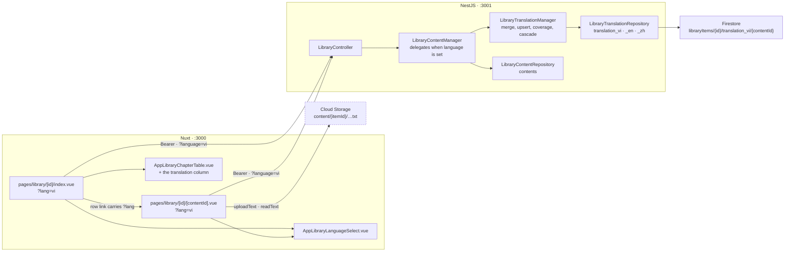

# Library — Part 4: reading a novel in translation

Source design: `_docs/design/1. Library.dc.html` — the language `<select>` in the novel detail
toolbar (line 269) and in the chapter toolbar (line 358), the conditional translation column in the
chapters table (296, 308), and the fallback banner in the reader (374).

## Goal of design

Part 2 gave a novel its chapters and part 3 gave the wizard a real source, so a `zh-Hant` book from
novel543 now lands in the catalogue with its Chinese chapters intact — and there is no way to read a
word of it in anything else. The mockup has drawn the answer since part 1: a languages dropdown in
the chapters toolbar and again in the reader, an extra column saying which chapters have been
translated, and a banner over a chapter that has not.

Part 4 stores translations and shows them. One subcollection per language, keyed by the chapter it
translates, and a `language` query parameter that decides which one a read and a write land in.
Nothing produces a translation; a person types one, or a later part's workflow writes one through the
same endpoint.

**In scope**

- Three translation subcollections under a library item — Vietnamese, English, Chinese — holding one
  document per translated chapter, keyed by that chapter's own id.
- A `language` query parameter on the content list, the content read and the content replace, with a
  **fallback to the source row** where the translation is not there.
- Two derived response fields, `translated` and `sourceTitle`, so a client can tell a translation
  from a fallback and draw the mockup's two-line title cell.
- `translations` on the item, from `GET /library/:itemId` — how many chapters each language covers, which is what the
  dropdown's `412 / 640` and `none yet` labels are made of.
- The dropdown on both screens, the conditional column in the chapters table, the fallback banner in
  the reader, and a save that writes the translation rather than the source.

**Out of scope — deliberately**

| Deferred | Why |
| --- | --- |
| Producing translations | Nothing here calls a translation engine. A translation is written by hand through the reader, or later by a workflow that will `PUT` through this same endpoint. The mockup's *"Translations are produced by a workflow run"* stays a sentence about a part that has not happened. |
| Image and video sets | A translation of a JPEG is not a thing. `language` on a set is a `400`, and the three subcollections only ever exist under a novel. |
| Languages beyond the three | The dropdown is a fixed enum, not a registry. A fourth language is one enum member, one map entry and one line in the frontend's list — see [Step 1](#step-1--the-language-and-its-subcollection). |
| Translating an item's own metadata | Title, author, description and genres stay in the source's language. The mockup translates chapter titles and chapter bodies, and nothing else. |
| Searching in a translation | `search` still matches the source title, because the scan it filters is the source collection. See [Known limits](#known-limits). |
| Counters over translations | `discoveredCount` and `downloadedCount` describe the source inventory. A translation write does not recount the item, and must not. |
| Export and import | The mockup's *"Export packs metadata, chapters and translations into a .zip"* is a different part. |

### Decisions taken

| Question | Decision |
| --- | --- |
| Firestore layout | **Your suggestion**, with one refinement: `libraryItems/{itemId}/translation_{lang}/{contentId}` — a translation document carries **the id of the chapter it translates**. That is what makes the fallback a lookup rather than a query, and makes a stray translation impossible to create. |
| The Chinese code | **`zh`, not `cn`.** `cn` is a country; `zh` is the language, and it is what `crawlers.ts` already writes as `zh-Hant` and what the mockup's own `<option value="zh">` uses. The subcollection is `translation_zh`. One enum member to change if you would rather it read `cn`. |
| Where `language` goes | **A query parameter**, as asked: on `GET /contents`, `GET /contents/:contentId` and `PUT /contents/:contentId`. Absent means the source. |
| `POST` and `DELETE` | **Source only.** A translation is *of* a chapter, so it cannot be created before one exists — `PUT ?language=vi` is the upsert that creates it. Deleting a chapter deletes its translations with it. |
| The fallback's honesty | **A `translated` boolean on every row.** A response that silently substitutes the source is a response a client cannot draw the mockup from: the table needs the Translated / Not translated tag and the reader needs the banner. |
| The two-line title cell | **`sourceTitle` on the row**, null when the row *is* the source. **Derived on read, not stored**: every path that can be asked for a translation has already loaded the source row, so the merge holds both strings at no cost — and a stored copy would keep showing the old title after a rename. |
| Where the coverage counts live | **On the item**, as `LibraryItemDto.translations`, answered by `GET /library/:itemId`. No `/translations` route: the dropdown is drawn on a screen that has already fetched the item, so a second call would be a round trip to learn something the first one could have said. `LibraryListItemDto` omits it — the listing draws no dropdown, and three aggregations per row per page is a cost for nothing. |
| Where the rules live | **A third manager**, `LibraryTranslationManager`, over its own small repository. `library-content.manager.ts` is 357 lines and the planning rule caps a file near 300 — folding translations into it would land it near 450. The content manager delegates one way and the translation manager knows nothing about it. |
| How the collection name is built | **A `Record<TranslationLanguage, string>` lookup**, never string concatenation. The enum is validated by the pipe, so a request cannot name a collection. |
| Where the dropdown's state lives | **The URL**, as `?lang=vi`. It survives a reload, it travels from the table into the reader on the row's own link, and Back returns to the language you left. |

---

## Contracts

### `TranslationLanguage` — `backend/src/library/entities/library-translation.entity.ts`

```ts
export enum TranslationLanguage {
  Vietnamese = 'vi',
  English = 'en',
  Chinese = 'zh',
}

/** The subcollection each one is stored in. A lookup, so a request never names a collection. */
export const TRANSLATION_SUBCOLLECTIONS: Record<TranslationLanguage, string> = {
  [TranslationLanguage.Vietnamese]: 'translation_vi',
  [TranslationLanguage.English]: 'translation_en',
  [TranslationLanguage.Chinese]: 'translation_zh',
};
```

There is no `Translation` entity. A translation document **is a `NovelChapter`**, as you described —
same fields, same shape, same `entityFrom` mapping — which is what lets one repository and one set of
DTOs serve both collections. Three of its fields are inert there and are documented as such:

| Field | In a translation document |
| --- | --- |
| `type` | Always `novel`. The three subcollections exist under nothing else. |
| `sourceUrl` | Always `null`. A translation has no upstream address. |
| `status` | Written as the source row's, and **overridden from it on every read** — see the merge below. |
| `index` | The source chapter's number, copied on write and likewise overridden on read. |
| `title`, `words`, `contentUrl` | The translation's own. These three are what a `PUT` actually writes. |
| `language` | The `TranslationLanguage` the document is filed under. |

### The merge, and the fallback

Reading one row at language `L`:

```
source = contents/{contentId}                      404 if absent
trans  = translation_L/{contentId}

trans ? { ...trans, index: source.index, status: source.status, sourceUrl: source.sourceUrl,
          translated: true,  sourceTitle: source.title }
      : { ...source, translated: false, sourceTitle: null }
```

Three fields come from the source even when a translation is returned, because all three describe
**the chapter** rather than the text of it: its number in the novel, how far its scrape got, and
where it was scraped from. Copies of those on the translation document would go stale the moment the
chapter was re-scraped, so the stored copies exist only to keep the shape whole and are never the
ones answered with.

`sourceTitle` is the fourth, and there is no stored copy of it at all — no `originalTitle` field on
the translation document. It does not need one: the three routes that take a `language` have each
read the source row before they get here, so the title is already in hand, and every screen that
draws it is drawing a merged row. Storing it would buy nothing and cost correctness in the one case
the cell exists for — rename chapter 412, by hand or by a re-scrape, and a stored copy would keep
naming the chapter by a title it no longer has, directly beneath the translation of it.

### Endpoints

**No new route and no new path constant.** Three existing routes gain a query parameter, and a fourth
gains a property — all on the existing `LibraryController` under the existing `@ApiTags('Library')`,
so NSwag adds no client and no method.

| Method | Path | Adds | Answers |
| --- | --- | --- | --- |
| `GET` | `/api/v1/library/:itemId` | — | `200 LibraryItemDto`, now carrying `translations` |
| `GET` | `/api/v1/library/:itemId/contents` | `language?` | `200 LibraryContentPageDto`, every row merged |
| `GET` | `/api/v1/library/:itemId/contents/:contentId` | `language?` | `200` one merged row |
| `PUT` | `/api/v1/library/:itemId/contents/:contentId` | `language?` | `200` the row it just wrote |

Refusals, each a sentence:

| Status | When |
| --- | --- |
| `400` | `language` on an image or video set — *"Only a novel has translations."* |
| `400` | A `language` that is not one of the three. The pipe's own message, listing them. |
| `404` | No item under that id, or no **source** chapter under that content id. A missing translation is a fallback, never a 404. |

`PUT ?language=vi` is an **upsert**: it writes `translation_vi/{contentId}` whether or not it was
there, which is the only way a translation ever comes into existence. It still `404`s when the source
chapter is missing — a translation of nothing is not writable.

What a `PUT ?language=…` reads from the body: `title`, `words`, `contentUrl`. Everything else on
`UpdateLibraryContentDto` is refused the way a chapter already refuses `filename` — the manager's
existing `chapterBlock` rules apply unchanged, and `index` is the source's.

### `LibraryTranslationCoverageDto` — `dto/library-translation.dto.ts`

```
language     TranslationLanguage
translated   number — documents in that subcollection
```

It reaches a client as **`LibraryItemDto.translations`**:

```ts
@ApiProperty({ type: [LibraryTranslationCoverageDto], nullable: true,
  description: 'How many chapters each language covers. Null on an image or video set, which has no translations.' })
translations!: LibraryTranslationCoverageDto[] | null;
```

Three rows for a novel, always all three, `0` where nothing is translated — so the dropdown can draw
`Japanese · none yet` without a special case. `null`, not `[]`, on a set: an empty array would read
as *a novel nobody has translated*, and the two are not the same fact.

No `total` on the row. The total is the item's own `metadata.discoveredCount`, which sits four fields
away in the same response, and a number sent twice is a number that can disagree with itself.

Counted with Firestore aggregations, as `LibraryContentRepository.counts` is — three `count()` calls,
no documents read, the same cost for a novel of twelve chapters and one of twelve hundred.

**`LibraryListItemDto` omits it**, beside the `createdAt` it already omits:

```ts
export class LibraryListItemDto extends OmitType(LibraryItemDto, ['createdAt', 'translations'] as const) {}
```

The listing draws no dropdown, and `LibraryManager.list` never computes coverage — twenty rows a page
would be sixty aggregations to answer a question the listing does not ask. The omission is what says
so in the generated client, rather than leaving a field that is always absent.

`POST` and `PUT` answer with `LibraryItemDto` too, so both pay the three aggregations. On a create
the answer is always `0 / 0 / 0` and the cost is three of the cheapest queries Firestore has, on a
request that already makes several — worth it to keep one response class for the whole of
`GET /:id`, `POST` and `PUT`, which is what that class is for.

### DTO changes

| File | What changes |
| --- | --- |
| `dto/query-content-language.dto.ts` | New. `QueryContentLanguageDto { language?: TranslationLanguage }`, `@IsOptional() @IsEnum(TranslationLanguage)`. |
| `dto/query-list-library-contents.dto.ts` | `extends QueryContentLanguageDto`. One declaration, three routes. |
| `dto/library-content.dto.ts` | `LibraryContentBaseDto` gains `translated!: boolean` and `sourceTitle!: string \| null`. Its `implements LibraryContentBase` clause still holds — a class may carry more than the interface it implements, which is what keeps both fields out of the stored shape. |
| `dto/library-item.dto.ts` | `LibraryItemDto` gains `translations`. |
| `dto/library-item-list.dto.ts` | The `OmitType` list grows `'translations'`. |
| `dto/library-translation.dto.ts` | New. The coverage row above. |

### Frontend types — `frontend/app/types/library-content.ts` and `library.ts`

`LibraryContentBase` gains the same two fields. Plus:

```ts
export type TranslationLanguage = 'vi' | 'en' | 'zh'

export interface TranslationCoverage { language: TranslationLanguage, translated: number }
```

`types/library.ts`: `LibraryItemDetail` gains `translations: TranslationCoverage[] | null`, beside the
`createdAt` that already marks it as the detail response rather than a listing row. `LibraryItem` —
the listing's mirror — does not.

---

## Shape of the system



The bytes take the path part 2 already built: a translated body is a `text/plain` object under
`content/{itemId}/`, uploaded by the browser, and the translation row keeps its URL. Nothing in
`storage.rules` changes, because a translation is the same kind of object as a chapter.

---

## Step 1 — The language and its subcollection

| File | What it is |
| --- | --- |
| `backend/src/library/entities/library-translation.entity.ts` | New. `TranslationLanguage` and `TRANSLATION_SUBCOLLECTIONS`, as above, plus `TranslatedContent = LibraryContent & { translated: boolean, sourceTitle: string \| null }` — the merged row, which is what the manager returns and the DTOs document. |
| `backend/src/core/firebase/collections.ts` | One comment line naming the three, pointing at the entity for the map. The map itself stays beside its enum: a `Record` keyed by a library enum does not belong in `core`. |
| `backend/src/library/library-translation.repository.ts` | New, small, and deliberately not a `FirestoreRepository` subclass — for `LibraryContentRepository`'s reason: a row here is keyed by three things, the item, the language and the chapter. Uses the shared `entityFrom`. |

The repository, in full — five methods and a private accessor:

```ts
findByIds(itemId, language, contentIds): Promise<Map<string, NovelChapter>>
upsert(itemId, language, contentId, draft): Promise<NovelChapter>
remove(itemId, contentId): Promise<void>          // all three languages
removeAll(itemId): Promise<void>                  // all three, batched
counts(itemId): Promise<Record<TranslationLanguage, number>>
```

`findByIds` is `getAll(...refs)` over the page's ids — at most `pageSize` documents, and one round
trip whatever that is. Not a query: there is nothing to order and nothing to filter, and a lookup by
id needs no index at all. It answers with a `Map` because the caller is about to zip it against a
list, and `.find()` per row over two hundred rows is the shape that quietly goes quadratic.

`upsert` uses `set(..., { merge: false })` after reading whether the document exists, so `createdAt`
survives a rewrite the way `replace` preserves it on a content row, and a first write stamps both
dates. `remove` and `removeAll` cover all three languages, unconditionally: a chapter's translations
go when the chapter does, and asking which languages exist first would cost three reads to save three
deletes.

## Step 2 — The translation manager

| File | What it is |
| --- | --- |
| `backend/src/library/library-translation.manager.ts` | New. The rules, framework-free apart from `@Injectable()` and the exceptions, helpers as module-level free functions after the class — `library.manager.ts`'s shape. |
| `backend/src/library/library-translation.manager.spec.ts` | Against a hand-written fake repository, no Nest fixture, `jest.mock('firebase-admin/auth', () => ({}))` first line — `library-content.manager.spec.ts`'s shape exactly. |

Four public methods, and each one is short:

- **`decorate(itemId, language, rows)`** — one `findByIds` over the rows' ids, then the merge above
  per row. With no `language` it does no I/O at all and returns every row as
  `{ ...row, translated: false, sourceTitle: null }`, which is what keeps one code path through the
  content manager rather than a branch at every call site.
- **`save(itemId, language, source, input)`** — the upsert. `title` and `words` from the body,
  `contentUrl` from the body, `index`, `status` and `sourceUrl` copied from `source`, `language` the
  requested one, `type` novel. Answers with the merged row, so a save's response is drawable without
  a refetch.
- **`coverage(itemId)`** — the three aggregations, as three rows.
- **`removeFor(itemId, contentId)` / `removeAll(itemId)`** — the cascades, passed straight through.

Two rules live here and nowhere else:

1. **`requireNovel(item)`** — `language` on an image or video set is the `400`. Checked before
   anything is read, because it is the mistake that should not cost a round trip.
2. **The merge's three source fields.** One expression, with the comment that says why: `index`,
   `status` and `sourceUrl` describe the chapter, not the text of it.

Spec cases worth having:

- A row with a translation → the translation's `title` and `words`, the source's `index` and
  `status`, `translated: true`, `sourceTitle` the source's.
- A row without one → the source verbatim, `translated: false`, `sourceTitle: null`.
- A page of ten where three are translated → exactly one `findByIds`, and the seven fall back.
- No `language` → the repository was never touched.
- `save` on a chapter with no translation yet → the document is created, `createdAt` stamped, and
  `contents` was not written.
- `save` twice → `createdAt` survives, `updatedAt` moves.
- A source `status` that changed after the translation was written → the read answers with the new
  one. This is the case the stored copy exists to fail, so it is the one worth pinning.
- `language` on an image set → `400`, nothing read.

## Step 3 — The content manager, the controller, the cascade

| File | What changes |
| --- | --- |
| `backend/src/library/library-content.manager.ts` | `list` and `get` end in `translations.decorate(…)`; `replace` routes to `translations.save(…)` when a language is given; `remove` also calls `translations.removeFor(…)`. Four small edits, and the file gains about thirty lines. |
| `backend/src/library/library.manager.ts` | Injects `LibraryTranslationManager`. A private `withCoverage(item)` — `translations.coverage(item.id)` for a novel, `null` for a set — wraps the three answers that return a whole item: `get`, `create` and `replace`. `list` does not call it. And `remove(id)` gains `translations.removeAll(id)` beside the existing `contents.removeAll(id)` — Firestore does not cascade, and three subcollections left behind are three times the documents nothing can reach. |
| `backend/src/library/library.controller.ts` | `@Query()` on the two content GETs and the content PUT. Nothing else: the coverage rides on a response the route already returns. |
| `backend/src/library/library.module.ts` | Register the manager and the repository. Export the manager, for the same reason the other two are exported: a later part's workflow will write translations without going through HTTP. |
| `backend/src/library/library.manager.spec.ts` | Three cases: `get` on a novel carries three coverage rows, `get` on an image set carries `null` and ran no aggregation, and `list` never asks for coverage at all. |
| `backend/src/library/library-content.manager.spec.ts` | Two cases: a `replace` with a language leaves `contents` untouched, and a `remove` cascades. |

The dependency runs one way — `LibraryContentManager` injects `LibraryTranslationManager`, and the
translation manager takes source rows as arguments and has never heard of the content manager. That
is what keeps the seam small enough to be worth having: `decorate` is called at the end of two
methods, and the rest of `list` — the scan, the search, the slice — is untouched.

**The counters are deliberately not recounted** on a translation write. `recount()` reads `contents`
and only `contents`, so `412 / 640 ch.` on the listing keeps meaning what it has always meant: how
much of the source we hold. A translated chapter that has never been scraped is not a downloaded
chapter.

`_deploy/firebase/firestore.indexes.json` gains the same `fieldOverrides` block the `contents`
collection group already has, repeated for `translation_vi`, `translation_en` and `translation_zh` —
but for **every** field this time, `index` and `status` included, because nothing ever queries these
collections. They are read by id and counted whole:

```json
{ "collectionGroup": "translation_vi", "fieldPath": "title", "indexes": [] }
```

…and so on for `index`, `language`, `words`, `status`, `sourceUrl`, `contentUrl`, `type`, `createdAt`
and `updatedAt`, across all three. Verbose, and the file is already written this way; the alternative
is paying write amplification on ten automatic indexes per translated chapter for queries nobody
makes.

## Step 4 — The two screens

Run `pnpm generate:api` first: `listContents` gains a trailing `language` argument, and `getContent`
and `replaceContent` likewise. No method is added — the coverage arrives on `libraryClient.get()`.
Declaring `language` **last** in `QueryContentLanguageDto` is what keeps the existing positional call
sites compiling unchanged.

| File | What it is |
| --- | --- |
| `frontend/app/types/library-content.ts` | `translated` and `sourceTitle` on the base, `TranslationLanguage`, `TranslationCoverage`. |
| `frontend/app/utils/library-content.ts` | `TRANSLATION_LANGUAGES: { code, name }[]` — the three, in the mockup's order — and `coverageLabel(translated, total)`, which is the mockup's own three cases: `none yet`, `complete`, `412 / 640`. |
| `frontend/app/components/AppLibraryLanguageSelect.vue` | New. The languages icon and a `USelectMenu` about 190px wide: **"{source language} · source"** first, then one option per language labelled `Vietnamese · 412 / 640`. Takes the item's language, the coverage rows and the chapter total; models the code or `null`. Two callers, which is what earns it a file. |
| `frontend/app/components/AppLibraryChapterTable.vue` | One optional `language` prop. When set, a column appears between Title and Words carrying **Translated** (`primary`, subtle) or **Not translated** (`neutral`, outline), and the title cell grows the muted `sourceTitle` line beneath — both `v-if`d on the prop, so the source view is the table it is today. The row's `NuxtLink` carries `?lang=` so the reader opens in the language the table is in. |
| `frontend/app/pages/library/[id]/index.vue` | The dropdown in the chapters toolbar, the language in the URL, and the coverage fetch. |
| `frontend/app/pages/library/[id]/[contentId].vue` | The dropdown in the chapter toolbar, the fallback banner, and a save that writes the translation. |

**The detail page.** `lang` is a computed over `route.query.lang`, validated against the three and
`null` otherwise, so a hand-typed `?lang=de` reads as the source rather than as an error. It joins the
`watch([itemId, debouncedSearch])` that resets to page one — changing language is a new list, not a
filter over the loaded one — and is passed through `fetchPage` and `reloadLoaded` alike, so a job
settling in the background refetches in the language on screen.

Coverage needs **no fetch of its own**: it is `item.translations` off the `useAsyncData` the page
already runs, so `refreshAll()` and the existing `refreshItem()` after a save keep the dropdown's
labels current with no new call and no new state. On an image or video set it is `null` and the
dropdown never renders — the same `v-if="novel"` branch that already decides the whole screen.

**The reader.** The same `lang` computed, and the chapter's `useAsyncData` keys on it as well as on
`contentId`, so switching language refetches the chapter rather than reusing the source's cache. The
navigator's links carry it. Three behaviours follow from `chapter.translated`:

- **`false`, with a language selected** — the blueprint banner over the column: *"No {language}
  translation for this chapter yet"* / *"Showing the source. Save to write one."* The reading view
  shows the source body, which is exactly what the mockup does.
- **The editor starts empty in that case**, not pre-filled with the source. This is the one trap in
  the whole part: an editor seeded with the source text and then saved would file the source as its
  own translation, in every chapter someone opened and saved without thinking. The title field is
  seeded from the source title, because a translated chapter that keeps its original title is a
  reasonable thing and an empty title is not.
- **`true`** — read and edit the translation exactly as the source is read and edited today, and
  `save()` `PUT`s with `?language=`. The upload, the replace and the `discard` of what it replaced are
  part 2's sequence unchanged; only the URL gains a parameter. A save that *created* a translation
  also refreshes the item, so the coverage in the dropdown moves — both pages key their item fetch on
  `library-item-${itemId}`, so the detail screen behind this one gets the new count for free.

The `Content — plain text` label becomes `{language} translation — plain text` and the hint beneath
becomes the mockup's: *"Edits overwrite the machine translation. Re-running the translation workflow
will discard manual changes."* Both are the source's text when no language is selected.

Styling as ever: tokens and Tailwind classes only, no `<style>` block, square corners, all four
registration marks on the banner's blueprint.

---

## Known limits

**Search matches the source title, in every language.** The scan the search filters is the source
collection, ordered by `index`; matching a translated title would mean loading translations for all
2,000 scanned rows rather than for the two hundred on the page. So typing a Vietnamese title into
**Find chapter** finds nothing, while the Chinese one finds it and shows the Vietnamese. The fix is
the same one part 2 named for search generally — a `keywords` field, written per language — not a
bigger scan.

**A translation is `PUT` into existence, and a `PUT` cannot delete one.** Clearing a translation back
to nothing is not expressible: saving an empty body writes a translation row with `contentUrl: null`,
which reads as translated-but-empty rather than as untranslated. `DELETE ?language=` is the honest
fix and is left out because nothing in the mockup asks for it.

**The three subcollections are three writes on a chapter delete, whether or not they hold anything.**
Deleting a chapter costs four deletes instead of one. Cheap, and the alternative — three reads to
learn which to skip — is not cheaper.

**Coverage is three aggregations per detail-page load**, recomputed rather than stored. Exact, and it
cannot drift, which is why the counters were built this way in part 2. It does mean the dropdown's
label is a round trip behind a save until `refreshAll()` lands.

**Nothing checks that a translation is in the language it is filed under.** `translation_vi` will
hold whatever is typed into it. There is no language detection here and there should not be.

**An item whose own language is one of the three can be "translated" into itself.** Picking Chinese
on a `zh-Hant` novel files a `translation_zh` beside a Chinese source. Harmless, and the alternative
is matching `zh` against the free-text `zh-Hant` the crawler wrote, which would be a guess. The
source option is labelled with the item's own language, so the redundancy is at least visible.

**A translated body is a second Storage object per chapter per language.** A 640-chapter novel in
three languages is up to 2,560 objects under `content/{itemId}/`. Part 2's orphan-sweep limit now
applies four times over, and its fix — dropping the prefix when the item goes — still covers all of
them, which is the reason that decision was worth making then.

**`words` on a translation is the client's word**, as it is on a chapter. Same reason, same fix.

**No optimistic concurrency, now in four places.** Two people translating one chapter into one
language is last-write-wins, and the loser's Storage object is orphaned rather than overwritten.

---

## Running it locally

```bash
pnpm install
pnpm dev:infrastructure   # emulators + the scraping API on :8000
pnpm seed:firebase        # admin@datntdev.com / StrongPassword123!
pnpm dev                  # backend :3001 + frontend :3000
```

**Backend**, before any UI:

```bash
pnpm --filter @media-studio/backend run test -- library-translation.manager
pnpm --filter @media-studio/backend run test -- library-content.manager
pnpm lint && pnpm typecheck
```

Then `http://localhost:3001/docs`, with an ID token from the signed-in app and a novel that already
has chapters:

1. `GET /api/v1/library/{id}/contents` — every row reads `translated: false`, `sourceTitle: null`.
   The shape is unchanged apart from those two fields.
2. `GET /api/v1/library/{id}/contents?language=vi` — the same rows, still `translated: false`. This
   is the fallback, and it should be indistinguishable from the source view except in intent.
3. `PUT /api/v1/library/{id}/contents/{contentId}?language=vi` with
   `{"title":"Chương một","words":12,"contentUrl":null}` → `200`, `translated: true`,
   `sourceTitle` the original title, `index` and `status` the source's.
4. `http://127.0.0.1:4000/firestore` → `libraryItems/{id}/translation_vi` holds **one document, whose
   id is the chapter's**. `contents` is untouched, and the item's `metadata.discoveredCount` has not
   moved — this is the step that proves the counters stayed out of it.
5. `GET /api/v1/library/{id}` → `translations` reads `[{vi,1},{en,0},{zh,0}]`. Then
   `GET /api/v1/library` — the listing rows carry **no** `translations` field at all, which is the
   `OmitType` doing its job. And `GET` an image set: `translations` is `null`.
6. `GET /api/v1/library/{id}/contents?language=vi` again — one row translated, the rest falling back.
7. The refusals: `?language=de` → `400` naming the three; `?language=vi` on an image set → `400`
   saying only a novel has translations; a `PUT ?language=vi` on an unknown content id → `404`.
8. `DELETE` that chapter → the `translation_vi` document goes with it. Then delete the item and check
   all four subcollections are gone.

**Through the UI**, which is where the fallback actually has to read well:

1. Open a novel. The toolbar has the dropdown, reading **{language} · source**, and the table is
   exactly the table it was.
2. Pick **Vietnamese**. The URL becomes `?lang=vi`, a translation column appears reading **Not
   translated** on every row, and the titles are unchanged — the fallback, drawn.
3. Open a chapter. It opens at `?lang=vi`, the banner says there is no Vietnamese translation yet,
   and the reading view shows the source. Switch to **Edit**: the body is **empty** and the title is
   the source's. This is the step the whole part turns on — if the box is pre-filled with the source
   text, stop and fix it before going further.
4. Type a paragraph, **Save**. The banner goes, the word count is the translation's, and the Storage
   emulator holds a second `.txt` under `content/{itemId}/`.
5. **All chapters** → that row reads **Translated**, its title is the Vietnamese one with the source
   title beneath, and the dropdown now reads `Vietnamese · 1 / {n}`.
6. Switch back to **source**. The original title, the original body, no translation column, and the
   URL loses `?lang`. Reload on `?lang=vi` and the language comes back.
7. Open the chapter from the table while in Vietnamese, then press Back — the table is still in
   Vietnamese.
8. Run a scrape over that chapter. Its **Status** changes in the Vietnamese view too, because status
   comes from the source row; its title and body do not.

Each step is one commit, and each leaves `pnpm lint`, `pnpm typecheck` and `pnpm build` green.
