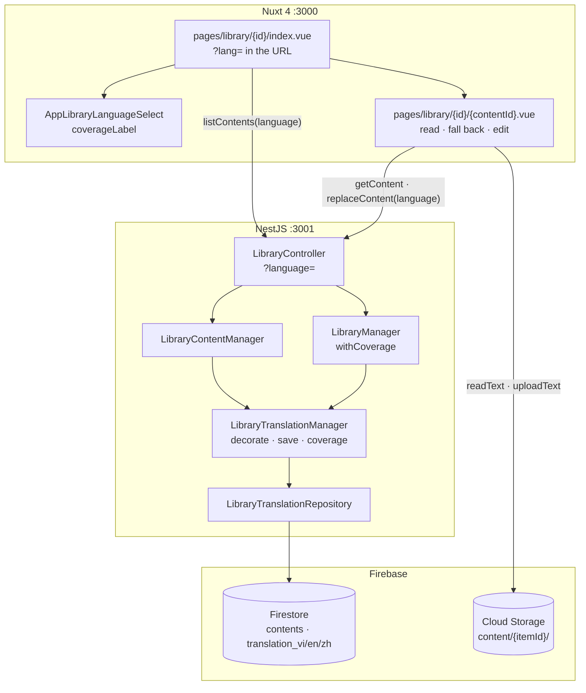
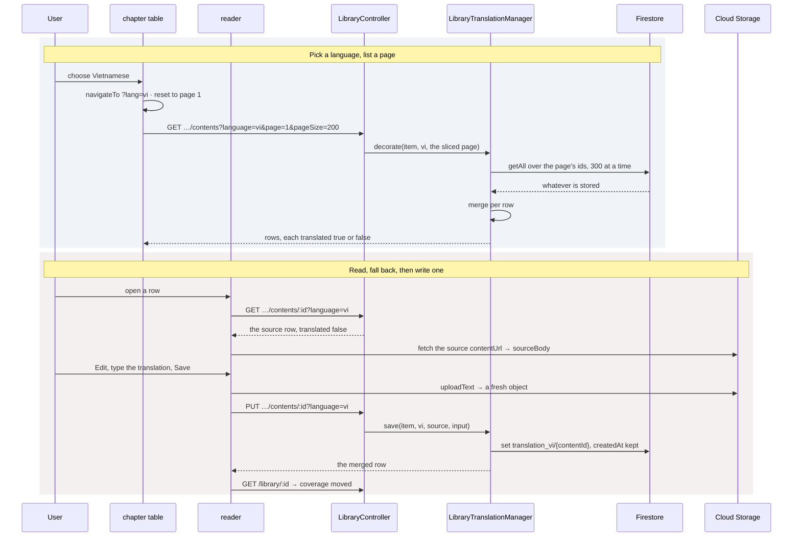

# Library — Part 4: reading a novel in translation

## Overview

Part 4 lets a novel be read and written in a language other than its own. A `?language=`
parameter on the content routes is the whole of the surface: with it, a read answers with the
translation folded over the source row, and a `PUT` writes the translation instead of the
chapter. Without it, every route behaves exactly as part 2 left it.

Each language is a subcollection beside `contents` — `translation_vi`, `translation_en`,
`translation_zh` — holding one document per translated chapter, **keyed by that chapter's own
id**. That key is what makes every read a lookup: there is nothing to order and nothing to
filter, so these collections carry no index and are never queried.

The languages are a closed set rather than a registry. Each one has to exist in the enum, in the
subcollection map and in the index overrides, so a fourth is a deliberate act rather than a
string a request can invent — and the collection a request reaches is always one of three names
this codebase wrote.

## Requirements

- **Three languages, named in one place.** `TranslationLanguage` (`vi`, `en`, `zh`),
  `TRANSLATION_SUBCOLLECTIONS` mapping each to its collection name, `TRANSLATION_LANGUAGES` for
  everything that iterates all of them, and `TRANSLATION_NAMES` for the sentences this process
  writes.
- **A translation is filed under the chapter it translates.** Same document id. A translation of
  a chapter that is not there is not a thing to store, so `PUT` is the only way one comes into
  existence — there is no create route.
- **Only a novel is translated.** A `language` on an image or video set is a `400`, and so is a
  `PUT ?language=` against an asset row.
- **A read answers with two things a client cannot work out for itself.** `translated` is false
  when the row is the source — either because no language was asked for or because none is
  stored — and `sourceTitle` is the chapter's own title, so a client can tell a real translation
  apart from one that happens to read like the original.
- **`sourceTitle` is derived on every read, never stored.** Renaming a chapter renames the
  subtitle under every translation of it.
- **The merge reads three fields from the source, however old the translation is.** `index`,
  `status` and `sourceUrl` describe the *chapter* rather than the text of it, so a stored copy
  would start lying the moment the chapter was re-scraped. `title`, `words` and `contentUrl` are
  the translation's own.
- **A missing translation falls back to the source, for reading only.** The reader loads the
  source text into `sourceBody`, never into the editor. An editor seeded with the source and
  then saved would file the original as its own translation, in every chapter anyone opened and
  saved without thinking.
- **Coverage rides on the item.** `GET /library/:id` answers with all three languages, zeroes
  included, so the dropdown can say `none yet` without a special case. Null on a set — an empty
  list would read as a novel nobody has translated, and the two are not the same fact.
- **Coverage is not on the listing.** Three aggregations per novel, twenty rows a page, for a
  question no listing row has a dropdown to ask. `LibraryListItemDto` omits it and
  `LibraryManager.list` never computes it.
- **Translating downloads nothing.** A `PUT ?language=` leaves the source chapter exactly as it
  was and does not move the item's counters — they say how much of the *source* we hold.
- **A chosen language lives in the URL.** `?lang=` survives a reload, travels into the reader on
  a row's own link, and Back returns to the language you left. A `?lang=` we do not translate
  into reads as the source rather than as an error.
- **Cascades reach translations.** A deleted chapter takes its translations in every language; a
  deleted item takes all of them.

## Solution

### Contract Skeleton

Three existing routes grow one query parameter. No new route is added.

| Method | Path | With `?language=` | Refuses |
| --- | --- | --- | --- |
| `GET` | `/api/v1/library/:itemId/contents` | Each row on the page merged with its translation | `400` a `language` on a set, or one we do not translate into · `401` · `404` |
| `GET` | `/api/v1/library/:itemId/contents/:contentId` | The row merged with its translation | `400` · `401` · `404` |
| `PUT` | `/api/v1/library/:itemId/contents/:contentId` | Writes the **translation**; the source chapter is untouched | `400` a chapter without a title, `filename`/`filesize` on a chapter, or the language rules · `401` · `404` |
| `GET` | `/api/v1/library/:id` | Answers with `translations` — all three languages, or null on a set | `401` · `404` |

**`QueryContentLanguageDto`** — `language?: TranslationLanguage`, validated by `@IsEnum`, so a
value outside the three is a `400` before any collection name is built.
`QueryListLibraryContentsDto extends QueryContentLanguageDto`.

**`TranslatedContent`** — what every language-aware route answers with:
`LibraryContent & { translated: boolean; sourceTitle: string | null }`. Added to
`LibraryContentBaseDto`, so it appears on all three row shapes.

| Field | Type | Meaning |
| --- | --- | --- |
| `translated` | `boolean` | False for the source, and false for a chapter nothing has translated yet. |
| `sourceTitle` | `string \| null` | What the chapter is called in its own language. Null when this row *is* the source. |

**`LibraryTranslationCoverageDto`** — `language: TranslationLanguage`, `translated: number`.
Computed per read; nothing stores it.

**The merge, field by field** — `merge(source, translation)` in `library-translation.manager.ts`:

| Field | Taken from | Why |
| --- | --- | --- |
| `id`, `createdAt`, `updatedAt` | the translation | Its own document. |
| `title`, `words`, `contentUrl` | the translation | The text, and what describes it. |
| `index`, `status`, `sourceUrl` | the **source** | These describe the chapter, not the text of it. |
| `translated` | `true` | |
| `sourceTitle` | the source's `title` | The line under a translated title. |

With no translation stored — or no language asked for — `untranslated(content)` returns the
source row with `translated: false` and `sourceTitle: null`, and does no I/O at all.

**Firestore** — `libraryItems/{itemId}/translation_{vi|en|zh}/{contentId}`, holding a whole
`NovelChapter` shape. The three copied fields keep the stored document a complete chapter, and
are read from the source again on the way out.

### Component Diagrams

- **One direction only.** `LibraryContentManager` holds `LibraryTranslationManager`, which knows
  nothing of it. `decorate` with no language does no I/O and marks every row untranslated, which
  is what lets `list` and `get` end in one call rather than branching around it.
- **`LibraryTranslationRepository` does not extend `FirestoreRepository`.** A row here is found
  by three things — the item, the language and the chapter — so it cannot inherit the one-key
  `findById`. What is worth sharing is `entityFrom`.

- **Language is a new list, not a filter over the loaded one.** Changing it resets the table to
  page one alongside a new search or a new item.
- **The fallback is read-only, and the save knows it.** `creating` is true when the row on screen
  is the source falling back. In that case `replaced` is `null` — that object is the *source's*
  text, and dropping it would delete the chapter to write a translation of it — and the coverage
  is refetched afterwards, because a language that now covers one more chapter is a dropdown
  label out of date.
- **`dirty` is false while falling back.** Nothing is stored in this language yet, so there is
  nothing for the editor to differ from: the only way to write one is to enter Edit deliberately.
- **`upsert` keeps `createdAt`.** The document may not be there, so it is a `set` — and the
  stored date is read first, which is the same promise `LibraryContentRepository.replace` makes
  with its `update`.
- **Coverage is three `count()` aggregations in one `Promise.all`** — the same cost for a novel of
  twelve chapters and one of twelve hundred.

## Implementation Steps

- **Step 1 — the language and its subcollection.**
  `entities/library-translation.entity.ts` declares `TranslationLanguage`,
  `TRANSLATION_SUBCOLLECTIONS`, `TRANSLATION_LANGUAGES`, `TRANSLATION_NAMES`,
  `TranslatedContent` and `TranslationCoverage`. `core/firebase/collections.ts` documents why the
  map lives beside the enum rather than here: a `Record<TranslationLanguage, …>` in `core` would
  have `core` importing from a feature. `_deploy/firebase/firestore.indexes.json` switches off
  single-field indexing on every field of all three collections — they are only ever read by id.
- **Step 2 — the translation manager and its repository.**
  `library-translation.repository.ts`: `findByIds` (chunked at `LOOKUP_LIMIT = 300`, answering a
  `Map` because the caller is about to zip it against a list — a `find()` per row over two
  hundred rows is the shape that quietly goes quadratic), `upsert`, `upsertMany` (batched at
  500, each row carrying its own `createdAt` because a batch cannot read), `remove`, `removeAll`
  and `counts`. `library-translation.manager.ts`: `decorate`, `save`, `coverage`, `removeFor`,
  `removeAll`, plus `merge`, `untranslated` and `translationDraft`. The two refusals in
  `translationDraft` are word for word the ones a source chapter gets — a translation is a
  chapter, and being asked for one without a title should not read differently.
- **Step 3 — the content manager, the controller, the cascade.**
  `LibraryContentManager.list` folds translations onto the **page**, not the scan — the slice is
  at most `pageSize` rows. `get` calls `decorate` with one row in and one row out. `replace`
  branches on `language` and delegates to the translation manager, leaving the counters alone.
  `remove` calls `translations.removeFor`; `LibraryManager.remove` calls `translations.removeAll`.
  `LibraryManager.withCoverage` wraps every whole-item response.
  `dto/query-content-language.dto.ts` and `dto/library-translation.dto.ts` are the new contract;
  `LibraryContentBaseDto` grows `translated` and `sourceTitle`, and `LibraryItemDto` grows
  `translations`.
- **Step 4 — the two screens.** `types/library-content.ts` gains `TranslationLanguage` and
  `TranslationCoverage`; `types/library.ts` gains `LibraryItemDetail`, which is the item plus
  `createdAt` and `translations`. `utils/library-content.ts` gains `TRANSLATION_LANGUAGES`,
  `coverageLabel` — the mockup's three cases, `none yet`, `complete`, `412 / 640` —
  `asTranslationLanguage` and `languageName`. `AppLibraryLanguageSelect.vue` is the dropdown.
  `pages/library/[id]/index.vue` keeps the language in `?lang=` as a computed with a setter that
  navigates; `pages/library/[id]/[contentId].vue` reads it, keeps it on every outgoing link, and
  keys its chapter fetch on it so switching language is a different chapter to fetch rather than
  the same one redrawn.

## Appendix

### Known limits

- **Search runs over source titles only.** The list is narrowed before translations are folded
  in, so searching while reading in Vietnamese matches the Chinese titles. Reversing the order
  would mean a translation lookup over the whole scan rather than over one page.
- **The status filter is likewise the source's.** A translation has no status of its own — the
  merge takes `status` from the chapter.
- **`?status=` and `?language=` do not interact.** Nothing can ask for "chapters not yet
  translated": that would need either a per-language field on the source row or a query across
  a collection these subcollections are deliberately not indexed for.
- **Ordering is the source's `index`.** A translation cannot be reordered independently, which is
  correct for a novel and would not be for anything else.
- **A translation's `words` is the client's figure**, as a chapter's is. `wordCount` in
  `utils/library-content.ts` is deliberately the same function the scraper uses, so an edit does
  not rewrite the scraper's number with a different reading of the same text.
- **Three languages, hard-coded.** A fourth is an enum member, a subcollection name, a set of
  index overrides and an entry in the frontend list — four deliberate edits, by design.
- **No translation workflow.** Nothing generates a translation; a person writes it in the editor.
  There is no review state, no per-chapter "needs retranslation" flag, and no diff against the
  source it was written from.
- **Coverage is a count, not a comparison.** `412 / 640` says how many documents exist in that
  subcollection, not whether any of them is still faithful to a chapter that has since been
  re-scraped.
