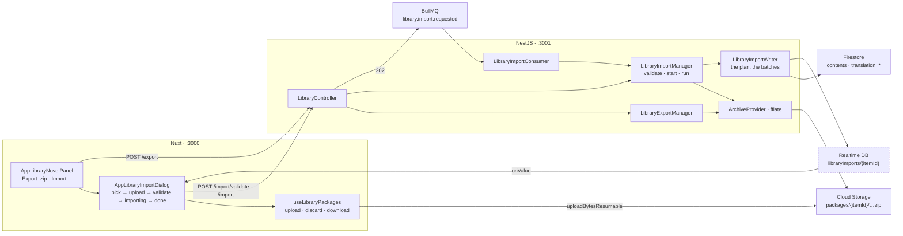

# Library — Part 5: export and import as a .zip

Source design: `_docs/design/1. Library.dc.html` — the two-up **Export .zip** / **Import…** buttons
in the novel panel (lines 255–261), and the four-step **Import novel package** modal (540–646): the
stepper strip, the dropzone and the **On conflict** select (564–576), the upload bar (578–591), the
validation checks (593–605), the writing bar (607–619) and the summary (621–632).

## Goal of design

Part 4 finished the novel: a book has metadata, chapters, bodies in Storage and up to three
translations. All of it lives in one Firestore item and one bucket prefix, and there is no way to get
it out — no backup, no move between environments, no handing a finished translation to somebody
else. The mockup has drawn the answer since part 1: a button that packs the item into a `.zip`, and
a dialog that reads one back.

Part 5 is that round trip. Export walks a novel and streams a zip into Cloud Storage; import
uploads one, says what is in it before writing anything, and then writes it in the background,
merging by chapter number under a conflict policy the person picked.

**In scope**

- A package format — `manifest.json`, `item.json`, `chapters.json`, one `.txt` per chapter body, the
  same again per translated language, and the cover.
- `POST /library/:id/export` — builds the zip, files it in the bucket, answers with the download URL.
- `POST /library/:id/import/validate` — reads the package's records and answers the mockup's checks.
  **Nothing is written.**
- `POST /library/:id/import` — queues the work and answers `202`. One queue message, one pass, live
  progress in the Realtime Database, so the dialog can be closed and reopened.
- Three conflict policies, the mockup's own three: keep the existing chapter, overwrite it, or import
  into a new library item.
- The two buttons in the novel panel and the four-step dialog behind one of them.

**Out of scope — deliberately**

| Deferred | Why |
| --- | --- |
| Image and video sets | A set's package is its bytes — a 3 GB video set is a different problem with different limits, and the mockup puts neither button on a set's screen. `POST /export` on one is a `400`, the same sentence part 4 gives for a language on a set. |
| Importing the cover | The package **carries** the cover so an archive is whole and validation can compare it, and the import never writes it. Writing it would mean uploading under `covers/{targetId}/`, discarding whatever the target had, and deciding what happens when the package's cover is the worse one — for a field the mockup's summary never mentions. |
| A history of packages | Nothing lists past imports or re-downloads an old export. The live node carries the last outcome; the item's counters carry the result. No `libraryImports` collection, and no row in the Scrapings screen. |
| Pause, resume and retry of an import | A scraping job has all three because it is a thousand independent fetches against a flaky source. An import is one sequential pass over one file we already hold: it finishes or it fails, and a failure is re-run by pressing Import again. |
| Selective import | The whole package goes in. There is no "chapters 200–400 only" — the mockup's only choice is what to do about collisions. |
| Merging by anything but the chapter number | The mockup says *"Importing into this item merges by chapter number"*, so `index` is the key. Not `sourceUrl`, which `appendDiscovered` matches on: a package from another workspace may carry a source we never crawled, and two items of the same book from two sites would never line up. |
| Sweeping the bucket | An export object and an uploaded package both stay until something removes them. A successful import drops the package it read; nothing drops an export. See [Known limits](#known-limits). |

### Decisions taken

| Question | Decision |
| --- | --- |
| Where the zip lives | **Cloud Storage, under `packages/{itemId}/`**, beside `content/{itemId}/` and `covers/{itemId}/`. The bytes never travel through the API in either direction — `library.controller.ts` has said so since part 1, and it is what lets the browser upload a package with a progress bar and download an export without an `Authorization` header. |
| How the API refers to a package | **By its download URL**, the same string a `contentUrl` and a `coverUrl` are. The server turns it back into an object path with the regex `ContentFileProvider` already has, and refuses a URL that is not in our bucket. |
| Export: synchronous | **Yes.** One request, one answer, the mockup's *Preparing…* on the button. It is a read of what we already hold, streamed straight into the bucket, and it writes nothing to Firestore — so there is nothing to make it a job except its duration. Its ceiling is in [Known limits](#known-limits). |
| Import: a background job | **Yes, and it has to be.** A 640-chapter package is 640 Storage writes; a translated one is double that. That is minutes, and the mockup already says *"You can close this dialog — the import continues in the background."* |
| Which job machinery | **The existing queue, with one message per import** — not one per chapter. `QueueTopic.LibraryImportRequested`, one consumer, one sequential pass. Not a `ScrapingJob`: that shape is a fan-out over an external service with tasks, retries, pause/resume and a History tab, and an import would wear a `crawler`, a `range` and a task subcollection that mean nothing. |
| Where progress lives | **The Realtime Database**, at `libraryImports/{itemId}` — the tree the browser already subscribes to, for the reasons the notify part records. No Firestore document: nothing queries an import, nothing lists one, and a node that costs nothing to write is what a progress bar wants. |
| The zip library | **`fflate`**, one dependency for both directions, no native build, types included. Used through its **streaming** API, so a package is never held in memory whole: an export streams chapter bodies out of the bucket and into the archive, and an import streams the archive out of the bucket and each body back into it. |
| Where the zip code lives | **`ArchiveProvider` in `core/providers/`**, beside `ContentFileProvider` and for its reason: a manager should not import a compression library, and the next thing that wants a zip will not be the library module. |
| What the format keys on | **`index`, the chapter number.** Stated once, in `library-package.entity.ts`, and it is what the merge, the translations and the conflict policy all match on. |
| Whether entry order matters | **No.** The package is read **twice** — once for the records, once for the bodies — so a body can arrive before or after the record that names it. That second read is also what makes `validate` and the import share one code path: validation *is* the first pass. |
| Recounting | **Once, at the end.** `recount()` writes the item document, and Firestore sustains about one write per second to a single document — 640 of them is not slow, it is contention. Every write an import makes is batched and the counters move once. |
| A second import while one runs | **`409`.** Read the live node before queueing. Two passes writing the same chapters is a race whose loser orphans a Storage object per chapter. |

---

## Contracts

### The package — `backend/src/library/entities/library-package.entity.ts`

```
manifest.json                the schema version, when, from where, and the counts
item.json                    the item's writable representation — the `POST /library` body
cover.jpg                    only when the item has a cover. Read on import, never written
chapters.json                the chapter records, in reading order
chapters/0001.txt            one per chapter that has a body
translations/vi.json         the Vietnamese records
translations/vi/0001.txt     one per translated chapter that has a body
```

```ts
/** The format's version. A package from a future one is refused rather than half-read. */
export const PACKAGE_SCHEMA = 1;

export interface PackageManifest {
  schema: number;
  /** Only a novel is packaged. Present so a set's package can be refused by reading four fields. */
  kind: LibraryItemType;
  exportedAt: string;
  /** The Firebase project it came from — the mockup's "from workspace kms-media". */
  project: string;
  source: { itemId: string; title: string };
  counts: { chapters: number; bodies: number; translations: Record<string, number> };
}

/** One chapter, as the package states it. `file` is null where the chapter has no text yet. */
export interface PackagedChapter {
  index: number;
  title: string;
  language: string;
  words: number;
  sourceUrl: string | null;
  file: string | null;
}

/** What to do with a chapter number the target already holds. The mockup's select, verbatim. */
export enum ImportConflict {
  Skip = 'skip',
  Overwrite = 'overwrite',
  NewItem = 'newItem',
}
```

A translation record is a `PackagedChapter` too — same fields, same reader, and `sourceUrl` is
always null there for the reason part 4 gives. That is what lets one `chapters.json` parser serve
four files.

`item.json` is **exactly `CreateLibraryItemDto`'s shape**: `title`, `coverUrl`, `sourceMode`,
`sourceName`, `sourceUrl`, `status` and `metadata`. Not a shape of its own — an import that creates
an item passes it straight to `LibraryManager.create`, and a field added to the item is a field the
package carries without anything here changing.

`coverUrl` inside `item.json` is the **exporting workspace's** URL and is dead everywhere else. It is
carried because it says whether there was a cover; the bytes beside it in `cover.jpg` are the real
answer, and neither is written on import.

### `ArchiveProvider` — `backend/src/core/providers/archive.provider.ts`

```ts
/** One entry going in. All three await, so a slow upload slows the read feeding it. */
interface ArchiveWriter {
  text(name: string, body: string): Promise<void>;    // a string this process holds
  object(name: string, path: string): Promise<void>;  // a stored object, deflated
  image(name: string, path: string): Promise<void>;   // the same, stored as it is
}

writeTo(path: string, filename: string, build: (into: ArchiveWriter) => Promise<void>): Promise<StoredArchive>
readFrom(path: string, wanted: (name: string) => boolean, onEntry: (name: string, body: Buffer) => Promise<void>): Promise<void>
remove(path: string): Promise<void>
```

`StoredArchive` is `{ url: string; bytes: number }` — the download URL in the exact form
`getDownloadURL()` produces, because that is the only form the rest of this codebase reads a stored
object in. `filename` is written as the object's `contentDisposition`, so the browser saves
`silent-cartographer-export.zip` rather than a UUID and the frontend needs no blob dance.

`readFrom` is push-based and sequential: `fflate`'s streaming `Unzip` reads local headers as they go
by and never seeks, so there is no central directory to consult and no random access. Two things
follow, and both shape the import. **Whether an entry is read is decided from its name alone**, the
moment its header goes past — hence `wanted`, a synchronous predicate, rather than a lazily resolved
entry object; what it refuses is never decompressed, and what it accepts arrives whole. And an
archive that needs two kinds of entry in a fixed order has to be **read twice**, which is why
validation and the import are one pass each rather than one pass together.

`image` exists so the cover is stored rather than deflated: compressing a JPEG costs CPU to grow the
file. Everything else — records and chapter bodies alike — is text and goes through `ZipDeflate`.

**`core/firebase/storage-url.ts`** is extracted in the same step: `downloadUrl(config, path, token)`
and `objectPathFrom(url)`, lifted out of `ContentFileProvider` unchanged. Two callers each now, which
is what earns it a file — and one place where the shape of a Firebase download URL is written down.

### Endpoints

Three routes, all on the existing `LibraryController` under the existing `@ApiTags('Library')`, so
NSwag adds three methods to `LibraryClient` and no new client.

| Method | Path | Body | Answers |
| --- | --- | --- | --- |
| `POST` | `/api/v1/library/:id/export` | — | `200 LibraryPackageDto` |
| `POST` | `/api/v1/library/:id/import/validate` | `LibraryPackageRefDto` | `200 LibraryPackageReportDto` |
| `POST` | `/api/v1/library/:id/import` | `StartLibraryImportDto` | `202 LibraryImportDto` |

Both the first two are a `POST` answering `200` under `@HttpCode(HttpStatus.OK)` — the pattern
`POST /scrapings/validate` and `POST /scrapings/discover` already set: they write something, but
nothing a caller can address afterwards.

Refusals, each a sentence:

| Status | When |
| --- | --- |
| `400` | Export or import on an image or video set — *"Only a novel can be packaged."* |
| `400` | A `packageUrl` that is not an object in our bucket. |
| `400` | A package that will not open, has no `manifest.json`, or states a `schema` above ours. |
| `400` | `POST /import` on a package whose report is not `valid`. The server re-reads it; a client cannot skip validation by not calling it. |
| `404` | No item under that id. |
| `409` | An import is already running over this item. |

### `LibraryPackageDto` — `dto/library-package.dto.ts`

```
url            string  — the download URL, tokenised, ready to open
filename       string  — silent-cartographer-export.zip
bytes          number  — what the archive weighs
chapters       number  — records written
bodies         number  — of those, how many had text
translations   LibraryTranslationCoverageDto[] — part 4's row, reused
```

`translations` is part 4's coverage DTO rather than a shape of its own: *how many chapters each
language covers* is the same fact whether it is being read off an item or out of a package, and two
classes saying it is two classes that can disagree.

### `LibraryPackageReportDto`

```
valid          boolean — no check failed. What the dialog's Next button reads
checks         LibraryPackageCheckDto[]
chapters       number  — records in the package
adding         number  — chapter numbers the target does not hold
existing       number  — chapter numbers it does
skipped        string[] — entries that are not part of the format
translations   LibraryTranslationCoverageDto[] — one row per language the package carries
```

```ts
export enum PackageCheckState { Pass = 'pass', Warn = 'warn', Fail = 'fail' }

export class LibraryPackageCheckDto {
  state!: PackageCheckState;
  /** The bold line — "640 chapter files". */
  label!: string;
  /** The muted line beneath — "228 not present in this item · 412 already stored". */
  detail!: string;
}
```

The five rows are the mockup's five, built in this order and each from something actually read:

| Row | State | Label / detail |
| --- | --- | --- |
| 1 | pass / fail | `manifest.json · schema v1` — *"Exported 12 Aug 2026 from project media-studio-dev"* |
| 2 | pass / warn | `Metadata record` — *"Title, author, genres, cover · matches this item"*, or *"Describes “X” — this item is “Y”"* |
| 3 | pass | `640 chapter files` — *"228 not present in this item · 412 already stored"* |
| 4 | warn | `2 files skipped` — *"notes.pdf, chapter_507.docx — not part of the format"*. Omitted when nothing was skipped |
| 5 | pass | `Translations · Vietnamese` — *"412 chapters"*. One row per language the package carries |

Row 2 is a **warn, never a fail.** Importing a package into the wrong book is a mistake worth
showing in bold and not one worth refusing: a re-exported item after a rename would otherwise be
unimportable into itself, and *"Import as new library item"* exists precisely so a package that
matches nothing still has somewhere to go.

`valid` is *no row failed*, so in practice only a broken or future-schema package is refused —
which is the mockup's own footer: *"Nothing is written until validation passes"* and, on the
validate step, *"1 warning — you can continue."*

### `LibraryPackageRefDto` / `StartLibraryImportDto` / `LibraryImportDto`

```ts
export class LibraryPackageRefDto {
  @IsUrl() packageUrl!: string;
}

export class StartLibraryImportDto extends LibraryPackageRefDto {
  @IsEnum(ImportConflict) onConflict!: ImportConflict;
}

export class LibraryImportDto {
  /** Where the chapters are going. The route's id, unless the policy made a new item. */
  itemId!: string;
  /** Bodies to write — chapters plus translations. What the progress bar divides by. */
  total!: number;
}
```

`itemId` on the answer rather than assumed from the route is the whole of what `newItem` costs a
client: the dialog's **View chapters** navigates to what came back.

### The live node — `libraryImports/{itemId}`

```ts
export interface LibraryImportSnapshot {
  itemId: string;
  status?: string;          // 'running' | 'completed' | 'failed'
  total?: number;
  done?: number;
  /** "Chapter 412 · Nine Bells for the Harbour" — what the mockup draws under the bar. */
  label?: string;
  added?: number;
  overwritten?: number;
  skipped?: number;
  translated?: number;
  error?: string;
}
```

`RealtimeProvider` gains `publishImport(snapshot)` and `clearImport(itemId)`, under a new
`LIBRARY_IMPORTS_ROOT`. Same class because it already owns the database handle and the swallow-and-log
policy that makes a mirror write unable to fail an import; the fields are primitives, so core still
holds no domain type. `update` rather than `set`, so a tick that moved `done` costs no read of the
rest.

Published **every 10 bodies** and at each phase change, not per body: 1,280 bodies would be 1,280
writes to say a bar moved, and the chunking in `publishTasks` exists for the same reason.

The node is **not cleared when the import ends.** It is the last outcome, which is what lets a
reopened dialog say *"Import complete · 228 chapters added"* rather than nothing. It goes when the
item does — `LibraryManager.remove` gains `clearImport(id)` beside the two cascades it already runs.

`_deploy/firebase/database.rules.json` gains the sibling block:

```json
"libraryImports": { ".read": "auth != null", ".write": false }
```

### Storage — `_deploy/firebase/storage.rules`

```
match /packages/{itemId}/{file} {
  allow read: if request.auth != null;

  // Kept in step with PACKAGE_MAX_MB in frontend/app/utils/library-package.ts.
  allow create, update: if request.auth != null
    && request.resource.size < 200 * 1024 * 1024
    && request.resource.contentType.matches('application/zip|application/x-zip-compressed');

  allow delete: if request.auth != null;
}
```

The third prefix under an item's id, for the reason the file already states: an item's whole
footprint should be findable from its id alone.

**200 MB, not the mockup's 2 GB.** The cap matches `ASSET_MAX_MB` because it is the same rule in the
same file, and only a novel is packaged — 640 chapters of text is single-digit megabytes. The 2 GB
belongs to the set packages this part does not build.

An export is written by the Admin SDK, which rules do not apply to; it is *read* through a tokenised
download URL, which they also do not apply to. So `read` above is for nothing today and stays,
because the alternative is a rule that is wrong the first time something lists the prefix.

### Frontend types — `frontend/app/types/library-package.ts`

Mirrored by hand from the node above, the arrangement `types/scraping-status.ts` already has:
`LibraryImportSnapshot`, `ImportConflict`, `PackageCheckState`, and `ImportStage` — the dialog's own
`'pick' | 'upload' | 'validate' | 'importing' | 'done'`, which is the mockup's `impStage` and lives
only on the client.

---

## Shape of the system



The request that starts an import touches Firestore once — to read the item and, under `newItem`, to
create one. Everything else happens on the consumer, in the worker half of the same process.

---

## Step 1 — The format, the URL helper and the archive provider

| File | What it is |
| --- | --- |
| `backend/src/core/firebase/storage-url.ts` | New. `downloadUrl` and `objectPathFrom`, moved out of `ContentFileProvider` unchanged. |
| `backend/src/core/providers/content-file.provider.ts` | Imports both instead of declaring them. About twenty lines shorter, no behaviour moved. |
| `backend/src/core/providers/archive.provider.ts` | New. The three methods above, over `fflate` and the bucket. |
| `backend/src/library/entities/library-package.entity.ts` | New. `PACKAGE_SCHEMA`, `PackageManifest`, `PackagedChapter`, `ImportConflict`, and the entry names — `MANIFEST_ENTRY`, `ITEM_ENTRY`, `CHAPTERS_ENTRY`, plus `bodyEntry(position)` and `translationEntries(language)`. |
| `backend/src/core/core.module.ts` | `ArchiveProvider` in `providers` and `exports`. |
| `backend/package.json` | `fflate`. One dependency, no `@types` — it ships its own. |

Every entry name is built by a function in the entity file and read by a matcher in the same file.
Nothing anywhere else concatenates a path inside a zip, for `TRANSLATION_SUBCOLLECTIONS`' reason: a
name that appears in two places is a name that eventually disagrees with itself.

`writeTo` in outline — a `fflate.Zip` whose `ondata` writes into the bucket's own write stream, so
the archive is never assembled in memory:

```
const zip = new Zip((err, chunk, final) => …)      // → bucket.file(path).createWriteStream()
into.text(name, body)   → new ZipDeflate(name), push the UTF-8 bytes, end
into.object(name, path) → new ZipPassThrough(name), pipe bucket.file(path).createReadStream()
await build(into); zip.end(); await the stream's finish
```

A body is already `text/plain` and compresses well, so it goes through `ZipDeflate`; the cover is a
JPEG or PNG and goes through `ZipPassThrough`, because deflating a compressed image costs CPU to
grow the file. `bytes` is counted off the chunks as they pass.

`readFrom` is the mirror: `bucket.file(path).createReadStream()` pushed into `fflate.Unzip`, one
`UnzipInflate` per entry, and `onEntry` awaited before the next entry is let through — a zip read
that does not apply backpressure will happily buffer a whole package.

## Step 2 — Export

| File | What it is |
| --- | --- |
| `backend/src/library/library-export.manager.ts` | New, ~120 lines. Reads the novel and writes the package. |
| `backend/src/library/dto/library-package.dto.ts` | New. `LibraryPackageDto`, and the report and request classes Step 3 fills in. |
| `backend/src/core/api.constants.ts` | `LIBRARY_EXPORT_PATH = 'export'` and `LIBRARY_IMPORT_PATH = 'import'`. |
| `backend/src/library/library.controller.ts` | The `POST :id/export` route. |
| `backend/src/library/library.module.ts` | The manager, provided. Not exported: nothing but HTTP exports a package. |
| `backend/src/library/library-export.manager.spec.ts` | New, against fake repositories and a fake `ArchiveProvider` — `library-translation.manager.spec.ts`'s shape. |

One public method:

```ts
async export(itemId: string): Promise<LibraryPackage>
```

which requires the item, refuses a set, reads the chapters with
`LibraryContentManager.chapters(itemId)` — already there, already ordered by `index`, already
unpaged — reads each language's translations, and hands `ArchiveProvider.writeTo` a builder that
appends in exactly this order:

1. `manifest.json`
2. `item.json`
3. `cover.<ext>`, when `coverUrl` is set
4. `chapters.json`, then `chapters/0001.txt` … for every chapter with a `contentUrl`
5. `translations/vi.json`, then `translations/vi/0001.txt` …, and the same for the other two

The order is the format's and is what makes a human unzipping it read the book in order. It is
**not** what the import depends on — see Step 4.

`bodyEntry` is numbered by the record's **position in the array**, zero-padded to four, not by its
chapter number. Two chapters may carry the same `index` — nothing has ever stopped that — and two
entries with one name is a corrupt archive. The record's own `file` field is what ties the two
together, so the numbering is for the human and the field is for the machine.

The filename is the item's title slugged plus `-export.zip`, which is the mockup's
`silent-cartographer-export.zip`. A title that slugs to nothing falls back to the item's id.

**Only a language with at least one translation gets a `.json` and a folder.** An empty
`translations/ja.json` in every package would be three files saying nothing, and the coverage rows on
the response already answer *what is in here*.

A chapter with no `contentUrl` gets a record and no file, `file: null`. That is a discovered chapter
nobody has scraped yet, and it is worth carrying: the numbering and the titles are most of what
discovery produced.

## Step 3 — Reading a package, and the report

| File | What it is |
| --- | --- |
| `backend/src/library/library-import.manager.ts` | New, ~180 lines. `validate`, `start`, `run`. |
| `backend/src/library/library.controller.ts` | The `POST :id/import/validate` route. |
| `backend/src/library/library-import.manager.spec.ts` | New. |

The reader is one private method and it is the part both entry points share:

```ts
private async records(url: string): Promise<PackageRecords>
```

One `readFrom` in which every JSON entry is buffered and parsed and **every body entry is left
undrained**, so the pass costs the archive's directory and its small files and nothing else. It
answers `{ manifest, item, chapters, translations, skipped }`, where `skipped` is every entry name
the format does not recognise — the mockup's `chapter_507.docx, notes.pdf`.

`validate(itemId, url)` is that pass plus a comparison against the target: the stored chapters'
numbers as a `Set`, so `adding` and `existing` are one loop, and the five checks built off what it
found. It writes nothing, and it is safe to call twice.

The refusals live here, and each one is checked before anything expensive:

- The URL is not an object in our bucket → `400`, before the object is opened.
- No `manifest.json`, or it will not parse → `400`.
- `manifest.schema > PACKAGE_SCHEMA` → `400` naming both numbers. A **lower** schema is accepted:
  there is one version today and the reader will be told to widen when there are two.
- `manifest.kind` is not a novel, or the target is not → `400`.

## Step 4 — The import, queued and run

| File | What it is |
| --- | --- |
| `backend/src/core/queues/queue.messages.ts` | `QueueTopic.LibraryImportRequested`, its payload, `LIBRARY_IMPORT_QUEUE`, and the registry entry. Four small additions; `allConsumerQueues()` picks the queue up and `CoreModule` registers it with no further change. |
| `backend/src/core/providers/realtime.provider.ts` | `publishImport` and `clearImport`, ~30 lines. |
| `backend/src/library/library-import.writer.ts` | New, ~200 lines. The plan, the second pass, the batched writes and the progress. |
| `backend/src/library/library-import.handler.ts` | New, ~50 lines. `@Processor(LIBRARY_IMPORT_QUEUE, { concurrency: 1 })` over `QueueConsumer`. |
| `backend/src/library/library-content.repository.ts` | `createMany` answers with the ids it allocated; `replaceMany` is new. |
| `backend/src/library/library-translation.repository.ts` | `upsertMany` is new. |
| `backend/src/library/library.manager.ts` | `clearImport(id)` in `remove`. |
| `backend/src/library/library.module.ts` | The writer and the consumer. |
| `backend/src/library/library.controller.ts` | The `POST :id/import` route, `202`. |

**The endpoint** (`LibraryImportManager.start`) does four things and none of them is slow: it
validates — the report has to be `valid`, whether or not the client asked for one; it refuses a
`409` if the node for the target says `running`; under `ImportConflict.NewItem` it creates the item
from `item.json` through `LibraryManager.create`, so the response can name it; and it sends one
message. Then `202`.

Validating twice, once from the dialog and once here, is deliberate and cheap: it is one read of the
small half of the archive, and the alternative is an endpoint that trusts a client to have asked a
question.

**The consumer** is thin, as `ScrapingContentConsumer` is: unwrap, call `run`, and let a throw leave
the message in the failed set. `concurrency: 1` — an import is a burst of Storage writes and a
Firestore batch, and two at once buys nothing but contention. Before it rethrows it publishes
`status: 'failed'` with the message, so the dialog says why rather than hanging at 60%.

**The run**, in `LibraryImportWriter`, is a plan and then a pass:

```
records      = the first pass (already in hand from the endpoint's validate? no — read again)
stored       = contents.chapters(targetId), indexed by `index`
plan         = per record: 'add' | 'overwrite' | 'skip', per the policy
                 (a target that was just created holds nothing, so every record is an 'add')
pass two     = readFrom, and for each body entry:
                 find its record → find its plan row → skip, or saveText and keep the URL
                 every 10 bodies, publishJob-style publish of done / label
flush        = createMany(adds) → the ids come back
               replaceMany(overwrites)
               resolve every translation's chapter number to a content id, now that all of them exist
               upsertMany per language
recount      = once
publish      = completed, with the four counters
remove       = the uploaded package
```

The plan is built **before** the second pass and holds every decision, so the pass is a lookup and a
write. That is what makes entry order irrelevant, and it is why the package is read twice rather
than once — a single pass would have to decide about a body before knowing whether its record
exists.

Translations resolve **after** the chapter flush, keyed by chapter number throughout, because a
chapter the package added has no document id until `createMany` allocates one. That is the only
ordering constraint in the whole run and it is between two writes, not between two entries.

`createMany` answering with its ids is one line — it already builds a `doc()` per draft and throws
the reference away. `appendDiscovered` ignores the return.

`replaceMany` and `upsertMany` are `createMany`'s loop with a different verb, batched at Firestore's
500. `upsertMany` takes the stored `createdAt` alongside each draft — the caller has it from
`findByIds`, which the plan already ran — so a rewritten translation keeps the date it was first
written and a new one is stamped with both. That is the promise `LibraryTranslationRepository.upsert`
makes one document at a time, kept for five hundred.

**A skipped chapter can still gain a translation.** The policy is about the chapter's text, and a
target that already has chapter 412 in Chinese has no opinion about the Vietnamese in the package.
The policy applies again, separately, where the translation itself already exists.

**Failure leaves what it wrote written.** There is no transaction over 640 Storage objects and there
should not be one; a failed import is re-run by pressing Import again, and the second run finds most
of its chapters already there and — under **skip** — leaves them alone. The uploaded package is
deliberately **not** removed on failure, so the retry has something to read.

## Step 5 — The two buttons and the dialog

Run `pnpm generate:api` first: `LibraryClient` gains `export`, `validateImport` and `startImport`.

| File | What it is |
| --- | --- |
| `frontend/app/types/library-package.ts` | New. The node, the two enums, and `ImportStage`. |
| `frontend/app/utils/library-package.ts` | New. `PACKAGE_MAX_MB`, `IMPORT_CONFLICT_OPTIONS` — the mockup's three labels — `packageCheckTag(state)` returning the badge triple the way `contentStatusTag` does, `IMPORT_STEPS`, and `checkPackage(file)`, which rejects with the sentence to print as `checkAsset` does. |
| `frontend/app/composables/useLibraryPackages.ts` | New. `upload(itemId, file, onProgress)` over `uploadBytesResumable`, `discard(url)`, and `download(url)`. |
| `frontend/app/components/AppLibraryNovelPanel.vue` | The two-up grid, the hint line beneath, and two more emits. |
| `frontend/app/components/AppLibraryImportDialog.vue` | New, ~260 lines. The four-step modal. |
| `frontend/app/pages/library/[id]/index.vue` | `onExport`, the dialog, and the refresh after an import lands. |

**The panel.** A `grid-cols-2` of two `subtle` neutral buttons between the discovery hint and **Edit
metadata**, exactly where the mockup puts them, under the mockup's own sentence: *"Export packs
metadata, chapters and translations into a .zip. Import accepts a zip exported from any workspace."*
Export takes an `exporting` prop and reads **Preparing…** while it is true; both are enabled for a
manual item, unlike the two scraping controls above them — a manual novel is exactly the kind you
would want to move.

**Export, on the page.** `libraryClient.export(itemId)` then `packages.download(url)`, which is
`window.location.assign` and nothing more: the object carries its own `Content-Disposition`, so the
browser saves it under the right name without the fetch-to-blob dance and without a 200 MB `Blob` in
a tab. A toast on failure, the shape `onDiscover` already has.

**The dialog** is the mockup's five stages behind one `UModal`, with the stepper strip across the
top drawn from `IMPORT_STEPS` and the current stage's index.

- **pick** — an `AppBlueprint` dropzone, dashed, all four registration marks, handling both a click
  and a drop. `checkPackage` refuses anything that is not a `.zip` under the cap before a byte
  moves. Beneath it the mockup's paragraph, and the **On conflict** `USelect`.
- **upload** — `uploadBytesResumable`, whose `state_changed` gives `bytesTransferred / totalBytes`.
  The bar, the percentage badge and the filename are all real. On success the stage advances to
  **validate** on its own; the mockup's *"Do not close the browser tab while uploading"* is the
  footer hint, and it is true — closing it aborts the upload.
- **validate** — `validateImport({ packageUrl })`, and the returned `checks` drawn one per row with
  `packageCheckTag`. **Import 228 chapters** is enabled when `valid` and labelled from `adding`.
  A cancel here `discard`s the uploaded object: an abandoned package should not sit in the bucket.
- **importing** — `startImport` answers `202` and the dialog subscribes to
  `libraryImports/{answer.itemId}` with `onValue`, in the dialog rather than in a composable because
  it is the only screen that watches one. `done / total` is the bar, `label` is the line beneath, and
  the footer says *"Running in the background."*
- **done** — the mockup's `<dl>`, four rows, off the node's own counters: chapters added, chapters
  overwritten, translations added, skipped. **View chapters** closes the dialog and emits `imported`
  with the target id.

Reopening the dialog while an import runs picks the node up and lands on **importing** — which is
what makes *"You can close this dialog"* true. A node that has already settled does not do that: the
stage only follows the node once this dialog has started an import, or found one `running` when it
opened.

**The page** handles `imported`: `refreshAll()` when the id is this item's, or `navigateTo` when the
policy made a new one. The subscription and the node do the rest — the counters, the coverage in the
language dropdown and the chapter table all come from the refetch.

Styling as ever: tokens and Tailwind classes only, no `<style>` block, square corners, all four
registration marks on every blueprint.

---

## Known limits

**Export is a request, and a long novel makes it a long one.** 640 chapters is 640 sequential reads
out of the bucket, streamed through the archive — a minute or two, held open by a browser and by
whatever proxy sits in front of the API. The button says *Preparing…* and means it. The fix is the
one the import already has: a queue message, a node and a progress bar. It is not built because the
mockup draws export as a button and not as a dialog, and because an export writes nothing that a
timeout could leave half-done — a failed one leaves an incomplete object nobody was given the URL of.

**An export object is never removed.** Every export leaves a zip under `packages/{itemId}/` under a
random name, and exporting the same novel five times leaves five. The random name is deliberate —
`ContentFileProvider` and `useContentFiles` both give the reason, that a fixed one would break a
download in flight — so the answer is not a shorter name but a bucket lifecycle rule over the
`packages/` prefix, which is one line of GCS configuration and also sweeps a package whose import
failed. Nothing in the emulators enforces one, which is why it is written here rather than done.

**A package is bounded by a rule, not by anything real.** 200 MB is what `storage.rules` admits, and
it is a guess: nothing measures a package before it is uploaded except `checkPackage`, which reads
the same constant. A novel long enough to exceed it is a novel our 2,000-row content scan already
cannot page through.

**The scan limit is the export's ceiling too.** `chapters()` goes through `findMatching`, which stops
at `CONTENT_SCAN_LIMIT`. A novel of 2,500 chapters exports 2,000 of them and logs the warning the
repository already logs. Part 2's limit, inherited unchanged, and the fix is still real paging rather
than a bigger number.

**Two chapters with the same number merge into one.** The key is `index`, the target's rows are
indexed by it, and a duplicate silently overwrites its twin. Nothing has ever stopped two chapters
sharing a number — `POST /contents` takes an `index` — so this is a pre-existing ambiguity that
import is the first thing to be hurt by.

**A failed import is a partial one.** The chapters written before the failure stay written and the
counters are recounted only if it got that far, so an item can sit with 400 of 640 chapters and an
item document that still says 200. The next `recount` — any content write, or a re-run — fixes the
counters. There is no rollback and there should not be one.

**The uploaded package is left behind when an import fails**, on purpose, so it can be retried. That
is also how it becomes litter: nothing retries it either, and the bucket keeps it.

**Nothing checks that a translation is in the language its folder names.** `translations/vi/` will
import whatever is in it, which is part 4's limit reaching one layer further out.

**`words` comes from the package.** A record states its own count and the import believes it, as
every other write in this codebase believes the client's. A package hand-edited to claim 40,000 words
gets 40,000 words.

**No optimistic concurrency, now in a fifth place.** The `409` stops two imports over one item, and
stops nothing else: a person editing chapter 412 in the reader while an import overwrites it is
last-write-wins, and the loser's Storage object is orphaned.

**A `zip64` or encrypted package is refused as unreadable.** `fflate`'s streaming reader supports
neither, and the error is the generic *"could not open the package"* rather than a sentence naming
the reason.

---

## Running it locally

```bash
pnpm install              # picks up fflate
pnpm dev:infrastructure   # emulators + the scraping API on :8000
pnpm seed:firebase        # admin@datntdev.com / StrongPassword123!
pnpm dev                  # backend :3001 + frontend :3000
```

**Backend**, before any UI:

```bash
pnpm --filter @media-studio/backend run test -- library-export.manager
pnpm --filter @media-studio/backend run test -- library-import.manager
pnpm lint && pnpm typecheck
```

Then `http://localhost:3001/docs`, with an ID token from the signed-in app and a novel that has
chapters, at least one scraped body and at least one Vietnamese translation:

1. `POST /api/v1/library/{id}/export` → `200`. Open the `url` in a tab: the browser **saves**
   `{slug}-export.zip` rather than displaying it, which is the `contentDisposition` doing its job.
2. Unzip it. `manifest.json` reads `"schema": 1` and names the emulator project; `chapters.json` has
   one record per chapter in reading order; `chapters/0001.txt` holds the first scraped body;
   `translations/vi.json` and `translations/vi/…` are there and `translations/en.json` is **not**.
3. `http://127.0.0.1:4000/storage` → one object under `packages/{itemId}/`. Export again: **two**.
   This is the known limit, seen.
4. `POST /api/v1/library/{id}/export` on an image set → `400`, *"Only a novel can be packaged."*
5. Upload that zip through the UI (step 3 below), then `POST /{id}/import/validate` with its URL →
   five checks, `valid: true`, `adding: 0` and `existing` the whole novel. A package re-imported into
   the item it came from should add nothing.
6. `POST /{id}/import` with `onConflict: "skip"` → `202`, `{ itemId, total }`. Watch
   `http://127.0.0.1:4000/database` → `libraryImports/{id}` moves `running` → `completed`, and the
   summary says every chapter skipped. `contents` is untouched and `discoveredCount` has not moved.
7. Do it again with `"overwrite"` → the same chapters, new Storage objects under `content/{itemId}/`,
   the old ones orphaned. Then again immediately, before the first settles → `409`.
8. `"newItem"` → a second item in the listing carrying the same title, all 640 chapters and the
   Vietnamese translation, and **no cover**. The response's `itemId` is the new one.
9. `validate` with a `packageUrl` pointing outside our bucket → `400`. With a `.txt` renamed to
   `.zip` → `400`, *"could not open the package"*.
10. Delete the imported item → `libraryImports/{id}` is gone from the database emulator.

**Through the UI**, which is where the four steps have to read well:

1. Open a novel. The panel has **Export .zip** and **Import…** side by side under their sentence.
   Press Export: the label reads **Preparing…**, then the file lands in Downloads.
2. Press **Import…**. Step 1 of 4, the dropzone, the conflict select defaulting to *Keep existing
   chapter, skip imported*. Drop the file you just exported.
3. **Upload package** → the bar moves, the percentage is real, the filename and size are the file's.
   It advances on its own.
4. Step 3 of 4: the five checks, one warning at most. The primary button reads **Import 0 chapters**
   — because you are importing the item into itself — and the footer says you can continue.
5. Change the conflict select to **Overwrite with imported content** back on step 1 and run it again
   on a novel exported from a *different* item, so `adding` is not zero. Press **Import N chapters**.
6. **Close the dialog while the bar is moving.** Reopen **Import…** — it comes back on step 4 with
   the bar where it now is. This is the step the whole part turns on; if it opens on the dropzone,
   the node subscription is not being picked up on open.
7. Let it finish. **Import complete**, four rows, the numbers matching what the emulator shows.
   **View chapters** closes it, and the table behind has the new chapters and the new count.
8. Switch the language dropdown to **Vietnamese**: the coverage label has moved, and the imported
   chapters read **Translated** with the source title beneath.
9. Import a package into an image set — the buttons are not there, because the panel is a novel's.

Each step is one commit, and each leaves `pnpm lint`, `pnpm typecheck` and `pnpm build` green.
