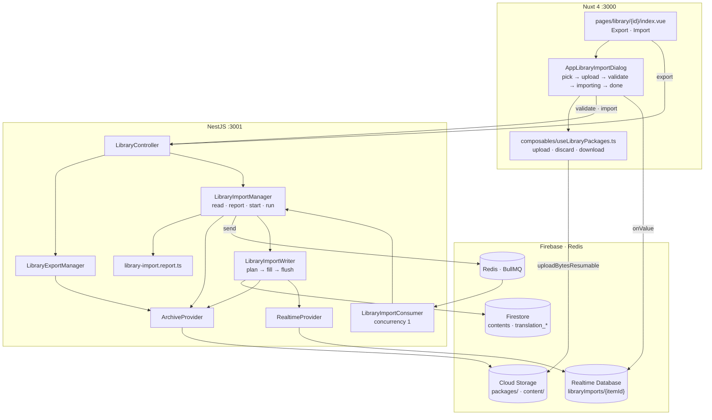
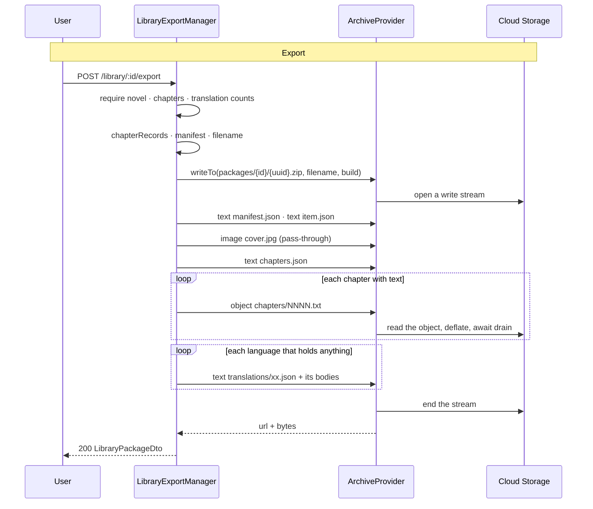
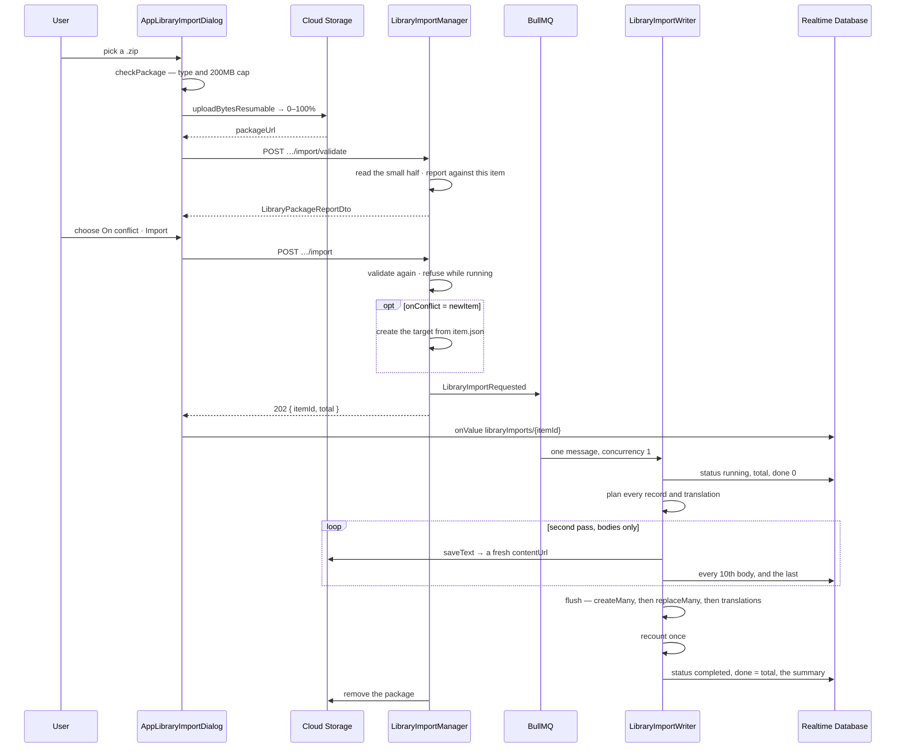

# Library — Part 5: export and import as a .zip

## Overview

Part 5 packs a novel — its metadata, its cover, every chapter and every translation — into a
single `.zip` in Cloud Storage, and reads one back into an item. Export is one synchronous
request that streams; import is validated in front of the person, then run on a queue, with
progress mirrored to the Realtime Database so a package of a thousand chapters is visible while
it unpacks.

Nothing is ever held whole. `ArchiveProvider` streams both ways through `fflate`'s push API,
which is also the one thing every caller has to design around: the reader has no central
directory to consult and cannot seek, so whether an entry is read at all is decided from its
name alone, the moment its header goes past. Anything needing two kinds of entry in a fixed
order reads the archive twice — which is exactly what import does.

Every decision about what a package *means* for the target is made before a byte of text is
read. The plan says what each record does to the item; the pass that follows only fills in where
the text landed. That is what makes entry order irrelevant.

## Requirements

- **The format is versioned and self-describing.** `manifest.json` is read before anything else
  in the package is trusted; a `schema` from a later workspace fails validation rather than being
  half-read.
- **Every entry name is built by a function and recognised by a matcher, both in one file.**
  `library-package.entity.ts` owns `coverEntry`, `translationsEntry`, `bodyEntry`,
  `translationBodyEntry`, `isRecordEntry`, `isBodyEntry`, `isCoverEntry`, `isPackageEntry`,
  `translationsEntryLanguage` and `bodyEntryLanguage`. Nothing outside that file concatenates a
  path inside an archive.
- **Body entries are numbered by position, not by chapter number.** Nothing stops two chapters
  sharing a number, and two entries with one name is a corrupt archive. `file` on the record is
  what ties a record to its text, and is null where a chapter has none.
- **`item.json` is a `POST /library` body.** An import that creates a new item passes it straight
  to `LibraryManager.create`, so a field added to an item is a field the package carries without
  anything here changing.
- **Only a novel can be packaged.** A set's package is its bytes, which is a different problem.
  Both routes refuse it in the same words, from `NOT_PACKAGEABLE`.
- **An export writes nothing to Firestore.** A failed export is an incomplete object nobody was
  given the URL of, rather than a half-changed item.
- **A row pointing at text that is not in storage fails the whole export.** An archive that says
  it holds a chapter and does not is worse than one nobody got — so it is a `422` naming the
  entry, rather than a quietly empty file.
- **Validation writes nothing and is safe to call twice.** It reads only the small half of the
  archive; every body goes past undecompressed. That is what makes it cheap enough to run once
  for the person and once for the endpoint that will not take their word for it.
- **A warning does not stop an import; a failure does.** In practice only a broken or
  future-schema package is refused: importing into the wrong book is worth showing in bold and
  not worth refusing, because "Import as new library item" exists for a package that matches
  nothing.
- **Merging is by chapter number.** A number the target does not hold is added whatever the
  policy says. One it does is overwritten only when asked **and** when the package has text to
  put there — a record with no body would otherwise blank a stored chapter and orphan its object.
- **The conflict policy applies to a translation on its own.** A chapter kept because the target
  already has its text has no opinion about a language it has none in.
- **Every Firestore write is batched and the item is recounted once.** Six hundred calls to
  `LibraryContentManager.replace` would be six hundred writes to one item document, and Firestore
  sustains about one a second to a single document — that is contention, not slowness.
- **Bytes go around the API in both directions.** The browser uploads a package with
  `uploadBytesResumable`, which is what buys the mockup's progress bar; a multipart `POST` to the
  API would not. A download is a plain navigation, because the object carries its own
  `Content-Disposition`.
- **A replaced object is dropped after the flush, never before.** Discarding earlier would leave a
  row pointing at nothing if the batch failed.

## Solution

### Contract Skeleton

| Method | Path | Answers | Refuses |
| --- | --- | --- | --- |
| `POST` | `/api/v1/library/:id/export` | `200 LibraryPackageDto` — filed in the bucket; open `url` | `400` an image or video set · `401` · `404` · `422` a chapter points at text that is not in storage |
| `POST` | `/api/v1/library/:id/import/validate` | `200 LibraryPackageReportDto` — read, compared, nothing written | `400` a set, a URL that is not an object in this bucket, or a package that will not open · `401` · `404` |
| `POST` | `/api/v1/library/:id/import` | `202 LibraryImportDto` — queued; watch `libraryImports/{itemId}` | `400` a set, a package that will not open, or one whose report is not valid · `401` · `404` · `409` an import is already running over this item |

`export` and `import/validate` are both `POST`s answering `200`: each writes something, but
neither writes a resource the caller addresses afterwards — the same reading
`POST /scrapings/validate` takes.

**The archive layout**

```
manifest.json                the schema version, when, from where, and the counts
item.json                    the item's writable representation — the POST /library body
cover.jpg                    only when the item has a cover. Read on import, never written
chapters.json                the chapter records, in reading order
chapters/0001.txt            one per chapter that has a body
translations/vi.json         the Vietnamese records
translations/vi/0001.txt     one per translated chapter that has a body
```

**`PackageManifest`** — `schema` (`PACKAGE_SCHEMA = 1`), `kind` (`LibraryItemType`, so a set's
package is refused by reading one field), `exportedAt`, `project` (the Firebase project it came
from — the mockup's *"from workspace kms-media"*), `source: { itemId, title }`,
`counts: { chapters, bodies, translations }`.

**`PackagedChapter`** — `index`, `title`, `language`, `words`, `sourceUrl`, `file`. A translation
record is the same shape — same reader, same writer — with `sourceUrl` always null, because a
translation has no upstream address.

**`LibraryPackageDto`** — what export answers with.

| Field | Type | Notes |
| --- | --- | --- |
| `url` | `string` | A download URL, `Content-Disposition` already set. |
| `filename` | `string` | `{slug(title) or id}-export.zip`. |
| `bytes` | `number` | What the archive weighs, counted as it was written. |
| `chapters` / `bodies` | `number` | Records, and how many carried text. |
| `translations` | `LibraryTranslationCoverageDto[]` | All three languages. |

**`LibraryPackageRefDto`** — `packageUrl`. **`StartLibraryImportDto`** adds
`onConflict: ImportConflict` (`skip` | `overwrite` | `newItem`).
**`LibraryImportDto`** — `itemId` (the target, already resolved) and `total` (bodies to write).

**`LibraryPackageReportDto`** — what the dialog draws.

| Field | Type | Notes |
| --- | --- | --- |
| `valid` | `boolean` | No row failed. |
| `checks` | `LibraryPackageCheckDto[]` | `state` (`pass` \| `warn` \| `fail`), `label`, `detail`. |
| `chapters` / `adding` / `existing` | `number` | |
| `skipped` | `string[]` | Entry names the format does not know. |
| `translations` | `LibraryTranslationCoverageDto[]` | Only the languages the package carries. |

The five rows `report()` builds: the manifest, the metadata record, the chapter records, the
skipped names (omitted entirely when nothing was skipped — a row reading "0 files skipped" is a
row saying nothing), and one row per language.

**`ArchiveProvider`** — `core/providers/archive.provider.ts`.

| Member | Does |
| --- | --- |
| `writeTo(path, filename, build)` | Opens a `Zip` piped into a `createWriteStream`, hands `build` an `ArchiveWriter`, answers `{ url, bytes }`. |
| `ArchiveWriter.text(name, body)` | A string this process holds, deflated. |
| `ArchiveWriter.object(name, path)` | A stored object, streamed straight through and deflated. |
| `ArchiveWriter.image(name, path)` | The same, stored as-is — deflating a JPEG costs CPU to grow the file. |
| `readFrom(path, wanted, onEntry)` | Every entry `wanted` says yes to, in archive order. An entry it refuses is never decompressed. |
| `remove(path)` | Drops a package nothing needs again. Quiet about one that is not there. |

**The live node** — `libraryImports/{itemId}` in the Realtime Database, written only by
`LibraryImportWriter` through `RealtimeProvider.publishImport`. Keyed by the item because there
is no import record: nothing lists past imports and nothing queries one, so the node is the whole
of what an import is remembered by.

| Field | Notes |
| --- | --- |
| `status` | `running` \| `completed` \| `failed`. |
| `total` / `done` | Bodies to write — chapters plus translations — and how many have landed. |
| `label` | `"Chapter 412 · Nine Bells for the Harbour"`. |
| `added` / `overwritten` / `skipped` / `translated` | The summary, written once at the end. |
| `error` | The failure, in one line. |
| `updatedAt` | Epoch ms, stamped on every write. |

**Storage** — `packages/{itemId}/{uuid}.zip`, `application/zip`, capped at 200 MB in
`storage.rules`, written from both ends: an export by the API, an import by the browser.

**The queue** — `QueueTopic.LibraryImportRequested` → `LIBRARY_IMPORT_QUEUE`, payload
`{ itemId, packageUrl, onConflict }`. One message for the whole import, not one per chapter: an
import is a single sequential pass over one archive we already hold, and splitting it would mean
reading that archive once per chapter.

### Component Diagrams



- **Two managers, one format.** `LibraryExportManager` reads and writes an archive;
  `LibraryImportManager` reads one and says what it holds; `LibraryImportWriter` is the half that
  writes into the item, split out because together they would put the manager well past the
  file-length line. `library-import.report.ts` is prose rather than rules — the manager decides
  what a package *is*, and it decides how to say so.
- **`import type` in both directions.** The writer and the report hold nothing of the manager at
  runtime; the manager holds them. That is what keeps the pair a one-way dependency.



- **Everything is worked out before the archive is opened**, so the manifest can state the counts
  and the entries can be written in reading order.
- **Backpressure is the design, not a tuning knob.** Each `object()` awaits the upload's drain
  before reading more of the source object, which is what keeps a package of any size off this
  process's heap. Bodies are copied one at a time, deliberately.
- **A language nobody has translated into gets no records file and no folder.** Three empty
  arrays in every package would be three entries saying nothing the coverage rows do not.



- **Two passes over the archive.** The first reads the records and collects the names of
  everything else — `wanted` decides from the name alone, and it is what makes the report's
  `skipped` free. The second reads only bodies. A single pass would have to decide about a body
  before knowing whether the record naming it exists.
- **The endpoint validates again.** An endpoint that trusts a client to have asked a question is
  an endpoint that can be asked not to.
- **Under `newItem` the target is created in the request**, not on the consumer, so the answer
  can name it. It is created *after* the conflict check, so a refused request never leaves a
  stray item behind — and a brand new item cannot have an import running over it.
- **The flush order is forced.** Chapters first, because a translation is filed under a chapter's
  document id and an added chapter has none until `createMany` allocates it. Then every matched
  chapter's id is filled in — not only the rewritten ones, because a translation is filed under
  its chapter whether or not the chapter itself was written.
- **A skipped body is counted and dropped.** The bar is over what the package *holds*, not over
  what turned out to be worth writing, so a three-body package never stalls at 0%. The final
  `done` is republished with the summary so the bar ends full.
- **The package is dropped only on success.** A failed import is re-run by pressing Import again,
  and a retry needs something to read. On failure the manager publishes `failed` with the message
  before rethrowing, so the dialog says why rather than hanging at sixty percent.

## Implementation Steps

- **Step 1 — the format and the archive provider.**
  `entities/library-package.entity.ts` — the schema constant, the manifest and record shapes,
  `ImportConflict`, `PackageCheckState`, and every entry-name builder and matcher.
  `core/firebase/storage-url.ts` — `downloadUrl` and `objectPathFrom`, the one place the shape of
  a Firebase download URL is written down, shared by `ArchiveProvider` and `ContentFileProvider`.
  `core/providers/archive.provider.ts` and its spec.
- **Step 2 — export.** `library-export.manager.ts`: `require` (item, novel, or the refusal each
  case owes), `packLanguages`, `manifest`, `chapterRecords`, `chapterBodies`, `itemRecord`,
  `coverOf`, `slug`. `dto/library-package.dto.ts` and the `POST :id/export` route.
- **Step 3 — reading a package, and the report.** `library-import.manager.ts`: `read` (the first
  pass), `pathOf`, `require`, `validate`, `reportFor`. `library-import.report.ts`: the five rows.
  The `POST :id/import/validate` route.
- **Step 4 — the import, queued and run.** `QueueTopic.LibraryImportRequested`,
  `LIBRARY_IMPORT_QUEUE` and the payload in `core/queues/queue.messages.ts`.
  `library-import.handler.ts` — a thin `QueueConsumer` at concurrency 1: unwrap, delegate, let a
  throw leave the message in the failed set. `library-import.writer.ts` — `planFor`, `actionFor`,
  `chapterDraft`, `translationDraft`, `bodyCount`, then `fill`, `flush`, `flushTranslations` and
  `discardReplaced`. `RealtimeProvider` gains `publishImport`, `clearImport` and
  `runningImport`; `database.rules.json` gains a read-only `libraryImports` node.
  `LibraryManager.remove` clears the node, which is the only thing that ever does.
- **Step 5 — the two buttons and the dialog.** `composables/useLibraryPackages.ts` — `upload`
  with progress, `discard`, `download`. `types/library-package.ts` — `ImportConflict`,
  `ImportStage`, `LibraryImportNode`. `utils/library-package.ts` — the stepper strip, the
  conflict options, the check badges, the per-stage footer lines, `checkPackage`.
  `AppLibraryImportDialog.vue` runs the five stages and subscribes to the live node.
  `pages/library/[id]/index.vue` gains `onExport` — which holds the button at **Preparing…** for
  as long as the request takes — and `onImported`, which refreshes for an import into this item
  and navigates for one into a new one. `storage.rules` gains the `packages/{itemId}/` block.

## Appendix

### Known limits

- **Only a novel.** An image or video set is refused at all three routes. Packing a set means
  packing its bytes, which is a different problem with a different size profile.
- **Export is one synchronous request.** A long novel is a long wait with the connection held
  open; there is no job record, no progress and no resume. Only import is queued.
- **Export never times out on its own.** It finishes or it fails; a proxy in front of the API is
  what would cut it short.
- **The reader cannot seek.** Every decision about an entry is made from its name as the header
  goes past, which is why import reads the archive twice and why nothing can be looked up by
  name inside a package.
- **`cover.jpg` is read but never written on import.** It says there *was* a cover; `coverUrl` in
  `item.json` is the exporting workspace's and is dead everywhere else. Neither is applied.
- **A title mismatch is a warning, not a refusal.** A re-exported item that has since been
  renamed would otherwise be unimportable into itself.
- **One import per item at a time**, enforced by reading the live node's `status`. Two imports
  into two different items run one after the other anyway: the consumer's concurrency is 1.
- **The conflict check is not atomic.** It reads the node and then queues; two requests a
  millisecond apart could both pass. The consumer's concurrency of 1 is what actually serialises
  them.
- **`newItem` creates the item in the request.** If the queue send then fails, the item exists
  and is empty.
- **Progress publishes every tenth body.** A package of nine bodies moves the bar once, at the
  end.
- **The live node outlives the run, deliberately**, so a reopened dialog can say what the last
  import did. Only deleting the item clears it.
- **Nothing sweeps `packages/`.** An export nobody downloaded, and an uploaded package that was
  never imported, stay in the bucket — the dialog discards its own abandoned upload, and a
  successful import removes what it read, but a failed one leaves the package for the retry.
