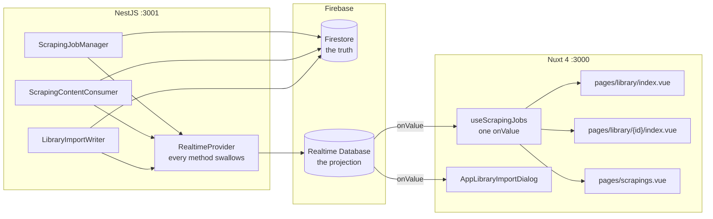
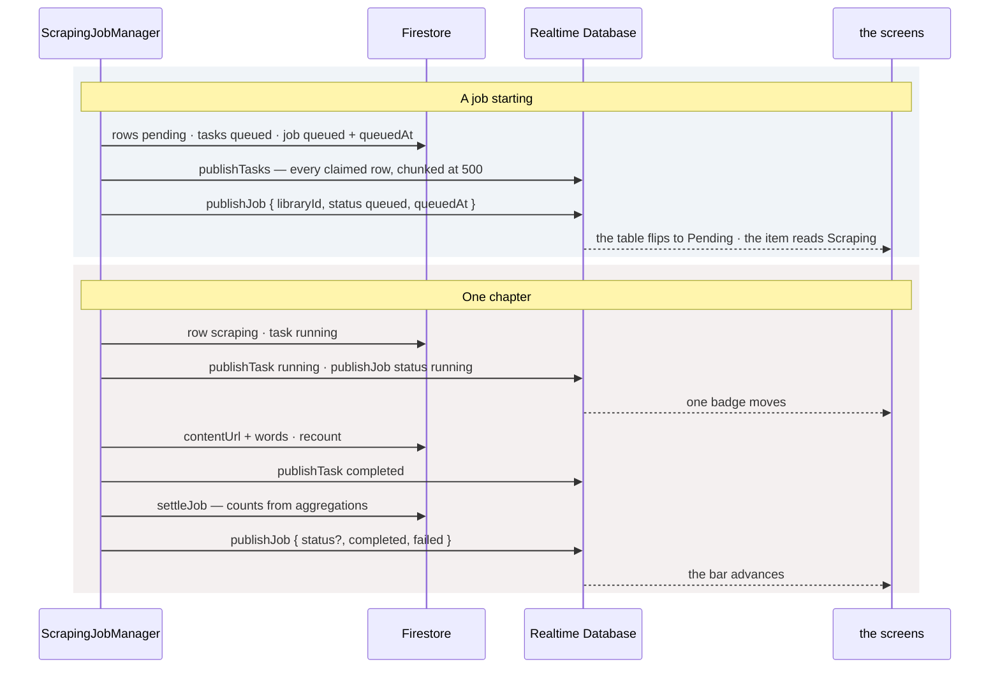
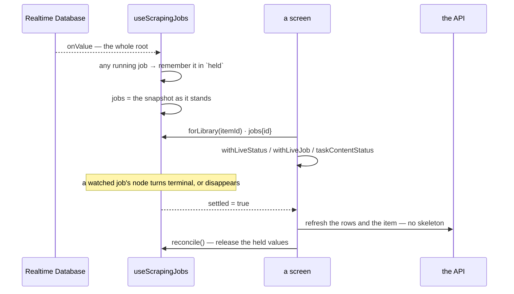

# Notify — Part 1: a realtime channel for scraping status

## Overview

A scraping job over a long novel runs for hours. Everything up to this part was fetch-and-refetch:
the screens learned that work had happened only when somebody pressed something. This part adds
the channel that makes work visible *while* it runs — the Firebase Realtime Database, written by
the API beside the Firestore writes it mirrors, and subscribed to by the browser.

The tree is **derived and disposable**. Firestore holds the truth; `scrapings/runningJobs` is a
projection the screens watch, and `libraryImports/{itemId}` is the same for an import. Losing the
tree loses nothing but the animation. That is the property everything else here rests on:
**nothing in `RealtimeProvider` throws.** A publish is a courtesy to a screen, and a chapter that
has been fetched, stored and completed must not be scraped again because a mirror write failed.
Every method funnels through one `attempt` that logs and swallows, which is why no caller has a
`try`.

The Realtime Database rather than Firestore listeners, for two reasons that both matter. Firestore
bills per document read and write, so the cost of *showing* progress would scale with the number
of people watching it, and a thousand chapter transitions would be a thousand billed writes to
documents the screens are already listening to. And this needs none of the querying Firestore is
better at: it is one small tree, read whole, keyed by id.

## Requirements

- **Two trees, one writer each.** `ScrapingJobManager` and `ScrapingContentConsumer` write
  `scrapings/runningJobs`; `LibraryImportWriter` writes `libraryImports`. The library's own
  managers keep their Firestore writes and publish nothing — a job's progress is the job's to
  publish.
- **Nothing here throws, and nothing here reads except two members.** `runningJobs()` feeds the
  sweep and `runningImport()` answers whether an import is already going; both answer empty on a
  failed read, so a failure skips a tick rather than taking the tick with it.
- **Every write is an `update`, not a `set`.** A transition sends the fields it moved and leaves
  the rest of the node where it is, which is what keeps a chapter completing from costing a read
  of the job it belonged to. Only `id` / `itemId` is required on a snapshot; `stated()` drops
  every undefined field before the write.
- **Every node is stamped.** `updatedAt` in epoch milliseconds on every publish, so a node can be
  recognised as stale.
- **Timestamps are epoch milliseconds here and ISO strings in Firestore.** These are compared and
  never displayed.
- **`core` holds no domain types.** Statuses on the tree are plain strings, and are the caller's
  own enum values verbatim — the same rule `queue.messages.ts` states about a payload.
- **The browser cannot write it.** `database.rules.json` gives both roots
  `".read": "auth != null"` and `".write": false`. The Admin SDK bypasses rules by design, so the
  only correct client rule is no.
- **One burst, then one row at a time.** `publishTasks` chunks at 500 because a novel is a
  thousand rows and claiming them is the single burst in a job; everything after it is
  `publishTask`, one status field. A chunk that fails is logged and the rest still go — a partly
  live table beats none.
- **A node is trusted only while its job has not settled.** After that the API's answer is the
  truer one, which is what makes the minute before the sweep harmless.
- **The last live values are held across the refetch gap.** A job's final act moves its node to
  `completed` before the screen's refetch lands; dropping the overlay at that instant would blink
  every row back to what it was fetched with. `reconcile()` is what releases them, once the stored
  rows are in hand.
- **A booked job's node must not make its item read Scraping.** `scheduled` is deliberately absent
  from the frontend's active set: nothing is being fetched, and the library is untouched until the
  cron publishes it.
- **The import node outlives its run.** There is no import record — nothing lists past imports —
  so the node is the whole of what an import is remembered by, and it survives deliberately so a
  reopened dialog can say what the last one did. Only deleting the item clears it.

## Solution

### Contract Skeleton

No HTTP endpoint is added. The contract is the tree, the provider, and the rules file.

**The tree**

```
scrapings/runningJobs/{jobId}
  libraryId   status   range   refetch
  startAt   queuedAt   total   completed   failed   updatedAt
  tasks/{contentId}
    status   index

libraryImports/{itemId}
  status   total   done   label
  added   overwritten   skipped   translated   error   updatedAt
```

**`ScrapingJobSnapshot`** — one job's live summary. Only `id` is required.

| Field | Type | Notes |
| --- | --- | --- |
| `id` | `string` | The job. Not written into the node; it is the key. |
| `libraryId` | `string?` | Written where the node first appears — what lets a Library screen find the job running over the item it draws. |
| `status` | `string?` | The caller's enum value verbatim. |
| `range` / `refetch` | `string?` / `boolean?` | The ask, for a screen that has no record in hand. |
| `startAt` / `queuedAt` | `number?` | Epoch ms. |
| `total` / `completed` / `failed` | `number?` | **The job's own tasks, never the item's rows.** |

**`ScrapingTaskRow`** — `contentId`, `status`, `index`. `index` saves the screen a lookup to name
the chapter.

**`LibraryImportSnapshot`** — one item's running or last import. Only `itemId` is required:
`status`, `total`, `done`, `label`, `added`, `overwritten`, `skipped`, `translated`, `error`.

**`RealtimeProvider`** — `core/providers/realtime.provider.ts`.

| Member | Writes / reads | Notes |
| --- | --- | --- |
| `publishJob(snapshot)` | `runningJobs/{id}` | One `update`, stamped. |
| `publishTasks(jobId, rows)` | `runningJobs/{id}/tasks` | Multi-path `update`, chunked at `UPDATE_CHUNK = 500`. |
| `publishTask(jobId, contentId, status)` | `…/tasks/{contentId}` | The status alone — `publishTasks` already wrote the `index`, and a transition has no business rewriting it. |
| `runningJobs()` | reads the root | `{ [jobId]: status }`. Empty on failure. |
| `clearJob(jobId)` | removes the node | Called by the sweep, and by a delete. |
| `publishImport(snapshot)` | `libraryImports/{itemId}` | One `update`, stamped. |
| `runningImport(itemId)` | reads the node | What tells an endpoint an import is already running. Null on failure. |
| `clearImport(itemId)` | removes the node | Only `LibraryManager.remove` calls it. |

**`database.rules.json`**

| Path | `.read` | `.write` | `.indexOn` |
| --- | --- | --- | --- |
| `scrapings/runningJobs` | `auth != null` | `false` | `library/id`, `status` |
| `libraryImports` | `auth != null` | `false` | — |

**Configuration** — `FIREBASE_DATABASE_URL` on the backend and
`NUXT_PUBLIC_FIREBASE_DATABASE_URL` on the frontend must name the same namespace: the emulator
takes it from the URL's subdomain, and two ends that disagree each read an empty database, raise
nothing, and leave the screen still. `FIREBASE_EMULATOR_DATABASE_HOST` and
`NUXT_PUBLIC_FIREBASE_EMULATOR_DATABASE_HOST` point both at the emulator on `9000`.

**What `counts()` grows for this.** `ScrapingTaskCounts` gains `halted` — tasks a person put in
`paused` or `stopped` — held apart from `pending` because they are not owed, and apart from a
drain because they are not done. `settleJob` requires `pending === 0 && halted === 0`, without
which a paused job would read as drained the moment its last in-flight chapter landed, and
`completed` would be stamped over the `paused` somebody just asked for.

### Component Diagrams



- **The Firestore write and the mirror write are separate acts, deliberately.** Firestore first,
  every time; the publish after. A mirror that failed leaves a screen a tick behind, which the
  next transition or the settling refetch corrects.
- **One subscription serves three screens.** `useScrapingJobs` subscribes once to
  `scrapings/runningJobs` and disposes on scope teardown; the import dialog has its own
  `onValue` on the one node it cares about.



- **A transition costs no read of the job it belonged to**, because every write is an `update` of
  the fields that moved.
- **`publishJob` on settling carries `status` only when the job actually settled.** `stated()`
  drops it otherwise, so a chapter completing mid-job moves the counters and leaves the status
  where it is.



- **`believed(id)`** answers the node while its job is running, and the last held node afterwards.
  `settled` is true when any *watched* job's node has turned terminal **or gone** — the sweep takes
  a settled job a minute later, and a screen that missed the transition still owes itself a
  refetch.
- **The reload is deliberately not a reset.** The library detail screen calls `reloadLoaded()`,
  which re-fetches the pages already on screen and swaps them in one assignment, rather than
  `refreshContents()`, which would throw a reader who had scrolled through a thousand rows back
  to the first two hundred. It is quiet about its own failure: the rows on screen are a job's
  worth of live updates and are right in every column but `words`.
- **The Scrapings screen watches the *set* of live nodes.** A job started or settled elsewhere
  changes which tab it belongs on, which is a question about the page rather than about the job —
  so `liveIds` asks for the refetch while the overlay keeps the figures moving in between.

## Implementation Steps

- **Step 1 — the database, and the way in.** `_deploy/firebase/firebase.json` publishes the
  Database emulator on `9000`; `_deploy/dockercompose.local.infrastructure.yml` adds `database` to
  `--only` and exposes the port. `_deploy/firebase/database.rules.json` declares both roots
  read-only. `FirebaseAdminService` gains `database`, and `FIREBASE_DATABASE_URL` plus
  `FIREBASE_EMULATOR_DATABASE_HOST` join `configuration.ts`.
  `core/providers/realtime.provider.ts` is the whole of the write surface, registered and exported
  by `CoreModule`.
- **Step 2 — settling a job honestly.** `ScrapingTaskCounts` gains `halted`, and
  `ScrapingJobRepository.counts` the aggregation behind it. `ScrapingJobManager.settleJob`
  recomputes `completed` and `failed`, and stamps a terminal status and `completedAt` only when
  nothing is owed and nothing is halted.
- **Step 3 — publishing the status.** `ScrapingJobManager.publishScrapingTaskMessages` calls
  `publishTasks` and `publishJob`; `halt` publishes the moved tasks and the new job status;
  `settleJob` publishes the counters; `sweep` reads `runningJobs()` and clears every terminal
  node; `remove` clears the node itself rather than waiting for the sweep, because the sweep works
  from the node's own status and the record that explains it is already gone.
  `ScrapingContentConsumer` publishes `running`, `completed` and `failed` per task.
- **Step 4 — the browser's end.** `plugins/firebase.client.ts` gains `getDatabase` and
  `connectDatabaseEmulator`, provided as `$firebaseDatabase`. `types/scraping-status.ts` mirrors
  the tree by hand. `composables/useScrapingJobs.ts` is the single `onValue`, with `jobs`, `held`,
  `believed`, `forLibrary`, `settled` and `reconcile`, disposed through `onScopeDispose`.
- **Step 5 — the screens.** `utils/library.ts` gains `withLiveStatus`, which draws an item as
  **Scraping** from the fact that there is a job at all rather than from a stored field — the
  item's own status is the person's, `draft` or `ready`, and the runner never writes it.
  `utils/scraping-job.ts` gains `withLiveJob` and `taskContentStatus`.
  `pages/library/index.vue` overlays every row and refetches once on `settled`;
  `pages/library/[id]/index.vue` overlays the item and merges each chapter's live status into the
  row itself — returning the same object where the two agree, so a tick that moved one chapter
  leaves every other row identical rather than merely equal — and calls `reloadLoaded()` plus
  `refreshItem()` on `settled`. `pages/scrapings.vue` overlays each card and watches `liveIds`.
- **Step 6 — the import channel.** `RealtimeProvider` gains `publishImport`, `clearImport` and
  `runningImport`; `LibraryImportWriter` publishes `running` with the total, then every tenth body
  and the last, then `completed` with the summary; `LibraryImportManager.run` publishes `failed`
  with the message before rethrowing, so the dialog says why rather than hanging at sixty per
  cent. `types/library-package.ts` mirrors the node, and `AppLibraryImportDialog.vue` subscribes to
  it.

## Appendix

### Known limits

- **The channel is fire-and-forget.** A publish that fails is logged and dropped; nothing retries
  it and nothing reconciles the tree against Firestore. The next transition, or the refetch a
  settled job triggers, is what corrects a screen.
- **No ordering guarantee between the two stores.** Firestore is written first and the mirror
  after, so a screen can briefly show a task as `running` after its completion has been committed —
  or, if a publish is lost, keep showing `running` until the settling reload.
- **The tree deliberately carries less than the record.** No `words`, no per-row `updatedAt`, no
  `skipped`, no `error`. Those arrive with the reload, which is the single point where the screens
  go back to the API's answer.
- **A job's live counters are its own tasks.** A job over chapters 1–20 says nothing about the
  other 1,285, so the *item's* totals move only on that reload.
- **An item with two overlapping jobs takes the first one found** by `forLibrary`.
- **A settled node lingers up to a minute** — by design, so the screen's refetch is not raced —
  and longer if a sweep tick fails, since `runningJobs()` answers empty rather than throwing.
- **A node whose process died mid-job is not cleaned up by anything but the sweep**, and the sweep
  only clears *terminal* nodes. A job left `running` by a killed consumer keeps its node until
  somebody stops it.
- **Everyone sees everything.** Both roots are readable by any signed-in user, with no per-item or
  per-job scoping — which matches the API, where a verified token is full access.
- **`.indexOn` is declared for `library/id`**, a path the current node shape does not use — the
  node carries a flat `libraryId`. It is harmless, and `forLibrary` scans the root client-side
  rather than querying.
- **No presence, no notifications, no toasts from the channel.** This is a progress mirror, not a
  notification system: nothing is delivered to a user who is not looking at the screen.
