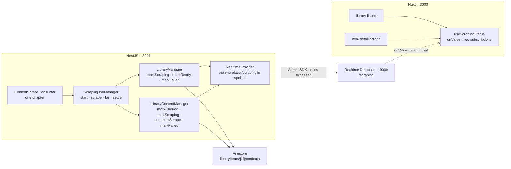

# Notify — Part 1: a realtime channel for scraping status

Source design: `_docs/design/1. Library.dc.html` — the listing's status column and the item detail
screen's novel panel, both of which already draw everything this part makes move. The job this
watches is described in `_docs/plan/[scraping]-part2_download_library_content.md`.

## Goal of design

Part 2 of scraping taught the app **what we hold**. `POST /api/v1/scrapings/job` fans a novel out over
BullMQ, one message per chapter, and a consumer fetches each one, stores its text and completes the
row. A 1,305-chapter novel drains two at a time, so the job runs for hours. It stopped exactly there,
and said so in its own *Out of scope* table:

> | **Live progress on the screen** | No socket, no polling, no stream. The chapter table shows what it last fetched, and a reader who wants to know where a job has got to refreshes or revisits the item. Pushing rows as they complete means a channel, a subscription per screen and a reconnection story, and all three want the job record below to exist first. |

So the two screens that draw a scraping status learn nothing while the work runs. The detail page says
as much in its own comment — *"Nothing follows a job while it runs, so this is the whole of what the
screen learns"* — and `AppLibraryScrapeDialog.vue` agrees: *"Nothing here watches the job — there is
nothing to watch it with."* There is no `setInterval`, no `refreshNuxtData` and no poll anywhere in
`frontend/app`; the **Scraping** badge, the `412 / 1,305 ch.` counter and every chapter row's badge
move only when a user action calls `refreshAll()`.

This part is **the channel**: the backend mirrors the values it already writes to Firestore into
Firebase Realtime Database, the browser subscribes, and the badges and counters move on their own.
Firestore stays the source of truth. The realtime tree is an overlay, and nothing reads it to decide
anything.

It is called *notify* rather than *scraping part 3* because the tree is not about scraping. Scraping
is simply the first thing worth watching, and the second — a render queue, an upload — will hang off
the same plugin, the same composable and the same rules file.

**In scope**

- A Realtime Database emulator in the local infrastructure, and the config path to it from both ends.
- `/scraping/items/{itemId}` — one live summary per library item.
- `/scraping/contents/{itemId}/{contentId}` — one node per queued chapter, written at job start and
  removed when the job drains.
- `RealtimeProvider`, the one place a path under `/scraping` is spelled.
- Publishing at the seven status transitions the library managers already make.
- `database.rules.json` — read for a signed-in user, write for nobody.
- `useScrapingStatus()`, two subscriptions, and the overlay in the listing and the detail screen.
- Settling an item that today never leaves `scraping` — see *Decisions taken*.

**Out of scope — deliberately**

| Deferred | Why |
| --- | --- |
| Notifications | Despite the name. This part builds the channel; a toast when a job finishes, a bell in the header, a browser push are each a decision about interruption, and none of them is worth making before there is something to interrupt with. |
| A job record, and the `Scrapings` screen | Still deferred, and still for part 2's reason. The tree here describes an **item**, not a job — so two overlapping jobs on one item are one running item, which is what the screen would have drawn anyway. Cancel, pause and an **ETA** all want `scrapingJobs` first. |
| **Retry failed** | Unchanged. It needs the ids of failed rows that may sit past the loaded pages, which is the cursor part 1 deferred. The button keeps its `SCRAPING_DEFERRED` tooltip. |
| A progress bar | The badge and the `412 / 1,305 ch.` counter are what the design draws, and they carry the same information. There is no `UProgress` anywhere in the app; adding one is a design change, not a consequence of having live numbers. |
| Writing from the browser | The client's rules are read-only. Every value here is derived from a Firestore write the backend has already made, so a client that could write could only lie. |
| Reconciling a stale node | Nothing sweeps a summary left saying `scraping` by a backend that died mid-job. Firestore has the same gap today, and both want a heartbeat on a job record. |
| Image and video sets | As everywhere else in this path: only a novel crawler exists. The tree is type-free and would carry a set unchanged. |

### Decisions taken

| Question | Decision |
| --- | --- |
| Realtime Database, or Firestore listeners? | **Realtime Database**, and [Firebase's own comparison](https://firebase.google.com/docs/database/rtdb-vs-firestore) is the argument. **Billing is the decisive one:** Firestore charges per read, write and delete; the Realtime Database charges for bandwidth and storage and nothing per operation. A 1,305-chapter job is thousands of tiny updates, and on Firestore each is a billable write *and* a billable read in every tab watching it — the cost of showing progress would scale with the number of people looking, which is the wrong direction for a counter. **Latency runs the same way:** Firestore quotes typical responses no greater than 30 ms, the Realtime Database no greater than 10 ms, and *frequent state-syncing* is the workload it names for itself. **And what Firestore is better at, this does not use:** indexed queries with compound sorting and filtering. The client reads one key by id. |
| What that choice gives up | The Realtime Database offers deep queries with limited sorting and filtering — one property or the other, not both — and is documented as suited to simple data models with limited scalability. All three are free here. The tree is keyed by item id and read by key; nothing sorts it, nothing filters it, and it holds six fields per item rather than a library. The querying the listing genuinely needs — type, status, source and search, together — stays on Firestore, which is where it belongs. |
| Presence, and why it matters later | Presence is **native to the Realtime Database and absent from Firestore**, which can only obtain it by syncing *from* the Realtime Database through Cloud Functions. Nothing here uses it yet, but `onDisconnect` is the mechanism that will eventually settle a summary a dead backend abandoned — so the stale-node problem in *Known limits* has a fix on this store and would have had none on the other. |
| Where the tree is rooted | **`/scraping`, split into `items` and `contents`.** Split rather than nested, so the listing can subscribe to every item's summary without also downloading a thousand chapter nodes per item. One listener serves the whole listing. |
| What the summary carries | `status`, `total`, `completed`, `failed`, `pending`, `updatedAt`. Exactly what the two screens draw, and nothing that would have to be kept in step with a DTO. No titles, no URLs, no word counts — those come from the API on the refetch that follows the job. |
| `pending`, stored or derived? | **Stored.** It is written in the same `update()` as the other four, so they cannot disagree; derived on the client, it would be right only as long as the other three arrived together. It means *queued or in flight* — what is still owed. |
| What a chapter node carries | `status` and `index`. Enough for the table to flip a badge and for a person reading the Emulator UI to know which chapter it is. |
| How the client trusts it | **Only while `status` is `scraping`.** Any other status is ignored in favour of the API's answer. This is what makes a stale node harmless by construction: nothing has to be swept, and a chapter edited by hand outside a job cannot leave the screen showing a count nobody recomputed. |
| Node lifetime | The **summary persists** — it is six fields, the next job overwrites it, and deleting it on settle would race the client's own transition watcher, which is what tells the screen to refetch. The **contents subtree is removed** when the job drains, so no long-term mirror of the `contents` subcollection accumulates. Both go when the item is deleted. |
| Who publishes | **The library managers**, beside the Firestore write that already exists. The statuses are theirs; `ScrapingJobManager` moves rows and should not learn a second store to do it. |
| What a failed publish does | **Nothing.** Every method on `RealtimeProvider` swallows and logs. A realtime write is a courtesy to a screen; a chapter that has been fetched, stored and completed must not be re-fetched because a mirror write failed. |
| Item stuck in `scraping` | **Fixed here.** Two existing faults make the badge spin forever, and both are invisible until it is live. `LibraryItemStatus.Failed` is declared but written by no code, so a novel with one dead chapter never settles; and drain is tested with `completed === total`, which a job over a range — chapters 1–20 of 1,305 — never satisfies. |
| What drain actually means | **`pending === 0`** — nothing of this item is queued or in flight. Not `completed === total`, which asks whether the whole novel is downloaded, which is a different question and the wrong one. |
| Where the emulator lives | Port **9000**, in the same container as the other three, under the same `--only` list. Namespace `demo-media-studio`, named identically from both ends — the emulator takes its namespace from the `databaseURL`'s subdomain, and two ends that disagree read two empty databases and simply stay still. |

---

## Contracts

### The tree

```
/scraping/items/{itemId}
    status      "draft" | "scraping" | "ready" | "failed"    the item's own LibraryItemStatus
    total       1305        every row of the item
    completed   412         rows whose status is `completed`
    failed      3           rows whose status is `failed`
    pending     890         rows `pending` or `scraping` — what is still owed
    updatedAt   1765...     epoch ms, so a node can be read as stale

/scraping/contents/{itemId}/{contentId}
    status      "pending" | "scraping" | "completed" | "failed"
    index       413         the chapter number, so a node reads without a lookup
```

`updatedAt` is epoch milliseconds rather than the ISO string the entities carry: it is compared and
never displayed, and JSON numbers sort in the Emulator UI the way an operator expects.

### `core/providers/realtime.provider.ts`

The one place a path under `/scraping` is spelled, beside `CacheProvider` and `ContentFileProvider`,
which likewise own their own shelf.

```ts
/**
 * One item's live summary. `pending` is stored rather than derived: the five are written in one
 * `update`, so they cannot disagree — derived on the client, it would be right only for as long as
 * the others arrived together.
 */
export interface ScrapingStatusSnapshot {
  status: LibraryItemStatus;
  total: number;
  completed: number;
  failed: number;
  pending: number;
}

/** One queued row, as the chapter table reads it. */
export interface ScrapingContentSnapshot {
  status: LibraryContentStatus;
  index: number;
}
```

| Method | What it does |
| --- | --- |
| `publishItem(itemId, snapshot)` | One `update` on `/scraping/items/{itemId}`, stamping `updatedAt`. |
| `publishQueued(itemId, rows)` | The whole claimed set in one multi-path `update`, chunked at 500 — the batch size `LibraryContentRepository` already writes in. |
| `publishContent(itemId, contentId, snapshot)` | One `update` on the one node. |
| `clearContents(itemId)` | `remove` on `/scraping/contents/{itemId}`. What settling does. |
| `clear(itemId)` | Both subtrees. What a deleted item does. |

Every one returns `Promise<void>` and never rejects: a caught failure is logged at `warn` and
swallowed. That rule is the whole of this class's error handling, and it is why no caller has a
`try`.

### `database.rules.json`

```json
{
  "rules": {
    "scraping": {
      ".read": "auth != null",
      ".write": false
    }
  }
}
```

The Admin SDK bypasses rules, so `false` closes the tree to everything else. A signed-in reader gets
the whole of `/scraping`, which is derived data about items they can already list.

### What `counts()` grows

`LibraryContentRepository.counts()` answers `{ total, completed, bytes }` today. It gains two more
aggregations in the same `Promise.all`, and `LibraryContentCounts` grows to match:

| Field | Query |
| --- | --- |
| `failed` | `where('status', '==', Failed).count()` |
| `pending` | `where('status', 'in', [Pending, Scraping]).count()` |

Aggregations cost the same for twelve chapters as for twelve hundred, which is the bargain this
method already struck.

---

## Shape of the system



### The flow — a job starting

```
start({ libraryId, range, … })
  …  select the candidate rows                          unchanged from part 2
  1  contents.markQueued(itemId, ids)                   Firestore: the rows go `pending`
  2  realtime.publishQueued(itemId, rows)               one multi-path update, chunked at 500
  3  realtime.publishItem(itemId, recount())            total · completed · failed · pending
  4  library.markScraping(itemId)                       Firestore: the item goes `scraping`
  5  realtime.publishItem(itemId, { status: scraping })
```

Steps 2 and 3 sit inside `markQueued`, and step 5 inside `markScraping` — the publish goes beside the
write it mirrors, so there is no call site that can write one and forget the other.

### The flow — one chapter

```
scrape({ itemId, contentId, … })
  …  fetch and store the text                           unchanged from part 2
  1  contents.markScraping(…)     -> publishContent(…, scraping)
  2  contents.completeScrape(…)   -> publishContent(…, completed) + publishItem(…) from its recount
  3  counts.pending === 0         -> settle(itemId, counts)

fail({ itemId, contentId })
  1  contents.markFailed(…)       -> publishContent(…, failed) + publishItem(…) from a new recount
  2  counts.pending === 0         -> settle(itemId, counts)
```

`markFailed` does not recount today; it must, or the summary is wrong and drain is undetectable on
the path where the last chapter is the one that fails.

```ts
/**
 * The queue has drained when nothing of this item is queued or in flight. A failed row settles the
 * item as failed, a clean drain returns it to ready, and either way the per-chapter subtree goes —
 * it described work that is over.
 */
private async settle(itemId: string, counts: LibraryContentCounts): Promise<void>
```

`pending === 0` rather than `completed === total`: the second asks whether the whole novel is
downloaded, which a job over chapters 1–20 never makes true, so the item wore **Scraping** forever.

### The flow — what the screen does

```
useScrapingStatus
  1  onValue('/scraping/items')                         the listing: one listener, every item
  2  onValue('/scraping/items/{id}')                    the detail screen: its own summary
  3  onValue('/scraping/contents/{id}')                 and its chapters, while a job runs
  4  onScopeDispose -> off()                            every subscription detached with its screen
```

```
the overlay
  1  node exists and node.status === 'scraping'         otherwise the API's answer stands
  2  item.status          <- node.status
  3  discoveredCount      <- node.total
  4  downloadedCount      <- node.completed
  5  chapter row .status  <- contents[row.id].status
  6  status leaves 'scraping' -> refreshAll() once
```

Step 6 is the one place the screen returns to the API's truth, and it is also how `words` and
`contentUrl` arrive — the two things a completed chapter gains that the realtime node deliberately
does not carry.

---

## Step 1 — The database, and the way in

Everything needed to write a node, and nothing that writes one. At the end of this step the Emulator
UI lists **Realtime Database** beside the other three, the backend logs it at boot, and
`RealtimeProvider` is injectable and unused.

**The infrastructure**

| File | What changes |
| --- | --- |
| `_deploy/firebase/database.rules.json` | **New.** The rules above. |
| `_deploy/firebase/firebase.json` | `"database": { "rules": "database.rules.json" }` at the top level, beside `firestore` and `storage`; a `database` emulator block on `0.0.0.0:9000`. |
| `_deploy/firebase/Dockerfile` | `firebase setup:emulators:database` joins the jar pre-pull line, `database.rules.json` joins the `COPY … /config/`, and `9000` joins `EXPOSE`. |
| `_deploy/dockercompose.local.infrastructure.yml` | `--only auth,firestore,storage,database`; `127.0.0.1:9000:9000` published with the comment its neighbours carry; a fourth `curl` in the healthcheck. |

The config files are baked into the image rather than bind-mounted — Docker Desktop's Windows file
sharing serves them unreliably, as the Dockerfile's own comment records — so `pnpm dev:infrastructure`
must rebuild. It already passes `--build`.

**The backend's end**

| File | What changes |
| --- | --- |
| `backend/src/core/config/configuration.ts` | `FirebaseConfig` gains `databaseUrl`; `FirebaseEmulatorConfig` gains `databaseHost`. Read from `FIREBASE_DATABASE_URL` and `FIREBASE_EMULATOR_DATABASE_HOST` — named for the service, not for the variable the SDK reads, which is the rule the comment above `emulators` already states. |
| `backend/src/core/firebase/firebase-admin.service.ts` | `process.env.FIREBASE_DATABASE_EMULATOR_HOST` set beside the other three; `databaseURL` passed to `initializeApp`; a `get database(): Database` accessor over `getDatabase(this.app)`; `credential()`'s emulator branch extended to require the fourth host; the matching log line. |
| `backend/.env.example`, `backend/.env` | `FIREBASE_DATABASE_URL=https://demo-media-studio.firebaseio.com` and `FIREBASE_EMULATOR_DATABASE_HOST=127.0.0.1:9000`, bare `host:port` as the other three are, under the existing `# ── Emulators ──` banner. |
| `backend/src/core/providers/realtime.provider.ts` | **New.** The class above. |
| `backend/src/core/core.module.ts` | `RealtimeProvider` joins `providers` and `exports`. |

The namespace is load-bearing. The emulator reads it from the `databaseURL`'s subdomain, so
`demo-media-studio` must be spelled identically here and in the frontend's own URL. Two
ends that disagree each get their own empty database, no error is raised anywhere, and the screen
simply never moves — which is the hardest possible way to find this out.

## Step 2 — Settling a job

No realtime writes yet: this is the correctness half, and it stands on its own. At the end of this
step a job over a range returns its item to **Ready**, and a novel with a dead chapter settles to
**Failed** instead of wearing **Scraping** for good.

| File | What changes |
| --- | --- |
| `backend/src/library/library-content.repository.ts` | `counts()` gains the `failed` and `pending` aggregations; `LibraryContentCounts` grows the two fields. |
| `backend/src/library/library.manager.ts` | `markFailed(id)` — **new**, mirroring `markReady`'s guard: only an item currently `scraping` moves, so a draft is not something a finished job demotes. |
| `backend/src/library/library-content.manager.ts` | `markFailed` recounts and returns `LibraryContentCounts`, as `completeScrape` already does. |
| `backend/src/scraping/scraping-job.manager.ts` | `settle()` replaces the drain check at the end of `scrape()`, and `fail()` calls it too. |

`LibraryItemStatus.Failed` has been declared since part 1 of the library and written by nothing. This
is the step that finally writes it.

## Step 3 — Publishing the status

The mirror. At the end of this step every transition writes its node, and the Emulator UI's Realtime
Database tab fills in as a job runs — with nothing in the browser yet reading it.

| File | Method | What it publishes |
| --- | --- | --- |
| `library/library.manager.ts` | `markScraping` | the summary, `status: scraping` |
| | `markReady` | the summary, `status: ready` |
| | `markFailed` | the summary, `status: failed` |
| | `remove` | `realtime.clear(id)` — both subtrees, beside the `removeAll` it already calls, because nothing cascades in either store |
| `library/library-content.manager.ts` | `markQueued` | `publishQueued` for the claimed rows, then the summary |
| | `markScraping` | `publishContent(…, scraping)` |
| | `completeScrape` | `publishContent(…, completed)`, then the summary from the `recount()` it already runs |
| | `markFailed` | `publishContent(…, failed)`, then the summary from step 2's new recount |
| `scraping/scraping-job.manager.ts` | `settle` | `realtime.clearContents(itemId)` |

`recount()` already answers with the counts and is already handed the `LibraryItem`, so it is where
the snapshot is assembled — the item's status and the four numbers, in one place, from one read.

Ordinary content edits — create, replace, remove — deliberately do **not** publish. They call
`recount()` too, but nothing reads a node whose status is not `scraping`, so a publish there would be
noise with no reader.

## Step 4 — The browser's end

The subscription, against a tree that is already filling. At the end of this step the values are in
the browser and nothing draws them yet.

| File | What changes |
| --- | --- |
| `frontend/nuxt.config.ts` | `runtimeConfig.public.firebase` gains `databaseUrl` and `emulatorDatabaseHost`, both `''`, commented as their neighbours are. |
| `frontend/.env.example`, `frontend/.env` | `NUXT_PUBLIC_FIREBASE_DATABASE_URL=http://127.0.0.1:9000/?ns=demo-media-studio` and `NUXT_PUBLIC_FIREBASE_EMULATOR_DATABASE_HOST=http://127.0.0.1:9000`. Schemes included, as the frontend's other two hosts carry them. |
| `frontend/app/plugins/firebase.client.ts` | `getDatabase(app)`, `connectDatabaseEmulator(db, hostname, Number(port))`, and `firebaseDatabase` in `provide`. It belongs here for the reason the plugin's own docblock gives: the emulator must be connected before anything touches the service. |
| `frontend/app/types/scraping-status.ts` | **New.** `ScrapingItemStatus` and `ScrapingContentStatus`, mirrored by hand from the provider's shapes — the arrangement `types/library.ts` already has with the DTOs. |
| `frontend/app/composables/useScrapingStatus.ts` | **New.** |

```ts
/** Every item's live summary, keyed by id — one listener for the whole listing. */
export function useScrapingStatuses(): { statuses: Ref<Record<string, ScrapingItemStatus>> }

/** One item: its summary, and its chapters while a job is running. */
export function useItemScrapingStatus(itemId: Ref<string>): {
  status: Ref<ScrapingItemStatus | null>
  contents: Ref<Record<string, ScrapingContentStatus>>
  running: Ref<boolean>
}
```

`running` is `status?.status === 'scraping'` and is the only gate the two screens consult — the
overlay rule, spelled once, so neither page restates it.

Subscriptions are opened with `onValue` and detached in `onScopeDispose`. `useItemScrapingStatus`
re-subscribes when `itemId` changes, which is what a client-side navigation between two items is.

## Step 5 — The two screens

The overlay. At the end of this step nothing is refreshed by hand and both screens move.

| File | What changes |
| --- | --- |
| `frontend/app/pages/library/index.vue` | `items` becomes a computed overlaying each row's live summary: `status`, `metadata.discoveredCount` from `total`, `metadata.downloadedCount` from `completed`. A `watch` calls `refresh()` when a watched item leaves `scraping`. |
| `frontend/app/pages/library/[id]/index.vue` | The same overlay on `item`, and `contents` merged into the `chapters` computed. A `watch` on `running` calls `refreshAll()` once when it goes false. |

Neither `statusTag()` nor `contentLabel()` nor `contentStatusTag()` changes, and neither does
`AppLibraryTable.vue`, `AppLibraryGrid.vue`, `AppLibraryNovelPanel.vue` or
`AppLibraryChapterTable.vue`. They read whatever the row now carries, which is the point of merging
into the row rather than passing a second prop down four components.

The listing's **page membership** is not recomputed. An item filtered to `Ready` that starts scraping
keeps its place until the next fetch: the query is the server's answer, and re-running it on every
tick would fight the pager and the debounced search. The settle-triggered `refresh()` corrects it
within one job.

**Retry failed (n)** keeps its `SCRAPING_DEFERRED` tooltip. Nothing here changes what it needs.

## Step 6 — Verification

**The specs**

| Spec | What it covers |
| --- | --- |
| `backend/src/core/providers/realtime.provider.spec.ts` — new | The path each method writes, the 500-chunking in `publishQueued`, `updatedAt` stamped on every summary, and — the one that matters — that a rejected write resolves rather than throws. |
| `backend/src/library/library-content.manager.spec.ts` | The repository double answers the two new count fields; a `RealtimeProvider` double asserts `markQueued`, `markScraping`, `completeScrape` and `markFailed` each publish what they wrote. `markFailed` now recounts. |
| `backend/src/library/library.manager.spec.ts` | `markFailed`'s guard — a `draft` item does not move — and that all three item transitions publish. |
| `backend/src/scraping/scraping-job.manager.spec.ts` | Drain keys off `pending === 0`: a range job settles with `completed < total`; a job whose last chapter fails settles the item to `failed` from `fail()`; either way `clearContents` is called once. |

**Running it locally**

```bash
pnpm dev:infrastructure     # rebuilds the image — Realtime Database :9000 joins the other three
pnpm seed:firebase
pnpm lint && pnpm typecheck
pnpm --filter @media-studio/backend run test -- realtime.provider
pnpm --filter @media-studio/backend run test -- scraping-job.manager
pnpm dev
```

*After step 1* — the Emulator UI at `localhost:4000` lists **Realtime Database**, and the backend logs
a database line at boot beside the auth, Firestore and Storage ones. A namespace typo shows up here
and nowhere else, so read the URL in that log line rather than trusting the `.env`.

*After step 2* — sign in as `admin@datntdev.com` / `StrongPassword123!`, open a crawler novel
(`novel543`, `https://www.novel543.com/0413553971`) and press **Discover new chapters** if it has
none. Then:

1. Scrape a small range — `1-20`. When it drains, the item is **Ready**. Before this step it stayed
   **Scraping**, because `completed` was 20 and `total` was 1,305.
2. Point one row's `sourceUrl` at a dead URL and scrape it with *Do not retry*. The row goes
   **Failed**, and when the queue drains the item settles to **Failed** rather than spinning.

*After step 3* — repeat the `1-20` job with the Emulator UI's Realtime Database tab open:

3. `/scraping/items/{itemId}` appears with `status: "scraping"`, and `/scraping/contents/{itemId}`
   fills with 20 nodes as `markQueued` runs.
4. `completed` climbs and `pending` falls, two at a time, and the individual chapter nodes go
   `pending` → `scraping` → `completed`.
5. When the last one lands, `status` is `"ready"` and `/scraping/contents/{itemId}` is **gone**.
6. Delete a scraped item. Both its subtrees go with it.

*After step 5* — the whole point, and the one test that cannot be automated here:

7. Open the detail page in one tab and `/library` in another. Start a `1-20` job from **Scrape
   content…**. **Then touch neither tab.** The listing row's badge turns **Scraping** and its counter
   climbs; the detail panel's counter climbs with it; chapter rows go **Pending** → **Scraping** →
   **Completed** as the queue drains.
8. When it finishes, both badges settle — and the detail page's **Words** column fills in, which is
   the `refreshAll()` on the transition, not the realtime node.
9. Stop the backend mid-job, then reload. The screen shows `scraping` and nothing moves, which is the
   stale-node limit below behaving as described rather than a failure.
10. Signed out, reading `/scraping` from the browser console is refused by the rules.

Each step is one commit, and each leaves `pnpm lint`, `pnpm typecheck` and `pnpm build` green.

---

## Known limits

**A summary node outlives its job.** Six fields per item that has ever been scraped, kept forever and
overwritten by the next job. Nothing reads a node whose status is not `scraping`, so this costs
storage rather than correctness. Deleting it on settle would race the client's transition watcher,
which is the thing that tells the screen to refetch — so the node has to outlive the job by at least
one round trip, and "at least one round trip" is not a lifetime anything can express here.

**Nothing reconciles a node with Firestore.** A backend that dies mid-job leaves the summary saying
`scraping`, and the screen believes it until a new job overwrites it. Firestore has exactly the same
gap — the item's own `status` is left at `scraping` too — so the mirror is no worse than what it
mirrors.

The fix is cheaper on this store than it would have been on the other, and it is worth naming now
even though it is not built here. Presence is native to the Realtime Database: the backend holds a
connection, so it can register an `onDisconnect` against each item it is scraping and let the server
stamp the summary the moment that connection drops — no heartbeat to poll and no sweeper to run.
Firestore has no equivalent, and the workaround Firebase documents for it is *to sync from the
Realtime Database through Cloud Functions*, which is this store with two more moving parts. What
`onDisconnect` cannot do is repair Firestore's own copy of the status, so a `scrapingJobs` record is
still the complete answer and still belongs to the deferred **Scrapings** part.

**The tree describes an item, not a job.** Two overlapping jobs on one item are indistinguishable:
the second `publishQueued` simply joins its rows to the first's subtree, and the first to drain clears
both. The screen would have drawn one running item either way, so nothing visible is wrong — but
`clearContents` firing while the other job is still publishing means that job's remaining rows stop
updating live until it settles. Job identity is the fix and it is deferred.

**The listing's page membership does not follow a status change.** An item filtered to `Ready` that
starts scraping keeps its place, with a live **Scraping** badge, until the next fetch. Re-running the
query on every tick would fight the pager and the debounced search.

**Three realtime writes per chapter, unthrottled.** Comfortable at `SCRAPE_CONCURRENCY = 2`, and the
per-chapter nodes are cheap because each has exactly one reader. The summary does not: it is the node
every open listing tab is watching, so a future runner at higher concurrency wants it throttled — the
counts it carries are worth having once a second, not once per chapter.

**`publishQueued` writes the whole claimed set at once.** 1,305 nodes in three chunked updates at job
start, which is one burst against a database that has done nothing until then. It has not been
measured against a novel that size.

**The client cannot tell "no job" from "no channel".** An absent node and a database the browser never
reached look identical: both leave the screen showing the API's answer, which is correct but static.
A misconfigured namespace therefore degrades to exactly the behaviour this part replaced, silently.
The boot log is the only place it shows.

**Every completed chapter still recounts the item**, now with five aggregations rather than three. The
same bargain part 2 recorded — correct and drift-free, small beside the scrape itself — and the same
cheap version is still out of reach for the same reason: recounting once when the queue drains means
knowing the queue has drained, and `pending` is exactly the count that tells you.
