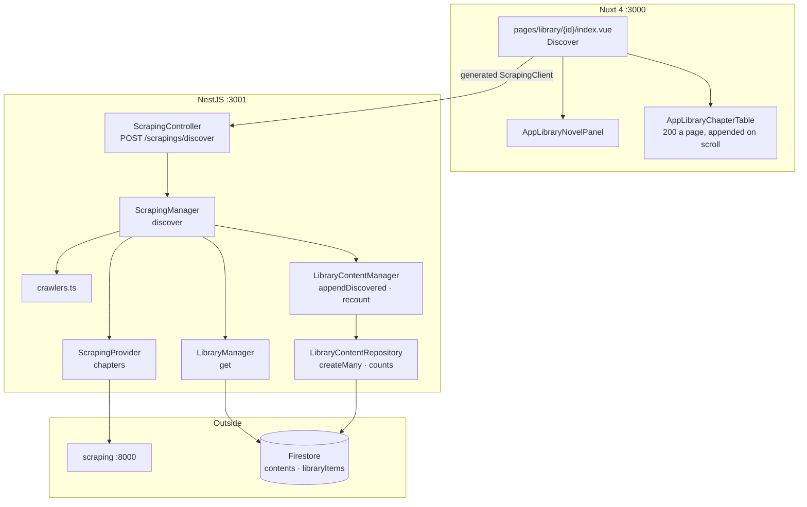
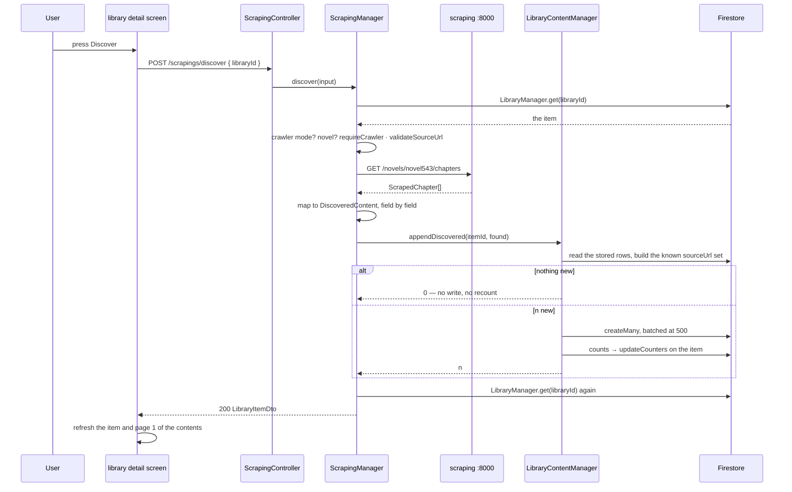

# Scraping — Part 1: discovering the content a source holds

## Overview

Part 3 of the library read a source *before* an item existed, to fill a create wizard. This part
reads the source of an item that already exists, and writes down what it turns out to hold: one
placeholder row per chapter the source lists and our store does not have.

`POST /api/v1/scrapings/discover` takes one field — which item — because everything else is
already on the item: the crawler is its `sourceName`, the URL is its `sourceUrl`, and the type is
its `type`. It reads the chapter list **live** rather than from `validate`'s cache: a stale
chapter list is exactly the thing this endpoint exists to notice.

Matching is on `sourceUrl` — the source's own key, and the only field that survives a retitling
or a chapter inserted above. So the operation is idempotent: a client that gives up on a long
novel can simply call again, and the second call appends exactly what the first missed.

## Requirements

- **One field in, the whole item out.** `DiscoverDto` carries `libraryId` and nothing else. The
  answer is a `LibraryItemDto`, re-read from Firestore after the write, so the counters agree
  with the store rather than with an in-memory patch.
- **A manual item is refused.** It has no source to read; its content is added by hand.
- **A crawler item that is not a novel is a `501`.** A chapter is the only row discovery can
  build — an asset would need a filename and a size, and discovery reports neither.
- **The crawler and the host are checked before a fetch is spent**, as in library part 3:
  `requireCrawler(item.sourceName)` then `validateSourceUrl(crawler, item.sourceUrl)`.
- **A discovered row is a placeholder, and says so.** `LibraryContentStatus.Discovered` is its
  own state: what the source turned out to hold and nothing more. It is not `Pending`, which
  means queued or added by hand, and not `Completed`, which means the bytes are stored.
- **Matching is on `sourceUrl`, not on title or index.** Titles change and chapters get inserted;
  the address does not.
- **Nothing new writes nothing.** A second run over an unchanged source costs one read and
  recounts nothing.
- **A discovered chapter's language comes off the item.** The wizard set `metadata.language` from
  the crawler at creation, so discovery needs none of its own.
- **The upstream shape does not travel field-for-field.** `ScrapingManager.discover` maps
  `ScrapedChapter` onto `DiscoveredContent` explicitly, so a field the service adds cannot
  arrive in our store without anyone deciding it should.
- **The counters are recomputed, not incremented.** `appendDiscovered` ends in
  `LibraryContentManager.recount`, which is the same five aggregations every other content
  change uses.
- **A long chapter list is drawn lazily.** The detail screen pages content at 200 rows and
  appends on scroll, so a novel of 1,305 chapters does not arrive as one response.

## Solution

### Contract Skeleton

| Method | Path | Answers | Refuses |
| --- | --- | --- | --- |
| `POST` | `/api/v1/scrapings/discover` | `200 LibraryItemDto` — read, compared, appended; the counters as they now stand | `400` a manual item, or a `sourceUrl` not on the crawler's own site · `401` · `404` no item, no crawler under its `sourceName`, or no book at its URL · `501` a crawler item that is not a novel · `502` the source or the browser failed · `503` the service did not answer in time |

It writes rows, but none of them is a resource the caller addresses — so `200` rather than `201`,
and the item is what comes back.

**`DiscoverDto`**

| Field | Type | Rules |
| --- | --- | --- |
| `libraryId` | `string` | `1–128`. The crawler item to read the source of. |

**`LibraryContentStatus`** — `library/entities/library-content.entity.ts`. The five states, and
who owns each.

| State | Means | Set by |
| --- | --- | --- |
| `discovered` | The source has it; we hold nothing. | discovery |
| `pending` | Queued, or a placeholder added by hand. | a client (derived from a null `contentUrl`), and the job runner |
| `scraping` | A fetch is in flight. | the job runner |
| `completed` | The bytes are stored. | a client (derived from a `contentUrl`), and the job runner |
| `failed` | The attempts are spent. | the job runner |

**The discovered row** — `LibraryContentDraft`, built by `chapterDraft(item, content)`:

| Field | Value |
| --- | --- |
| `type` | The item's — `novel`. |
| `index` | The source's numbering, verbatim. |
| `title` | The source's title, verbatim. |
| `language` | `item.metadata.language`. |
| `words` | `0` |
| `sourceUrl` | The chapter's own URL, as the source listed it. |
| `contentUrl` | `null` |
| `status` | `discovered` |

**`DiscoveredContent`** — the manager-to-manager shape: `index`, `title`, `sourceUrl`.
`LibraryContentManager.appendDiscovered(itemId, found)` answers with how many landed.

**Upstream** — `GET {SCRAPING_BASE_URL}/novels/{crawler}/chapters?sourceUrl=…`, already declared
by `scraping.provider.ts` as `ScrapedChapter { index, title, url }`.

### Component Diagrams

- **`ScrapingModule` imports `LibraryModule`, which does not import it.** The library exports
  `LibraryManager` and `LibraryContentManager` precisely so the parts after it can read and write
  items without going through HTTP — and that direction is what keeps the two free of a cycle.
  Neither scraping manager is exported: nothing outside that module calls them.
- **`ScrapingProvider` knows nothing about a novel.** The mapping from what the source says to
  what the library stores belongs to the manager above it, which knows which crawler was used.

- **Why the item is re-read.** `recount()` writes the counters straight to Firestore, so
  answering with a patched copy of the item read at the top would answer with numbers that
  disagree with the store one line later.
- **The screen counts the difference itself.** `onDiscover` remembers `discoveredCount` before the
  call and subtracts, so the toast can say "Found 37 new chapters" or "No new chapters" — the
  endpoint answers with the item, not with a delta.
- **Lazy loading.** `fetchPage(1)` replaces what is drawn; every page after appends. `ticket` is
  bumped per request so a search two letters ago cannot land after this one, and `more` is simply
  `rows.length < total`. The reader's own navigator does the same thing against its own fetch —
  the detail screen's list is whatever the search box there narrowed it to, and a navigator has
  to be the whole novel.

## Implementation Steps

- **Step 1 — the contract skeleton.** `scraping/dto/discover.dto.ts`. The `POST discover` route on
  `ScrapingController`, with every refusal declared. `LibraryContentStatus` gains `Discovered`,
  and `types/library-content.ts` plus the `CONTENT_STATUS_TAGS` map in
  `utils/library-content.ts` gain the matching badge.
- **Step 2 — the manager work.** `ScrapingManager.discover`: read the item through
  `LibraryManager.get`, refuse a manual item and a non-novel, check the crawler and the host,
  fetch the chapter list, map it, append, log what the source held against what was new, re-read.
  `LibraryContentManager.appendDiscovered`: refuse a non-novel with a `501`, read the stored rows,
  build a `Set` of known `sourceUrl`s, filter, return early on nothing new, `createMany`,
  `recount`. `LibraryContentRepository.createMany` batches at 500 and answers with the ids it
  allocated, in order.
- **Step 3 — the screen.** `AppLibraryNovelPanel.vue` gains the **Discover** control, disabled for
  a manual item and held while a call is in flight. `pages/library/[id]/index.vue` gains
  `onDiscover`, which refreshes both halves — the rows changed, and so did the item's counters —
  and prints the difference or the API's own sentence through `apiMessage`.
- **Step 4 — lazy-loading the chapter list.** The detail screen's content fetch becomes a manual
  paged loader at `PAGE_SIZE = 200`: `rows`, `total`, `loaded`, `loading`, `loadingMore`,
  `contentError`, `more`, `fetchPage`, `refreshContents`, `loadMore`, with the search debounced at
  300 ms and the language, the item id and the search all resetting to page one. The chapter table
  and the asset grid call `loadMore` when the reader reaches the end.

## Appendix

### Known limits

- **Novels only.** A crawler item of any other type is a `501` at this endpoint, as it is at
  `validate`.
- **Discovery only appends.** A chapter the source has removed, retitled or renumbered is left
  exactly as it was: nothing is updated and nothing is deleted. Only the `sourceUrl` set decides
  what is new.
- **A source that changes a chapter's URL appends a duplicate.** The old row stays, and the new
  one is added beside it under the same `index`.
- **The whole chapter list arrives in one upstream call.** There is no incremental read, so a
  1,305-chapter novel is a 1,305-entry response and a browser fetch that can take a minute. The
  operation is idempotent to make giving up survivable, not to make it fast.
- **No progress.** The request is held open with nothing to watch; the button says
  **Discovering…** and means it. Jobs get a live channel in the notify part; discovery does not.
- **Two discoveries at once are not serialised.** Both read the same stored set and both append —
  nothing locks the item, so overlapping calls can double-write the same chapters.
- **`words` is 0 and `contentUrl` is null on every discovered row.** They stay that way until a
  scraping job fetches the text, which is scraping part 2.
- **The item's own status is untouched.** Discovery does not set `Scraping` — that reading is
  derived on the frontend from a running job, not from a stored field.
