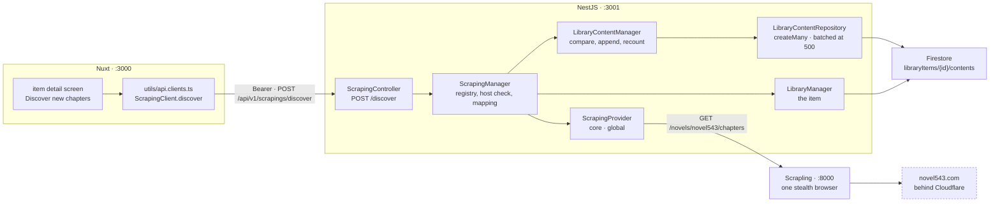

# Scraping — Part 1: discovering the content a source holds

Source design: `_docs/design/1. Library.dc.html` — the item detail screen's **Discover new chapters**
control, rendered disabled since part 2. The service this part calls is documented in
`scraping/README.md`.

## Goal of design

Part 3 of the library taught the backend to read a source: `POST /api/v1/scraping/validate` drives the
Scrapling service, maps what novel543 publishes into our own words, and caches the answer for thirty
days so the add-item wizard can preview a book before anything is written. It stopped exactly there,
and said so in its own *Out of scope* table:

> | Seeding chapters on create | The response carries the whole chapter list, and creation still ignores it. Writing 1,305 content rows is the job runner's work, and doing it inside a `POST /library` would make one request that either finishes or leaves half a novel behind. |

So a crawler item is created as a `draft`, its `contents` subcollection is empty, and
`metadata.discoveredCount` stays `0` forever. Part 2 had already drawn the button that ought to fix
that — **Discover new chapters** — and rendered it disabled with a tooltip reading *"Scraping arrives
with the job runner."*

This part gives that button something to call. One endpoint reads the item's source, works out which
chapters are not stored yet, appends them as placeholder rows, recomputes the item's counters, and
answers with the refreshed item. It is the first half of the job runner: **what the source has**.
Fetching the text behind each chapter — *what we hold* — is the second half, and is not here.

The endpoint is synchronous and idempotent. Running it twice adds nothing the second time, which is
what makes a client that times out on a 1,305-chapter novel able to simply call again.

**In scope**

- `POST /api/v1/scrapings/discover`, body `{ libraryId }`, answering `200` with the updated
  `LibraryItemDto`.
- `LibraryContentStatus` grown from three states to five, so a row that is merely *known to exist* is
  distinguishable from one *queued for scraping*.
- `sourceUrl` on a content row — where the piece came from, beside `contentUrl`'s where it is now.
- A batched `createMany` on the content repository, and an `appendDiscovered` on the content manager
  that owns the comparison.
- The path prefix respelled `scrapings`, carrying `validate` with it.
- **Discover new chapters** enabled on the item detail screen, calling that endpoint.
- The chapter table loading its rows as the reader reaches them, because the screen that drew 200 of
  them was written before anything could produce 1,305.

**Out of scope — deliberately**

| Deferred | Why |
| --- | --- |
| Scraping the chapter text | Discovery is an inventory. Fetching 1,305 chapter bodies is a different job with a different failure story, and it is the one that genuinely needs the queue. The rows this writes are placeholders — `contentUrl: null` — which is exactly the shape part 2 designed for. |
| Putting discovery on BullMQ | The producer and consumer exist (`core/queues/`), and this endpoint is the obvious first real caller. It stays synchronous here because it is idempotent and because a queued version needs a job record and a `Scrapings` screen to show it on — neither of which exists yet. Nothing below blocks the move. |
| Reporting progress while it runs | The button waits on the request and says what landed when it is done. A run that narrates itself needs the job record and the `Scrapings` screen, and neither exists yet. **Scrape content…**, **Scrape selected** and **Retry failed** stay disabled for the same reason. |
| Image and video discovery | `sourceUrl` lands on `LibraryContentBase` so a set can reuse it, but only a novel crawler exists, and `discover` refuses anything else with a `501` exactly as `validate` does. |
| A migration for stored rows | `ready` → `completed` orphans content already written. Everything lives in the Firestore emulator and is reseeded — see *Known limits*. |

### Decisions taken

| Question | Decision |
| --- | --- |
| Endpoint shape | **`POST /api/v1/scrapings/discover`** with `{ libraryId }`, on the existing `ScrapingController`, behind `FirebaseAuthGuard`. A body rather than a path parameter because the controller is prefixed `scrapings`, and an item id in *its* URL space would read as a library route served from the wrong module. `200` rather than `201` — it creates rows, but none of them is a resource the caller addresses. |
| Path spelling | **`SCRAPING_PATH = 'scrapings'`**, so `validate` moves too. The controller class name is untouched, so the NSwag `operationIdFactory` still yields `Scraping_validate` / `Scraping_discover` and the generated client stays `ScrapingClient`. |
| How a stored chapter is identified | **`sourceUrl`**, and discovery compares on it. `index` renumbers when a source inserts a chapter, and `title` is edited; the URL is the source's own key. It is also the one thing a scraper will need to fetch the body, so the field earns its place twice. |
| Where `sourceUrl` sits | On **`LibraryContentBase`**, next to `contentUrl` — "where it came from" beside "where it is now". On the base rather than on `NovelChapter` so `rootOf()` sets it once, so neither `chapterBlock()` nor `assetBlock()` grows a rejection for it, and so image discovery reuses it unchanged. |
| Chapter numbering | The source's own `index`, **stored verbatim**. The scraping service documents it as reading order from 1 — `PreviewChapterDto`: *"Reading order, from 1."* — so a fresh item's first appended chapter is `1`, and re-running discovery cannot renumber what is already there. |
| Where the chapter list comes from | **`ScrapingProvider.chapters()` directly, live.** Not `validate`'s cache: that stores one blob of metadata + cover + chapters on a thirty-day TTL, discovery needs only the list, and a stale list is precisely the thing this endpoint exists to notice. |
| Default status of an appended row | **`discovered`.** Known to exist, nothing queued, no bytes. |
| Where the comparison lives | **`LibraryContentManager`**, which already owns the rules for the `contents` subcollection. The scraping manager fetches a list and hands it over; it never builds a content draft. This also keeps `recount()` private. |
| How the counters move | **`recount()`, unchanged.** It reads `discoveredCount` and `downloadedCount` back as Firestore aggregations and stamps `discoveredAt` — a count that is recomputed cannot drift, and a novel of twelve hundred chapters costs the same as one of twelve. |
| Writing a thousand rows | **Batched at 500**, Firestore's limit, in the loop shape `removeAll()` already uses. |

---

## Contracts

### Endpoint

| Method | Path | Body | Answers |
| --- | --- | --- | --- |
| `POST` | `/api/v1/scrapings/discover` | `dto/discover.dto.ts` | `library/dto/library-item.dto.ts` |

| Status | When |
| --- | --- |
| `200` | Read, compared, appended. The body is the item with its counters as they now stand. |
| `400` | A manual item — it has no source to read — or a `sourceUrl` that is not on the crawler's own site. |
| `401` | Missing or invalid ID token. |
| `404` | No item under that id, no crawler under its `sourceName`, or no book at its URL. |
| `501` | A crawler item that is not a novel. There is nothing here yet that can describe one. |
| `502` | The source, or the browser behind the scraping service, failed. |
| `503` | The scraping service did not answer, or did not answer in time. |

### `dto/discover.dto.ts`

| Field | Type | Notes |
| --- | --- | --- |
| `libraryId` | `string` | The crawler item to read the source of. `@IsString`, `@MinLength(1)`, `@MaxLength(MAX_ID)`. |

### `LibraryContentStatus` — `backend/src/library/entities/library-content.entity.ts`

```ts
export enum LibraryContentStatus {
  Discovered = 'discovered',
  Pending = 'pending',
  Scraping = 'scraping',
  Completed = 'completed',
  Failed = 'failed',
}
```

The three-state split part 2 documented — derived from `contentUrl`, with `Failed` reserved for the
runner — no longer describes it. The five read as a life cycle:

| State | Means | Set by |
| --- | --- | --- |
| `discovered` | The source has it. Nothing has been asked of it. | Discovery. |
| `pending` | Queued, or a placeholder added by hand. | `rootOf()`, and later the runner. |
| `scraping` | In flight. | The runner. |
| `completed` | The bytes are stored. Was `ready`. | `rootOf()`, from `contentUrl`. |
| `failed` | The attempt is spent. | The runner. |

`ready` → `completed` is a rename and touches every reference; `discovered` and `scraping` are new.

### The content row — `LibraryContentBase`

| Field | Type | Notes |
| --- | --- | --- |
| `sourceUrl` | `string \| null` | **New.** Where the piece came from. Null for a row added by hand. What discovery matches on, and what a scraper will fetch. |
| `contentUrl` | `string \| null` | Unchanged. Where our bytes are. Null while the row is a placeholder. |

### The upstream shape — already declared by `scraping.provider.ts`

```ts
export interface ScrapedChapter { index: number; title: string; url: string; }
```

`GET /novels/{crawler}/chapters?sourceUrl=…` answers with these, in reading order. Nothing new is asked
of the scraping service by this part.

---

## Shape of the system



### The flow

```
discover({ libraryId })
  1  item = library.get(libraryId)                     404 if there is none
  2  item.sourceMode === Crawler                       400 — a manual item has nothing to read
  3  item.type === Novel                               501, as validate refuses a non-novel crawler
  4  crawler = requireCrawler(item.sourceName)         404 — the existing helper
  5  checkHost(crawler, item.sourceUrl)                400 — the existing helper, before any fetch
  6  chapters = provider.chapters(crawler.name, …)     ~4s warm. Live: no cache read, no cache write
  7  added = contents.appendDiscovered(item.id, …)     compare on sourceUrl, append, recount
  8  log how many landed
  9  return library.get(libraryId)                     re-read, so the answer is what was written
```

Steps 6 and 7 in that order, with nothing cached between them, is the whole point: discovery is the one
call in this codebase whose answer being current *is* the feature.

Step 9 re-reads rather than patching the item in memory. `recount()` writes `discoveredCount`,
`downloadedCount`, `discoveredAt` and `updatedAt` through a dotted-path update, and reading back is
what makes the response agree with the store rather than merely resemble it.

---

## Step 1 — The contract skeleton

Everything a caller can see, and nothing that does anything. At the end of this step the route answers,
the OpenAPI document is complete, the generated client has the method — and calling it throws
`NotImplementedException`. Nothing else in the app has changed behaviour.

The point of taking it in this order is that the whole contract — the path, the DTO, two enum values,
a renamed third, and a new field on every content row — lands in one reviewable commit, and the
frontend regeneration happens once. Step 2 adds no DTO, so it needs no second regeneration.

**The path**

| File | What changes |
| --- | --- |
| `backend/src/core/api.constants.ts` | `export const SCRAPING_PATH = 'scrapings'`, and the `/api/v1/scrapings/…` comment above it. |
| `backend/src/scraping/scraping.controller.ts` | The `/api/v1/scraping/…` line opening its docblock. |

**Five content states**

| File | What changes |
| --- | --- |
| `backend/src/library/entities/library-content.entity.ts` | The enum from *Contracts*, and a docblock describing a life cycle rather than a two-way derivation. |
| `backend/src/library/library-content.manager.ts` | `rootOf()`: `contentUrl ? Completed : Pending`. `recount()` reads `counts.completed`. |
| `backend/src/library/library-content.repository.ts` | `LibraryContentCounts.ready` → `completed`, and the aggregation's `.where('status', '==', …)` with it. |
| `backend/src/library/dto/library-content.dto.ts` | The `status` description on `LibraryContentBaseDto`. |
| `backend/src/library/dto/query-list-library-contents.dto.ts` | Its description reads *"All three"* — now five. |
| `frontend/app/types/library-content.ts` | The union gains `'discovered'` and `'scraping'`; `'ready'` becomes `'completed'`. |
| `frontend/app/utils/library-content.ts` | `CONTENT_STATUS_TAGS` needs all five keys — the `Record` makes a missing one a compile error. |

Badge labels are the states' own names — **Discovered** (neutral, outline), **Pending** (neutral,
subtle), **Scraping** (primary, subtle), **Completed** (primary, subtle), **Failed** (neutral,
outline) — so what the badge says and what the store holds are one word, and a filter chosen by name
matches the row it drew.

`contentStatusTag()` has exactly one consumer, `AppLibraryChapterTable.vue`, and it needs no edit.
`LibraryItemStatus` is a different enum and is not touched: the `'ready'` in
`frontend/app/utils/library.ts`, `frontend/app/types/library.ts` and `AppLibraryFormDialog.vue` is the
*item's* status, and `Ready` there keeps its name.

**Where a row came from**

| File | What changes |
| --- | --- |
| `backend/src/library/entities/library-content.entity.ts` | `LibraryContentBase` gains `sourceUrl: string \| null`. |
| `backend/src/library/dto/library-content.dto.ts` | `LibraryContentBaseDto` gains the matching `@ApiProperty({ type: String, nullable: true, … })`. |
| `backend/src/library/dto/create-library-content.dto.ts` | Optional `sourceUrl?`, `@IsUrl()` and `@MaxLength(MAX_URL)`, as `contentUrl` already carries. |
| `backend/src/library/library-content.manager.ts` | `rootOf()` returns `sourceUrl: input.sourceUrl ?? null` beside `contentUrl`. |

`LibraryContentDraft` is `WithoutStamps<LibraryContent>` and picks the field up with no edit. Because it
lands on the base rather than on `NovelChapter`, the per-type blocks are untouched.

**The endpoint, declared**

| File | What changes |
| --- | --- |
| `backend/src/scraping/dto/discover.dto.ts` | New. `DiscoverDto` — one validated field, in the shape `ValidateDto` has. |
| `backend/src/scraping/scraping.controller.ts` | `@Post('discover')`, `@HttpCode(HttpStatus.OK)`, `@ApiOkResponse({ type: LibraryItemDto })`, and the per-status `@Api*Response` descriptions from the contract table. One line of delegation. |
| `backend/src/scraping/scraping.manager.ts` | `discover(input: DiscoverDto): Promise<LibraryItemDto>` throwing `NotImplementedException`. No new dependencies yet. |

Close the step with `pnpm generate:api`, which rewrites `frontend/app/utils/api.clients.ts`:
`ScrapingClient.discover()`, both scraping URLs respelled, the five-value `LibraryContentStatus`, and
`sourceUrl` on the content DTOs. Never hand-edited.

## Step 2 — Controller and manager handling logic

The contract does not move in this step. What changes is that the route starts working.

**The repository** — `backend/src/library/library-content.repository.ts`, a batched create mirroring
the batched delete directly above it:

```ts
/** Rows a source turned out to hold. Batched, because a novel is a thousand of them. */
async createMany(itemId: string, drafts: LibraryContentDraft[]): Promise<void> {
  const contents = this.contentsOf(itemId);

  for (let from = 0; from < drafts.length; from += BATCH_LIMIT) {
    const batch = this.firebase.firestore.batch();
    const now = Timestamp.now();

    drafts.slice(from, from + BATCH_LIMIT).forEach((draft) => batch.set(contents.doc(), { ...draft, createdAt: now, updatedAt: now }));

    await batch.commit();
  }
}
```

**The content manager** — `backend/src/library/library-content.manager.ts`, where the subcollection's
rules already live:

```ts
/** One piece of content a source is known to hold, as discovery reports it. */
export interface DiscoveredContent {
  index: number;
  title: string;
  sourceUrl: string;
}
```

```ts
/**
 * The pieces the source has and we do not, appended as placeholders.
 *
 * Matched on `sourceUrl` — the source's own key, and the only field that survives
 * a retitling or a chapter inserted above it. Answers with how many landed, so a
 * caller can say so.
 */
async appendDiscovered(itemId: string, found: DiscoveredContent[]): Promise<number> {
  const item = await this.requireItem(itemId);
  const stored = await this.contents.findMatching(itemId, { type: item.type });
  const known = new Set(stored.map((content) => content.sourceUrl).filter(Boolean));
  const fresh = found.filter((content) => !known.has(content.sourceUrl));

  if (fresh.length === 0) {
    return 0;
  }

  await this.contents.createMany(itemId, fresh.map((content) => chapterDraft(item, content)));
  await this.recount(item);

  return fresh.length;
}
```

`chapterDraft()` is a module-level helper beside `chapterBlock()`, building one `NovelChapter` draft:
`type` from the item, `index` and `title` and `sourceUrl` from the source,
`status: LibraryContentStatus.Discovered`, `contentUrl: null`, `words: 0`, and `language` read off the
novel's own `item.metadata.language` — which the wizard set from the crawler at creation, so discovery
needs no language of its own.

The early return matters: a second run writes nothing *and* skips the recount, so the endpoint costs
one read when there is nothing new.

**The scraping manager** — `backend/src/scraping/scraping.manager.ts`. `LibraryManager` and
`LibraryContentManager` join the three dependencies it already takes, and `discover()` loses its
`NotImplementedException` for the flow above. `requireCrawler()` and `checkHost()` are reused as they
stand. The mapping from `ScrapedChapter` to `DiscoveredContent` is written field by field rather than
as a spread, so a field the service adds cannot arrive in our store without anyone deciding it should —
the same rule `novelContent()` follows.

**The module** — `backend/src/scraping/scraping.module.ts` gains `imports: [LibraryModule]`. It already
exports `LibraryManager` and `LibraryContentManager`, and does not import `ScrapingModule`, so there is
no cycle. The module's docblock claims it has no imports; that sentence goes.

**The button** — the control part 2 drew disabled, now calling the endpoint.

| File | What changes |
| --- | --- |
| `frontend/app/components/AppLibraryNovelPanel.vue` | **Discover new chapters** loses `disabled` and emits `discover`. A `discovering` prop drives its spinner, as `uploading` drives the gallery panel's. It stays disabled for a manual item — there is no source to read — and the tooltip says which of the two it is rather than repeating `SCRAPING_DEFERRED`. |
| `frontend/app/pages/library/[id]/index.vue` | Owns the call, as it owns every other one on the screen: `scrapingClient.discover({ libraryId })`, then `refreshAll()`, then a toast. |

The page reads `metadata.discoveredCount` off the response and subtracts what it held before, so the
toast says **Found 1,305 new chapters** or **No new chapters** — which is what makes a second run's
idempotency visible without opening the emulator. Failures land in a toast through `apiMessage`, the
way an upload's do; the endpoint's refusals are already sentences.

`SCRAPING_DEFERRED` stays where it is. **Scrape content…**, **Scrape selected** and **Retry failed**
are the text-fetching half, and that is still the job runner's.

## Step 3 — Verification

**The specs**

| Spec | What changes |
| --- | --- |
| `backend/src/scraping/scraping.manager.spec.ts` | Its fixture builds the manager from three fakes and now needs five. New cases: appends only what is missing; a second run appends nothing; a manual item is a `400`; an unknown item a `404`; the chapter list is fetched live even when a cached preview exists. |
| `backend/src/library/library-content.manager.spec.ts` | The `LibraryContentStatus.Ready` references and the fake repository's `counts()` follow the rename. New cases for `appendDiscovered`: an empty item takes everything, a full one takes nothing, a partly-filled one takes the difference. |

**Running it locally**

```bash
pnpm dev:infrastructure     # Firestore :8080, Storage :9199, scraping API :8000, Redis :6379
pnpm seed:firebase
pnpm lint && pnpm typecheck
pnpm --filter @media-studio/backend run test -- library-content.manager
pnpm --filter @media-studio/backend run test -- scraping.manager
pnpm dev
```

1. Sign in at `localhost:3000` as `admin@datntdev.com` / `StrongPassword123!`.
2. Add an item through the wizard: crawler `novel543`, URL `https://www.novel543.com/0413553971`.
   It saves as a draft holding nothing, `discoveredCount: 0`.
3. Take an ID token from the browser and call the endpoint:

```bash
curl -X POST http://localhost:3001/api/v1/scrapings/discover \
  -H "Authorization: Bearer $TOKEN" \
  -H 'Content-Type: application/json' \
  -d '{"libraryId":"<id>"}'
```

Expect `200`, and a `LibraryItemDto` whose `metadata.discoveredCount` is the source's chapter count and
whose `metadata.discoveredAt` is now.

4. Open the item's detail screen. The chapter list is populated, ordered from index 1, every row badged
   **Discovered** with an em dash for its word count.
5. **Call it a second time.** `discoveredCount` must not move and no duplicate rows may appear. This is
   the idempotency check, and the one that proves the `sourceUrl` comparison works.
6. Confirm the wizard's **Validate** button still works — it is on the respelled path now.
7. Send a manual item's id → `400`. Send an id that does not exist → `404`.

Then the same thing through the screen, which is what step 2 now ships:

8. On a fresh crawler item, press **Discover new chapters**. It spins for the four seconds the source
   takes, the table fills, the **Chapters** count moves, and the toast reads **Found 1,305 new
   chapters**.
9. Press it again. Nothing is added and the toast reads **No new chapters**.
10. Open a manual novel. The button is disabled, and its tooltip reads *A manual item has no source to
    read.* — not the deferred-scraping sentence, which still belongs to the three controls beside it.

In the Emulator UI at `localhost:4000`, `libraryItems/{id}/contents` holds one document per chapter,
each with `sourceUrl` set, `contentUrl: null` and `status: 'discovered'`.

## Step 4 — Lazy-loading the chapter list

Step 2 made a screen assumption false in one press of a button. The chapters pane asks for
`PAGE_SIZE = 200` and draws what comes back; the count beside **Chapters** is the server's `total`. So
a novel discovery just filled reads **1,305**, shows two hundred, and offers nothing that reaches row
201. Part 2 chose 200 because a novel added by hand has dozens of chapters, and that was true until
this part shipped.

This step makes the rest reachable, by fetching the next page when the reader arrives at the end of the
last one.

### Decisions taken

| Question | Decision |
| --- | --- |
| Paging or scrolling | **Appending, on scroll.** `query-list-library-contents.dto.ts` already says why: *"a chapter row is one line, and the mockup scrolls them rather than paging through them."* Numbered pages would be a second navigation model on a screen that already scrolls. |
| What triggers the next page | **A sentinel row after the last chapter**, watched with `useIntersectionObserver`. Not a **Load more** button: the reader's own scrolling is the signal, and the button would be a control whose only job is to undo a limit they never asked for. |
| Page size | **Stays 200**, the DTO's maximum. Counter-intuitive for a lazy list, and deliberate: `LibraryContentManager.list()` reads *every* matching row and slices in memory, so each page costs a full scan of the subcollection. Fifty-row pages would make the first paint marginally faster and the walk to chapter 1,305 cost 27 scans instead of 7. |
| Where the accumulation lives | **The page**, as every other fetch on this screen does. The table stays a table: it renders what it is handed, and says when it has run out of rows. |
| What a content change does | **Resets to the first page.** Refetching every loaded page would be seven scans to redraw one deleted row. It costs the reader their place — see *Known limits*. |

### The files

| File | What changes |
| --- | --- |
| `frontend/app/components/AppLibraryChapterTable.vue` | `loadingMore` and `more` props, and a `load` emit. After the last row, a sentinel `<tr>` watched by `useIntersectionObserver`, drawn only while there is more to fetch; while a fetch is in flight it holds one skeleton row, so the table grows rather than flickering. |
| `frontend/app/pages/library/[id]/index.vue` | The single-page `useAsyncData` becomes an accumulator — `rows`, `total`, `loaded`, `loadMore()` — reset by a watch on `[itemId, debouncedSearch]`, exactly where the old `watch` option sat. `loading` keeps meaning *the first page*, and `loadingMore` is the new one. `refreshAll()` resets. |
| `frontend/app/pages/library/[id]/[contentId].vue` | The reader's navigator has the same ceiling and the same fix: the same accumulator, watched on `itemId` alone since it has no search, and its sentinel inline in the `<nav>` rather than in a component — the list is a run of `NuxtLink`s, not a table. A failed page leaves the navigator short rather than taking over a screen that is showing the chapter fine, which is what its `useAsyncData` did too. |

The selection watcher needs no edit: it already prunes `selected` to the rows that are loaded, and rows
are only ever added to that set.

The asset grid has the same 200-row ceiling and is deliberately left alone. It is a different component
with a different empty state, no crawler can fill one yet, and doing both here would make one commit
that changes two screens.

### Verification

1. Discover a 1,305-chapter novel, then scroll the chapters pane. Rows arrive in blocks of 200 without
   a control being pressed, and the pane reaches chapter 1,305.
2. The count beside **Chapters** reads 1,305 throughout — it is the server's total, not what is drawn.
3. Type in **Find chapter…**. The list resets to the first page of matches; scrolling pages through
   those, not through everything.
4. Select a row, scroll past it, and load two more pages. It stays selected.
5. Delete a chapter from the third page. The list returns to the top with the row gone and the count
   down by one.
6. A twelve-chapter manual novel is unchanged: one page, no sentinel, no second request.
7. Open a chapter. The navigator on the left pages the same way as it is scrolled, and moving between
   chapters through it does not refetch what is already loaded.

Each step is one commit, and each leaves `pnpm lint`, `pnpm typecheck` and `pnpm build` green.

---

## Known limits

**The rename orphans stored rows.** Content already written with `status: 'ready'` will not match the
`completed` aggregation, and `contentStatusTag()` returns `undefined` for it — a runtime error in the
badge, not a graceful degradation. Everything lives in the Firestore emulator and is reseeded by
`pnpm seed:firebase`, so this costs nothing today. A deployed store would need a one-off rewrite
before this ships.

**A first discovery of a long novel is a long request.** Roughly four seconds for the chapter list on a
warm browser, plus three batch commits for 1,305 rows. It is tolerable only because it is idempotent:
a client that gives up can call again, and the second run appends exactly what the first missed. This
is the strongest argument for moving it onto the queue, and nothing in the design resists that — the
manager method is already the shape a consumer's `handle()` would call.

**Discovery is blind past 2,000 chapters.** `findMatching` caps at `CONTENT_SCAN_LIMIT`, so on a longer
novel the `known` set is incomplete and rows past the cap would be appended a second time. The
repository already logs a warning when a query fills the limit. The fix, if it ever matters, is an
existence check keyed on `sourceUrl` rather than a full scan.

**So is the chapter list.** The same cap bounds `list()`, so the eleventh page of a 2,500-chapter novel
comes back empty while `total` still says 2,500 — the reader scrolls to a stop with four hundred rows
missing and nothing saying so. Step 4 makes this visible where the old 200-row ceiling hid it behind a
limit nobody could reach anyway.

**Every page of the chapter list is a full scan.** `list()` reads all matching rows and slices in
memory, so walking a 1,305-chapter novel to the end costs seven reads of the whole subcollection rather
than seven reads of two hundred rows. Firestore charges per document. The fix is a cursor —
`startAfter` on `index` — which changes the repository, the manager and the query DTO together, and is
a step of its own rather than a line in this one.

**Loading more loses your place when the content changes.** Deleting a row from the third page resets
the list to the first. The alternative is refetching every loaded page, which the scan cost above makes
worse than the inconvenience it fixes.

**The reader's navigator does not scroll to the chapter you are on.** Open chapter 900 directly and the
navigator holds chapters 1–200 with no highlight in view; the rest arrives only as it is scrolled.
Strictly better than before, when 900 was unreachable there at all — but the screen's own promise is
*"the whole novel, so moving on never goes via the table"*, and it keeps that promise only for the
first two hundred. Fetching until the current chapter lands would cost up to seven scans on a page load
that already costs two, so the honest fix is the cursor, not more requests.

**`PUT /library/:id` still zeroes `discoveredCount`** when its body omits `metadata` — `nextDraft()`
treats the inventory as client-writable, which part 1 chose deliberately. Editing an item straight
after discovering it contradicts the count until the next content change recomputes it. Untouched
here, and worth revisiting when the runner starts writing counters in earnest.

**Nothing reports progress.** The endpoint answers when it is done and says nothing while it works.
That is acceptable for a call the user triggers and waits on, and unacceptable for the text-scraping
job that follows — which is why that one needs the `Scrapings` screen first.
