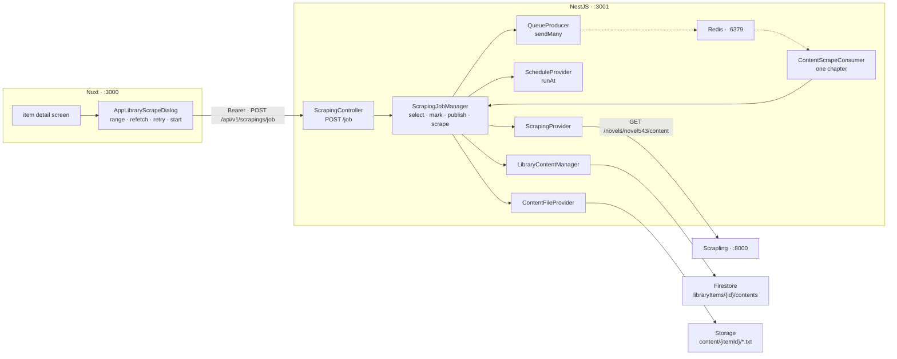

# Scraping — Part 2: downloading the content behind each chapter

Source design: `_docs/design/1. Library.dc.html` — the item detail screen's **Scrape content…**
control and the **Start a scraping job** dialog behind it (lines 409–491). The service this part
calls is documented in `scraping/README.md`.

## Goal of design

Part 1 taught the app **what a source has**. `POST /api/v1/scrapings/discover` reads a novel's
chapter list live and appends a placeholder row per chapter — `sourceUrl` set, `contentUrl: null`,
`status: 'discovered'`. It stopped exactly there, and said so in its own *Out of scope* table:

> | Scraping the chapter text | Discovery is an inventory. Fetching 1,305 chapter bodies is a different job with a different failure story, and it is the one that genuinely needs the queue. The rows this writes are placeholders — `contentUrl: null` — which is exactly the shape part 2 designed for. |

So three controls on the item detail screen — **Scrape content…**, **Scrape selected**, **Retry
failed** — are still drawn disabled behind `SCRAPING_DEFERRED`, and `core/queues/` has a producer, a
consumer base class and a schedule provider whose only caller is a sample that logs a line.

This part is **what we hold**: a dialog that describes a job, an endpoint that fans it out over
BullMQ, and a consumer that fetches one chapter, stores its text and completes the row. It is the
second half of the job runner, and the first real use of the queue.

**In scope**

- `POST /api/v1/scrapings/job`, body `{ libraryId, range, refetch, startAt, retry }`, answering `200`
  with what was queued.
- A range expression over chapter numbers — `all`, `missing`, `1,3,5,7`, `23-34`.
- One BullMQ message per chapter, with the caller's retry count on it, published now or booked for a
  wall-clock time.
- `QueueProducer.sendMany`, and per-message options on the producer.
- A fourth endpoint on the Scrapling service: the text behind one chapter URL.
- A consumer that fetches it, writes it to Cloud Storage and completes the row — or fails it once its
  attempts are spent.
- **Start a scraping job**, the dialog part 2 of the library drew and part 1 of scraping left
  disabled.

**Out of scope — deliberately**

| Deferred | Why |
| --- | --- |
| **Live progress on the screen** | No socket, no polling, no stream. The chapter table shows what it last fetched, and a reader who wants to know where a job has got to refreshes or revisits the item. Pushing rows as they complete means a channel, a subscription per screen and a reconnection story, and all three want the job record below to exist first. |
| A job record, and the `Scrapings` screen | Nothing here can be paused, cancelled or watched. BullMQ holds the work and Firestore holds the outcome per row, which is enough to see a novel fill in. A card with a progress bar and an **ETA** needs a `scrapingJobs` collection, and that collection is what a second instance, a restart and a **Cancel** button all need first. It is its own part. |
| **Retry failed** | It needs the ids of failed rows that may sit past the loaded pages, which is the cursor part 1 already deferred. The button stays disabled, with the sentence it already has. |
| Image and video downloading | The queue payload is type-free, but only a novel crawler exists and only a chapter has a body to fetch. A set is refused with the `501` `discover` already gives. |
| Rate limiting | The service self-bounds at four tabs. This takes two of them and measures nothing. |

### Decisions taken

| Question | Decision |
| --- | --- |
| Endpoint shape | **`POST /api/v1/scrapings/job`** with `libraryId` in the body, on the existing `ScrapingController` — the shape `discover` chose, and for its reason: an item id in `scrapings`' URL space reads as a library route served from the wrong module. `200` rather than `201`: it queues work, and the job is not a resource a caller can address yet. NSwag stays at `ScrapingClient.job()`, so no new client class appears. |
| What `range` selects | The **candidate rows**, by `index`. `all` → every chapter; `missing` → every chapter whose status is not `completed`; anything else → an index expression. |
| What `refetch` decides | Whether a candidate that is **already `completed`** survives the filter. So `missing` + `refetch` is a no-op pair and `all` + `!refetch` behaves like `missing` — which is why the dialog shows the Skip / Force toggle only for a specific range. |
| Range expression | Comma-separated tokens, each a number or a span `A-B` / `A:B`, surrounding brackets tolerated. `1,3,5,7`, `23-34` and `[23:34]` all parse. An unreadable one is a `400` before anything is queued. |
| `retry` | **A number — how many retries, `0`, `1` or `3`.** Not an enum: the three labels in the mock are three counts, and a name like `three-retry` only spells one out in words that then have to be mapped back. BullMQ counts attempts, so it is handed `retry + 1`, and the DTO is the only place that arithmetic appears. |
| Scheduling | **`ScheduleProvider.runAt`**, not a BullMQ `delay`. Booked under `scrape:{itemId}`, so a second booking for the same item replaces the first rather than double-publishing. In memory, and only that — see *Known limits*. |
| When the selection is made | **At request time, once.** The scheduled task closes over the rows it will publish, so the answer's `queued` count is the truth rather than an estimate, and the subcollection is read once rather than twice. |
| What queueing does to a row | Flips it to **`pending`** in one batched write, and the item to `scraping`. Otherwise a job booked for 03:00 leaves the screen looking untouched — and `pending` is the state the enum already defines as *queued*. |
| One message per chapter | Yes, published with `Queue.addBulk` through a new `QueueProducer.sendMany`. A chapter per message is what makes one failure one failed chapter; `send` in a loop would be 1,305 round trips to say so. |
| Where the text lands | **Cloud Storage, `content/{itemId}/{uuid}.txt`** — the same shelf the browser uploads a hand-written chapter to, so `useContentFiles.readText` and `.discard` keep working unchanged. Written through the Admin SDK with a `firebaseStorageDownloadTokens` metadata value, so the URL it returns has the same `?alt=media&token=…` form `getDownloadURL()` produces. A signed URL is not an option: the emulator has no credential to sign with. |
| Where a chapter body comes from | A **new endpoint on the Scrapling service** — `GET /novels/{crawler}/content?sourceUrl=…`. The three it exposes today are all about a book; none of them returns a chapter. |
| Marking a row failed | A `@OnWorkerEvent('failed')` hook on the consumer, acting only once `job.attemptsMade` has spent `job.opts.attempts`. Throwing out of `handle` stays how a consumer says *not done*; the hook is how the last throw becomes a red badge. |
| The order of the steps | Contract, **screen**, publishing, scraping. The dialog is built against a route that refuses it, which is what the contract skeleton is for: the request it composes is reviewable before anything queues, and the two halves that can each take a day — the queue and the parser — land one at a time behind a screen that already works. |

---

## Contracts

### Endpoint

| Method | Path | Body | Answers |
| --- | --- | --- | --- |
| `POST` | `/api/v1/scrapings/job` | `dto/scraping-job.dto.ts` | `ScrapingJobStartedDto` |

| Status | When |
| --- | --- |
| `200` | Selected, marked, and published — or booked. `queued: 0` where the range matched nothing, which is an answer rather than a failure. |
| `400` | A manual item, a range that will not parse, or a `startAt` that has passed. |
| `401` | Missing or invalid ID token. |
| `404` | No item under that id, or no crawler under its `sourceName`. |
| `501` | A crawler item that is not a novel. |

### `dto/scraping-job.dto.ts`

| Field | Type | Notes |
| --- | --- | --- |
| `libraryId` | `string` | The crawler item to scrape. `@IsString`, `@MinLength(1)`, `@MaxLength(MAX_ID)` — as `DiscoverDto` carries it. |
| `range` | `string` | `all`, `missing`, or an index expression. `@IsString`, `@MaxLength(MAX_RANGE)`. |
| `refetch` | `boolean` | Whether a chapter that already holds text is fetched again. `@IsBoolean`, default `false`. |
| `startAt` | `string \| null` | `@IsOptional`, `@IsDateString`. Null publishes immediately. |
| `retry` | `number` | How many times a failed chapter is tried again. `@IsInt`, `@Min(0)`, `@Max(MAX_RETRIES = 3)`, default `3`. The dialog offers 3, 1 and 0; anything in range is accepted. |

```ts
/** BullMQ counts attempts, not retries. The one place the two are reconciled. */
export function attemptsFor(retry: number): number {
  return retry + 1;
}
```

`ScrapingJobStartedDto` — `{ queued: number; skipped: number; startAt: string | null }`: what was
published or booked, how many candidates were dropped as already complete, and when it runs.

### Queue registry — `backend/src/core/queues/queue.messages.ts`

```ts
export enum QueueTopic {
  SamplePinged = 'sample.pinged',
  ContentScrapeRequested = 'content.scrape.requested',
}

/** Ids and primitives only — the message outlives the process that wrote it. */
export interface ContentScrapeRequested {
  itemId: string;
  contentId: string;
  crawler: string;
  sourceUrl: string;
  /** Whether stored bytes are to be overwritten, decided when the job was described. */
  refetch: boolean;
}

export const CONTENT_SCRAPE_QUEUE = 'content.scrape.requested.scraper';
```

### The upstream shape — new on the Scrapling service

```
GET /novels/{crawler}/content?sourceUrl={chapterUrl}   ->  { title: string, content: string[] }
```

`sourceUrl` here is a **chapter** URL — the `url` discovery stored on the row — and not a book URL,
which is the one thing this endpoint does differently from the three beside it.

`content` is the chapter's **lines**, not one string: that is what the page is, and what goes between
them is decided where the file is written. A chapter served over more than one page still answers with
one of these — the service follows the parts and joins them up, so a caller never sees a part.

---

## Shape of the system



### The flow — describing a job

```
job({ libraryId, range, refetch, startAt, retry })
  1  item = library.get(libraryId)                     404 if there is none
  2  crawler item · novel · requireCrawler · checkHost 400 / 501 / 404 — the four refusals discover makes
  3  chapters = contents.chapters(item.id)             every novel row, ordered by index
  4  candidates = selectByRange(range, chapters)       400 on an expression that will not parse
  5  queued = refetch ? candidates : candidates without text
  6  none                                              -> { queued: 0, skipped, startAt: null }
  7  contents.markQueued(item.id, ids)                 batched; the item goes `scraping`
  8  startAt ? schedule.runAt(`scrape:${id}`, at, publish) : await publish()
  9  return { queued, skipped, startAt }
```

`publish()` is one `producer.sendMany(ContentScrapeRequested, …, { attempts: attemptsFor(retry) })`,
each payload built field by field from its row — the rule `novelContent()` and `discover()` both
follow.

### The flow — one chapter

```
scrape({ itemId, contentId, crawler, sourceUrl, refetch })
  1  content = contents.find(itemId, contentId)        gone -> log and return; a deleted row is not a failure
  2  completed && !refetch                             -> return; a re-run of a spent message costs one read
  3  contents.markScraping(itemId, contentId)
  4  scraped = provider.content(crawler, sourceUrl)
  5  url = files.saveText(itemId, scraped.content.join('\n'))
  6  contents.completeScrape(itemId, contentId, { contentUrl: url, words })
  7  files.discard(content.contentUrl)                 the bytes it replaced, once the row points elsewhere
  8  the last one -> library.markReady(itemId)
```

Step 7 after step 6, never before: a row pointing at nothing is worse than an object nobody reads —
the order `pages/library/[id]/index.vue` already takes for an upload.

Step 8 reads the counters `recount()` has just written. `downloadedCount === discoveredCount` on an
item that is `scraping` returns it to `ready`; without it the item wears **Scraping** forever, because
nothing else in this design knows the queue has drained.

---

## Step 1 — The contract skeleton

Everything a caller can see, and nothing that does anything. At the end of this step the route
answers, the OpenAPI document is complete, the generated client has the method — and calling it
throws `NotImplementedException`.

One `pnpm generate:api` for the whole part, because no later step adds a DTO.

| File | What changes |
| --- | --- |
| `backend/src/scraping/dto/scraping-job.dto.ts` | **New.** `ScrapingJobDto`, `ScrapingJobStartedDto` and `attemptsFor()`, in the shape `ValidateDto` and `DiscoverDto` have. |
| `backend/src/scraping/scraping-job.manager.ts` | **New.** `ScrapingJobManager.start(input): Promise<ScrapingJobStartedDto>` throwing `NotImplementedException`. No dependencies yet. |
| `backend/src/scraping/scraping.controller.ts` | `@Post('job')`, `@HttpCode(HttpStatus.OK)`, `@ApiOkResponse({ type: ScrapingJobStartedDto })` and the per-status `@Api*Response` sentences from the contract table. One line of delegation. |
| `backend/src/scraping/scraping.module.ts` | `ScrapingJobManager` joins `providers`. |

A second manager rather than a fifth and sixth method on `ScrapingManager`: that class is about
reading a source and caching the answer, and this one is about work that outlives the request.

Close with `pnpm generate:api`, which rewrites `frontend/app/utils/api.clients.ts`:
`ScrapingClient.job()` and the two new DTO types. Never hand-edited.

## Step 2 — The dialog

The screen, against a route that still refuses it. At the end of this step **Scrape content…** opens,
composes a valid request, and shows the `501` in its own error line — which is the contract skeleton
doing exactly what it is for.

`frontend/app/components/AppLibraryScrapeDialog.vue`, **new**. The design is
`_docs/design/1. Library.dc.html` lines 409–491.

Props `itemId`, `total`, `missing` and `indexes?: number[]` — the preset a **Scrape selected** press
hands over. `v-model:open`, a `started` emit, and the `AppLibraryChapterDialog.vue` skeleton
throughout: `UModal` with `#body` and `#footer` only, a `UForm` with a literal id, the submit button
in the footer bound by `type="submit" form="…"`, inline `role="alert"` failures through `apiMessage`,
state refilled in `watch(open, …)`, and the parent owning the toast.

| Field | Control |
| --- | --- |
| What to extract | Three `AppBlueprint as="label"` radio cards over an `sr-only` `<input type="radio">` — the `cardTone()` pattern in `AppLibraryFormDialog.vue`. **Everything not yet extracted** (`missing`, carrying the *Recommended* badge), **Everything — including already extracted** (`all`), and **A specific range** with two `UInput`s. Each card's hint counts what it would queue. |
| If content already exists | Shown **only** for the range card. The segmented pair `AppLibraryFilters.vue` uses — a bordered `flex` of two `UButton`s with `:aria-pressed` — Skip it / Force re-scrape, driving `refetch`. The warning under it is the mock's. |
| On failure | `USelect` over `SCRAPE_RETRY_OPTIONS`, whose values are the numbers the DTO takes: *Retry 3× then mark failed* → `3`, *Retry once* → `1`, *Do not retry* → `0`. Default `3`. |
| Start | `USelect` — Queue it now / At a set time — and, for the second, a `UInput type="datetime-local"`. Native rather than `UCalendar`: that wants `@internationalized/date`, which this project does not have, and one field does not earn a dependency. |

Option constants live in `frontend/app/utils/library-content.ts` beside `SCRAPING_DEFERRED`, typed so
a missing case is a compile error.

`range` is built on submit: `'missing'`, `'all'`, `` `${from}-${to}` ``, or the selected rows' `index`
values joined with commas. `startAt` is `null`, or the `datetime-local` value through
`new Date(…).toISOString()`.

**The wiring**

| File | What changes |
| --- | --- |
| `frontend/app/components/AppLibraryNovelPanel.vue` | **Scrape content…** loses `disabled` and emits `scrape`. It stays disabled for a manual item, under the tooltip `discoverHint` already computes for the button below it. |
| `frontend/app/pages/library/[id]/index.vue` | Owns the call, as it owns every other one on this screen: `scrapingClient.job(…)`, then `refreshAll()`, then a toast. **Scrape selected** opens the same dialog with `indexes` set from `selected`. |

The toast reads **Queued 1,305 chapters**, **Scheduled for 03:00 · 1,305 chapters**, or **Nothing to
scrape** on `queued: 0` — so a job that matched nothing says so rather than looking like it worked.
Failures land through `apiMessage`, the way an upload's do.

**Retry failed (n)** keeps its `SCRAPING_DEFERRED` tooltip. It needs the ids of failed rows that may
sit past the loaded pages, and that is the cursor part 1 deferred.

`refreshAll()` after the call is the whole of how this screen learns anything: there is no live
update, and rows move only when they are fetched again.

## Step 3 — Publishing the job

The route starts working, and the messages start flowing — to a consumer that logs a line and stops.
At the end of this step a job can be queued or booked, every chapter in range turns **Pending**, and
the backend log counts what arrived. Nothing is fetched and nothing is stored.

**The producer** — `backend/src/core/queues/queue.producer.ts` gains per-send options and a bulk send:

```ts
/** What a caller may decide per message. Everything else stays `defaultJobOptions`'. */
export interface QueueSendOptions { attempts?: number }

async send<T extends QueueTopic>(topic: T, payload: QueuePayloads[T], options?: QueueSendOptions): Promise<void>

/** One topic, many payloads. `addBulk`, because a novel is a thousand messages. */
async sendMany<T extends QueueTopic>(topic: T, payloads: QueuePayloads[T][], options?: QueueSendOptions): Promise<void>
```

Both stamp the same `QueueMessage` envelope and fan out over `QUEUE_CONSUMERS[topic]` exactly as
`send` does today. Nothing about the sample topic changes.

**The registry** — `queue.messages.ts` grows the topic, the payload, the queue name and its
`QUEUE_CONSUMERS` entry from *Contracts*. `allConsumerQueues()` picks the queue up with no edit, so
`CoreModule` registers it without changing.

**The content manager** — `backend/src/library/library-content.manager.ts`, where the subcollection's
rules already live:

| Method | What it is |
| --- | --- |
| `chapters(itemId)` | Every novel row, ordered by `index`. `requireItem` + `findMatching`, refusing a non-novel item the way `appendDiscovered` does. |
| `markQueued(itemId, contentIds)` | Those rows to `pending`, batched. |

**The content repository** — `updateStatus(itemId, contentIds, status)`, batched at 500, in the loop
shape `createMany` already uses.

**The library repository** — `updateStatus(itemId, status)`, a root-field write beside
`updateCounters`'s dotted-path one, and `markScraping()` on `LibraryManager` over it.

**The job manager** — `start()` loses its `NotImplementedException` for the first flow above.
`selectByRange()` is a module-level helper beside it, and the one piece worth a spec of its own.

`requireCrawler`, `checkHost` and `hostOf` move from `scraping.manager.ts` into `crawlers.ts`, beside
the registry they read, and both managers import them. Nothing about what they do changes.

**The consumer** — `backend/src/scraping/content-scrape.handler.ts`, **new**, a provider of
`ScrapingModule`, in the shape `system/sample.handler.ts` has:

```ts
/** The service drives one stealth browser and self-bounds at four tabs. Two is the share this takes. */
const SCRAPE_CONCURRENCY = 2;

@Processor(CONTENT_SCRAPE_QUEUE, { concurrency: SCRAPE_CONCURRENCY })
export class ContentScrapeConsumer extends QueueConsumer<ContentScrapeRequested> {
  /** Step 4's work goes here. For now it says what it was handed, which is what proves the fan-out. */
  protected handle(message: QueueMessage<ContentScrapeRequested>): Promise<void> {
    this.logger.log(`Would scrape ${message.payload.sourceUrl} (refetch: ${message.payload.refetch})`);

    return Promise.resolve();
  }
}
```

**The module** — `ScrapingModule` already imports `LibraryModule`, which exports both managers, so
only the consumer is added to `providers`.

## Step 4 — Scraping one chapter

The consumer's `handle` stops logging and starts working. Nothing a caller can see changes shape.

**The Scrapling service** — `scraping/`:

| File | What changes |
| --- | --- |
| `app/models.py` | `ChapterContent` — `title`, `content: list[str]`, in the casing the models beside it use. |
| `app/parser.novel543.py` | `resolve_chapter(source)` — host check and an absolute URL, the shape `resolve()` has. `parse_content(page)` — the heading, and the lines under it: the direct `<p>` children of `div.content`, dropping one that carries a link, one that is empty or only whitespace, one made only of punctuation, and the heading printed again above the prose. The middle two are `is_prose()`, which each line is stripped before reaching; the last is `heading_key()`, which drops the site's `(1/2)` marker so the `<h1>` and a repeated heading can meet. `next_part_url(page, chapter_url)` — the chapter's next page, matched on the href, because a long chapter is served as `…_527.html` then `…_527_2.html`. |
| `app/main.py` | `@app.get("/novels/{crawler}/content", response_model=ChapterContent)`, in the shape `get_chapters` has — `get_crawler`, resolve, `fetch_page`, parse. |
| `README.md` | The fourth endpoint. |

**The provider** — `backend/src/core/providers/scraping.provider.ts`: a `ScrapedContent` interface and
`content(crawler, sourceUrl)`, through the existing `call()` / `json()` pair, with `CONTENT` beside
`METADATA`, `CHAPTERS` and `COVER`. Its refusals map as they already do.

**The file provider** — `backend/src/core/providers/content-file.provider.ts`, **new**, registered and
exported by `CoreModule` beside `CacheProvider`:

```ts
/** A chapter body, written where the browser writes one, and readable the same way. */
async saveText(itemId: string, text: string): Promise<string>

/** Quiet about an object that is not there, as `CacheProvider.drop` is. */
async discard(url: string | null): Promise<void>
```

`saveText` writes `content/{itemId}/{randomUUID()}.txt` as `text/plain; charset=utf-8` with
`metadata: { firebaseStorageDownloadTokens: token }`, and returns
`{host}/v0/b/{bucket}/o/{encoded path}?alt=media&token={token}` — the host read from
`config.firebase.emulators.storageHost` where there is one and `firebasestorage.googleapis.com`
otherwise. That is the URL `getDownloadURL()` hands the browser, which is what lets the reader's
`fetch` and `useContentFiles.discard` stay untouched.

A random name rather than the row's id, for the reason `useContentFiles` gives: a body replaced
mid-edit must not overwrite the one still being read.

**The content manager** gains the three writes the second flow needs — `markScraping`,
`completeScrape({ contentUrl, words })` which recounts, and `markFailed` — over a narrow
`patch(itemId, contentId, fields)` on the repository. `replace()` is not it: that is the whole
writable row, and a consumer holds none of it. `LibraryManager.markReady()` joins `markScraping`.

**The consumer** — `handle` delegates to `ScrapingJobManager.scrape(payload)`, the second flow above,
and gains the hook that reddens a row:

```ts
/** The last throw, and only the last: every earlier one is a retry BullMQ has already booked. */
@OnWorkerEvent('failed')
onFailed(job: Job<QueueMessage<ContentScrapeRequested>>): void { … }
```

`wordCount` is a backend counterpart of the frontend helper in `app/utils/library-content.ts` —
whitespace-split, and CJK counted by character, since the only crawler reads `zh-Hant`.

## Step 5 — Verification

**The specs**

| Spec | What it covers |
| --- | --- |
| `backend/src/scraping/scraping-job.manager.spec.ts` — new | `selectByRange`: `all`, `missing`, `1,3,5,7`, `23-34`, `[23:34]`, and a malformed one as a `400`. `refetch` keeps a completed row where `!refetch` drops it. A null `startAt` publishes immediately; a set one books and publishes nothing yet. A manual item is a `400`, an unknown one a `404`, a set a `501`. `scrape()`: a missing row returns quietly, a completed row without `refetch` is skipped, and a good one writes the file, then the row, then discards the old object — in that order. |
| `backend/src/core/queues/queue.producer.spec.ts` | `sendMany` fans one topic's payloads over every subscribed queue, and passes `attempts` through. `attemptsFor(3)` is `4`. |
| `backend/src/library/library-content.manager.spec.ts` | `markQueued`, `completeScrape` (which recounts) and `markFailed` against the fake repository. |

**Running it locally**

```bash
pnpm dev:infrastructure     # Firestore :8080, Storage :9199, scraping API :8000, Redis :6379
pnpm seed:firebase
pnpm lint && pnpm typecheck
pnpm --filter @media-studio/backend run test -- scraping-job.manager
pnpm --filter @media-studio/backend run test -- library-content.manager
pnpm dev
```

*After step 2* — sign in at `localhost:3000` as `admin@datntdev.com` / `StrongPassword123!`, add a
crawler item (`novel543`, `https://www.novel543.com/0413553971`) and press **Discover new chapters**.
Then open **Scrape content…**: the dialog draws, the range card shows counts, and pressing **Start
job** prints the `501` in the dialog's own error line. The request in the network tab is the contract.

*After step 3* —

1. **Scrape content…** → *Everything not yet extracted* → *Queue it now* → **Start job**. The toast
   counts what was queued, and every row turns **Pending** on the refresh.
2. The backend log holds one `Would scrape …` line per chapter, two at a time.
3. Queue a job with **At a set time** two minutes out. The rows go **Pending** immediately, the log
   records the booking, and no `Would scrape` line appears until the clock reaches it.
4. Select three rows, press **Scrape selected**, and confirm the request carries those three `index`
   values.
5. A manual item's **Scrape content…** is disabled, with the tooltip that says why.

*After step 4* — check the new service endpoint on its own first. It is the one piece whose selector
is unverified:

```bash
curl "http://localhost:8000/novels/novel543/content?sourceUrl=<a chapter url from the table>"
```

Expect a title and a body of readable text, not an empty string. Then:

6. Queue *Everything not yet extracted* again. Refreshing the screen shows rows moving **Scraping**
   → **Completed** two at a time, **Words** filling in, and the item's badge returning to **Ready**
   when the last one lands.
7. Open a completed chapter in the reader. The text is there, and it is the source's.
8. Run the job again with *Skip it*: nothing is re-fetched. Run it with *Force re-scrape* over a
   two-chapter range: both are, and the Emulator UI at `localhost:4000` shows the old objects gone
   rather than orphaned under `content/{itemId}/`.
9. Stop the scraping service and queue one chapter with *Retry once*. Two attempts appear in the log,
   and the row goes **Failed** after the second — not before. With *Do not retry*, one attempt.

Each step is one commit, and each leaves `pnpm lint`, `pnpm typecheck` and `pnpm build` green.

---

## Known limits

**The screen does not move on its own.** A job runs for minutes and nothing tells the browser. The
chapter table is accurate as of its last fetch, so watching a novel fill in means refreshing it. Live
progress is out of scope above, and it wants the job record below before it is worth building.

**A booking does not survive a restart.** `ScheduleProvider` holds the timer in memory, and the rows
it queued are already `pending`. Restarting the backend between the booking and the firing leaves a
novel marked queued with nothing coming for it, and nothing on the screen says so. Rescheduling from
a stored record is the fix, and the record is the `Scrapings` part.

**Nothing can be cancelled or watched.** The dialog's only outcome is a count. Stopping a running job
means draining Redis by hand.

**Two instances would double-publish.** `scrape:{itemId}` is a name in one process's registry, so a
second instance books its own copy. The same record that fixes the restart fixes this.

**Every completed chapter recounts the item.** `completeScrape` calls `recount()`, so a
1,305-chapter novel runs 1,305 × 3 Firestore aggregations. Correct and drift-free, and small beside
the scrape itself — but the cheap version is one recount when the queue drains, which means knowing
the queue has drained, which means the job record again.

**Two chapters at a time is a guess.** `SCRAPE_CONCURRENCY = 2` against a service that self-bounds at
four tabs. Nothing measures whether the source starts refusing, and there is no rate limit anywhere
in this path.

**A chapter is followed for ten pages and no further.** `MAX_CHAPTER_PARTS` is a stop against a site
that links in a circle, not a judgement about how long a chapter may be. Past it the rest of the
chapter is not read and the row still completes, holding what was read — the service logs a warning
and nothing on the screen says so. Every chapter seen so far is one or two pages.

**A line that reads exactly like the chapter's heading is dropped, wherever it sits.** The rule is
whole-line equality after the `(n/m)` marker is stripped, not position, so a chapter whose heading is
short and ordinary — a two-word title that is also a line of dialogue — would lose that line of prose.
Nothing warns about it. Position would narrow the risk, and no chapter sampled repeats its heading at
all, so there is nothing yet to tune against.

**A paragraph carrying a link is dropped.** That is how the site's navigation and its VIP pitch are
kept out of the text, and it is right for every page read so far — but prose wrapped in a link would
go with them, silently.

**The word count is approximate for `zh-Hant`.** Whitespace-splitting does not describe Chinese, so
characters are counted instead. It agrees with the frontend's helper, and with nothing linguistic.

**A range past 2,000 chapters selects nothing.** `chapters()` reads through `findMatching`, which
caps at `CONTENT_SCAN_LIMIT`. Part 1 recorded the same limit for discovery, and it has the same fix:
a cursor.

**`refetch` overwrites manual edits**, exactly as the dialog warns. There is no undo, and the object
it replaced is deleted once the row points at the new one.

**A failed row keeps its old text.** Failure moves the status and nothing else, so a forced re-scrape
that fails leaves the row `failed` while still holding the previous body. That is the safe direction,
and it means **Failed** does not mean **empty**.
