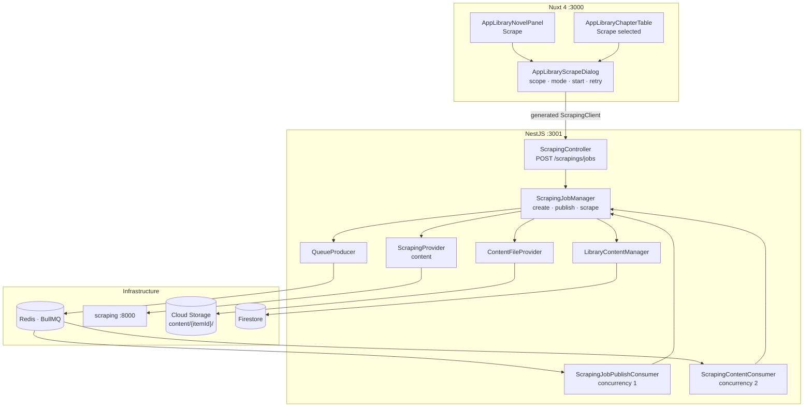
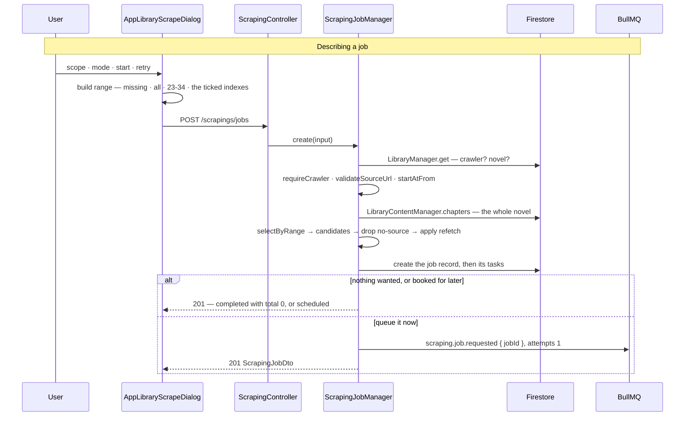
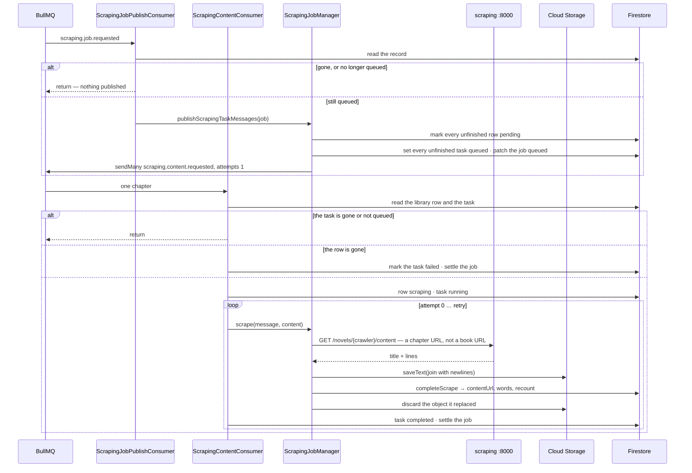

# Scraping — Part 2: downloading the content behind each chapter

## Overview

Part 1 wrote down what a source holds. This part fetches it. A person describes a job in a
dialog — which chapters, what to do with the ones already held, when to start — and the work
leaves the request: `POST /api/v1/scrapings/jobs` records the ask and hands it to a queue, and a
consumer fetches one chapter per message.

The queue layer is the part worth building carefully, because everything after it uses it. A
producer names a **topic** and is done: it does not name a queue, does not know which consumers
read it, and gets nothing back. `QUEUE_CONSUMERS` is the one place fan-out is configured, so
adding a consumer changes the registry and never the call. "Topic" rather than "queue" because
one of these fans out to several queues, and BullMQ has no word for that layer.

Two messages, two shapes of work. `scraping.job.requested` is a job's fan-out — a thousand
Firestore writes and a thousand sends, moved off the request that asked for it.
`scraping.content.requested` is one chapter: read it, store the text in Cloud Storage, point both
records at what was stored.

## Requirements

- **The selection is made once, at request time.** `selectByRange` runs against the whole novel's
  chapters before anything is written, so the record is the truth about the ask rather than an
  estimate of it. A range that will not parse is a `400` before a document exists.
- **`all` and `missing` are words; anything else is an index expression.** `1,3,5,7`, `23-34`,
  `[23:34]` — comma-separated tokens, each a number or a span, with surrounding brackets
  tolerated because a person who typed them meant the same thing.
- **`refetch` is a separate question from the range.** The range picks candidates; `refetch`
  decides whether a candidate that already holds text is fetched again. Everything dropped is
  counted as `skipped`.
- **A row with no `sourceUrl` cannot be fetched**, so it is dropped and counted as skipped too.
- **Everything refusable is refused before a document is written.** A manual item, a non-novel, an
  unknown crawler, a URL on another site, a `startAt` in the past.
- **A message carries ids and primitives only.** A domain entity in a payload would make `core`
  depend on the feature module that owns it, and would tie a queued message — which outlives the
  process that wrote it — to a shape free to change under it.
- **The record is the authority, not the message.** Every consumer re-reads the record it names
  and acts only if the record still wants the work. A job stopped between the send and the
  delivery is left alone.
- **A chapter is finished by the delivery that started it.** The queue hands a message over once,
  with `attempts: 1`, and the consumer spends the retries the caller asked for **in process**,
  with exponential backoff from one second. A later attempt would have to find its way back to a
  task somebody may have paused meanwhile.
- **The last failure is rethrown.** That is how a consumer says the work did not happen, and what
  leaves the message in BullMQ's failed set. Swallowing would mark it done.
- **The bytes are stored before either record moves, and the old object is dropped after.** A row
  pointing at nothing is worse than an object nobody reads — the same order the browser's own
  upload takes.
- **A URL this process writes is the same shape the browser writes.** `ContentFileProvider` puts
  the download token in object metadata, which is what `getDownloadURL()` itself reads, so a
  scraped chapter is read back by exactly the code that reads a hand-typed one.
- **`words` agrees with the frontend's count.** `wordCount` counts whitespace-separated tokens,
  and counts by *character* where the script is written without spaces — the only crawler reads
  `zh`. `utils/library-content.ts` holds the same function, deliberately, so an edit does not
  rewrite the scraper's figure with a different reading of the same text.

## Solution

### Contract Skeleton

| Method | Path | Answers | Refuses |
| --- | --- | --- | --- |
| `POST` | `/api/v1/scrapings/jobs` | `201 ScrapingJobDto` — persisted, and published or booked. A range that matched nothing is a `completed` record with `total: 0` | `400` a manual item, a range that will not parse, or a `startAt` that has passed · `401` · `404` no item, or no crawler under its `sourceName` · `501` a crawler item that is not a novel |

**`CreateScrapingJobDto`** — a job to *describe*, not a job to address.

| Field | Type | Default | Rules |
| --- | --- | --- | --- |
| `libraryId` | `string` | — | `1–128`. A manual item is a `400`. |
| `range` | `string` | — | ≤1024. `all`, `missing`, or an index expression. |
| `refetch` | `boolean` | `false` | Whether a chapter that already holds text is fetched again. |
| `startAt` | `string \| null` | `null` | `@IsDateString`. Null queues it now. |
| `retry` | `int 0–3` | `3` | How many times a failed chapter is tried again. The dialog offers 3, 1 and 0. |

**The queue registry** — `core/queues/queue.messages.ts`.

| Topic | Queue | Payload |
| --- | --- | --- |
| `scraping.job.requested` | `scraping.job.requested` | `{ jobId }` |
| `scraping.content.requested` | `scraping.content.scrape.requested` | `{ jobId, itemId, contentId, crawler, sourceUrl, refetch, retry }` |
| `library.import.requested` | `library.import.unpack.requested` | `{ itemId, packageUrl, onConflict }` |

`QueueMessage<T>` is the envelope every consumer is handed: `topic`, `payload`, and `sentAt` — the
ISO instant the producer stamped, which is when it was sent and not when it was picked up.

**`QueueProducer`** — `send(topic, payload, options?)` adds one copy to every queue subscribed to
the topic; `sendMany(topic, payloads, options?)` uses `addBulk`, because a novel is a thousand
messages and `send` in a loop would be a thousand round trips to say so. Queues are resolved by
token through `ModuleRef` with `strict: false`, because which ones exist is read from the registry
at startup and `@InjectQueue` needs its name at build time.

**`QueueConsumer<T>`** — a `WorkerHost` that opens the envelope and logs a failure before
rethrowing it. A subclass adds `@Processor(queueName)` — the decorator binds a class to its queue
and cannot be inherited — and implements `handle`.

**`ContentFileProvider`** — `saveText(itemId, text)` writes
`content/{itemId}/{uuid}.txt` as `text/plain; charset=utf-8` with a random download token and
answers the URL; `discard(url)` drops an object a row no longer points at, quietly, and quietly
ignores a URL that is not ours.

**Upstream** — `GET {SCRAPING_BASE_URL}/novels/{crawler}/content?sourceUrl=…`, where `sourceUrl`
is a **chapter** URL rather than a book URL — the one thing this call does differently from the
three beside it. `ScrapedContent { title, content: string[] }`: lines rather than one string,
because that is what the page is, and what goes between them is decided where the file is
written. A chapter served over several pages arrives already joined up by the service.

**Configuration** — `REDIS_HOST`, `REDIS_PORT`, `REDIS_PASSWORD`, `QUEUE_PREFIX`
(default `media-studio`, so two deployments can share one Redis without meeting),
`QUEUE_ATTEMPTS`, `QUEUE_BACKOFF_MS`, `QUEUE_KEEP_COMPLETED` (100), `QUEUE_KEEP_FAILED` (500 —
failed jobs are kept longer, because they are the ones worth reading).

### Component Diagrams

- **Two queues because BullMQ hands a job to exactly one worker.** Two parts that must both see a
  topic need two queues, and the producer sends the same message to each. `CoreModule` registers
  every queue the registry names, centrally: the registry already says which exist, and
  registering them twice from two places is how one comes to be missing from the other.
- **`SCRAPE_CONCURRENCY = 2`.** The scraping service drives one stealth browser and self-bounds
  at four tabs; two is the share this consumer takes. `PUBLISH_CONCURRENCY = 1`, because each
  publish message is a whole novel's worth of writes and sends.

- **The record exists before anything is published**, which is the whole point: a restart between
  the two leaves a job something can still see.
- **A range that matched nothing is not an error.** It is a `completed` record with `total: 0` and
  a `completedAt`, and the screen says "Nothing to scrape".

- **The gate at the top of the consumer is what a pause rests on.** A pause does not drain the
  queue; it marks the record, and the consumer skips what the record no longer wants.
- **A missing library row fails the task rather than skipping it.** A task left queued is one the
  job stays owed forever.
- **Retries are in process, with `BACKOFF_MS * 2 ** attempt`.** The attempt that earns the retries
  is not one of them, so `retry: 3` is four fetches. Only the last failure marks the task failed
  and rethrows.
- **Each chapter settles the job.** `settleJob` recomputes the counters from the task
  aggregations rather than incrementing them, so two consumers finishing at once cannot lose each
  other's write.
- **The dialog builds `range` and nothing else.** `missing`, `all`, a typed range, or the ticked
  chapters' `index` values joined by commas — the four cards in
  `SCRAPE_SCOPE_LABELS`. `refetch` is the mode, `SCRAPE_RETRY_OPTIONS` is the retry count, and
  `SCRAPE_START_OPTIONS` decides whether a `datetime-local` is shown.

## Implementation Steps

- **Step 1 — the queue layer.** `core/queues/queue.messages.ts` — the topics, the payload
  interfaces, `QueuePayloads`, `QueueMessage`, the queue names, `QUEUE_CONSUMERS` and
  `allConsumerQueues()`. `core/queues/queue.producer.ts` and `queue.consumer.ts`, with specs.
  `CoreModule` gains `BullModule.forRootAsync` — reading the namespaced config through
  `ConfigModule.forFeature`, because a module cannot inject its own providers into what it imports
  — plus `BullModule.registerQueue(...allConsumerQueues())`, re-exported so a feature module's
  consumer resolves the queue it processes.
- **Step 2 — `ContentFileProvider`.** `core/providers/content-file.provider.ts`, plus
  `core/firebase/storage-url.ts` if part 5 has not already landed it. The provider lives in `core`
  for `CacheProvider`'s reason: writing a file is not a domain concept, and the next thing that
  wants one will not be the scraping module.
- **Step 3 — the dialog.** `types/library-content.ts` gains `ScrapeScope` and `ScrapeStart`;
  `utils/library-content.ts` gains `SCRAPE_SCOPE_LABELS`, `SCRAPE_RETRY_OPTIONS` and
  `SCRAPE_START_OPTIONS`. `AppLibraryScrapeDialog.vue` is the four scope cards, the mode toggle,
  the start choice and the retry select, counting against the item's own inventory —
  `discoveredCount` and `discoveredCount - downloadedCount` — rather than against the filtered
  table. `AppLibraryNovelPanel` opens it for the whole novel; `AppLibraryChapterTable` opens it for
  the ticked rows.
- **Step 4 — describing a job.** `scraping/dto/scraping-job.dto.ts`,
  `scraping/scraping-job.manager.ts` (`create`, `selectByRange`, `parseIndexes`, `startAtFrom`,
  `draftOf`, `taskDraft`, `statusFor`, `wordCount`) and the `POST jobs` route. The record and its
  `tasks` subcollection are scraping part 3's contract; this part is what writes them.
- **Step 5 — publishing, and scraping one chapter.**
  `scraping/scraping-job.handler.ts` — `ScrapingJobPublishConsumer`, which validates the record and
  delegates. `ScrapingJobManager.publishScrapingTaskMessages` — mark the rows pending, mark the
  tasks queued, patch the job, publish to the live tree, `sendMany`.
  `scraping/scraping-content.handler.ts` — `ScrapingContentConsumer`, the gates, the retry loop and
  the three `markTask*` helpers. `ScrapingJobManager.scrape` — fetch, join with newlines, store,
  `completeScrape`, discard. `LibraryContentManager` gains `chapters`, `find`, `markQueued`,
  `markScraping`, `markFailed` and `completeScrape`.
- **Step 6 — the infrastructure.** `_deploy/dockercompose.local.infrastructure.yml` gains
  `redis:8-alpine` with `--appendonly yes` — a job that was accepted and then lost to a restart is
  worse than a slow write — on `127.0.0.1:6379`.

## Appendix

### Known limits

- **Novels only.** A crawler item of any other type is a `501`, as at `validate` and `discover`.
- **`sendMany` is not atomic with the writes before it.** The record and its tasks are committed
  first; if Redis is unreachable the send throws and the job sits `queued` with nothing published.
  Asking for `queued` again republishes it, which is what makes that recoverable.
- **A partial fan-out stays partial.** `send` resolves once each copy is queued; a queue that
  refuses a message leaves the copies already accepted accepted.
- **One attempt per message, by design.** `attempts: 1` means BullMQ never redelivers, so a
  consumer that dies mid-chapter — a process kill, an OOM — leaves that task `running` forever.
  Only a stop or a re-queue moves it.
- **A `running` task cannot be halted.** Its fetch is already in the air, so a pause or a stop
  leaves it to write its own completion; a pause takes effect within one chapter rather than
  instantly.
- **The whole novel is read to select a range.** `chapters(itemId)` is unpaged deliberately — a
  range is meaningless over a slice — so describing a job over a long novel reads every row.
- **Two overlapping jobs over one item are allowed.** Nothing locks an item, and both jobs' tasks
  can name the same chapter.
- **`wordCount` is not linguistic.** It counts whitespace tokens, and characters in CJK ranges.
  It agrees with the frontend, and neither agrees with anything else.
- **The text is stored as one object per chapter**, joined with `\n`. The service's paragraph
  boundaries survive; nothing else about the page does.
- **No throttling per source.** Two consumers fetch as fast as the service answers; politeness is
  the service's business, not the queue's.
