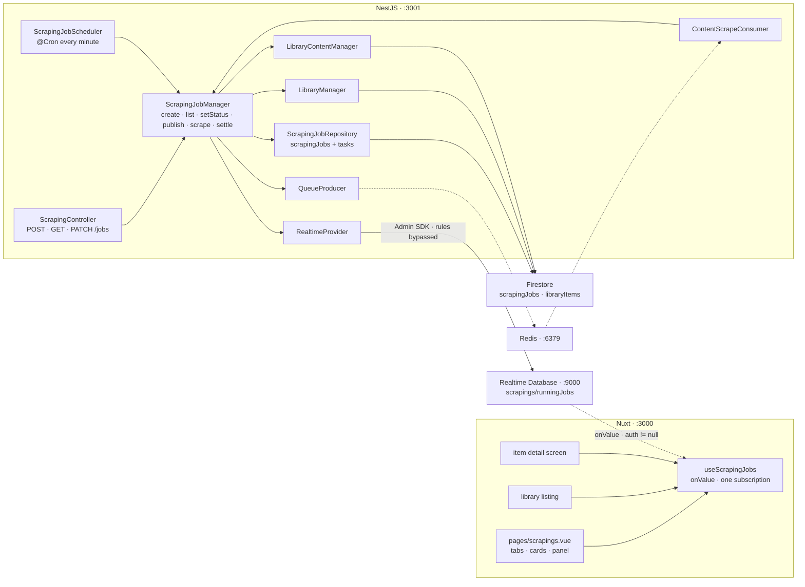

# Scraping — Part 3: a job record, and the Scrapings screen

Source design: `_docs/design/2. Scrapings.dc.html` — the three tabs, the job cards with their progress
bars, and the detail panel beside them. The work this records is described in
`_docs/plan/[scraping]-part2_download_library_content.md`; the channel it publishes over is
`_docs/plan/[notify]-part1_realtime_database_integration.md`.

## Goal of design

Part 2 taught the app **how to fetch**, and notify part 1 taught it **how to show progress**. What
neither built is the thing both of them deferred, in the same words, twice:

> | A job record, and the `Scrapings` screen | Still deferred, and still for part 2's reason. The tree here describes an **item**, not a job — so two overlapping jobs on one item are one running item, which is what the screen would have drawn anyway. Cancel, pause and an **ETA** all want `scrapingJobs` first. |

So `POST /api/v1/scrapings/job` writes nothing about itself. It selects rows, flips them to `pending`,
and hands 1,305 messages to BullMQ — and from that moment the job exists only as queue depth. A
booking made for 03:00 lives in one process's `SchedulerRegistry` and dies with a restart. Nothing can
be listed, paused, resumed or stopped. `app/pages/scrapings.vue` is a title and a hint over an empty
page, because there is nothing to draw.

This part is **the record**: a `scrapingJobs` collection that says what was asked for and where it has
got to, a cron that fires the booked ones, three endpoints over them, a live mirror of the jobs that
are running, and the screen the mockup describes.

**In scope**

- `scrapingJobs/{jobId}` in Firestore, with a `tasks` subcollection — one document per piece of
  content in range.
- `POST /api/v1/scrapings/jobs` — persists first, then publishes.
- A `@Cron` that runs every minute, publishing the jobs that have come due.
- `GET /api/v1/scrapings/jobs` — the tabs and the library filter the mockup draws.
- `app/pages/scrapings.vue` — the three tabs, the cards, and the detail panel.
- `scrapings/runningJobs/{jobId}` in the Realtime Database, and the three screens that read it.
- `PATCH /api/v1/scrapings/jobs/{id}/status` — `queued` (start or resume), `paused`, `stopped` — and
  the consumer gate that makes all three mean something.

**Out of scope — deliberately**

| Deferred | Why |
| --- | --- |
| Discovery as a job | The mockup's **Discover** cards and its *All job types* filter both describe one. `POST /scrapings/discover` is a request that answers in a few seconds, and wrapping a synchronous call in a record that can be paused is a record with nothing to say. The type filter is left out rather than drawn over one value. |
| The panel's **Failed (n)** list | The count is drawn; the rows are not. A row needs the chapter's number, its title and the error, and only the first and last are on the task — the title is a join per row into `libraryItems/{id}/contents`. The item detail screen already lists failed chapters with their titles, which is one click away. |
| **Retry failed** | Unchanged from part 2 and notify part 1. A job now knows exactly which of its tasks failed, so this is finally cheap to build — but it is a new endpoint with its own semantics (a retry of a settled job: the same record, or a new one?) and it is not what the restructure is for. The button keeps its tooltip. |
| **Pause all**, **Clear finished** | Bulk over the listing. Neither is more than a loop over the endpoints this part adds, and neither is worth a route before there is a person with more than one job running. |
| Removing a message from Redis | A pause does not drain the queue. It marks the record, and the consumer skips what the record no longer wants — see *Decisions taken*. |
| Job history retention | Jobs accumulate. Nothing prunes them and nothing archives them. |
| Image and video sets | As everywhere in this path: only a novel crawler exists. The record carries `libraryType` and would file a set unchanged, but nothing can yet scrape one. |

### Decisions taken

| Question | Decision |
| --- | --- |
| Where the pieces of a job live | **A `tasks` subcollection**, `scrapingJobs/{jobId}/tasks/{contentId}` — not an array field on the job document. Three reasons, and the first is fatal on its own: Firestore has no way to write one element of an array, so every chapter completing would be a read-modify-write of the whole document, and two consumers finishing at once would lose one of the two writes. A 1,305-chapter novel would also carry that document to roughly a quarter of the 1 MB limit, and the consumer would read all of it to check one row. `libraryItems/{id}/contents` is the same shape for the same reasons, so this is the pattern the codebase already has. **The logical shape is unchanged** — the DTO answers with a list, and the live node nests them under the job. |
| Why *tasks* rather than *contents* | Because they are not contents. `libraryItems/{id}/contents` is what we **hold**; this is what a job has been asked to **do**, and one of these rows can be stopped, paused and republished while the content row it names sits still. Two subcollections a screen apart called the same thing is how a reader comes to think they are the same thing. |
| The task document's id | **The library `contentId`.** A job scrapes a piece of content at most once, so the id is already unique within the job, and the consumer reads its task directly rather than querying for it. |
| One status vocabulary, or two | **One.** `ScrapingJobStatus` — `scheduled`, `queued`, `running`, `paused`, `stopped`, `completed`, `failed` — reads the same on a job and on one of its tasks, so the screen has one badge map and the aggregate is obviously derived from the parts. It is **not** `LibraryContentStatus`: that one says whether we *hold* a chapter, which is a different question that outlives every job and stays exactly as it is. |
| What a running job does to the library | **Nothing new.** `libraryItems/{id}.status` and each content row's `LibraryContentStatus` stay the source of truth for what we hold, written exactly where they are written today. The job record is about the work, and the two are deliberately not merged: a chapter is `completed` forever, while the job that fetched it is `completed` only once. |
| Why `libraryType` is on the record | The mockup's second filter is *All libraries · Novels · Images · Videos*, which is the item's `type`. Denormalised at creation so the listing narrows in Firestore rather than by reading twenty library items to find out what they are. |
| When a scheduled job touches the library | **When it publishes, not when it is booked.** Today a job booked for 03:00 flips 1,305 rows to `pending` at lunchtime, because there was nowhere else to say it existed. Now there is: the record sits in `scheduled`, the *Scheduled* tab draws it, and the item is left alone until the cron fires. The selection is still made once, at request time — the tasks are written there. |
| Scheduling | **A `@Cron(EVERY_MINUTE)` over the record**, replacing `ScheduleProvider.runAt`. A booking now survives a restart, which was part 2's second-largest known limit, and the claim is a Firestore transaction so a second instance cannot publish the same job twice — which was the third. `ScheduleProvider` and its spec are **deleted**: nothing else calls them, and an in-memory timer beside a durable record is a second answer to a question that now has one. |
| Why a minute | It is the resolution the dialog offers (`datetime-local` to the minute) and it costs one indexed query per tick. A job booked for 03:00:30 fires at 03:01. |
| What a pause does to messages already queued | **Nothing.** BullMQ hands a message to a consumer, and there is no cheap way to reach into a queue and remove 1,200 of them by hand. So the record is the authority instead: the consumer's first act is to read its task, and anything that is not `queued` is skipped. A paused job's remaining messages drain in seconds, each costing two small reads and no fetch. |
| What a resume does, therefore | **Republishes.** `PATCH … { status: 'queued' }` walks the tasks that are not `completed`, sets them `queued`, and sends one message per row — which is exactly what the original publish does. It is the same code path, and it is why *start a scheduled job now* and *resume a paused job* are one endpoint rather than two. |
| A task that is already in flight | **Left to finish.** Pause and stop move the tasks that are `queued`; a task that is `running` has a fetch in the air, and marking it would either be overwritten by the completion or throw away work that is already paid for. So a pause takes effect within one chapter rather than instantly. |
| Where the live tree is rooted | **`scrapings/runningJobs/{jobId}`**, replacing `scraping/items` and `scraping/contents` entirely. One tree with one writer: the old one had the two library managers publishing item-shaped nodes that no longer describe anything a screen asks about. `LibraryManager` and `LibraryContentManager` lose their `RealtimeProvider` dependency, which is a net simplification of both. |
| Why the item's counters ride on the job node | The Library listing draws `412 / 1,305 ch.` for the **item**, not for the job — a job over chapters 1–20 knows nothing about the other 1,285. `ScrapingJobManager` already receives `LibraryContentCounts` back from every `completeScrape`, so the five numbers are in hand at the moment the job node is written, and they go under `library` on it. No second tree, and no second writer. |
| What leaves the live tree, and when | A job node is written when the job is created and **removed by the next cron tick after it settles** — not at the moment it settles. The screen watches for the transition to `completed` or `failed` and refetches; removing the node in the same act would race that refetch, which is the problem `useScrapingStatus`'s `held`/`reconcile` pair exists to work around. A minute is far longer than a round trip, so the race is gone rather than papered over. |
| The endpoint's shape | **`POST /api/v1/scrapings/jobs`** — plural, because a job is now a resource, answering `201` with the record rather than `200` with a count. `PATCH …/{id}/status` rather than a `PUT` of the whole job: status is the one field a client may move, and the other thirteen are the server's. |
| A status the job cannot reach | **`400`**, with a sentence naming the states it can be asked for. Every other refusal in this codebase is a `400`, and a `409` here would be the only one of its kind for a rule that reads exactly like the manual-item and bad-range refusals beside it. |
| `libraryTitle` on the record | **Denormalised, at creation.** The card names the item, and a listing of twenty jobs would otherwise be twenty document reads to draw twenty titles. A record is a historical statement — *this is what was scraped, as it was called then* — so an item renamed later leaving an old job with its old title is the honest answer rather than a bug. |
| Rate and ETA | **Computed in the browser**, from `queuedAt` and `completed`. A naive average over the whole run, which is what the mockup's `38 / min` is. Nothing is stored, nothing is sampled, and a paused job's arithmetic is wrong until it resumes — five lines rather than a rate table. |

---

## Contracts

### Firestore — `scrapingJobs/{jobId}`

| Field | Type | Notes |
| --- | --- | --- |
| `id` | `string` | The document id. |
| `libraryId` | `string` | The item being scraped. |
| `libraryType` | `LibraryItemType` | Its type — what the listing's library filter narrows on. |
| `libraryTitle` | `string` | As the item was called when the job was described. |
| `crawler` | `string` | Its `sourceName`, carried so a republish needs no read of the item. |
| `status` | `ScrapingJobStatus` | |
| `range` | `string` | The expression as it was sent — `all`, `missing`, `23-34`. Drawn verbatim in the panel. |
| `refetch` | `boolean` | |
| `retry` | `number` | How many retries a failed task is allowed. `attemptsFor()` still turns it into BullMQ's count. |
| `startAt` | `string \| null` | ISO. When the job is **due**. Null was queued immediately. |
| `queuedAt` | `string \| null` | ISO. When its messages actually went out — the panel's **Started**. |
| `completedAt` | `string \| null` | ISO. When it settled, whichever way. |
| `total` | `number` | Tasks in the job. What the progress bar divides by. |
| `completed` | `number` | |
| `failed` | `number` | |
| `skipped` | `number` | Candidates dropped as already complete. Answered by the POST, and kept for the panel. |
| `createdAt`, `updatedAt` | `string` | ISO, as every other entity carries them. |

### Firestore — `scrapingJobs/{jobId}/tasks/{contentId}`

| Field | Type | Notes |
| --- | --- | --- |
| `contentId` | `string` | The library content row this task is for. **It is also the document id.** |
| `libraryId` | `string` | Denormalised so a task reads on its own. |
| `index` | `number` | The chapter number — what the subcollection is ordered by. |
| `sourceUrl` | `string` | Carried so a republish needs no read of the library row. |
| `status` | `ScrapingJobStatus` | |
| `refetch` | `boolean` | The job's, copied down: it is what the message carries. |
| `retry` | `number` | The job's, copied down, for the same reason. |
| `startAt` | `string \| null` | ISO. When a consumer picked this task up. |
| `completedAt` | `string \| null` | ISO. |
| `error` | `string \| null` | The last failure, in one line. What a deferred **Failed** list would draw. |

```ts
/**
 * Where a job — or one task of it — has got to. One vocabulary for both, so the
 * aggregate reads as what it is: the state of its parts.
 *
 * Not `LibraryContentStatus`. That one says whether we hold a chapter, which is a
 * question that outlives every job that ever asked it.
 */
export enum ScrapingJobStatus {
  /** Described and booked. Nothing published, and the library untouched. */
  Scheduled = 'scheduled',
  /** Published. Waiting for a consumer — and the one state a consumer will act on. */
  Queued = 'queued',
  /** A consumer has it. */
  Running = 'running',
  Paused = 'paused',
  Stopped = 'stopped',
  Completed = 'completed',
  Failed = 'failed',
}

/** The three a job settles in, and never leaves. What the History tab lists. */
export const TERMINAL_JOB_STATUSES = [Stopped, Completed, Failed] as const;

/** Queued, running or paused — what the Active tab lists. */
export const ACTIVE_JOB_STATUSES = [Queued, Running, Paused] as const;
```

### The endpoints

| Method | Path | Body | Answers |
| --- | --- | --- | --- |
| `POST` | `/api/v1/scrapings/jobs` | `CreateScrapingJobDto` | `201` · `ScrapingJobDto` |
| `GET` | `/api/v1/scrapings/jobs` | — | `200` · `ScrapingJobPageDto` |
| `PATCH` | `/api/v1/scrapings/jobs/{id}/status` | `UpdateScrapingJobStatusDto` | `200` · `ScrapingJobDto` |

`CreateScrapingJobDto` is part 2's `ScrapingJobDto` renamed and otherwise untouched — `libraryId`,
`range`, `refetch`, `startAt`, `retry`, with the same validators. `ScrapingJobStartedDto` is deleted:
the job is now a resource, and `{ queued, skipped, startAt }` were three fields of it.

| Status | When — `POST` |
| --- | --- |
| `201` | Persisted, and published or booked. A range that matched nothing is still a record: it is written `completed` with `total: 0`, so a person who asked for it can see that they did. |
| `400` | A manual item, a range that will not parse, or a `startAt` that has passed. |
| `401` | Missing or invalid ID token. |
| `404` | No item under that id, or no crawler under its `sourceName`. |
| `501` | A crawler item that is not a novel. |

| Query — `GET` | Type | Notes |
| --- | --- | --- |
| `state` | `active \| scheduled \| history` | The screen's three tabs, over the status groups above. Omitted means all. |
| `libraryType` | `novel \| image \| video` | The mockup's *All libraries* select. |
| `libraryId` | `string` | Not drawn by the mockup, and one line here: it is what the item detail screen would ask for. |
| `page`, `pageSize` | `number` | As every other listing in this app pages. |

`ScrapingJobPageDto` is `{ items, total, page, pageSize }` over `ScrapingJobDto`, matching
`LibraryItemPageDto` field for field. `ScrapingJobDto` carries the record's own fields and
`tasks: ScrapingTaskDto[]` — which is the shape the record was drawn in, whatever the store does
underneath.

| Status | When — `PATCH` |
| --- | --- |
| `200` | Written, published where the new status is `queued`, and mirrored. |
| `400` | A status this job cannot reach from where it is — `queued` from anything but `scheduled` or `paused`, `paused` from anything but `queued` or `running`, or anything at all asked of a settled job. |
| `404` | No job under that id. |

`UpdateScrapingJobStatusDto` is one field, `status`, `@IsEnum` over the three a client may ask for —
`queued`, `paused`, `stopped`. The other four are the runner's, which is the rule
`library-item-update.dto.ts` already states about `WRITABLE_STATUSES`.

### The live tree

```
scrapings/runningJobs/{jobId}
    id            "8Kq…"
    libraryId     "kQ2…"
    libraryType   "novel"
    libraryTitle  "The Silent Cartographer"
    status        "scheduled" | "queued" | "running" | "paused" | "stopped" | "completed" | "failed"
    range         "1-640"
    refetch       false
    startAt       1765…      epoch ms, or absent
    queuedAt      1765…      epoch ms, or absent
    total         640
    completed     412
    failed        2
    updatedAt     1765…      epoch ms, so a node can be read as stale

    library                  the item's own aggregate, as of this write
        status    "scraping"
        total     1305
        completed 412
        failed    2
        pending   890

    tasks
        {contentId}
            status  "queued" | "running" | "completed" | "failed" | "paused" | "stopped"
            index   413
```

Timestamps are epoch milliseconds here and ISO strings in Firestore, which is the split notify part 1
made and for its reason: these are compared and never displayed.

`database.rules.json` gains the new root and an index, and keeps the old one's terms — read for a
signed-in user, write for nobody, because every value is derived from a Firestore write the backend
has already made:

```json
{
  "rules": {
    "scrapings": {
      "runningJobs": {
        ".read": "auth != null",
        ".write": false,
        ".indexOn": ["libraryId", "status"]
      }
    }
  }
}
```

### `core/providers/realtime.provider.ts`

Rewritten around the job. Still the one place a path under the root is spelled, still swallows every
failure — a publish is a courtesy to a screen, and a chapter that has been fetched, stored and
completed must not be scraped again because a mirror write failed.

| Method | What it does |
| --- | --- |
| `publishJob(job)` | The summary and the `library` block in one `update`, stamping `updatedAt`. |
| `publishTasks(jobId, rows)` | The whole set, chunked at 500 — the size the Firestore writes beside it use. |
| `publishTask(jobId, contentId, status)` | One task moving. `update`, so the `index` written at claim time is left alone. |
| `runningJobs()` | Every node and its status, for the sweep. The one read on this class. |
| `clearJob(jobId)` | `remove` on the node. What the sweep does. |

### The message payload

```ts
export interface ContentScrapeRequested {
  /** Which job asked. The task it names is what decides whether this is still wanted. */
  jobId: string;
  itemId: string;
  contentId: string;
  crawler: string;
  sourceUrl: string;
  refetch: boolean;
}
```

One field added. Ids and primitives only, as the file's own rule states.

---

## Shape of the system



`ScrapingJobManager` is the only writer of the live tree, and the only caller of the job repository.
The two library managers keep their Firestore writes and lose their `RealtimeProvider` — a job's
progress is the job's to publish.

### The flow — describing a job

```
create({ libraryId, range, refetch, startAt, retry })
  1  item · crawler · host · type                       the four refusals part 2 makes, unchanged
  2  chapters = contents.chapters(item.id)
  3  candidates = selectByRange(range, chapters)        400 on an expression that will not parse
  4  wanted = refetch ? fetchable : fetchable not yet complete
  5  job = jobs.create({ …, status: startAt ? scheduled : queued, total: wanted.length })
  6  jobs.createTasks(job.id, wanted)                   one document per row, batched at 500
  7  startAt ? return job : return publish(job)
```

Step 5 before step 7 is the whole point of this part: the record exists before anything is queued, so
a restart between the two leaves a job that the cron can still see. A `wanted.length` of zero skips
straight to `completed` — a record of an ask that matched nothing.

### The flow — publishing

Shared by the immediate path, the cron, and a resume. It is one method.

```
publish(job)
  1  tasks = jobs.tasks(job.id) not completed
  2  contents.markQueued(libraryId, tasks)              Firestore: the library rows go `pending`
  3  library.markScraping(libraryId)                    Firestore: the item goes `scraping`
  4  jobs.setTaskStatus(job.id, tasks, queued)
  5  producer.sendMany(ContentScrapeRequested, …, { attempts: attemptsFor(job.retry) })
  6  jobs.patch(job.id, { status: queued, queuedAt: now })
```

### The flow — one chapter

```
scrape({ jobId, itemId, contentId, … })
  1  task = jobs.task(jobId, contentId)                 gone -> return; a deleted job is not a failure
  2  task.status !== queued                             -> return; paused, stopped, or already taken
  3  jobs.startTask(jobId, contentId)                   the task goes `running`, stamped
  4  content = contents.find(itemId, contentId)         gone -> jobs.failTask(…, 'the row is gone')
  5  … fetch, store, complete the library row …         unchanged from part 2
  6  jobs.completeTask(jobId, contentId)                the task, and the job's `completed`
  7  jobs.drained(jobId) -> settle(jobId, itemId, counts)

fail({ jobId, itemId, contentId }, error)
  1  jobs.failTask(jobId, contentId, error)             the task, and the job's `failed`
  2  contents.markFailed(itemId, contentId)             unchanged
  3  jobs.drained(jobId) -> settle(jobId, itemId, counts)
```

Step 2 is the gate the whole pause story rests on, and it is one comparison — it arrives with the
endpoint that needs it, in step 5. Step 4 marking a vanished row **failed** rather than returning
quietly is new: a job whose item was deleted mid-run used to leave a task that never moved, and
therefore a job that never drained.

```
settle(jobId, itemId, counts)
  1  job.failed > 0 ? failed : completed                the job's own tasks, not the item's rows
  2  jobs.patch(jobId, { status, completedAt: now })
  3  counts.pending === 0 -> library.markFailed | markReady    the item, exactly as today
```

The item and the job settle on two different tests, and both are right: `counts.pending === 0` asks
whether *anything at all* is still owed on the item — a second, overlapping job included — while the
job settles on its own tasks being done.

### The flow — the cron

```
@Cron(EVERY_MINUTE) tick()
  1  due = jobs.findScheduled(before: now)
  2  for each: jobs.claim(id)                           a transaction, scheduled -> queued
  3  claimed -> publish(job)
  4  from step 4 of this plan: sweep the settled nodes out of the live tree
```

Step 2 is what makes a second instance harmless: the transaction reads the status and writes it in one
act, so exactly one instance sees `scheduled` and the other sees the job it did not get.

### The flow — a status change

```
setStatus(id, status)
  paused   from queued | running     -> tasks in `queued` go paused; the job goes paused
  stopped  from anything not settled -> tasks not completed go stopped; the job goes stopped, completedAt
  queued   from scheduled | paused   -> publish(job), which republishes every unfinished task
  anything else                      -> 400
```

A task that is `running` is left alone in all three: its fetch is already in the air, and it will
write its own completion a chapter later.

---

## Step 1 — The record, and the endpoint that writes it

The collection, its repository, and `POST /scrapings/jobs` persisting before it publishes. Scheduling
still runs through `ScheduleProvider`, exactly as it does today. At the end of this step every job that
runs leaves a record of what it did.

| File | What changes |
| --- | --- |
| `backend/src/core/firebase/collections.ts` | `SCRAPING_JOB_COLLECTION = 'scrapingJobs'` and `TASK_SUBCOLLECTION = 'tasks'`, with the sentences their neighbours carry. |
| `backend/src/core/api.constants.ts` | `SCRAPING_JOBS_PATH = 'jobs'`, beside `LIBRARY_CONTENT_PATH`. |
| `backend/src/scraping/entities/scraping-job.entity.ts` | **New.** `ScrapingJobStatus`, the two status groups, `ScrapingJob` and `ScrapingTask` — the two tables above. |
| `backend/src/scraping/scraping-job.repository.ts` | **New.** Extends `FirestoreRepository<ScrapingJob>` for `findById`, and adds what a job needs. |
| `backend/src/scraping/dto/scraping-job.dto.ts` | `ScrapingJobDto` → `CreateScrapingJobDto`, otherwise untouched. **New** in the file: `ScrapingJobDto` and `ScrapingTaskDto`. `ScrapingJobStartedDto` is deleted. `attemptsFor()` stays. |
| `backend/src/scraping/scraping.controller.ts` | `@Post('job')` becomes `@Post(SCRAPING_JOBS_PATH)` at `201`, and the method is named `createJob` — a controller method's name is the generated client's method name. `validate` and `discover` are not touched. |
| `backend/src/scraping/scraping-job.manager.ts` | `start()` becomes `create()` and the first flow above; `publish()` becomes the shared second flow; `scrape()` and `fail()` gain the task writes. |
| `backend/src/core/queues/queue.messages.ts` | `jobId` on `ContentScrapeRequested`. |
| `backend/src/scraping/content-scrape.handler.ts` | The `failed` hook passes the error's message through to `jobs.fail`. |
| `backend/src/scraping/scraping.module.ts` | `ScrapingJobRepository` joins `providers`. |
| `frontend/app/components/AppLibraryScrapeDialog.vue` | `scrapingClient.job(…)` → `createJob(…)`; the `started` emit carries a `ScrapingJobDto`. |
| `frontend/app/pages/library/[id]/index.vue` | The toast reads the job: `total` where it read `queued`, `skipped` and `startAt` unchanged. |

```ts
/** What narrows a listing. Nothing else does — see the GET's query table. */
export interface ScrapingJobFilter { statuses?: ScrapingJobStatus[]; libraryType?: LibraryItemType; libraryId?: string }

findMatching(filter): Promise<ScrapingJob[]>          // ordered by createdAt, the scan-limit shape part 1 uses
create(draft): Promise<ScrapingJob>
patch(id, fields): Promise<void>                      // status, queuedAt, completedAt, the counters
findScheduled(before: Date): Promise<ScrapingJob[]>   // status == scheduled && startAt <= before
claim(id): Promise<ScrapingJob | null>                // a transaction: scheduled -> queued, or null
createTasks(jobId, drafts): Promise<void>             // batched at 500, `createMany`'s loop
tasks(jobId): Promise<ScrapingTask[]>                 // ordered by index
task(jobId, contentId): Promise<ScrapingTask | null>
patchTask(jobId, contentId, fields): Promise<void>
setTaskStatus(jobId, contentIds, status): Promise<void>       // batched, `updateStatus`'s loop
counts(jobId): Promise<{ total, completed, failed, pending }> // aggregations, `counts()`'s shape
```

Every one of these has a counterpart in `library-content.repository.ts`, deliberately: the two
subcollections have the same shape of problem, and a reader who knows one knows the other.
`findScheduled` needs a composite index on `(status, startAt)` — `_deploy/firebase/firestore.indexes.json`.

Close with `pnpm generate:api`.

## Step 2 — The cron

The scheduled path moves off the in-memory timer, and out of the endpoint. At the end of this step a
booking survives a restart, two instances cannot double-publish, and a job booked for 03:00 leaves the
library alone until 03:00.

| File | What changes |
| --- | --- |
| `backend/src/scraping/scraping-job.scheduler.ts` | **New.** `@Cron(CronExpression.EVERY_MINUTE) tick()` — the fourth flow above. Delegates to the manager and holds no rules of its own; a failing tick is logged and the next one runs. |
| `backend/src/scraping/scraping-job.manager.ts` | `runDue()`, and `create()` loses its `schedule.runAt` branch — a `startAt` now only decides which status the record is written in. |
| `backend/src/scraping/scraping.module.ts` | The scheduler joins `providers`. |
| `backend/src/core/providers/schedule.provider.ts`, `.spec.ts` | **Deleted**, with their entries in `CoreModule`. `ScheduleModule.forRoot()` stays — it is what `@Cron` needs, and the comment above it is rewritten to say so. |

`startAtFrom()` keeps refusing a time that has passed. It is now the only thing that reads `startAt`
before the cron does.

## Step 3 — The listing, and the screen

`GET /scrapings/jobs`, and the mockup over it. Nothing is live yet: the screen fetches, and refetches
when something is done to it. That is the same bargain part 2's dialog struck, and it makes the
screen reviewable before the tree exists.

**The endpoint**

| File | What changes |
| --- | --- |
| `backend/src/scraping/dto/query-list-scraping-jobs.dto.ts` | **New.** `state`, `libraryType`, `libraryId`, `page`, `pageSize` — the shape `query-list-library-items.dto.ts` has, defaults included. |
| `backend/src/scraping/dto/scraping-job.dto.ts` | `ScrapingJobPageDto`. |
| `backend/src/scraping/scraping.controller.ts` | `listJobs`, with the per-status `@Api*Response` sentences. |
| `backend/src/scraping/scraping-job.manager.ts` | `list(query)` — `state` to its status group, then `findMatching`, then the slice. Ordering and paging happen here, over what Firestore answered: part 1's shape, and what keeps the collection free of composite indexes. |

Tasks are answered with the job. A page of twenty jobs is twenty subcollection reads, which is the
one place this listing is more expensive than the library's — and the panel needs them.

**The screen** — `_docs/design/2. Scrapings.dc.html`.

| File | What changes |
| --- | --- |
| `frontend/app/types/scraping-job.ts` | **New.** `ScrapingJobStatus`, `ScrapingJob`, `ScrapingTask`, `ScrapingJobTab` — mirrored by hand from the DTOs, the arrangement `types/library.ts` already has. |
| `frontend/app/utils/scraping-job.ts` | **New.** `jobStatusTag()`, `jobProgressLabel()`, `jobRate()`, `jobEta()` — the labels and the two derived numbers, out of the components. |
| `frontend/app/components/AppScrapingJobCard.vue` | **New.** One card: the kind tag, the title, the meta line, the status tag, the two icon buttons, the progress bar and the two right-aligned figures. |
| `frontend/app/components/AppScrapingJobPanel.vue` | **New.** The right panel: the big figure over its bar, the four-cell grid — **Range**, **Mode**, **Rate**, **Started** — and the two buttons under it. |
| `frontend/app/pages/scrapings.vue` | The screen: the tab group, the library select, the list, and the panel. `useAsyncData` over `scrapingClient.listJobs(…)`, watched on the filters — `pages/library/index.vue`'s shape, minus the debounced search, because there is nothing to search. |

The header's `{{ activeJobCount }} running` reads the `active` page's `total`. The two buttons on each
card and the two in the panel are drawn disabled until step 5 — the tooltip pattern the library's
deferred controls already use. **Pause all**, **Clear finished** and **Retry failed** stay disabled
past this part; the *All job types* select is left out entirely.

## Step 4 — The live tree

The mirror moves from items to jobs, and all three screens read it. At the end of this step nothing
on the Scrapings screen or either Library screen is refreshed by hand.

**The backend**

| File | What changes |
| --- | --- |
| `_deploy/firebase/database.rules.json` | The rules above. |
| `backend/src/core/providers/realtime.provider.ts` | Rewritten around the five methods in *Contracts*. `ScrapingStatusSnapshot` becomes `ScrapingJobSnapshot` and `ScrapingLibrarySnapshot`; the per-row shape keeps its two fields. Everything still funnels through `attempt`. |
| `backend/src/library/library.manager.ts` | `RealtimeProvider` out of the constructor; `publish()` deleted; the four transitions keep their Firestore writes and lose nothing else. |
| `backend/src/library/library-content.manager.ts` | The same: `publishSummary()` deleted, and the four job writes stop publishing. `markQueued` keeps its `QueuedContent` rows — the job manager needs them for `publishTasks`. |
| `backend/src/scraping/scraping-job.manager.ts` | Every publish: `publishJob` + `publishTasks` at create and at publish, `publishTask` on each transition, `publishJob` with `library: counts` on each completion, and `publishJob` at settle. |
| `backend/src/scraping/scraping-job.scheduler.ts` | The sweep joins the tick: `runningJobs()`, then `clearJob` for each terminal one. |

`LibraryContentCounts` travelling from `completeScrape` to the job node is the whole reason this can
be one writer: the numbers are already in the manager's hand at the moment it publishes.

**The browser**

| File | What changes |
| --- | --- |
| `frontend/app/composables/useScrapingStatus.ts` | **Deleted**, replaced by: |
| `frontend/app/composables/useScrapingJobs.ts` | **New.** One `onValue` on `scrapings/runningJobs`, and the `held` / `settled` / `reconcile` trio the old file worked out — the reasoning in its docblock is unchanged and moves with it. |
| `frontend/app/types/scraping-status.ts` | `ScrapingItemStatus` stays: it is the `library` block's shape, and `withLiveStatus` still takes it. |
| `frontend/app/pages/scrapings.vue` | Each fetched row wears its live node where there is one, exactly as the library listing merges its own. |
| `frontend/app/pages/library/index.vue` | `useScrapingStatuses()` → `useScrapingJobs()`; `running(item.id)` → `forLibrary(item.id)?.library ?? null`. `withLiveStatus` and the `settled` watcher are untouched. |
| `frontend/app/pages/library/[id]/index.vue` | The same, plus the chapter merge: `liveRows` becomes the running job's `tasks` for this item. |

```ts
/** Every running job, live. One subscription serves all three screens that watch work. */
export function useScrapingJobs(): {
  jobs: Ref<Record<string, ScrapingJob>>
  /** The running job for an item, or null — what the Library screens overlay from. */
  forLibrary: (libraryId: string) => ScrapingJob | null
  /** Whether a watched job has settled since the last `reconcile()`. */
  settled: Ref<boolean>
  reconcile: () => void
}
```

An item with two overlapping jobs takes the first the composable finds. That was already the behaviour
— the old tree could not tell two jobs apart at all — and it is now visible on the Scrapings screen as
the two rows it actually is.

## Step 5 — Pause, start and cancel

The three buttons the screen has been drawing disabled, and the consumer gate that makes them mean
something.

| File | What changes |
| --- | --- |
| `backend/src/scraping/dto/scraping-job.dto.ts` | `UpdateScrapingJobStatusDto` — one `@IsEnum` field over the three a client may ask for. |
| `backend/src/scraping/scraping.controller.ts` | `updateJobStatus`, `@Patch(':id/status')`, with the `400` and `404` sentences. |
| `backend/src/scraping/scraping-job.manager.ts` | `setStatus(id, status)` — the fifth flow above. The `queued` branch is `publish()`, unchanged from step 1. |
| `backend/src/scraping/scraping-job.manager.ts` | `scrape()` gains step 2 of the third flow: a task that is not `queued` is returned from, not scraped. |
| `frontend/app/components/AppScrapingJobCard.vue` | The two icon buttons call `updateJobStatus`. A paused job's first button reads **Resume** and sends `queued`. |
| `frontend/app/components/AppScrapingJobPanel.vue` | **Pause** / **Resume** and **Cancel**, the same two calls. |
| `frontend/app/pages/scrapings.vue` | Owns the calls and the refetch, as `pages/library/[id]/index.vue` owns its own. |

The transition table lives in the manager, as one `Record<ScrapingJobStatus, ScrapingJobStatus[]>` of
what each status may be reached from — so a status that cannot be asked for is a lookup rather than a
chain of `if`s, and the `400`'s sentence is built from it.

## Step 6 — Verification

**The specs**

| Spec | What it covers |
| --- | --- |
| `backend/src/scraping/scraping-job.manager.spec.ts` | Rewritten around the record. `create` persists before it publishes; a scheduled job writes the record and leaves the library untouched; a range matching nothing is a `completed` record with `total: 0`. `list` maps each tab to its status group. `setStatus`: each legal transition, and a `400` for `queued` from `running`, `paused` from `paused`, and anything asked of a settled job. A resume republishes only what is unfinished. `scrape` skips a task that is not `queued`, and marks a vanished library row failed rather than returning. `settle` reads the job's own tasks, and the item's `pending`. |
| `backend/src/scraping/scraping-job.repository.spec.ts` — new | `claim` returns the job once and null the second time. `findScheduled` narrows on both fields. |
| `backend/src/scraping/scraping-job.scheduler.spec.ts` — new | A tick publishes what it claims, skips what it does not, and sweeps only terminal nodes. A throw in one job does not stop the rest. |
| `backend/src/core/providers/realtime.provider.spec.ts` | The five methods' paths, the 500-chunking, `updatedAt` on every job write, and — still the one that matters — that a rejected write resolves rather than throws. |
| `backend/src/library/library-content.manager.spec.ts`, `library.manager.spec.ts` | The `RealtimeProvider` doubles come out. The Firestore assertions stay exactly as they are. |

**Running it locally**

```bash
pnpm dev:infrastructure
pnpm seed:firebase
pnpm lint && pnpm typecheck
pnpm --filter @media-studio/backend run test -- scraping-job
pnpm dev
```

*After step 1* — sign in as `admin@datntdev.com` / `StrongPassword123!`, open a crawler novel
(`novel543`, `https://www.novel543.com/0413553971`) and **Discover new chapters** if it has none.

1. Scrape `1-20`. The Firestore tab at `localhost:4000` shows one `scrapingJobs` document and twenty
   under its `tasks`, the tasks move `queued` → `running` → `completed`, and the job settles
   `completed` with `total: 20`. The chapters fill in exactly as they did before.
2. Point one row's `sourceUrl` at a dead URL and scrape it with *Do not retry*. Its task goes `failed`
   carrying the error, and the job settles `failed`.
3. Scrape a range that is already complete without *Force*: a `completed` record with `total: 0` and
   `skipped: 20`, and the toast still says **Nothing to scrape**.

*After step 2* —

4. Book a job two minutes out. The record is `scheduled` — and **the item is still Ready and no
   chapter is Pending**, which is the change. Restart the backend. When the clock reaches it, the cron
   publishes and the rows move.
5. `POST` a job with a `startAt` that has passed: still a `400`, before anything is written.

*After step 3* —

6. `/scrapings` lists the jobs from steps 1, 2 and 4 under the right tabs, and the card figures match
   the records. Selecting a card fills the panel.
7. The library select narrows to novels and back. The header's count matches the *Active* tab.
8. Start a job, then press the tab twice: the bar has moved. Nothing moves on its own yet.

*After step 4* — with the Realtime Database tab open:

9. `scrapings/runningJobs/{jobId}` appears with its twenty tasks, `completed` climbs, and
   `library.completed` climbs with it. `scraping/items` and `scraping/contents` are not written at all.
10. When it settles the node reads `completed` — and is **gone within a minute**, on the sweep.
11. Open `/scrapings` in one tab and `/library` in another, start a `1-20` job, **and then touch
    neither tab.** The card appears, its bar fills and its figures climb; the listing row's badge turns
    **Scraping** and its counter climbs with it.
12. Open the item detail screen during a job: chapter rows go **Pending** → **Scraping** →
    **Completed**, and **Words** fills in on the refetch that follows the settle.
13. Watch a booked job move from *Scheduled* to *Active* on its own when the cron fires, and to
    *History* when it drains.
14. Signed out, reading `scrapings/runningJobs` from the browser console is refused by the rules.

*After step 5* —

15. Start a `1-40` job and press **Pause**. Both screens stop moving within one chapter, the log shows
    the remaining messages arriving and being skipped, and the unfinished tasks read `paused`.
16. Press **Resume**. The rest are republished and the novel finishes.
17. **Cancel** mid-run leaves the job `stopped` and the item settled, and the node is swept a minute
    later.
18. `PATCH … { "status": "queued" }` on the stopped job is a `400` naming the states it can come from.

Each step is one commit, and each leaves `pnpm lint`, `pnpm typecheck` and `pnpm build` green.

---

## Known limits

**A list subscription downloads every running job's tasks.** The node nests `tasks` under the job, so
`onValue('scrapings/runningJobs')` pulls every task of every running job — roughly 40 bytes × the
chapters in flight, on entering the Scrapings screen or the Library listing. It is bounded by
*running* work rather than by history, because the sweep removes a job a minute after it settles, so
in practice it is one or two jobs' worth. The fix, if it ever hurts, is the split notify part 1 used:
`scrapings/jobTasks/{jobId}` as a sibling, subscribed to only by the screen that draws rows.

**A page of the listing is a subcollection read per job.** Twenty jobs is twenty-one queries, because
the panel wants tasks. The library's listing pages in one. Answering without tasks and fetching them
per selected job is the fix, and it is a second endpoint.

**A pause takes effect within one chapter, not instantly.** A task already `running` is left to
finish. With `SCRAPE_CONCURRENCY = 2` that is at most two more chapters after the button is pressed.

**A pause discards the queue rather than holding it.** The messages already published drain and are
skipped, so resuming republishes every unfinished task. Pausing and resuming a 1,300-chapter job twice
is three full publishes. Correct, and cheap in Redis terms; it is simply not what the word *pause*
suggests.

**A resumed job can be handed the same task twice.** The republished message and a straggler from the
previous publish can both arrive; the second finds the task `running` or `completed` and returns. Two
consumers picking up the same task in the same instant is the window the status check does not close,
and it costs one duplicate fetch and one overwritten file.

**Attempts spent are not recorded.** `retry` on both the job and its tasks is the *budget*, copied
down from the request. How many attempts a task actually took is BullMQ's, and it is gone once the job
leaves the queue. A republished task starts its budget again.

**The cron is a minute's resolution, and a minute's latency on the sweep.** A job booked for 03:00:30
fires at 03:01, and a settled job's node lingers for up to a minute — deliberately, so the screen's
refetch is not raced.

**A job's record and the library can disagree after a crash.** The record is written before the
publish and the library rows before the messages, so a backend that dies between two of them leaves a
job `queued` with rows `pending` and nothing coming. Nothing reconciles them; the fix is the same
`onDisconnect` presence hook notify part 1 described, and it is still not built.

**Deleting an item with a running job leaves the job to fail its way out.** Each message finds the
library row gone and fails its task, so the job settles `failed` within a queue drain rather than
hanging — but the Scrapings screen shows a job for an item that no longer exists until it does.

**`libraryTitle` and `libraryType` are snapshots.** An item renamed after a job ran keeps its old name
on that job's card. That is the intent, and it is worth knowing before somebody reports it.

**Jobs accumulate.** Nothing prunes `scrapingJobs`, and each job carries one task per chapter in range.
A novel scraped in twenty ranges is twenty records and 1,305 task documents. The *History* tab pages
over the same `LIST_SCAN_LIMIT` every listing in this app is bounded by, so past that limit the oldest
jobs are simply invisible.

**Two more Firestore writes per chapter.** The task's status and the job's counters, on top of the
library row and the item recount part 2 already pays for. Small beside the fetch, and the same bargain
this path keeps striking — but it is now four writes and five aggregations per chapter.

**The panel's rate and ETA are a flat average.** `completed ÷ minutes since queuedAt`, extrapolated.
A job that was paused for an hour reads as very slow until it has run for a while again.
