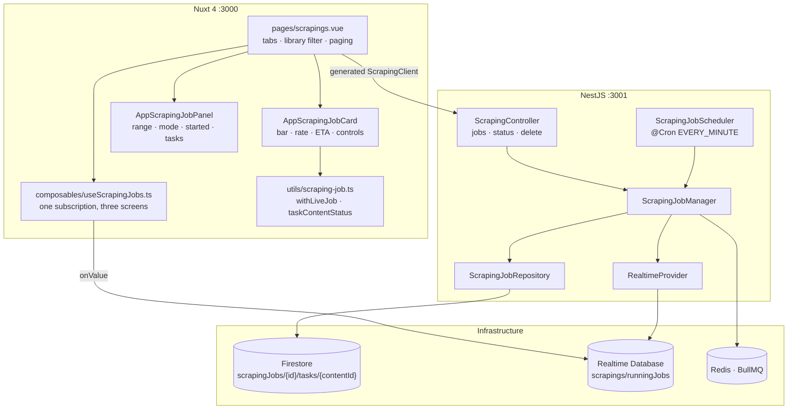
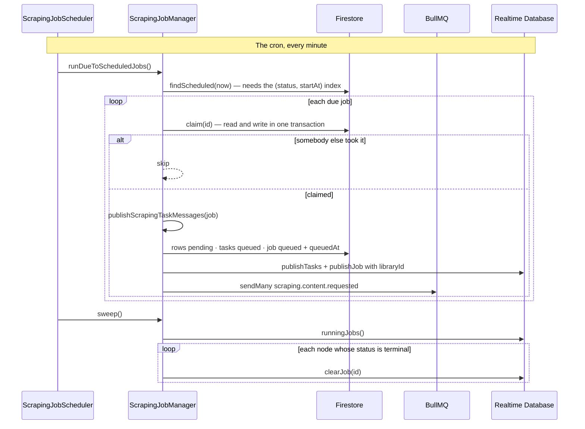
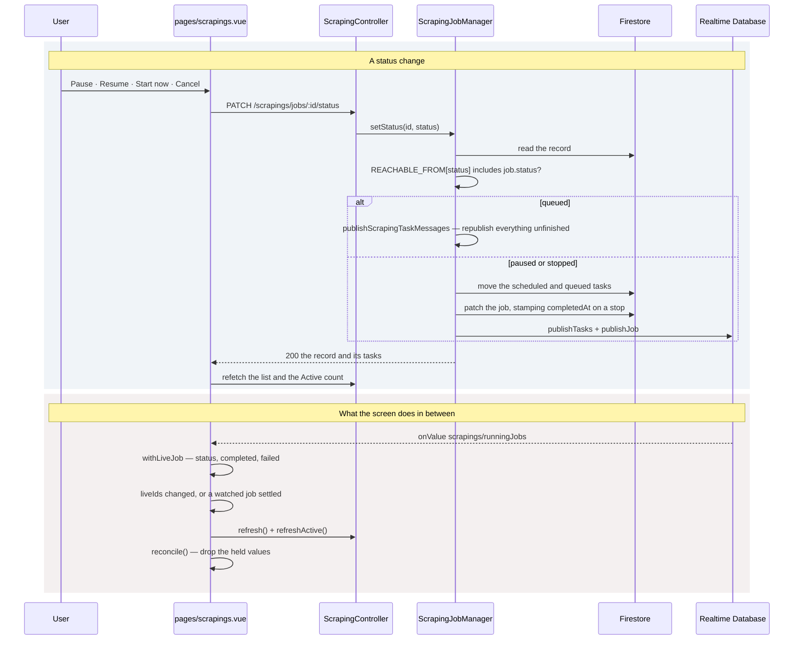

# Scraping — Part 3: a job record, and the Scrapings screen

## Overview

Part 2 could describe a job and fetch its chapters, but the job itself existed only as messages
in Redis: nothing listed it, nothing could pause it, and a booking lived in an in-memory timer
that a restart took with it. This part makes the job a **record** — `scrapingJobs/{jobId}` with a
`tasks` subcollection, one document per chapter it was asked to fetch — and builds the Scrapings
screen over it.

The record is a historical statement rather than a view of the library. `libraryTitle` and
`libraryType` are what the item was called when the job was described, so an item renamed later
leaves an old job wearing its old name, which is the honest answer. `range`, `refetch` and `retry`
are the ask, verbatim. The counters are the job's own tasks and never the item's rows: a job over
chapters 1–20 knows nothing about the other 1,285.

A task is filed under its library `contentId`, which is also its document id, because a job
scrapes a piece of content at most once — so a consumer reads its task directly rather than
querying for it.

Bookings move to a cron over the record: a minute is the resolution the dialog offers, the record
survives a restart, and the claim inside the tick survives a second instance.

## Requirements

- **One vocabulary for a job and for a task.** `ScrapingJobStatus` — `scheduled`, `queued`,
  `running`, `paused`, `stopped`, `completed`, `failed` — so an aggregate reads as what it is: the
  state of its parts. Deliberately not `LibraryContentStatus`, which says whether we hold a
  chapter, a question that outlives every job that ever asked it.
- **The three tabs are groups of statuses, asked for by name.** `state=active|scheduled|history`
  rather than a `status` filter — *active* is three statuses and *history* is another three, and a
  client should ask for the tab it draws instead of restating which states belong to it.
- **A client may move one field, and only between legal states.** `REQUESTABLE_JOB_STATUSES` is
  `queued`, `paused`, `stopped`; `REACHABLE_FROM` is the whole transition rule as a lookup, and
  what the `400`'s sentence is built from. The other four are the runner's — a job reaches them by
  doing the work.
- **`queued` means both "start this booked job" and "resume this paused one".** They are the same
  act — republish everything unfinished — so they are the same request and one branch.
- **A pause moves what has not been picked up and leaves what has.** `HALTABLE_TASK_STATUSES` is
  `scheduled` and `queued`; a `running` task's fetch is already in the air, and marking it would
  either be overwritten by the completion or throw away work already paid for.
- **Stopping settles; pausing does not.** A stop stamps `completedAt`; a pause is a state the job
  is expected to leave again.
- **A job settles only when nothing is owed *and* nothing is halted.** `pending === 0` alone would
  read a paused job as drained the moment its last in-flight chapter landed, and stamp `completed`
  over the `paused` somebody just asked for.
- **Counters are recomputed from aggregations, never incremented.** Two consumers finishing at once
  cannot lose each other's write, and a counter that is derived cannot drift.
- **Only a settled job can be deleted.** One still going has messages in the queue behind it, and
  deleting the record under them would leave every one of them arriving to find a task that is not
  there — work skipped that nobody cancelled. Stop it first.
- **Deleting cascades to the tasks, and takes the live node with it.** The tasks go first, so a
  failure part way through leaves a job that can be asked to delete itself again rather than
  orphaned rows under an id nobody holds.
- **Bookings live in Firestore and are claimed.** A cron tick queries `(status, startAt)`, and
  `claim(id)` reads the status and writes it in one transaction, so exactly one instance sees
  `scheduled` and the other sees the job it did not get.
- **The live tree is derived and disposable.** Firestore holds the truth; `scrapings/runningJobs`
  is a mirror the screens subscribe to. **Nothing in `RealtimeProvider` throws** — a chapter that
  has been fetched, stored and completed must not be scraped again because a mirror write failed.
- **A settled job's node is swept a tick later, not at the moment it settles.** The screen watches
  for the transition and refetches; removing the node in the same act would race that refetch.

## Solution

### Contract Skeleton

| Method | Path | Answers | Refuses |
| --- | --- | --- | --- |
| `POST` | `/api/v1/scrapings/jobs` | `201 ScrapingJobDto` | see scraping part 2 |
| `GET` | `/api/v1/scrapings/jobs` | `200 ScrapingJobPageDto` — newest first, each with the tasks it described | `401` |
| `PATCH` | `/api/v1/scrapings/jobs/:id/status` | `200 ScrapingJobDto` — written, published where the new status is `queued`, and mirrored | `400` a status this job cannot reach from where it stands, including anything at all asked of a settled job · `401` · `404` |
| `DELETE` | `/api/v1/scrapings/jobs/:id` | `204` — and every task filed under it | `400` a job that has not settled · `401` · `404` |

A `PATCH` rather than a `PUT` of the whole job: `status` is the one field a client may move, and
the other thirteen are the server's.

**`QueryListScrapingJobsDto`**

| Field | Type | Default | Applied by |
| --- | --- | --- | --- |
| `state` | `active` \| `scheduled` \| `history` | — | Firestore `in` over the tab's statuses |
| `libraryType` | `LibraryItemType` | — | Firestore equality |
| `libraryId` | `string` (≤128) | — | Firestore equality — every job over one item |
| `page` | `int ≥ 1` | `1` | manager slice |
| `pageSize` | `int 1–100` | `20` | manager slice |

**`UpdateScrapingJobStatusDto`** — `status`, `@IsIn(REQUESTABLE_JOB_STATUSES)`.

**Firestore — `scrapingJobs/{jobId}`**

| Field | Type | Notes |
| --- | --- | --- |
| `libraryId` | `string` | |
| `libraryType` | `LibraryItemType` | What the listing's library filter narrows on. |
| `libraryTitle` | `string` | As the item was called when the job was described. |
| `crawler` | `string` | The item's `sourceName`, carried so a republish needs no read of it. |
| `status` | `ScrapingJobStatus` | |
| `range` | `string` | The expression as it was sent. Drawn verbatim in the panel. |
| `refetch` | `boolean` | |
| `retry` | `number` | |
| `startAt` | `string \| null` | When the job is due. Null was queued immediately. |
| `queuedAt` | `string \| null` | When its messages actually went out. |
| `completedAt` | `string \| null` | When it settled, whichever way. |
| `total` | `number` | Tasks in the job. What the progress bar divides by. |
| `completed` / `failed` / `skipped` | `number` | Skipped is candidates dropped as already complete, or with no source. |
| `createdAt` / `updatedAt` | `string` | |

**Firestore — `scrapingJobs/{jobId}/tasks/{contentId}`**

| Field | Type | Notes |
| --- | --- | --- |
| `contentId` | `string` | The library row this task is for, and this document's id. |
| `libraryId` | `string` | Denormalised so a task reads on its own. |
| `index` | `number` | The chapter number — what the subcollection is ordered by. |
| `sourceUrl` | `string` | Carried so a republish needs no read of the library row. |
| `status` | `ScrapingJobStatus` | Written `scheduled` at creation, whatever the job is. |
| `refetch` / `retry` | `boolean` / `number` | The job's, copied down: they are what the message carries. |
| `startAt` / `completedAt` | `string \| null` | When a consumer picked it up, and when it ended. |
| `error` | `string \| null` | The last failure, in one line. |

**`ScrapingJobDto`** is the record plus `tasks: ScrapingTaskDto[]`.
**`ScrapingJobPageDto`** matches `LibraryItemPageDto` field for field.

**`ScrapingTaskCounts`** — what `counts(jobId)` answers with, as aggregations:
`total`, `completed`, `failed`, `pending` (still owed — `scheduled`, `queued`, `running`), and
`halted` (`paused` or `stopped`, held apart from `pending` because these are not owed, and apart
from a drain because they are not done).

**The live tree**

```
scrapings/runningJobs/{jobId}
  libraryId · status · range · refetch · startAt · queuedAt
  total · completed · failed · updatedAt
  tasks/{contentId}
    status · index
libraryImports/{itemId}          — library part 5
```

`database.rules.json` gives both roots `".read": "auth != null"` and `".write": false`: the Admin
SDK bypasses rules, so the only correct client rule is no.

Timestamps in the tree are **epoch milliseconds** and ISO strings in Firestore — these are
compared and never displayed. Statuses are plain strings, and are the caller's own enum values
verbatim: `core` holds no domain types.

**`RealtimeProvider`**

| Member | Does |
| --- | --- |
| `publishJob(snapshot)` | Whatever of the summary the caller has, in one `update`, stamped. |
| `publishTasks(jobId, rows)` | The whole claimed set, chunked at 500 — a novel is the one burst in the job. A chunk that fails is logged and the rest still go. |
| `publishTask(jobId, contentId, status)` | One task moving. The status alone, and `update` rather than `set`, because `publishTasks` already wrote its `index`. |
| `runningJobs()` | Every node and its status — the one read on the class, and what the sweep works from. Answers empty where the read failed. |
| `clearJob(jobId)` | A job's whole node, once it has settled and the screens have caught up. |

### Component Diagrams



- **The scheduler holds no rules of its own.** What is due, what may be published and in what
  order are the manager's; the cron is only *when* it is asked. Each of its two calls gets its own
  `try`: a publish that threw must not cost the sweep its turn, and nothing awaits a tick, so an
  unhandled rejection would be the whole process.
- **One subscription, three screens.** `useScrapingJobs` is what the library listing, the library
  detail screen and the Scrapings screen all overlay from.



- **`libraryId` is written where the node first appears**, because it is what the Library screens
  match a running job to the item they draw.



- **A node is trusted only while its job has not settled.** A settled one is ignored in favour of
  what the API answered, which is what makes the minute before the sweep harmless.
- **`held` is the one exception, and the whole reason `reconcile()` exists.** A job's last act
  moves its node to `completed` *before* the screen's refetch has landed. Dropping the overlay at
  that instant would blink every row back to the status it was fetched with, and the counters back
  to the numbers they had before the job started, for as long as a round trip takes. So the last
  published values are held across the gap and dropped only once the stored rows have caught up.
- **`scheduled` is deliberately not an active state on the frontend.** A booked job has a node from
  the moment it is recorded, and it must not make its item read **Scraping** hours before the cron
  publishes it — nothing is being fetched, and the library is untouched until then.
- **A task speaks the job's vocabulary; a row speaks the library's.** `taskContentStatus` is where
  the two meet, and the three states a job stops in all read as `pending`: the chapter is owed and
  nothing is fetching it, which is exactly what a placeholder row means.
- **Rate and ETA are computed in the browser** from `queuedAt`, `completed` and either `now()` or
  `completedAt` — a flat average over the run, so a finished job keeps the rate it ran at instead
  of decaying as the day goes on, and a job paused for an hour reads as slow until it has run for a
  while again. Nothing is stored and nothing is sampled.

## Implementation Steps

- **Step 1 — the record, and the endpoint that writes it.**
  `scraping/entities/scraping-job.entity.ts` — `ScrapingJobStatus`, `TERMINAL_JOB_STATUSES`,
  `ACTIVE_JOB_STATUSES`, `ScrapingJob`, `ScrapingTask`.
  `scraping/scraping-job.repository.ts` — `findMatching` (`JOB_SCAN_LIMIT = 500`), `create`,
  `patch`, `findScheduled`, `claim`, `createTasks` (batched at 500), `tasks`, `task`, `patchTask`,
  `startTask`, `completeTask`, `setTaskStatus`, `remove` (which supersedes the inherited `delete`,
  since Firestore does not cascade) and `counts`.
  `dto/scraping-job.dto.ts` and `dto/query-list-scraping-jobs.dto.ts`.
- **Step 2 — the cron.** `ScheduleModule.forRoot()` in `CoreModule`;
  `scraping/scraping-job.scheduler.ts` with `@Cron(CronExpression.EVERY_MINUTE)` calling
  `runDueToScheduledJobs()` then `sweep()`, each in its own `try`.
  `_deploy/firebase/firestore.indexes.json` gains the composite index on
  `scrapingJobs (status ASC, startAt ASC)` — the one composite index in the project.
- **Step 3 — the listing, the transitions and the delete.**
  `ScrapingJobManager.list` (Firestore narrows by the tab's status group, the library type and the
  library; the ordering and the slice happen here), `setStatus`, `halt`, `remove`, `sweep`,
  `settleJob`, `detail`, `require`, plus `REACHABLE_FROM`, `HALTABLE_TASK_STATUSES` and
  `STATE_STATUSES`. The `GET jobs`, `PATCH jobs/:id/status` and `DELETE jobs/:id` routes.
- **Step 4 — the live tree.** `core/providers/realtime.provider.ts` — `ScrapingJobSnapshot`,
  `ScrapingTaskRow`, the five job members and the `attempt` swallow that is the whole of the
  class's error handling, which is why no caller has a `try`.
  `_deploy/firebase/firebase.json` publishes the Database emulator on `9000`;
  `database.rules.json` declares both roots read-only. `FirebaseAdminService` gains `database`,
  and `FIREBASE_DATABASE_URL` plus `FIREBASE_EMULATOR_DATABASE_HOST` join the config — the
  emulator takes its namespace from the URL's subdomain, so the backend and the frontend must name
  the same one or each reads an empty database, raises nothing, and leaves the screen still.
- **Step 5 — the screen.** `types/scraping-job.ts` and `types/scraping-status.ts` mirror the DTOs
  and the tree by hand. `utils/scraping-job.ts` holds the status badges,
  `jobPrimaryControl`, `withLiveJob`, `jobSettled`, `taskContentStatus`, the progress and meta
  labels, and the rate/ETA arithmetic. `composables/useScrapingJobs.ts` is the single
  subscription, with `believed`, `forLibrary`, `settled` and `reconcile`.
  `pages/scrapings.vue` owns the tab and the library filter, fetches a page, keeps a second
  one-row request for the header's Active count, hosts `AppScrapingJobPanel`, and implements
  `onControl`, `onRemove` and `onClearFinished`. `AppScrapingJobCard.vue` and
  `AppScrapingJobPanel.vue` draw it. `pages/library/index.vue` and `pages/library/[id]/index.vue`
  overlay from the same composable.

## Appendix

### Known limits

- **The 500-job scan limit.** `findMatching` reads at most `JOB_SCAN_LIMIT` filtered documents, and
  the ordering and the paging run over those. Past that many matches, jobs beyond the limit are
  invisible to both, and `total` is what matched the scan.
- **A page of twenty is twenty-one queries.** Tasks are answered with each job, which is the one
  place this listing costs more than the library's. The panel needs them.
- **No bulk endpoints.** *Clear finished* is a loop over the single-job delete, scoped to the page
  in view, stopping at the first refusal and saying how many went — a wall of identical error
  toasts helps nobody. A History tab deeper than one page needs a second press. Acting on every
  job at once, and retrying a settled job's failed chapters, are both unbuilt.
- **A minute of resolution.** A job booked for 03:00:30 fires at 03:01. `datetime-local` goes no
  finer, and the tick costs one indexed query.
- **`claim` protects a booking, not a republish.** Two `PATCH …/status` requests a millisecond
  apart both read the same status and both pass the transition check.
- **A pause takes effect within one chapter**, not instantly — a `running` task is left alone.
- **An item with two overlapping jobs takes the first one found** when a Library screen asks
  `forLibrary`. On the Scrapings screen they show as the two rows they actually are.
- **The live counters are the job's own tasks.** A job over chapters 1–20 says nothing about the
  other 1,285, so the item's totals move only on the refetch a settled job asks for.
- **The tree carries no `words` and no `updatedAt` for a row.** Those arrive with the reload a
  settled job triggers, which is the single point where the screens go back to the API's answer.
- **A node whose job was deleted while running would linger.** In practice it cannot happen — only
  a settled job deletes, and the delete clears the node itself rather than waiting for the sweep.
- **`runningJobs()` answers empty on a failed read**, so a failed sweep skips a tick rather than
  taking the whole tick with it — and a settled node then sits in the tree until the next clean
  one.
